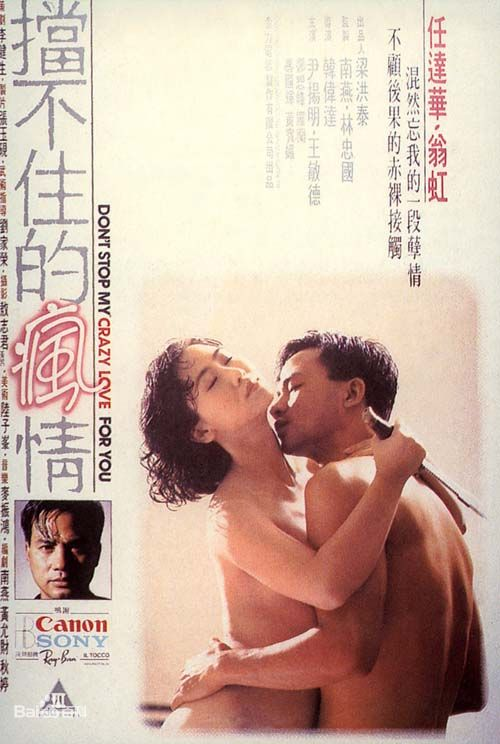

# 没穿衣服的姑娘

在闽南年轻人的话语中，是不常出现“姑娘”这个词的。直到我离开厦门时，“姑娘”对我而言，还只是一个在电视里看到的词。土生土长的闽南年轻人，带着一种奇怪的痞气，我后来在其他任何地方再不曾见过。那些未长开的男男女女，对人总是一副不愿搭理的模样，谁也入不得他们的眼。一旦争执起来，他们身上这种相同的秉性总令彼此心生恐惧。总而言之，傲慢且目中无人。回想中学时期的我，恐怕也逃不脱这副该死的模样。

在这样的地方，“姑娘”似乎是略带土气的北仔们才说的话，而闽南语中的“北仔”大约和粤语里的“北佬”相似，或多或少都带着轻蔑的意味。或许是受了台湾偶像剧文化的影响，在闽南的年轻人话语中，只要愿意，从刚出生到更年期的女性都可以被唤作“女生”，而这个“女生”上学与否则毫无关系。

我刚来北京的那一两年，春节返乡与老友相聚时，若不经意间说出了“姑娘”这个词，他们依然要笑我“变成北仔”了。

纵然如此，如今的我，在语言中、文字里，却一发不可收拾地喜用这个词。姑娘，Gu-Niang，有血有肉有灵性，充斥着青春躁动的活力。说出口的一刹那，只觉得舌头正在绘出一个凹凸有致的肉体，白花花，水灵灵，灿烂美好。

我曾试着去寻找记忆中第一个不穿衣服的姑娘，那时大约很小很小，在闽南某个农村的某台电视里，不知是谁，播放了一部香港三级片，居然也不避讳小孩子。画质粗糙，却让我觉得无比尿急。

到了幼儿园的时候，当了一辈子护士的阿嫲看着我长长的包皮很是不安，急匆匆找了医院的大夫，干净利落地割掉了。那时当然不晓得其中的用意，更不知道胯下这块肉的用处。及长，再无法待在阿嫲的身边，每每想到她，只觉得她是待我最包容最贴心的人。孩童时期的记忆总是最使人深刻，那些顽劣的日子里，她总端着半碗米饭，踩着小碎步，追在精力大爆发、上蹿下跳的我身后，想再喂我多吃几口。待我玩疲了，就逼她用漏风的嘴，给我读《七龙珠》的漫画，后来想起，这真是难为她了。一直到我二十岁了，她还是习惯像对待小孩那样，把苹果削好，再切成小小的一块块，端到我的书桌前。

当然，每次我看着自己胯下的光头小朋友，也会想起阿嫲。想起她那满是褶皱的手，牵着不听话的我去医院割包皮，耳边还是她在絮絮叨叨地哄我“不疼的，不疼的”。

这样一个下了雪的夜里，不知哪来的风正在周身嘻嘻笑着，我一个人走在北京远郊荒凉黑暗的小路上，想起阿嫲，想起我的小朋友，还有那些给了它活下去之勇气的，认识或不认识的姑娘们。

一直到了小学毕业，我也未搞明白，为什么一看见那些没穿衣服的胸部肿了的姑娘，就会想尿尿，而同龄的小姑娘却没有这样的魔力。不过，这已然不重要了，虽然对审美毫无概念，对欲望这东西也没有系统的理解，但我确切地知道我喜欢什么，我希望看到什么，再不是毫无头绪地想着为什么会尿急了。我为自己感到高兴，我虽还不知道她们是美的，却已感觉到，她们是好的，因为她们让我如此开心。多么好心的姑娘呀。

那还真是一段容易满足的好时光，班里的男孩子放学后就坐在电视前面，等着看美少女战士变身。那时，我有一种奇妙的优越感，因为我不看美少女战士，我所中意的是另外一部颇为小众的动画，名字叫《宇宙骑士：D-boy》。比起美少女那只有轮廓的亮晶晶的变身，《宇宙骑士》就显得高端大气多了，不单变身时间更长，而且可以非常惬意地看清那女体的每个细节。我记得D-boy有个妹妹，漂亮非凡，柔弱可人，可惜后来自爆了，死得凄惨，令人不忍回忆。上大学后，当我再找回这部动画来回味时，才发现，这真是一部罕有的悲伤无比的动画，实在不适合小孩观看。

终于有那样一天，我身边那些同龄姑娘们的身体，开始出现了令人兴奋的变化，她们也渐渐学会了那些成年姑娘们的魔法。我由衷地为她们感到高兴。还记得，那时的体育课虽是男女分开上的，却都在同一个操场。男生的体育老师总带着我们一块踢球，女生的体育老师则喜欢带着她们做各式各样的操。在姑娘们学会魔法之前，男生们总热衷于踢球。在姑娘们学会了魔法之后，我们几个痞气深重、恬不知耻的小男子，就会跑到她们做操的行列前，蹲成一排，等待着那一节让人尿急的跳跃运动。

年轻的姑娘们不施粉黛，穿什么都好看，不穿也好看。好看的姑娘们已经到了会害羞的年纪，一眼就看透了我们这群不怀好意的混蛋，却又无可奈何，那夹杂着嗔怒与羞涩的神情，叫人难忘。

那一个初夏午后，在闽南和煦的阳光底下，咸湿的海风吹来了姑娘的幽香，带着她们的体温，沁人心脾。妙不可言却又叫我惆怅不已。从那时起，我想念她们每一个人，还愿她们一直留在那个蹦蹦跳跳的操场上，不变的容颜和衣装，不变的背景和心境。

那一年，父亲对我说：“我要出去买菜了，我放在电视柜里的那些光碟，你千万不要偷看。”于是那一年的暑假，就在不断“快进”和“倒带”中飞逝而过。

那真是一个好时代，姑娘们的身子已经彻底长开，魅惑动人，却仍有一张孩子样的脸。这令我们激动万分，快乐无比。那时的我尚未意识到，这些日后贪得无厌的男人，最初的雄心正是在此间隐隐滋生。日日渴望着温香软玉，夜夜祈盼着心里的姑娘“愿荐枕席”。

姑娘们的这种变化来的突然，叫人措手不及。像我们所有人一样，雨果敏锐地观察到了这一点，还极尽文采地将这一变化记录下来——

“六个月，小姑娘已经变成了少女，如是而已。这种现象是极常见的。有那么一种时刻，姑娘们好像是忽然吐放的蓓蕾，一眨眼便成了一朵朵玫瑰。昨天人们还把她们当作孩子没理睬，今天重相见，已感到她们乱人心意了。这一个不但长大了，而且理想化了。正如在四月里一样，三天的时间足使某些树木花开满枝，六个月已同样够使她周身秀美了。她的四月已经到来。 我们有时看见一些穷而吝啬的人，好像一觉醒来，忽然从赤贫转为巨富，一下子变得奢侈豪华。那是因为他们收到了一笔年金，昨天到了付款日期。这姑娘领到了一个季度的利息。”

十三四岁的珂赛特“瘦到近乎难看”，在马吕斯眼中“毫无可取之处”“不怎么讨人喜欢”。可是仅仅六个月未见，她便长成了“秀长、美丽、有着女性已届成年却仍全部保有女孩那极尽天真情态的体形的最动人的人儿”。就是这样神奇。

这叫马吕斯如何不爱她？

从小朋友长出第一缕头发起，我就顽固地坚持，在真诚的爱情中，对美丽肉体的渴望是绝不可少的。爱上一个姑娘，首先是爱她的容颜，爱她的身段，想和她做爱。而厌倦一个姑娘，恰正从不想与她做爱的一刻开始。以我的心智，确实想象不出，爱一个姑娘却不想和她做爱的情境，正如无法想象一个方的圆或者圆的方。看那年轻的俊杰马吕斯，他并未与珂赛特说过一句话，对她的身世、内涵一无所知，便爱上了她，只因她突然生得美了。

要形容那时我们对美丽姑娘的觊觎之心，我的文字还无能为力。无论怎样写，都免不了沾上猥琐的气息。但我清楚地知道，这与今天宅男们对AV女优的那种渴望，绝无类似之处。除了坦荡荡的色情外，更多的是雄心，是大志，是非如此不可的执著与勇气，是全无办法消除或遏制的庞大气势，一如冲向敌阵的万千骑兵。

如果一定要用文字描绘这了不起的雄心，那只能是莎翁剧中亨利王的豪语——

**“若不是我们高坐在那儿，治理法兰西的广大土地和富敌王国的公爵领地，那就是听任我们的骨骸埋葬在黄土墩里，连个坟，连块纪念的墓碑都没有。我们的历史要不是连篇累牍把我们的武功夸耀；那就让我的葬身之地连一纸铭文都没**有吧。”

只能是冯唐笔下的老流氓——

**“从小到大，这辈子，有没有遇见过那样一个姑娘，那脸蛋儿，那身段儿，那股劲儿，让你一定要硬，一定要上，一定要干了她？之后，哪怕小二儿被人剁了，镟成片儿，哪怕进局子，哪怕蹲号子。之前，一定要硬，一定要上，一定要干她。这就是志气，就是理想，这就是牛逼。”**

自下了决心的那一刻，老流氓就成了亨利王。他置身于阿金库血淋淋的战场，燃着烈火的旗帜，散落满地的兵器，所有发了狂的战士，都入不了他的眼，他的目力所及之处，只有那个站在世界中心的姑娘——

**若不能将你抱上我的床，**

**若不能褪下你的衣裳，**

**若不能见着你高潮时的模样……**

**那么，便叫我倒在那荆棘路旁，**

**让刀剑插满我的胸膛，**

**让箭矢刺穿我的腑脏，**

**由那漫天的鹰鹫，**

**争相来食我的肝肠。**

**去啊，去啊。**

**去将我的仇人们呼唤，**

**聚拢在我残破的尸身旁，**

**哈哈大笑，纵情歌唱。**

许多年以后，我为了写一篇关于三级片的评论，特地将八九十年代的香港三级片全找了来。见到任达华所饰的强奸犯，被翁虹一枪打在蛋上，将死之际却带着笑说：“你是我梦寐以求的女人，我能够干你，也就死而无憾了。”这一幕，使我感动得几乎要掉下泪来。

那一个夏天，在单薄的校服之下，那跳动不止的青春活力，叫我们都丧了心智。而这影象，又随着记忆的沉淀，越发显得可贵。离开学校后，当疲倦和噩梦合谋，将快乐一点点地挤出我的生命。我突然意识到，我所怀念的或许并非止于姑娘们的胸和屁股，而是那昔日破土而出的生命力。如果我们怀抱着追问不止的严谨态度，对这个问题刨根究底，我们就会发现这样一个链条——那姑娘何以吸引你？

——因为她美。——她何以美？——请看她的胸和屁股。胸和屁股如何？——那是藏着人类这个物种的全部生命与活力之处啊。难道我们可以不追求生命吗？难道我们不渴望欣欣向荣的繁盛世界吗？难道我们这个物种，不正是在这样的追求中才得以繁衍至今日吗？

生命是一切的究极，所有命题的最终源头，无法再往下追问的终点。快睁眼看清楚这一切——她们的美丽即是生命的养料，我们在被压榨着的苦难之中，哪有不回首向过去寻找养料的道理。

作为人而过活一生，总有免不了的艰难。每逢这时，有人投向宗教，有人投向领袖，有人投向了集体主义和左翼运动。在我看来，这全部加起来，都比不上一个青春活泼的姑娘。《天龙八部》中，走投无路、形同乞丐的段延庆正要自绝于世，却遇见一个清丽秀美的刀白凤，情愿将白山茶花一样的身子交予满身脓血的他。事毕，段延庆顿时精神大振，走上了屌丝逆袭的光辉道路。而那一夜的姑娘，就成了永生的菩萨——天龙寺外，菩提树下，化子邋遢，观音长发。

至于我，作为一个中国语境下的死右派，却不时对左翼运动充满神往。细究起来，其中最吸引我之处，还是姑娘。革命中的姑娘似乎更加惹人喜爱。如果运动永不停息的话，她们就是最美的女人。喀秋莎、娜塔莎和冬妮亚，苏维埃的姑娘多漂亮，如果只在革命中。

试想，一帮朝气的年轻人凑在一起唱歌跳舞，谈人生谈理想。然后在理想主义光辉的照耀下，陌生的姑娘扑上来对着你砰的就是一炮。天亮后你起身拉上裤子，随即冲出街垒，要去跟这坏国家与旧制度碰个头破血流。如果时间止步于此，那么这就是童话一般的美好故事。

若干年后，当初的信仰或已背弃，昔日的理想或已褪色，不管什么颜色的革命也早已失败，那些指点江山的同学战友都在履带下化作了泥，在爆炸中碎成了灰。唯余一个干枯的老头子，掐着自己的大腿，或懊悔或悲伤。他青年时的激情与豪迈一去不返，但那模糊了面容的姑娘却久驻脑海。因为，再也见不着的姑娘永远美丽。

这不纯是我的空想，还有作家们的文字为证。史铁生笔下的小诗人在去串联的火车上，邂逅了一位年轻姑娘，昏暗摇晃的车厢中，他看不见她的面容，却因她身体的芬香而紧张躁动。他解开了她的胸罩，却终没能得到她的身子。一夜过后，永不相见——“火车上的那个姑娘已经消失，永劫不复，虽然她肯定就在这个世界上但诗人不知道她是谁，再也不可能知道她是谁。虽然她会记得火车上一个春情初动的少年，但她也再找不到他了”——这是一个好结局。

高行健在《一个人的圣经》中也有类似的故事，可惜却是一个坏结局——年轻的红卫兵为了躲避武斗，和陌生的姑娘躲入了小旅馆。在恐惧之中，他们用汗津津的身体彼此慰藉。天亮之后，他们失散了。“他只记得她的身体，此外都是陌生的”。本来到这里，故事便可以结束。可是年轻的红卫兵却执意要去寻找那位姑娘，终于也叫他找到了。“他再见她时，连面容都记不清都陌生，她却做了她的妻子。她还埋怨他葬送了她，利用了她一时的软弱”。这场不幸的婚姻，在若干年后，以她举报他思想反动而终结。

就像校服一样，不合身的军装裹着的美丽姑娘，迸发出一股令人无法忘怀的生命力。那或许只是一个瞬间，却要让每一个见证了的人铭记终身。

美丽，年轻，希望和生命，这几个词在我看来，不过是表达了同一个意思。这是一种可以传递的追求。衰老的人，喜爱年轻的少女，正是源自这样的一种追求。可称之为希望的东西，在我们自己身上一点点流失，却在姑娘身上依旧蓬勃。以至于我们嫉妒、羡慕，穷尽办法地要去抓取这救命的稻草。

是的，这所有的一切，都指向一个年轻、丰韵的姑娘。她有胸，有屁股，她的身子是香的。

所以，美人迟暮是最使人难受的事了。看见那些老去的姑娘，我总想起故乡的老厝，往日辉煌已尽，荒草生庭院，雀鸟筑檐下。贼人们登堂入室，搬走了宝贝，挖去了雕花，在再那屏风上涂鸦。唯剩得那位造物的匠人哭瞎了眼。

认识世界是一个残酷的过程，尤其当发现，这世上还有一种无法与之抗争的力量。无时无刻，不在削割侵蚀着我们所赞美、喜爱的一切。

而我却一厢情愿地，希望姑娘们永远美丽，希望日头永不落。

又或许，姑娘们的老去，只是一种精致的假象。这样想着就会好受多了——

<

你晓得，她们预先就设计好了，穿着校服或军装，埋伏在你生命的不同时间里，轮流出场，轻解罗裳，让你见一眼她们的美丽，然后哭着笑着怒骂着沉默着纷纷离场，让你或遗憾不已，或悔恨终身。你的苦楚都成为她们的谈资和笑料，她们躲在看不见的幕布之后，叽叽喳喳，嘻嘻哈哈，议论着你，耻笑着你。而这一切，你永不知晓。你在舞台上独自表演，还以为她们真爱着你哩。她们害苦了你的回忆。因为她们晓得，再美丽的姑娘，但凡只存在回忆中，便只能是苦涩。起初，忆及她们时，你或许还能不自觉地傻笑一阵。到了后来，你轻易绝不去想她们。因为你已衰弱，而她们将一直美丽，永不老去，生殉了你那日渐销蚀的梦。

当然，还有这样一种可能——到了最后，她们还不忘耍一把坏，于是她们戴上皱纹的假面，把自己打扮得又老又丑，遮盖自己美丽的容颜，再让你看一眼，让你失掉全部的希望。然而她们一回到幕布后边，就将这可怕的妆容卸下。她们只是想吓你哩。

整个时空不过是她们任性妄为的一场恶作剧。

以前我听说过濒死体验这种东西，据说人将死之际，或者将见到黑暗中的绚丽光芒，或者将见到他们信奉的神灵，或者将见到自己人生的回顾。我认为这都是不确的。一定不会是那样。在我濒死之际，眼前只会有一个没穿衣服的姑娘，白嫩娇艳，通体光盈。我看不清她的面容，我不知她是何人。但我确信她美极了。她要来告诉我，我人生的一切都不过是幕布前的表演，现在她要带我走出这剧场，至于这剧场之外，是鸟语花香或火光冲天，我并不在意。

如果没有神，她就是我这一生全部梦想和抱负的化身，是我的青春和希望的留存。如果有神，那她就是众神之神，是最高存在。在我的认知中，上帝如要在我面前显圣，那其形象一定是个没穿衣服的姑娘。

(采编：刘铮；责编：刘铮)
