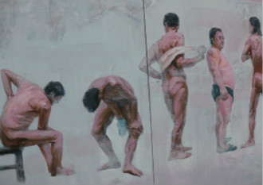

# 洗澡

父亲的浴室开在我的高中对面。“学子浴室”四个用红色油漆写在墙壁上的大字是唯一引人注意的地方。

因为学校没有浴室，在校的学生想洗澡都是难事。鉴于这点，父亲选择开一家，一来方便学生，二来让自己有点事做。父亲是个庄稼人，半辈子务农直到我成家立业。一下子闲下来，他的确不习惯。浴室很简单，没有休息室，也没有各种各样的按摩。洗个澡七块钱，仅此而已。看着每天来洗澡的学生，我总会想起自己那时候的点点滴滴。

那年我上六年级，父亲第一次带我去浴室。每个人赤身裸体，这对于第一次进浴室的我来说是最大的发现。我看着他们的生殖器，看着他们长膘的肚子，一个刺着纹身的小伙子引起了我从没有过的好奇。那也是我第一次看到光着身子的父亲。我问他为什么大人的生殖器比我大，父亲笑着说小孩子别问。往后，父亲常带我来。久而久之，第一次来时的那种新鲜感没了，我也知道父亲为什么会说“小孩子别问”了。水蒸气的弥漫让我看不清谁是谁。你能看到的就是大池子里十几个模糊的身影，他们一动不动，他们很享受，享受着这一天的疲惫都随着水蒸气蒸发了。那时候我对监考老师有种莫名的紧张感，但父亲对我说这有什么怕的，老师不还光着身子和你一起泡澡吗？

从池子出来，父亲会帮我搓背。浴室里有石凳，一般都是我坐着，父亲站着。因为都坐下来的话，父亲会使不上劲。搓到腋下时，父亲的一只手会把我的手拉起来，他的手劲很大，有几次把我拉疼了。那时候的我只需这么坐着，放松，任由父亲帮我从脖子搓到后背，前前后后。我们那里管搓下来的污泥叫“闸蟹”，父亲走总会指指那些污泥笑着对我说把这些带回家可以烧汤了。后来我发现每次搓大概十分钟左右，父亲会把一条腿踩在石凳上。后来我知道，那是因为他累了，这样更容易可以使上劲。因为我一个星期才回一次家，所以父亲总会借着搓背的时候和我聊聊近况。父亲没上过学，他所能拿来教育我的话无非是新闻里的励志故事和抗战时期的英雄事迹。当年八路军这么辛苦都能去打仗，你现在有吃有喝，还抱怨学习辛苦，你说你应该吗？这样的话每次都会说。刚开始会觉得啰嗦，有时候我实在听厌了会接他的话。当他提到“八路军”三个字时，我就接一句“八路军那时候啊，太艰苦了···”父亲听出了我的厌烦，也就对我笑笑了。

其实不仅在浴室，就算是一家人一起吃饭，父亲都免不了来教育我几句。想想父亲也是为我好，也就习惯了。正如他所说，只要我成家立业了，他就再不跟我啰嗦了。他给我边搓背边教育时，我总在想：等他七八十岁时，还会不会这样。父亲总喜欢问我类似“等他老了走不动了会不会背他？”、“要是他得了痴呆症，会不会送到养老院去？”这样的问题。他明知我的回答是什么，但听到我肯定的说“不要担心，肯定孝顺你的！”时，他会很开心。

后来我上大学，第一次进外地的浴室。相较于老家普通的浴室，大城市的总显得那么高档。但那个时候父母告知我洗好澡就出来不要上去，我知道这句话的意思。在外地洗澡的唯一不同就是搓背得喊专门的师傅。师傅娴熟的手艺总会让我舒服得睡着，但整个过程总觉得少了点什么。是的，过去帮我搓背的是父亲，现在是师傅。手艺虽好，可少了点感情。

每次闭着眼仰躺着，因为很少和师傅聊天，所以我一般都会在那想事情。想想前一天晚上和母亲打电话时，她给我提到的老家的新闻；想想和朋友们好久没联系了；我是个爱想事情的人，有回忆也有纯粹的幻想。我幻想要是这个时候是父亲在给我搓背该多好，幻想要是这个时候我和父亲都这么躺着让师傅搓背该多好，父亲从没来过大城市，他还不知道这里这么高档。师傅一不小心碰到了我的生殖器，我才醒过来。我让师傅轻点，师傅对我笑笑，我在想小时候第一次去浴室看到那么多生殖器的事情，没忍住笑了。 

浴室开张那天我也在家。晚上关门后，整个浴室就剩我和父亲。毕竟这是咱家的浴室，出于一种新鲜感，我对父亲说今天帮他搓背。这是我第一次帮父亲搓背，是不孝顺吗？父亲的皮肤很黑，这是因为过去经常赤膊在太阳下干活晒的。由于长时间的挑担子，父亲的肩上长满了老茧。我过去没有帮别人搓过背，所以对于力道的控制很陌生。过去坐着的是我，站着的是他，如今反过来了。我才帮他搓了后背就觉得手很酸了，于是我也把一条腿踩在凳子上，的确省劲多了。那时候父亲会借此机会教育我，可我这时候却不知道和他聊什么。

我是个不善表达的人。过去在外地上大学，也从没打电话对父母说想他们。我记得高中那会，我犹豫半天打电话对父亲说让他当心身体，注意休息。就这么一次电话，让他开心得逢人就说他儿子有多么懂事。“以后烟少抽点，身体要紧。”我随口说的这么一句话打破了原先的沉寂。也就这么一句话，似乎拉近了我与父亲之间的距离。过去他总是拿学习教育我，如今我拿健康教育他。只要一家人身体健康，这已是最大的愿望了。父亲把剩下的半根烟扔了，搓完背我还给他敲了背。

晚上一家人一起吃饭，父亲看上去很开心。他还在想着刚才儿子帮他搓背的事情吧！有多少年没有讲八路军了？我用带着玩笑的口吻对父亲说。少了过去吃饭时的思想教育课，的确静了许多，但也少了点什么。“八路军的事情以后用来教育孙子啊！”一句话道出了父亲现在的期盼。

虽然浴室比较简单，但生意却一直不错。有人建议父亲把浴室装修一下，价格涨涨，但父亲一直不肯。我明白父亲的心思。这学校周边都是普通人家，如果把浴室装修，门槛抬高，就没人来了。父亲毕竟只是找点事做，挣多少钱他自己心里清楚。

夜深了，外面偶尔听见几声狗叫。父亲披着大衣又去检查了一下炉子，一天就这么结束了。

(采编：朱燚；责编：刘铮)