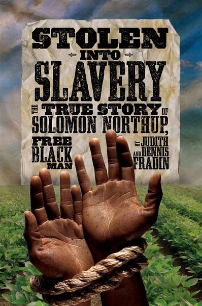
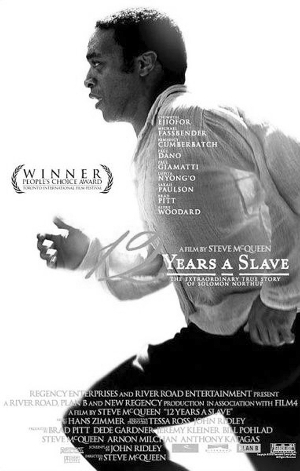

# 浅评《为奴十二载》和蓄奴史

很多人信仰死亡的一面是重生，佛教徒笃信死亡后人会经历六道的轮迴，基督徒相信耶稣基督被处死后复活，而未来的某个节点必然将重降人间。死亡不是灵魂的消减，而我想说，世上有比死亡可怕无数倍的事情，即是灵魂的囚禁。

生为一个自由人是种恩赐，《为奴十二载》中的男主角Solomon Northup便是如此。十七世纪，奴隶制成为社会争议的尖端，Solomon与他的家人住在北方废奴州的夹缝中，地位虽然低人一等，但全家人不用被奴隶主奴役肉体，那个时候，他是自由人，是劳动者，是音乐家。

这学期修的一门美国曆史课上，教授用一种非常“左”的方式，着重讲了奴隶们的苦难，然而所谓苦难，说起来总是流于字面的，因为当时黑奴们所经受的苦难，并非仅限于肉体上的奴役，而是思考能力与灵魂层面的剥夺。我们生活在这样一个整个社会都在以尊重他人的人格为准则的时代，N字头的字眼是禁忌，性行为以双方的统一与愉悦为前提，遇到不公也许也会愤怒，然而我们鑑别不公的能力与情绪上的愤怒是完完全全自由的，是基于许多稔熟与人心的价值观的。

很难想像当时的女性奴隶是被奴隶主要求与“Mate”来“交配”去生产后代，沦为动物，沦为生产工具，“人格”早就灰飞烟灭不复存在。《为奴十二载》设定的精巧之处在于，Solomon Northup是个受过教育的自由人，是个同我们一样有人格的人，我们很难将自己的身份代入进一个被迫”交配“的奴隶，因为我们无从感受从一出生就被人以牲畜来对待的境遇，而我们是某种意义上的Solomon，我们和他一样都是奴隶制的旁观者，也是一个充满了情绪化的怜悯之心的观众。

Solomon作为一个和我们相同的“观众”，却因人绑架而成为了一个奴隶。他所经受的十二年中，是带着清醒的与独立的人格的十二年。他未体验过从出生以来就需要的逆来顺受。体验过自由后的奴役是要比不知自由为合物的奴役残酷一万倍，所罗门的十二年是思维与身体双重囚禁的十二年。

我曾读过一本书，叫做《Who Speak for Margaret Garner?》， 书中的写到的Margaret Garner是一个肯塔基州的黑奴女性，她从主人手中逃跑之后又被人抓了回去。被赶回到奴隶主的潮湿狭小的奴隶房之后，她流着眼泪亲手杀死了自己两岁半的小女儿。我认为Margaret Garner并不是一个非常值得同情的人物，她的病态与极端行为，使得她与她孩子们的悲剧成为了一个值得让人深思的历史片段。她逃跑流浪的那段时间，是她一生中唯一的自由经历，虽然这段自由短暂到可以忽略不计，但是她却开始笃信，宁愿让自己的孩子死亡，也不能再生活在奴隶主的囚禁中。可见自由给人的改变是颠覆性的，无论这种自由是哪种形式，有多短暂。

反覆听了几个星期殿堂级配乐家Hans Zimmer为《为奴十二载》写的配乐。深沉的打击乐和铜管与影片平稳冷峻的叙事手法相辅，在南方农场的人声合唱更有一种粗犷的苍凉感。导演Steve McQueen还大量地刻画了路易斯安那州甘蔗地与棉花田的残酷美感，流着汗水的黑人奴隶在酷晒下劳作，绿色的作物，棉花的白色与奴隶们黑色的肌肤，构造成了油画感十足的美学镜头。

在这部电影里，音乐与美学从未成为导演凸显奴隶们的痛苦与悲惨的手段。叙事亦是如此。片中因为男主与一个白人仆人不合而被“lynching”，这原本是南方的一种私刑，用吊死的方式来处置“行为不当”的黑人，所谓的行为不当，甚至包括赌博，与白人女性的“不正当行为”等等。影片里，Solomon受施的惩罚不至死，将他悬挂起来，脚尖还能触碰到沼泽地。在窒息与不窒息间，给被惩罚的人深深地畏惧与痛苦感。这一幕在电影中表现的极为平静，主人公没有嚎叫，没有呼喊，他屏息但是极力保证自己不被绳子勒死，因此不停地用脚尖触地从而保持呼吸。这个平稳又残酷的长镜头很狡猾的带给了观众一种窒息感，以及生理上的压迫感。Solomon的喉咙与呼吸的急促声就在耳边，然而镜头中一群奴隶在冷漠的观望。他们暴露了在奴役环境下被彻底激活的可悲的奴性，而人性却在绳子上吊着摇摇欲坠，几近窒息。四两拨千斤，导演无需用血肉和哀嚎来演绎悲剧，因为悲剧就隐藏在奴隶们麻木又无神的双眼中。

圣经故事中，撒旦要夺走荣光。百年前的奴隶制度，是撒旦的附体，那段历史中唯有丑恶，是自由被杀戮后奴性的丑恶。

反抗奴性如Margaret Garner会被人认作是用暴力惩戒暴力，承受奴性如Solomon，是在更为煎熬中，活生生将自由的意志剥离，再注入奴性。从《为奴十二载》的一帧一帧画面中，我们除了看到那段历史的丑恶，什么都带不走。

（采编：刘鑫杰；责编：王冬阳）