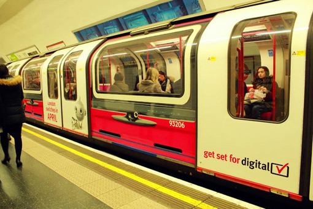
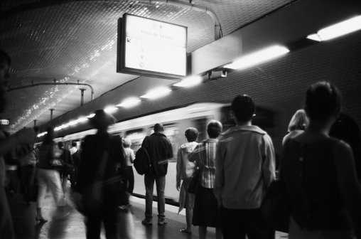
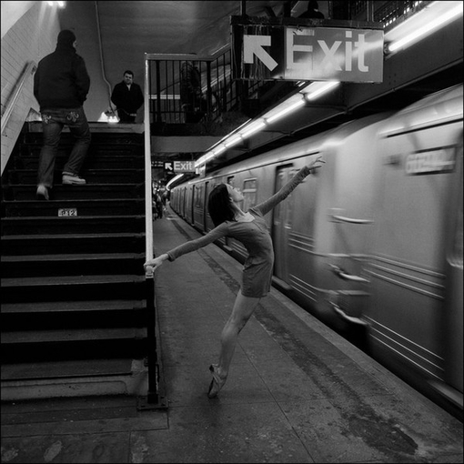

# 浮生地下铁

是做一辈子的懦夫，还是做这一刻的英雄？

眼前是一群黑压压的人，他们凶相毕露，双眼直视，脚步已经在不安地挪动。他们排成两行，却逐渐向我的方向靠拢；他们默然不语，却又杀气腾腾。

我面对着他们，脑海中浮现出了开始的那句话。

“我不在长安街。我不在光州广场。我不在警察清场中的华尔街，不在60年代的伯克利。我在京城地铁的一号线上。”

我和外面那群等待着一拥而上的人群相隔只有两扇玻璃门。我要出去，他们要进来。我如同孤身赤裸坠入秃鹰群中的一具天葬躯干，在潮水涌入的刹那，做好了生死由天，左右由人的觉悟。

北京的地铁是世界上运载能力最大的交通干线之一。每一天， 700万人如蚂蚁般出穴入洞，经由15条线路相连，在城市黑暗的地下世界里穿梭往来，再爬上地面。他们有的从容进入，狼狈出来；有的3D进去，2D平面出来；有的衣冠楚楚进去，衣衫不整出来。在夏日，人们褪去厚重的衣衫包裹时更是增进了所有人之间的摩擦和肌肤接触。那时候，人们纯粹地走进去，沾染着芸芸众生的DNA和气味出来。

在交汇站台里，进出车门的人群如同两军交战，狭路相逢。如果想体验300斯巴达勇士面对滚滚波斯大军冲锋时的绝望孤独，去坐地铁吧，紧贴在车门上，等待进站的一刻。你会希望背后有人相助，勾手扶肩，在潮水中杀出一条通路。但事实往往是波涛席卷之下，每个人都身不由己。

我曾经试过完全下不了一列班车：进站车门开后，只有短短的几秒黄金时间，那一瞬仿佛是摩西分红海时开出的短暂奇迹，车外两列排队的人群尚未聚拢，还有一丝希望从中间穿梭逃离。几秒过后，两列人会合，坚如磐石，如狂狼拍击，每一次向外逃离的冲锋都被无情地打回，只有以45度角斜身，用肩膀硬顶，双手猛推，才成功挪动一步，但转眼又被人群退回两步，直到警铃响起，车门将闭，终究叹气一声，认了这西西弗斯般徒劳的无力。

杨过海潮练剑，以力破巧，可曾想过有朝一日移步地铁？

只听两边的大妈在用京腔高喊：“快出来！抓紧下车儿！！”仿佛是下车的人在拖拉，踌躇。不，进出的人从不曾踌躇，他们意志坚定，他们只是在人海中抽搐。

列车员的高喊成为了喃喃不清的自言自语：出来吧！给你自由！

地铁是一个奇怪的存在。在这里，陌生人之间的距离被急剧压缩，素不相识的人，无论是浓妆艳抹的妇女，道貌岸然的绅士，青葱活泼的学生，西装革履的小白领，粗布军衣的农民工，都被化成了一具具木然的，散发着温热躯体，被挤压，推搡，并置。小清新的少女距离胡子扎拉，喷着酒气的大叔只有零点三公分的距离，鼻子嗅上了秀发，仿佛恋人般亲昵，少女却视之如常。平时扭捏作态，款款而行的白领女士也放下了时刻注重保持的身姿，只因在修罗地狱中再也无人观赏，人人自顾不暇。在紧紧包裹的人海中，要不然重新定义优雅，要不然接受现实。在这里，人的表象被卸下。我们只需要知道一个人的：占地面积，体积，形状，就已经足够了。让语言混入人群的喃喃自语中，让身姿隐没，让气味混杂，我们也就剩下了躯体，让灵魂和肉体融合。

在这个世界里，人与人之间的最大困难来自于对方。我们相互给予挑战和难题，构成了世界运行的基本逻辑。地上的世界又何尝不是如此？

但人们在这里相互挤压，排斥，对抗时，却又无可奈何地相互支撑，扶持，如万有的吸力和斥力，纠缠不清，相生相随。启动，加速，刹车，停止。列车进站，列车离开。列车载我们去远方，上了车，我们就身不由己，身躯却朝一个方向倾倒，一个方向施力，尽管我们彼此不认识。就像我们去一个地方上班，向一个目标前进，穿同样的服饰，追同样的潮流，尽管如同陌路，却被无形的力量牵引，在黝深的黑洞中爬行。

上周地铁里有人打架，一个男青年从门外飞速晃过，大步后退，另外两个人紧跟而上，拳头结结实实地抽上了对方的脸颊，拳拳到肉的声音让人心颤。转眼男青年的脸就涨红了。两个打人者被女保卫紧紧拦下，口中依旧不停地叫骂着

人多的地铁让人暴躁。

列车猛的启动，我插在大衣口袋里的手突然被人隔着衣服握紧。我回头看，是一个女生惊恐的眼神。她看到我警惕的眼神吓了一跳赶忙抽手，我才确认她只不过是一个忙乱中乱抓扶手的人，而不是我想象中的扒手。

人多的地铁是如此的让人不安。憔悴娇弱的特丽莎再也唤不起托马斯的同情。

地铁可以成为地狱。毕竟，它们都在地下。人流熙攘，会让人心浮躁，眼神涣散。每秒钟和30个陌生人打照面，在还没咀嚼青老俊丑的容颜，还没来得及追逐那一张一闪而过的耀眼脸庞时，新的40张脸就迎面而来，冲刷了所有关于过去的记忆和回味。

你走过国贸站那条连接1号线和10号线的长廊吗？你穿越过上海的人民广场站吗？你行走过纽约的时代广场站？你在圣母院地下的巴黎地铁交汇处驻足过吗？你被东京的大妈塞进过地铁车厢吗？人流，从四面八方相聚，转眼向四面八方散开。谁也留不住谁，谁也看不清谁。

光怪陆离的地下铁里，人世间百态纷呈。人们的面庞上带着悲伤，木然，欢乐，忍耐，突然被粗暴地压缩在了一起，成为了流动的心情盛宴。你从这条流动的情绪长河边走过，你在这条长河里照出了自己的倒影，你看到了自己前天的沮丧，大前天的雀跃，一年前的彷徨，五年前的回忆。你独独看不到自己今天的容颜。

不如收起情绪，一心做大隐于市的修行者。

佛祖在一号线？有一本书的名字就叫这个。

而一旦收起所有对心情，快乐，美好的追求，转而用思维代替，地铁也就成了天堂。

这是观察者的天堂。福尔摩斯会为这样的节奏和丰富的阅读材料而兴奋地彻夜不眠。从人群边穿过，在零点五秒内读出他们的职业，来历，去向，身家，修养。两点钟方向的女士，提着LV的大街包，穿着粗制的羽绒服，手上顺带拿着一个街边证券公司发放的纸袋，里面装着却是牛头不对马嘴的一叠打印文件和两个苹果。十点钟方向的男士，军大衣，灰西装裤，陈旧的皮鞋，一双劳动人民的手，神色充满焦虑地左顾右盼。他们是谁，他们来自哪里，他们来这座城市干嘛，有什么故事？去推理，去观察，去看人世间芸芸百态，地铁就是最好的试炼场。

在这里，茨威格会写出多少细腻丰富的短篇。

很多人说过，最好的思索场地不是办公室。最美的音乐，最好的文章，最精妙的想法常常来自于旅途。舒适的旅途或许能孕育出缓和优美的作品，但紧张刺激的地下铁也能诞生出数不尽的创意，只因在这沉重的尘世行走中，闭上身体的毛孔，却能放开心灵的触觉。

我喜欢在这里思考。有时是漫无边际的回忆，精神上的探索。有时是眼前的一个个有趣问题。地铁的等候人数在站台上真的是呈正态分布的吗（似乎是首尾突然下降）？为什么有的地方相较通道其他地方更为拥堵（往往可以找出瓶颈，处理速度小于流量的地方）？人群的来去方向分别是什么，有没有浪费的通道空间（依照每个站不同）？从双井到劲松走的是什么线路（从车辆拐弯的幅度可以推算）？林林总总，不能尽数。

一个作家曾经被人恐吓，说要将他流放到西伯利亚的旷野中。或许，那儿光是致命的无聊已经足以杀死一个人。但他只是笑笑说，那正好，他可以用这几年的时间在心里完成一部新小说的腹稿，甚至连稿纸都不需要。

人或许容易在人群中木然，在生活中失去兴趣，在烦躁中迷失。但一个丰富的心灵足以拯救人于尘世的空虚本质中。即使在西伯利亚都能富足地生存，又何况是地下铁这个丰富的人生舞台呢。

（采编：陈肃，责编：佛冉）
