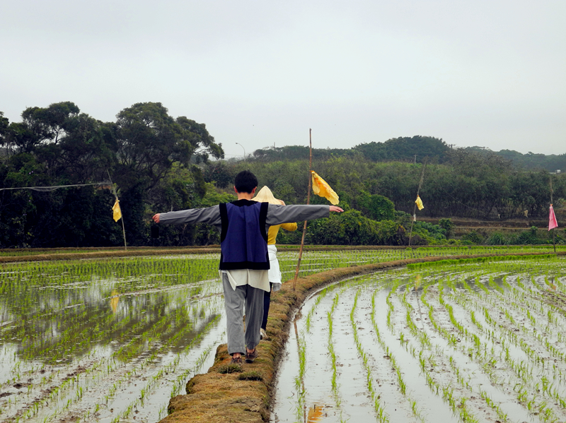
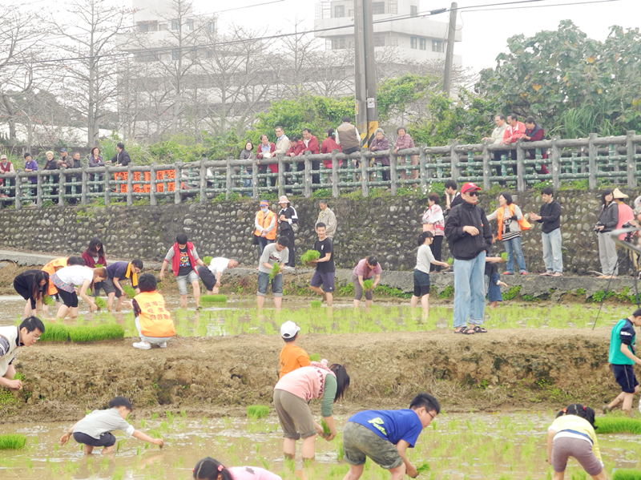
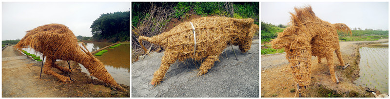
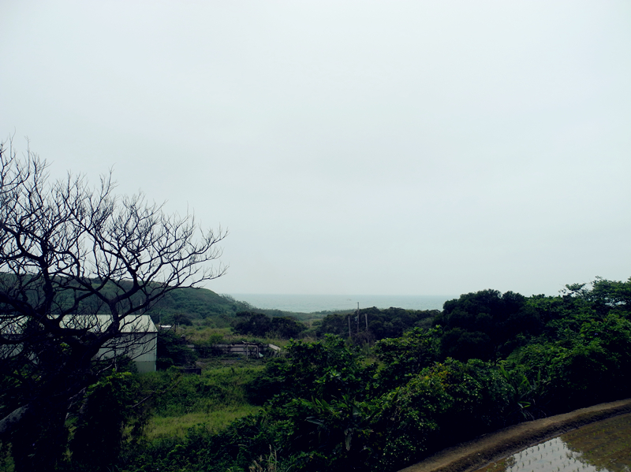
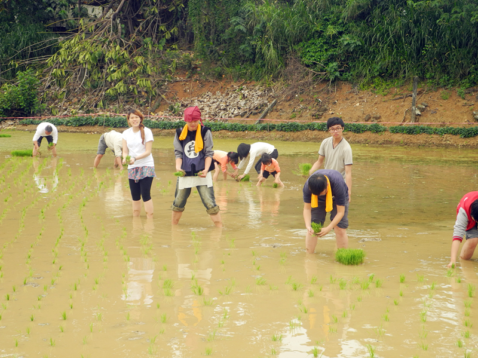

# 淡海札記（一）——遇見山海

淡海，下圭柔山，它曾經離我很近又很遠。

雖然我來淡水已經快兩年了，但是水和海的一字之差，讓淡海始終遙遠於我的生活，我只是從公車站牌上得知比淡水更接近天邊的地方叫淡海。但它到底有怎樣的風景，對於我來說一直神秘。

這顆鑲嵌在大臺北地區最後的翡翠讓山、海、城市之間得以緩衝，得以柔和，如果不是那一方海邊的梯田，我大概一輩子都不會和這個世外桃源一般的純淨之地有生命的交際。

那是春分前的幾天，我和我的朋友們第一次來到淡海的下圭柔山，參加一個名為農村生活心體驗的活動，整個活動有小型的繞境，有音樂表演，而重頭戲是體驗下田插秧。

我們從學校出發，原本以為路途漫長，沒想車開了不到15分鐘就到達了目的地。原來，淡海離我們一點都不遠。

大家在泓安醫院前下了車，這個安靜的不像話的醫院其實是一家精神專科醫院。醫院外面的路邊擺著很多的石雕，大多是半身人像，一個挨一個的排在路邊，有的西裝筆挺，有的笑容和善，路過的時候不免讓人多看幾眼。後來我才知道，在這個小小的村落裡臥虎藏龍，生活著很多具有隱士風範的藝術家。正是他們讓下圭柔山有了浪漫的氣質。

我們到達時，時間尚早，遠遠傳來鳥兒清脆婉轉的啼聲，這裡是鳥的天堂，整個淡海地區棲息著超過百種的鳥類。它們有的是候鳥，從遙遠的西伯利亞，中國大陸或者日本翻山越海來到這裡過冬，待來年春意冉冉時再飛走。而有的鳥飛來後就不願再飛走，成了這裡的永久居民，在下圭柔山的恬淡裡安然度過寒暑春秋。

這天的下圭柔山格外熱鬧，因為孩子們來了。我沒想到這個有點難找的小村落居然吸引了幾百個孩子，家長們帶著自己的寶貝來到這裡體驗農村生活的樂趣，作為大孩子的我同樣也很興奮。

我接到的第一個任務是去不遠處的藝術村搬東西。一開始我只知道是搬三件稻草紮起來的藝術品，但具體是什麼，我沒有概念。等到三隻龐然大物橫放在我眼前時，我就只剩下驚歎和為難了。朋友們商量一番之後決定大家一隻一隻的把它們抬到農田裡去。 這真是一件頗為辛苦的事情，七八個人手忙腳亂一番之後，總算是把一匹馬、一頭牛和一隻巨大的黑面琵鷺折騰到了梯田旁。我們把那只造型酷似華爾街銅牛的稻草牛擺在路口，突然不知誰說了一聲：“歡迎來到華爾街！”大家都哈哈大笑起来。

隨著一陣嗩呐高亢的曲調，土地公繞境儀式開始了，小朋友們抬著神明的鑾轎走在大人的中間，長長的一條隊伍在下圭柔山蜿蜒向前，走過農田、走過埤塘、走過住家，祝願著平安能灑滿這寧靜之鄉。

但當時我們不知道的是，這寧靜之鄉其實頗不寧靜。

民國81年，淡水被規劃出1,756公頃土地作為特定區域開發基地，計畫年期為25年（自1990年起至2014年止）。這塊西至台灣海峽，東至淡水區水源國小，南北以台二號省道之二號橋與九號橋為界的土地就是所謂的淡海新市鎮。

我在大一時和朋友騎車去北海岸，在淡金公路的右側看到的是大片大片的荒地，當時只是覺得不可思議，怎麼會留出這麼大一片的土地任其荒蕪，後來才知道，原來這就是傳說中的淡海一期。

淡海一期，曾經被期望為緩解臺北住房壓力的應許之地。二十多年過去，開發率不足一半，原本預計引入十三萬人，而現在只達到了十分之一的目標。外表豪華的樓盤被路障和房價擋起，成為與世隔絕的空城。

與計畫年期一致的是限建年期。在過去的這二十四個春秋裡，計畫區裡任何一間新房的出現都會被視為違法。這裡被人為的拖延，被人為的老舊，原本不該老去的淡海，今日已經明顯落後於時代，很多人的生活品質也一直無法提高。老百姓們默默咬著牙，忍受辛苦。

如今，又要徴地了。而此刻我眼前的下圭柔山就在那張徵收圖紙的範圍之內。我實在無法想像，他們要怎麼推平這高低起伏的丘陵，怎麼埋葬這沃野和良田，但是一想到這裡有一天會被怪手挖的滿目瘡痍，我的心情就突然開始沉重。

在歡喜熱鬧的繞境結束之後，我和兩三個朋友偷偷遠離了人群，向梯田的遠處探索。走過田埂，跨過溝渠，撥開樹蔭，山丘的背後突然明亮，出現一抹淡淡的藍，在天空的下方那是海平線，我從沒想過山、海、田可以如此親近，這樣的田園風光不再小家子氣，它有了寬廣的氣息，是無限，是未來。

我望著海望到出神，久久不願離開。如此夢幻的地方讓我有想要守護的衝動。但那時我並不知道，在不遠處，一個曾經一樣美麗的地方被偷偷填倒成了垃圾山。不知從什麼時候開始，在漆黑的夜色中，垃圾被以一車四千元的價格賣到這裡，熟睡中的村民們並不知情。直到垃圾堆成的山，到了再也無法掩飾的時候，村民們只能在無奈中接受現實，這座原本不該出現的怪異之山，成了他們心中難以跨越的坎坷。 我和朋友回到人群中時，熱鬧的表演已經接近尾聲，正好輪到淡江大學烏克麗麗社的同學們表演。年輕人活力四射，感染著在場的每一個人，而之後朋友的吉他彈唱亦是博得滿堂彩。

在下圭柔山的歌聲裡，我們來到田邊。老農夫們已經準備好了一捆一捆的秧苗，放在水田的旁邊。孩子們早已等不及，紛紛卷起褲管跳進田裡。整塊梯田突然間沸騰。我們也迫不及待的跟著下了田。

我從小到大都生活在城市裡，從未下過一次水田。第一腳踩在田裡的感覺是新奇和興奮。這是我第一次和土地親密接觸，泥巴沒過我的小腿。在我的皮膚上留下泥土的印記，同時也把這感覺深深的烙印在我心底。

老農夫們穿梭在水田中，動作嫺熟，很快就插好一排秧苗。初來乍到的我和小朋友們一樣對著秧苗下不了手，最後還是得靠老農夫們手把手的教。但是一樣的秧苗到了我們手裡，插下去還是變得不成樣子。一簇多、一簇少、一行偏、一行歪。整個水田被我們插的亂七八糟，我突然覺得我們根本就是來搗亂的。而周圍的小朋友們在這田間突然具有了成倍的殺傷力，他們不顧衣褲不顧爸媽的在水田裡奔跑嬉鬧，而遭殃的除了他們的媽媽，還有我。最終，我帶著一身的泥土，戰績輝煌的回到了田埂上，身上的泥已經多得讓我擦不過來。我坐在溝渠旁洗腳，稍微整理了一下，狼狽的穿上鞋襪。遠處傳來朋友們的召喚，他們在田埂上排成一排，擺出pose，相機快門記錄下的是他們燦爛的笑容，還有這美的不像話的下圭柔山。

從那一天開始，我再也離不開下圭柔山，再也離不開淡海，在田邊望海時萌生出來守護的念頭在我心底生了根，我不再是淡海的外人。我和這片土地有了羈絆，和這裡的人們有了連接，而我和淡海的故事從這裡才剛剛開始。

（採編:余澤霖 責編:余澤霖）
