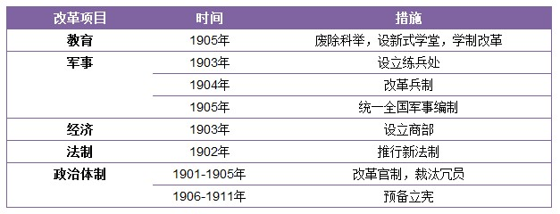
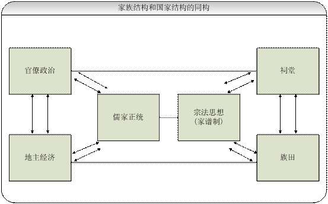

# 清末科举制度废除与双轨政治

** **

自1840年以降，清政府内忧外患不断：英法等率先步入工业化的强国以及日德等新兴强国不断对老大帝国发起冲击，清政府割地赔款外加政治依附，亦不能取悦西方列强；国内则是改革失利，民怨四起，革命暴乱此起彼伏。清朝已处于风雨飘摇之中，走向灭亡也只是时间问题。

不过，在晚清这段时间，发生了很多有影响并且很有意思的事情，许多政治力量登台亮相，并推出各种改革策略。洋务派二十年，曾创造出“同治中兴”的神话假象，百日维新也令许多人为之血脉喷张，认为这是立宪派在中国历史上少有的登台机会（当然剩下就是革命派了），也是中国走向“宪政”的历史机遇。但在这篇小文中，时间定格在了慈禧领导的清末新政，1901年。

不得不说的是，受以往革命史观的影响，大多数研究关注点往往在于阶级斗争，注重宏大叙事，将参与者脸谱化，并有将政治进程简单化和公式化的倾向（当然本文的叙述也都属于这种假大空的论调）。或者就是将其斥之为“反动政府”苟安残喘并谋求保证自己的统治地位而实行的“欺骗人民”的策略。而忽略了一点，那就是作为当权者的“合法”政府面对危机所做出的调整姿态和改革夙愿，以及重建有效政治权威的诸多努力。对于这种看法，我们姑且一笑了之。

#### 一·晚清新政的推行和科举制的废除

晚清新政，始于1901年，义和团运动失败，数目巨大的庚子赔款激起了各地的民变，加之各西方强国对中国更为变本加厉的侵略，清朝统治者意识到了自己王朝统治的巨大危机，遂进行变革。革命话语斥晚清新政为“假维新”，“伪变法”，而中国史学受革命史观的影响，亦一直持有此观点。然庚子之后，清廷危机日重，民变四起，革命日盛，王权岌岌可危，再也无法照旧统治，在危急关头，我们不能否认，清政府此举也确实是在为了国家的运行而进行的一次彻底的变革。“变法”是民变与革命之中惟一一条谋生之路，因而不乏真诚。这不仅是高层的认知，也是国民的普遍认知。数年间，慈禧太后曾多次表示要进行改革。

《光绪朝东华录》记载慈禧太后借光绪之口所发的上谕：

法积则弊，法弊则更，唯归于强国利民而已。

……晚近之学西法者，语言、文字、器械、制造而已，此西艺之皮毛，而非西学之本源……一切故事，尤须切实整顿，以期渐至富强。懿训以为取外国之长，乃可去中国之短，惩前事之失，乃可作后事之师。……

总之，法令不更，锢习不破，欲求振作，须议更张……各就现在情弊，参酌中西政治，举凡朝章国政，吏治民生，学校科举，军制财政，当因当革，当省并省……物穷则变，转弱为强，全系于斯。倘再蹈因循敷衍之故辙，空言塞责，遇事苟安，宪典俱在，决不宽贷。

在措施和执行力度上来看，新政不仅是对洋务运动的继承，而且其广度和深度远远超越了戊戌变法。

 **新政的具体措施包括：** 

关于新政，鉴于各种史料的论述已经非常详实，我就不在这里赘述。

新政施行之后，在改革的大环境之中，全国的确出现了一阵清新之风。首先，军队建设方面，废除了旧式的军队，编练新军，其中以袁世凯的北洋新军和张之洞的自强军为代表，而湖北新军在辛亥革命中发挥的作用也不得不让人感慨历史的嘲讽。政治上，1908年预备立宪，颁布《钦定宪法大纲》并开始着手组建责任内阁制，开放党禁，允许民间结社游行，创立政党，一时间，全国涌现出大大小小数百个政党。当然，开放党禁和报纸也为舆论的自由提供了良好的契机，另一方面，也为革命和改良等各种政治势力宣传自己的主张提供了便利。在这些政策当中，教育制度的改革是一个十分关键的因素，因为科举制度的废除，从根本上改变了政治结构的格局。

#### 二·科举制度与士绅社会—家国同构与双轨政治

这里要有一点概念的转化，在新政改革中，科举制度是比较狭义的使用，在下文中可能会更为广义，指一整套的制度设计，大致涵盖文化影响以及官僚权力配置，亦即双轨政治。

诚如白鲁恂（Lucian Pye）所讲，传统中国是一个相当成熟的文明体系，在外来力量的冲击下，整个体系分崩离析，文化民族的转型尚未彻底，始终徘徊于传统与现代之间，但又想混入民族国家的行列，因而成为了近代社会转型的最根本障碍。

两千多年的儒法专制社会尽管经历了战乱，兴衰和变迁，这套社会体系却始终根深蒂固的一直存在，这就说明这一体系是如此的牢固，同时也说明了分崩离析的传统社会转变为现代民族国家之艰难。

下图取自金观涛的《兴盛与危机：论中国社会超稳定结构》：

金观涛认为，作为经济形态的地主经济以及儒家正统的社会思想和官僚政治的联动是这个稳定体系的基础，同时也解释了传统社会家国同构以及在儒家文化的意识形态强力整合之下的制度构型，亦即伦理政治观，具体表现就在于科举制度的整合作用。但是，这个模型过于宏观化，对于具体的制度构建以及政治形态，行政效力的分析则显得解释力不足。而且，他更重于对文化和伦理的分析，经验性略有欠缺。在这个模型中，传统中国在其独特的家国同构形态以及经济政治和意识形态等方面的影响之下，保持了两千年的超稳定形态，而基本未发生太大的变革。“国”的结构是地主经济，意识形态和完善的官僚政治体系；而“家”的结构则是族田，祠堂，具有宗法意味的家谱制。何以解释呢？国对应着家，一个是宏观的，有自己独立意志的主体，一个是微观的，组成宏观主体的因子；思想上，儒家学说用宗法和伦理来控制了家庭成员，如三从四德，三纲五常，不一而足，社群中的人用传统的伦理观去维持着社会的整合和下一代的社会化；祠堂无疑是这种整合所存在的场域，在这种场域中，存在着种种约定俗称的规范，进行着模糊而又紧迫的仪式实践，不断地强化对于族群，对于整个国家（天子/社稷）的崇拜和忠诚，这种场域背后的逻辑就是权力逻辑和家长制逻辑；另一方面，对于违反这些规范的行为，惩罚措施也是十分严厉的，葛兰言曾有过研究，在宗族祠堂和族谱中不会有这个人的名字，这对于当时的人来说，无疑是最严厉的处罚，因为被家谱除名，就意味着死后无法在宗祠中享受后人的祭拜，而只能作为一个孤魂野鬼。

当然，这个模型也不是尽善尽美。对于传统社会中“双轨制”的政治安排和社会结构，也是缺乏解释力的。在逻辑上，家国同构的模型更强调二者的同一性，因而对二者之间的对立：如具体的忠孝观念之间的矛盾不怎么有明确的解释。此外，这个模型同样忽略了政治系统的命令执行程度，所以，对于双轨的中国政治形态缺乏足够的描述。

在专制的王朝时代，政府的命令通常只能到达县一级，“王权止于县政”。由于行政结构的安排，县令以下的行政权力，基本上是由民间德高望重的知识分子承担，这部分人又被称为“士绅”—没有取得功名或者告老还乡的官员，但是享有一定的威望并占有部分政治机构中的资源。而拥有政府中官职的知识分子，则被称为“士大夫”。但无论是士绅，还是士大夫，其本质都是知识分子。士绅对民间治理的合法性不是经济，甚至不是权力和组织，而是传统的文化价值。但是，知识分子又扮演着另一重角色：作为政治权威的批判者；作为政治权力的所有者，知识分子-士大夫可以实现自己的政治理想，而作为政治权力的批评者，他们又可以与权力当局保持一定的距离和张力，也就是在政治互动之中附带一些冲突和整合，从历史上来看，知识分子和政权的冲突一般都在安全阀之内，因为知识分子都有着自己朴素的政治抱负，希望政权能像他们所设想的一样，儒家的价值观对其有着很强的形塑。所以可以有效避免知识分子不满带来的冲击，实现政治体系的长久稳定。

关键的一点就是官僚政治体系的构成，他们是由国家通过大规模的正式考试录取上来的公务人员，他们具有同时代欧洲国家不具备的优势：1）不限阶级，所有人只要符合基本的要求都可以参加科举考试，而欧洲国家则大多要求贵族出身，平民几乎没有通过正式手段向社会上层流动的途径，相比之下，中国的科举为严格的社会结构打通了一条道路，允许寒门子弟通过天赋和努力实现社会的向上流动，并在形式上和实质上均缓解了阶级区隔和制度性排斥的风险；对于普通的知识分子来说，科举制度更是自己向上层流动的为数不多的合法渠道，是改变自己命运的一个契机。再加上儒家学说固有的家国同构思想，因此，讲究“修齐治平”成为学子们的追求而非通过农民起义实现自己的政治抱负，进可以入庙堂，退可以出江湖，有进有退的选择使得儒家思想保守倾向十分明显，当然，这对于维持统治是十分有利的；2）中国的官僚制度更为“理性”，层级明晰，责任清楚，有专门的取仕途径，并作为一项制度化措施不断延续，而欧洲的官僚制度则大多是贵族政治，取仕也基本靠出身和继承，相比之下，优劣明显。作为一项历时长久的制度设计，它不断在完善自身，使之更加适合专制王朝选拔符合自己统治要求的治国人才，同时可以摆脱贵族政治造成的保守性，利于自己政策的推行，我们可以看出，中国统治者用一个超越其社会结构不止一个时代的官僚制度管理者一个庞大但结构简单的农业国家，是绰绰有余的。

因此，在科举制度的时代，知识分子们的命运就这样被联系在了一起，作为“绅”的知识分子与作为“大夫”的知识分子，成为联系底层社会和国家政权的关键环节；同时，作为文化的主要习得群体，又肩负着意识形态场域的运转和维护，于是也与国家政权，与社会联系在了一起，并处于中心的位置。这同时也预示了科举制度终结之后传统知识分子的尴尬处境。

#### 三·后科举时代-整合环节欠缺

随着外部势力的入侵和影响，传统的中国社会不堪整合要求的重压，濒于解体。由于中华帝国本来自成体系，突然遭到“千年未遇之剧变”，因此，庞大的古老帝国显然没有足够的试错机会和时间，只得对变化忙乱应付。戊戌维新期间，主张变革者将教育症结归于科举取仕制度的束缚之上。梁启超有言：“欲兴学校，育人才，以强中国，惟变科举为第一义。大变则大效，小变则小效。”而严复指出：“如果今日中国不变法，则必亡是以。然则变将何先？曰：莫急于废八股。”1904年的日俄战争更是给中国的传统士大夫带了了巨大的冲击，教育不改，国祚不强。而新式学堂显然是日本胜利的关键。

在社会各界的强烈呼吁，以及动荡不安的社会现实交加之下，清廷终于在1905年废除科举制度，废除旧学制及选官制度，并建立了一系列的新式学校，对教育制度，以及官僚体系进行了大刀阔斧的改革。当然，从清政府的本意来看，意图到达救国图强的目的，但是事与愿违。首先，科举制度废除打乱了传统的士农工商几个等级的社会秩序，造成了社会分层的紊乱；第二，效果并不彰显，很多地方官员仍然出身于传统的功名科考，新式学堂并没有取得立竿见影的效果。

尽管学者们都看到了废除科举制带来的进步气象，但是忽略了重要的一点，那就是科举制度是作为专制帝国的社会整合的核心，它的运行，固然弊端丛丛，不过在没找到更好的替代机制以担负社会整合任务之前，贸然废除确实加剧了社会的无组织状态。本来，通过科举制度的纽带，儒家观念对于乡村社会的影响是具体的。家族的荣誉和发展均系于子弟获得功名，所以在以家族制为特征的乡村社会中，对于教育的重视自然形成了千千万万的耕读世家，儒家的理念就是通过这种教育模式得到传导。上文分析也指出，宗法制度和专制统治制度具有一致性，虽然朝廷通过乡里制度，对村落和乡村社会实施的是间接控制，乡约和族规都得到了与法律一样的地位，但是究其根本而言，乡约和族规的制定者仍然是儒生，它在本质上仍然是儒家观念与国家意志和地方信仰的结合体。所以地方秩序虽然存在多元化的价值结构，但儒家观念仍然居于社会的主导地位。但科举废除之后，城乡二元格局，和中央-基层二元格局彻底得到打破。农村的士绅失去来源，并最终使得儒家承载群体在乡土社会中的式微。一方面，是社会的集体观念的衰落；另一方面，担当与国家观念和主流意识沟通者的士绅失去了制度屏障，失去了以往的权威来源和作用发挥的空间，在制度上，国家亦失去了一个强有力的整合机制。

这样讲的话在即使不低估其他机制的整合作用的前提下，也可能会高估科举制度的社会作用，但是对于传统的双轨制国家，它还是有着别的制度不可比拟的优势。科举制度废除之后，新产生的智识阶层和精英人士大多居于城市，而在基层的社会，由于失去了传导到中央和城市的沟通途径，整个国家在乡土社会留下了巨大的权力空白，社会支离破碎，一盘散沙。

#### 四·双轨政治的终结——全能型政党国家

清亡之后，留下了一个烂摊子，所以重建有效政治权威的任务就交给了它的继任者。首先是革命党失败的尝试，接下来是北洋政府。真正采取了实质措施的，就是接下来的政党革命。在经历了北洋时期议会制运动以及大革命初期的失败之后，国民党由一个主张合法参与政治斗争（采取上层路线）的政党，转变为一个集权式，组织严密的全能型政党，并且，这和孙中山向苏联布尔什维克的学习是分不开的；与中国国民党相比，共产党在组织上与之基本没有太多的差别，师从俄共，都是布尔什维克式的政党，都是追求党的绝对权力和威望，并试图进行“党治社会”，同时也都谋求有效的政治权威的建立。

当然，二者不同点也是显而易见的。当传统中国存在两个彼此相对独立的自稳定的政治沟通模式之时（此时尚需要中介的力量），国民党的整合力度远远不够，其触角仅仅延伸到县级，基层党员数量严重不足，这也阻碍了国民党政策的传达效率。相比之下，共产党就十分重视基层的渗透，甚至深入每家每户，建立了远比国民党更为精致的组织系统，因此，在组织上，共产党就先胜一筹。而在社会动员的层面，共产党同样优于国民党，国民党是一个城市政权，因此更多的是在城市中遥控着边远地区。同时，国民党也排斥基层的动员，当然还是组织上的因素：无力对基层进行有效的动员和控制。而且，这也是根本的差别所在：共产党使得最零散化的基层农村社区组织了起来，汇成了一股强大的力量，这是国民党远远不及的。

关于两个政党如何斗争，如何实践，本文就不再赘述，可以另外再撰文叙述。但可以肯定的一点就是，全能政党的革命实践是双轨政治的终结。此外，文中的观点是本人整合后再阐释的，可以承担法律责任。但鉴于这不是学术论文，我没有严格按照学术规范来写作。在文末我会列出相关的参考阅读书目，不甚完整，各位朋友可以共同评阅。

 

### 【参考书目】

 邹谠：《二十世纪中国政治》，牛津大学出版社，1994. 费孝通：《乡土中国 生育制度》，北京大学出版社，1998. 王宪明，蔡苏乐主编：《中国近代史述要》，北京：清华大学出版社，2008. 陈旭麓：《中国近代史十五讲》，北京：中华书局，2008.7. 夏东元：《近代史新论》，上海：华东师范大学出版社，2009. 费孝通：《皇权与绅权—费孝通全集第六卷》，内蒙古人民出版社，2000. 费孝通：《论双轨制—费孝通全集第五卷》，内蒙古人民出版社，2000. 金观涛、刘青峰：《兴盛与危机：论中国社会超稳定结构》，香港中文大学出版社，1992. 刘海峰，李兵：《中国科举史》，上海：东方出版中心，2006.6 王日根：《中国科举考试与社会影响》，长沙：岳麓书社，2007. 孔飞力：《中华帝国晚期的叛乱及其敌人》，谢亮生等译，中国社会科学出版社，2002. 葛兰言：《中国人的宗教信仰》，程门译，贵州人民出版社，2010.3 杨念群：《中层理论—东西方思想会通下的中国思想研究》，江西教育出版社，2001.  

（编辑：周拙恒；责编：周拙恒）

 
