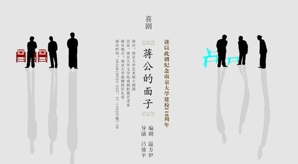

# 温方伊：面对权力，我更愿意做《蒋公的面子》里的夏小山

###(一) 谈《蒋公的面子》： “我知道它有很多不成熟的地方”

**七星人物：** 之前你在接受采访时说过，这部戏没有那么好，它的影响力远远高于它的质量。那么如果满分10分，你给《蒋公的面子》的剧本打多少分？

**温方伊：** 7、8分吧，或者7.5？（笑）
  
**七星人物：** 你觉得媒体大量关注这个剧的原因是什么？

**温方伊：** 因为它带来了话题。媒体关注的永远是话题。而这件事情能挖出话题来，这就是你为什么会坐在这里的原因。（笑）
  
**七星人物：** 在你看来，这部戏存在的最不成熟的地方在哪里？

**温方伊：** 最不成熟的地方很难说，我知道它有很多不成熟的地方。比如说它的剧本在我看来，还是说了太多并不需要的话。而它的表演，如果在现场看来的话，缺陷也是很明显的。而导演也没有找到一种特别好的方式，让它在舞台上动起来。

**七星人物：** 我们看之前南周的报道，发现您与导演吕效平老师对这部戏的主题的看法有些不一致，他想表达“人的荒谬”和“对现实的担忧”，您怎么看待吕老师的这个想法？这种不一致会使这部剧最后呈现出来的效果和你作为编剧的预想会有哪些不一样？

**温方伊：** 因为吕老师太清楚现在大学里面教授的状态，也太清楚现在知识分子跟权力之间的状态。他是想跟当下对话的。

而我一开始听到这个题目就对“与当下对话”并不感兴趣。我想的是做“知识分子永恒的精神困境”。我并不想把它和当下的体制有太密切的联系，因为在我看来知识分子的悲剧性和尴尬状态是自古以来都有的，古今中外都有，只不过是程度上和表现方式上的问题。

我们这种差异是一直存在的，不过在最后的呈现上，也并没有什么特别大的分歧，因为对于这个剧的精神本质的理解还是比较一致。而是不是跟当下对话这件事情在整个舞台呈现上并不会有太多的体现。

**七星人物：** 这部剧从在校庆时第一次正式演出，到国内百场，再到美国巡演，你的心态经历了一个怎样的变化过程？

**温方伊：** 一开始在学校演出的时候我以为只演一场，但后来跟我说是演四场，我已经非常高兴了。我觉得一个本科生的剧能够演四场简直就是，嗯，觉得大学四年就没白读了，站在人生顶端了。（笑）

没想到后来商演之后还是很成功，我已经觉得大大超过我的预期了。当一个人的预期在这儿（比划）的时候，超过一点他就会很兴奋，但是超过越多就越没有感觉。一开始跟我说去美国巡演，我觉得这是一件很荒诞的事情。现在这个剧能走多远我已经不是特别关心了。

**七星人物：** 在美国巡演去了哪些城市？美国观众是否能理解剧中国文人的特质？

**温方伊：** 旧金山，洛杉矶，达拉斯，休斯顿，华盛顿，纽约，从西线到东线几个比较大的城市去了一下。

上座率每个城市也不一样，旧金山第一场是最好的，效果很不错，跟国内没有什么区别。观众都是华人。一般来看这个剧的一种是老华侨，还有一种就是当地的华人留学生。留学生接受这个戏跟国内并没有太大差距，因为毕竟主要接受教育还是在国内。老华侨也没有特别大的问题，主要是我发现美国华人对政治的敏感度好像比国内观众还要高。

因为这个剧太中国了，而且里面有大量的典故，对于这个历史背景，外国人也不是很了解。所以给外国人看其实是很困难很困难的一件事情。

**七星人物：** 2014年还有巡演计划么？

**温方伊：** 今年在南京还会有演出，三月底在深圳也有两场，后面还会去北京。

**七星人物：** 剧中“时任道”，“夏小山”“卞从周”这三个名字有什么内涵吗？

**温方伊：** 主角的名字也是改了很多次。“从周”和“任道”这四个字是最先定的。“从周”这个名字一看就是用的孔子的那个典，“吾从周”，表现出卞从周他其实是一个政治上的保守派，支持政府的，他希望能够通过自己的行为推动政治进步，希望能够一定程度地融入到政治里面去。

而“任道”呢当然就是“任重而道远”，他想肩负时代道义，他是想跟政治实质上远离而精神上能够连接起来的一个人。夏小山的原型是胡小石先生，他原来的一个住处就叫“愿夏庐”，就取了“夏”这个姓，然后叫小山也是因为我特别喜欢晏几道。

**七星人物：** 剧中有一个从未露面的角色，叫楼之初。为什么要设计这个人物？他的价值在哪里？

**温方伊：** 写这个剧有一个大问题就是怎么把这三个人聚集在一个空间里。这个剧是学《艺术》，学《哥本哈根》，甚至学了一定的《禁闭》或者《洋麻将》。

《洋麻将》的一男一女本来就在一个养老院里面，他们可以一直聚在一起。《禁闭》那是因为他们三个人被关在地狱里关在一个房间，虽然他们互相憎恨，但他们仍然没有办法出去。《哥本哈根》同样是三个灵魂的对话。

而这是一个现实题材的剧，一个政治左派，一个政治右派，你怎样能把他们按在一起对话两个小时。后来看了这些，尤其是《洋麻将》，就想要么打麻将吧。但是有一个问题在于打麻将是要四个人，后来我就设定了三个人在等待第四个人，使得他们能够困在一个空间里对话。而既然这三个人是三个知识分子不同的状态，对于政治不同的状态，生活中不同的状态，那我就希望这第四个人在他们口中也是他们所理解的一种不同的状态。

 
《蒋公的面子》海报

###(二）谈知识分子：“我可能会更愿意做夏小山”

**七星人物：** 你是如何理解民国文人呈现的整体状态的？你觉得现在还有文人吗？从那时到现在，知识分子这个群体发生了哪些变化？

**温方伊：** 当然有文人。现在这么一种思想萎靡的状态当然是不大正常，但是还是有文人的嘛。在我看来，人与人的区别是不会因为年代的变化而产生太大的变化的。只不过民国它的风气更开放，它还是接连着前面文人士大夫的一种精神在里面。所以你会看见一些很癫狂的人物，比如黄侃。

在我看来，民国那时候的文人比现在是要自信得多，当然社会对他们的承认也要更多。但是他们同时他们有他们的自卑和苦恼，因为那个时候中国是一个最混乱的时代。他们对中国的命运有深深的担忧。他们也是看不到未来的，就如同我们现在也是看不到未来一样。

我们当代，经过多次的运动，一遍一遍把知识分子的骨头剃掉，把他们的皮扒掉，把他们做人的尊严整个儿给去掉之后，你让他们再立起来，一方面他们自己是没有信心的，另一方面民众对他们也没有当时那样大的信任度了。

中国是有知识分子的，只不过数量远远少于民国时期，质量也远远低于那个时段。

**七星人物：** 你觉得文人和知识分子这两个概念有什么差别？

**温方伊：** 是有区别的。在中国传统意义当中很少会有现代意义的知识分子，因为中国传统的文人他们只有一个目标，就是进入官场。而只要他一进入官场，他就很难说是一个现代意义的知识分子了。另一方面中国的知识分子是很难逃脱掉过去的影响与印记。现在知识分子起码有一个标准是他要保留自己的独立思想。

**七星人物：** 你觉得什么样的人可以被定义为“知识分子”？这个群体应当有哪些特质？

**温方伊：** 我并不是很清楚西方对于知识分子的准确定义，但是在我的理解中，第一，当然要具备一定的知识量。第二，他要有足够的智商来驾驭他的知识量。第三，他要有一个独立思考的意识。

我觉得这三点是密不可分的。虽然现在教育已经做得非常普遍了，大学非常多，但是顶尖的大学生仍然会是那么一批人，并不会因为知识的普及而使金字塔顶端的人增多太多。

**七星人物：** 是不是可以理解为有知识的人很多，会思考的人很少？

**温方伊：** 你不可能指望所有的人达到那么一个层次。因为我真的知道有一些人，他甚至读到了博士，但是他没有办法驾驭自己的知识量。

**七星人物：** 你对知识分子群体的认识经历了一个怎样的过程？

**温方伊：** 小时候看过了太多了顶尖人物的时候，容易产生一种“吹毛求疵”的心态。我记得我小时候读培根随笔，它里面写的当然很有道理。可是我会觉得这个人并没有真正履行他写的这些东西啊，并且他自己本身也进过监狱啊。但是后来我发现吹毛求疵的这种心态非常不现实。

**七星人物：** 所以你读书的时候会对写作者有一种苛求是吗？

**温方伊：** 会有一种苛求，甚至对这个世界上的人也有太多的苛求。但是后来你真正接触了生活之后你会觉得，很困难，并不是所有人都能做屈原，你也不能要求所有人做屈原。就像鲁迅只会骂街，但是你找不到任何的解决方式；胡适似乎要找解决方式，但并没有找到。但是这些东西把它放在一个真正的人的框架内，你会发现：要求太高了。后来我逐渐地发现这个问题之后，我再看他们，才会发现他们也是真正的人。

**七星人物：** 你所喜爱历史上的的知识分子有谁？

**温方伊：** 有一个美国记者叫伊罗生，他曾经写过一本书叫《中国革命的悲剧》。这个美国记者很有名。他曾经很年轻的时候来到中国，那个时候还是民国时代。他看到了很多底层民众的悲惨生活，他决定成为一个共产主义者。

我比较喜欢他主要是因为他是一个永远的怀疑论者。他不会因为他信仰什么而选择性地忽视掉其中的问题。他是一个好记者，一个有自己立场的记者，而不会永远盲目地跟着别人走。

**七星人物：** 你认为知识分子在社会中的使命或者说作用是什么？或者说，他们该承担哪些责任和义务？

**温方伊：** 当然应该承担某些责任，因为他们是社会精英。一个知识分子达到了一定的精神高度之后，他会希望引领这个时代，想要别人认同我的看法。

他要引领这个时代，一方面是跟高层对话。另一方面是跟普罗大众对话。但是跟高层对话他缺乏能够行动的权力，如果高层不听他的呢？另一方面，这么多年，起码在中国，知识阶层是鄙视普罗大众的。一方面他们想引领普罗大众，另一方面他们又鄙视着普罗大众。所以他们跟普罗大众之间的对话其实是隔绝着的，而跟高层之间的对话又缺乏一定的力度，所以一直处于一种很尴尬的状态之中，就像屈原。而这种尴尬的状态到今天仍是如此。

在我看来，知识分子永远要有自己的担当。如果我们说高一点的话就是：“为天地立心”。这是最高的，说低一点，一个知识分子，他要有自己独立思考的精神，不随波逐流。哪怕我无法引领这个社会，我选择不随波逐流。这在我看来也足够了。

**七星人物：** 知识分子面临的困境之一就是对待权力的态度，如果有一天你自己面对这种困境的时候，你会怎样抉择？

**温方伊：** 每个人会有自己的选择，并不会有统一的答案，很难说谁对谁错。就我个人的选择来说，我可能会更愿意做夏小山。

 
温方伊

###（三）谈话剧创作：“年轻带来的优势是大家会更宽容”

**七星人物：** 你平时喜欢看什么类型的戏剧？最偏爱哪几部？

**温方伊：** 很难说具体喜欢哪一种，戏曲我也挺喜欢的，话剧我也看，舞剧，音乐剧都看。

音乐剧我很喜欢《伊丽莎白》，话剧很多，比如我学习的《艺术》。

**七星人物：** 有没有喜欢甚至崇拜的剧作家和话剧导演？

**温方伊：** 我好像不会喜欢某个作家所有的剧，我都会喜欢某一个作家某一两部作品。莎士比亚我很喜欢《麦克白》，尤金·奥尼尔我很喜欢他的《穿越黑夜的漫长旅程》。

**七星人物：** 你认为好的话剧作品通常有哪些共性？

**温方伊：** 第一，不说废话；第二，它们都表现人的复杂性，比如说契诃夫的戏。契诃夫的戏是很难排的戏，只有世界上最好的演员和最好的导演才能演出它的好来。

**七星人物：** 你怎么看“接地气”这回事？

**温方伊：** 我觉得“接地气”这个词我至今都不是特别理解。我觉得各种艺术都应该有，一个真正繁荣的艺术市场，或者说比较正常的艺术市场是百花齐放的。俗的雅的，接地气的不接地气都应该容许它存在。因为观众的层次是不一样的，你不能指望所有人都能听懂交响乐，都喜欢交响乐。我并不大喜欢《私人定制》这部电影，其中有一段关于雅与俗的情节太偏执。

**七星人物：** 你目前读研期间还在继续话剧创作吗？

**温方伊：** 还在写，正在创作，其实已经过了deadline（交稿日期）。（笑）跟江苏省京剧院合作，写京剧《林徽因》。

**七星人物：** 关于戏剧创作，你现阶段最大的困惑或者说最想解决的问题是什么？

**温方伊：** 现阶段当然是我正在写的那个戏（京剧《林徽因》）。戏曲的现代化自它诞生以来就是一个剪不断，理还乱的问题。因为在一个古老的艺术形式面临现代化冲击的时候，都会有一批非常先锋的人物和一批非常保守的人。

我不知道戏曲现代化的那些努力到底是对是错，或者说戏曲就应该一直写传统戏曲，甚至我们都不用再继续写古装戏，我们只要继续演古装戏就可以了？或者我们还是要与时俱进，我们要写现代的故事，我们要开发它的其他的能量？我一直找不到答案。

**七星人物：** 你认为对于青年编剧来说，年轻带给你什么优势呢？

**温方伊：** 就是大家会更宽容。我觉得主要的优势在于此。

**七星人物：** 南京大学有百年的戏文传统，这是国内大部分高校都无法比拟的。许多高校对校园话剧都是一种不听不问不支持不反对的态度，更有学校会设立严苛的剧本审查制度。您怎么看待这个现象？

**温方伊：** 为什么南大会有这个剧上演，你很难想象这个剧会在清华北大会出来，因为是天子脚下。

**七星人物：** 你觉得原创话剧对于大学校园的意义是什么？是不是每个校园里都应该有几部好看的剧？

**温方伊：** 这是必然的，就像学校必须要有社团一样，要不然你大学过得多无聊。在我看来这是大学必不可少的。原创话剧，哪怕是不原创，你挑你喜欢的来演，一方面对于所有参与的人来说都是非常美好的回忆，另一方面它确实也体现了一个大学的精神和思想。如果没有话剧社，我觉得校园生活会失去一些色彩。

 
《蒋公的面子》剧照

###（四）谈个人经历：“我希望我能成为平凡的人里不那么平庸的一个”

**七星人物：** 你说过大学前你不喜欢文学创作，但是在却想靠码字为生，你觉得“码字”的生活对你有什么特别的吸引力？

**温方伊：** 还是挺喜欢（码字）的，只要有创作冲动。人总是会有一种不满足的状态，就像说我爱上一个人了，我心里总觉得有些东西填不满，才会诞生情诗，才会诞生情书，才会诞生这么多美好的作品。我的生活我总觉得缺一点什么东西，我想写出来，我不写出来我觉得难受。

**七星人物：** 在南京大学的四年带给你最有价值的东西是什么？

**温方伊：** 我觉得上大学对我的冲击是打开一扇新的大门。我发现这个世界是丰富多彩的，是有艺术这种东西存在的，是有那么多的生活方式可以去接触的，并不需要完全恪守于一开始你很固执的那么一种东西。

所以我觉得上大学对我一笔最大的财富是使我变得更加宽容，然后发现这个世界很美好的东西。然后我就开始打电脑游戏（笑），开始在网上看同人文，去接触很多我之前没有接触过的流行文化。

有些人会觉得上大学四年很无聊，没有任何收获，可是我觉得这四年对我太幸福了。我是一个太幸运的人。

**七星人物：** 然后你也开始看韩寒和郭敬明了吗？

**温方伊：** 还是没有。（笑）我会选择我感兴趣的人物，会做一些我以前完全看不上的事情，然后我发现我已经变成了我小时候很看不上的一类人。（大笑）

**七星人物：** 在几乎所有媒体的宣传中，你总是被贴上“90后编剧”的标签。而蒋方舟认为，人们之所以加上“90后”“80后”“新生代”这些标签，是因为作品本身还没有足够的分量，写作者本人也不足以作为作家这个群体在文坛当中生存。你怎么看这个问题？ 

**温方伊：** 所谓“一代不如一代”这种说法又不是现在才出来的。如果真的是一代不如一代，我们现代人应该比古人弱爆了（笑）。但是现在这个社会还在发展，人类也没有毁灭，地球也没有毁灭。

在我看来，前辈对后辈的这种看法，就是年长的人从年轻的人身上获得自尊心的一个重要的方式。就像我们现在90后都在鄙视00后一样。（笑）但实际上我们在这种鄙视下一代的过程之中，我们获得了很多的满足感和自信心。而某种程度上也在于年轻人确实不懂事，你指望十几岁二十几岁的人懂事啊？开什么玩笑？（笑）

**七星人物：** 毕飞宇说过，因为你写的是剧本，和名利圈贴得更近，所以他希望你能把握好，别太早进入名利圈。你对这个问题是什么态度？

**温方伊：** 确实，我对名利圈一直也是有点害怕，因为年轻人走出社会总是会害怕。目前来说（名利圈）离我还远点儿，因为我还在学校，没有真正走出去，还有一个象牙塔包裹在外面。我现在觉得只要一直有点小钱赚就可以了。（笑）

**七星人物：** 你是一个喜欢接受挑战的人还是一个喜欢把自己放在安全区的人？

**温方伊：** 放在安全区，自小性格就这样。

**七星人物：** 你怎么看“出名要趁早”这句话？

**温方伊：** 这句话为什么有那么多人问？

**七星人物：** 你觉得自己算是出名比较早的吗？

**温方伊：**也不算出名吧，戏剧圈子很小啊。在学校里有人说（我）是校园名人，也没有啦，除了有一次在食堂吃饭，有个博士跑过来让我帮他看两个剧本以外也没什么啊（笑）。我对“出名要趁早”这件事还真没有什么概念。

**七星人物：** 那你有没有出名的欲望？

**温方伊：** 没有，丝毫没有。我要是有出名的欲望我现在就把微博改成实名的了。（笑）

 
温方伊

**七星人物：** 童年时期影响你比较大的一本书或者一部戏是什么？ 

**温方伊：** 我特别喜欢两本：《红楼梦》和《水浒传》。《蒋公的面子》里很多半文言受《红楼梦》的影响很深。

**七星人物：** 国外的呢？

**温方伊：** 《呼啸山庄》。

**七星人物：** 小时候阅读大量名著的积累对于你现在读书的偏好有什么影响吗？

**温方伊：** 有啊，我仍然特别喜欢看中国古典的一些东西，虽然可能格调不太高，比如什么《三言二拍》啊什么的。（笑）

我偏好明清小说，还是喜欢很俗气的那些东西，所以我还不是个雅人。（笑）因为我中国古典的东西看得比较多，自小的阅读习惯后来就很难改了。所以我至今都不大能欣赏俄国长篇文学，比如陀思妥耶夫斯基啊，果戈里啊等等。因为和中国的表现方式差别太大了。俄国文学我特别喜欢的是短篇小说和戏剧。因为戏剧它把大量的心理描写都化为语言了，而（喜欢）短篇小说（是因为）它短呐。（笑）

**七星人物：** 最后想问一下，你觉得自己从事艺术创作的使命在哪里？或者说艺术创作的目的或是意义是什么？

**温方伊：** 我没有那么大野心，作为一个学生，我也没有那么大能量。我觉得只要我能表达出自己想表达的东西就够了。

（记者：于轶婷  编辑：李卓 责编：李卓）
