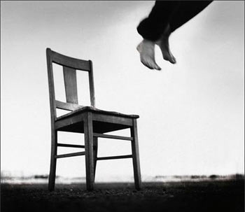

# 灯光之谜

**我好像做了一个很漫长的梦，梦的内容是什么记不清了，只是一睁眼，天花板上的吊灯还在晃荡，有个人坐在不远处的椅子上，头深深埋进交错在桌面的双臂里，窗外又是一阵呼啸的风。我轻轻走过去，见他的双肩微微颤动着，又不时夹杂断断续续的抽泣声。我猛地记起些什么，看看手表，时间定格在下午五点半，看来早已停转许久，对面的老楼房仅有的一户灯光也熄了，黑黢黢地戳在那里，网在一大片树杈之间，摇摇摆摆如鬼影，有些怕人。**

**“醒醒。”我轻轻推了推他的身子，不料自己的脖子忽然一阵剧痛。“你是？”我仰起头，想活动一下，怎知又是一阵头重脚轻，只好勉强挤出一抹尴尬的笑。而他始终没作声。**

 

# 灯光之谜

## 文/倪舸（University of Delaware)

 

**第五天.**

她仰面躺在一排课桌上，任凭我的手指顺势起伏。由颈部的蜿蜒，到渐渐隆起的温润。我想起曾在火车上看到的岭南，织成毯子的茶园、丰腴的丘陵与红到滚烫的梯田。

我慢慢揉搓着那个滚烫的一点，隐隐想起些模糊到近似砂纸的画面：一个人影把我托起，放在另一个人影臂弯里，大腿像被什么东西咬了一口，突如其来的坚硬让我大哭，那个人影撩开衣服，我的嘴中便多了一股绵软。

我始终记不起他们的脸，完完全全成了砂纸的模样。手指下的身体一声不吭，甚至连喘息也紧紧锁进喉咙里，她的体侧开始冰冷、坚硬，像只羊皮鼓，敲击着桌子的木板。

我不敢把头挪向那张脸，她高傲到完美，紧闭的嘴角蒙上阴沉，唯一不变的是眼睛的颜色，可没等我看清就熄了灯光，与对面楼房呼应着。我不知为何自己如此疲惫，昏昏沉沉中梦境被起床号声打个粉碎，入夜的匆匆又像腊月里冻死一只野狗，让人记不得自己这一天也曾温暖地活着。

**第四天．**

我试图鼓起最后的勇气追上那个影子，她走过回廊深处的柱子，伴随着披在身上的笑声一起，消失在楼梯中。我明白自己又失败了，不免生出些油腻的念想：用与生俱来的肮脏扼死那尊光洁肉身里的人儿，站在院子中央，像个凯旋的将军那样喊出她的名字，然后弄乱自己的头发，躺在沙坑里打滚，成为一头真正的猪，直到行刑时的那颗子弹。

处决一头可笑的猪，花费一颗送人上路的子弹，那一刻我便赢了，哪怕进了炼狱底层，见了同样粗鄙丑陋的畜与鬼，我也能高举着弹头，告诉它们，我以龌龊之身，舔食过华丽的胴体，临刑消费了一颗昂贵的子弹，埋进沙坑里，死在钢铁上。

我不明白是如何联系起如此疯狂的思虑，总之与课堂无关。老师上了年纪，每写下一个字都似乎要散架似得摇头晃脑咳嗽一番。作为尚未停课的学校，自然要灌输些绝对正确的东西。我的座位缩进墙角，临近垃圾箱的腥臭可以在整个后排画一个大圈。墙外又是叮叮咚咚的车铃，领头的人一定支起了锣架，跑了一路，响了一路。

又有谁家要倒霉了吧。

**第三天．**

不行，我不能如此消沉下去。他们批判我的父亲或许也自然有他们的道理，不然我不会还能坐在这学校里，挨骂在所难免，可总不至于游街，挨打。或许，一切仅仅是自己想象出来的，老师、周围的学生、黑板上的报刊、门外的封条……也包括……

我清楚自己不该想太多乱七八糟的东西，记下书上写的，喇叭里讲的便足够了。或是，这完全是个梦，一觉醒来，不用再忍受什么，不用再躲避什么，不用刻意记起什么，不用苟且遗忘什么。

不知道那姑娘今天怎么样了，她好像变成了影子，整日盯着我却又从不走近半步。

她在哪个教室？她有怎样的故事？我承认自己被她吸引，却想不起她的脸，只剩下那双眼睛，还有抬头时头发甩过的高傲。

“大夫，您瞧这些，病人一直在写什么东西，完全看不明白。”

“能保证他是完全清醒的吗？”

“检查不出什么问题，除了车祸的皮外伤、左颊贯通伤以及颈部扭伤外，脑震荡也已经痊愈了，可别人叫他也不应，就像完全听不见似的。不会主动吃饭，只能靠点滴葡萄糖维持……”

“找到他的家属了吗？”

“他是五天前那场车祸中唯一的幸存者，家属……”

**第二天．**

我从未像现在这样讨厌灯光，灯光一亮，纪检员就来了。

我不知道她的名字，今天试了两次，总是想去接近，交谈，可她完全是团雾，时隐时现，抓不住。

对面宿舍楼的灯熄了，这里也快了吧。真希望像昨天那样，至少，在整个世界都关上灯的时候，借着黑暗来临前渐行渐远的光亮，还能找到些属于自己的东西。

属于自己？笑话。如同当下，我的身体属于谁，我的笔与桌子，写下的每一张纸，上面每一个划了红圈的名字属于谁？

这个教室又要断电了，灯一灭，什么也看不到，什么也不去想，没有感知，那么我还是我吗？不是我，就没什么好担心的了，像昨晚来这里的那个人一样。

看来我真是讨厌灯光啊。

**第一天．**

我不知道在这个学校还可以待多久，父亲的案子没有定论前，我不必离开这里，定了案，当然有人赶我出去。学习，连续不断地学习，没有宿舍床铺，我只能躺在教室的桌子上写下这些。

听喇叭里说，前些日子又毙了二十个。活到这十六个年头，倒是从没想过怎么个死法，只是不甘。父亲敬业一生，落得个如此结局，真是讽刺呢。

对了，难得今天有人与我说话，是个姑娘。我趴在桌子上，她对我说了什么我完全听不清。我很害怕，不敢看她的脸，然后冲她大喊自己是黑五类，不要靠近，免得被旁人记下，受到什么牵连。我见她没说话，把头发拢了拢，甩到脑后，断电的时候看到她的眼睛闪过一点眼白。

哈哈，这么一喊，她还真的走了。

“大夫！病人有些异常！”

“怎么了？”

“他赤裸着身子坐在窗台上，抚摸着自己，不知道要干什么！”

我好像真的活了很久，这些年如何度过的怎么也记不清了，只是一睁眼，天花板上的吊灯没亮，我坐在墙角处的椅子上，头深深埋进交错在桌面的双臂里，窗外一丝风也没有。

我猛地抬头，课桌上被自己勒死的尸体消失了，我赤裸着身子，手指停在大腿上，一半滚烫，一半冰凉。我拍拍脑袋，好像记起些什么，想看看手表，却找也找不到了。对面的老楼房不知哪里去了，只剩一个院子，一棵大树掉光了叶子，黑黢黢地戳在那里，艳阳高照，光线透过树杈编成一张大网，扣在地上如鬼影，有些怕人。

“醒醒！”

我听见有人喊我，不料自己的脖子忽然一阵剧痛，门口赫然冒出几个张牙舞爪的人影。我仰起头，想看个明白，怎知又是一阵头重脚轻，一个趔趄，差点从窗口摔下楼去。

“醒醒！站着别动！”

“快去楼下准备垫子！通知消防队！”

“叫神经内科王主任来！”

妻抱着琪儿在后座睡得正酣，在外工作两年，还是第一次开车回家看老父亲。远处好像有道强光，等等，我好像隐约想起些什么往事。

“这孩子怎么了？快把衣服穿好！”

“都别笑了，是不是又是你们的恶作剧？”

“老师，我们一进教室就发现他这个样子。”

“好了好了，孙校长，告诉他吧。”

“孩子，你父亲今天早上释放的，不回家看看？”

不过，那到底是什么呢？

“生了生了！”

“不好，小家伙怎么不哭？”

“一定是缺氧了，快用力掐他一把！”

“可以了！喂口奶，看看食管有没有堵住。”

“恭喜张参谋长，是个男孩，五斤九两，算六斤吧。革命后继有人了！”

冬天的黑夜降临的很早，下午五点半，遥远的西山坳褪去了最后的霞红。

白织灯一摇一摆，强光透出窗子，给漆黑的大地割出一张婴儿的嘴。

 

（采编：周冰 责编：麦静）

 
