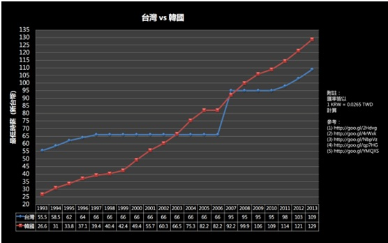

# 為什麼臺灣沒有人才！

科技大佬：為什麼臺灣沒有人才！ / 我： 為什麼我臉書的925位好友不是人！

草莓族、一代不如一代！」科技大佬在感嘆臺灣找不到像樣的人才的時候，我不禁感到很不解：我不是人？我925位臉書好友都不是人？

為了人才這個問題，我問過了好多人。從聯合國的場子，聽ILO的老大哥講全世界的人才蒸發問題，跟世界各地的青年聊聊各國的狀況，回到臺灣後，更是在看到資誠會計事務所的CEO SURVEY上，臺灣的CEO大喊臺灣沒人才，我找了更多的人聊了這個問題，也包括了appWorks這個接觸許多臺灣創新人才的重鎮裡的IC。以後會再跟大家分享這些所見所聞。

最近臺灣的經濟似乎沒傳過好消息。HTC出了很多事，還榮登這期商周封面，臺灣GDP成長這個以往驕傲的數字也實在是很慘，出口藍燈連連亮，科技大老同時也紛紛跳出來大喊：臺灣沒人才（清大的彭老師幫大家做了 個統整）

你要知道，對許多外國人來說，臺灣經濟狀況傳出不好的消息，根本就是天方夜譚。臺灣，踩在東亞門戶 、左鄰中國市場，右通西方文化，物美價廉 消費力高、科技大國，民主自由（？）、一流人才多，曾被佛里曼喻為腦礦大國。甚至會心想：我們憑什麼景氣不好？

我們就像是波利維亞，一個坐在石油上的窮國，我們臺灣，就是充滿人才的人才窮國。

事實上就是，當我們一般的人從學校畢業之後，大半不是去當公務員，就是找一份工作，然後買不起房。可是同時，眾多的科技大佬們，坐擁豪宅，能夠有小三小四小五小六，當他們能隨隨便便的買一棟帝寶的時候，我們大概買不起台北地段的「一層」房。

你會發現，台清交畢業的工程師們，根本不是在賣他的知識與技能，而是他的肝。

你會發現，文組畢業的學生，如果有拿張職照，做的行業跟「人文」這個字有關的，做了N百年薪水還是過不了四萬。臺灣人的薪水凍漲早就不是現實了。

看看韓國與臺灣的薪水變化：

那一條被打歪頭的藍險是臺灣，旁邊像起乩一樣飛上去的紅線是韓國。

先談談這些喊人才不夠的科技大佬，晚點再談談我們到底成不成才。

台灣不窮，但是錢都在那些少部份的手裡。現在的韓國其實也遇到了類似的問題，不過他們凍漲的沒這麼誇張。

在很多國家，員工是資產，是創造價值的，管理學之父杜拉克曾說：企業營利是為了抵平開銷，並用的資源哉培人才，用價值創造未來。

在臺灣，你不是人才，你不是價值，你很容易被當成成本，當成負債，所以對待你的方法是什麼？壓低你的薪水，壓低他的成本支出。你根本就沒有議價的空間。資誠CEO Survey的報告說，超過一半的臺灣企業都在感嘆找不到"好人才"。

我並不仇富。為什麼資本家往往可以有大量稅率的優勢、政府的補貼、可以比別人享受更多？因為「真正」的資本家是社會中非常有貢獻的付出者，而不是掠奪者。資本家提升國家的優勢、提供大量工作機會、照顧許許多多的家庭，透過現在教育培養產業裡的實務者、學者，分別貢獻勞力與新的技術，再透過與政府合作的資本家承擔風險，開創國族之未來。

聽起來超偉大，這一套是德國（那時還叫普魯士）用來刻意創造一個人工的工業革命的策略，以便在那時時代可以超英趕法。興教育、重學術、扶植資本家，再讓國家富強，百姓安居。後來被各國拿去參考、參考了。（臺灣不也是這樣嗎？你有發現你受的制式教育是方便你在未來當一名好僱員，或是做學術？）

資本家對社會有很大的責任。

但在臺灣，科技大佬好像不太知道有這回事。政府願意大量補貼、透過教育制度提供人才給資本家，是因為跟資本家有一個價值上的交換，前提是「資本家」要好好的照顧本國的老百姓，並且讓老百姓可以安居樂業。不過在這個世代，全球的資本家都忘了為何社會需要資本家，從付出者，變成掠奪者。

在美國，是一群金融家在掠奪，把美好的美國夢搞的七葷八素。在日本，是與政治勾結的財團。在南美洲，是殖民者或西方政權培養的地方豪強，墨西哥是黑幫，有些國家是政府本身在掠奪，在臺灣，是當初臺灣政府刻意創造的一群企業家。

他們不只嚷嚷著補貼不夠、稅優不夠，現在還嚷嚷著人才不夠。企業家們，到底是在照顧臺灣人才呢？還是臺灣人才當作一種成本，能夠把成本壓得越低越好？

重點來了，我與我臉書上的925位好友到底成不成才？科技大佬們說：社會上沒現成的人才給我們用。但我實際問了一下產業界，才知道：臺灣根本沒有「社會」可言。在臺灣，你畢業之後做什麼工作？瘋狂追尋大公司，不然報考公務員。舉我們最熟的美國為例好了，在美國，畢業之後可以會去做NPO（在國外非營利組織是一個產業）、少部人專門做學者，更多人去小公司發揮長才或自己創業。大公司在這樣的環境下，不能夠輕易直接在社會上挑人才，於是非常注重養才。

現在許多科技大佬們，年輕的時候、後來創業的時候，許多都是非常厲害，聰明而且有理想的一群人，但是有些地方，他們似乎不如他們在營利、擴產那樣的厲害，尤其是關於如何看待員工、如何培養人才這一塊。

科技大佬們不知道是不是被社會寵壞了，關於人才這方面，每一年台清交畢業現成的人力可以用，似乎不用自己去栽培第一流的人才，而是臺灣社會第一流的人才有這個「義務」，要去賣肝給大公司。在很多國家，第一流的人才選擇出來自己幹，日本的孫正義、中國的馬化騰、美國的賈伯斯，還有當年這些科技大佬們：張忠謀等人。試問，年輕的張忠謀若遇到台積電，願不願意委身去台積電賣肝，還是要再去開創另一個事業？張忠謀想當台積電的員工，還是想創業？身為第一流人才的他，願不願意被操到爆肝？

（當然，這是我主觀的意見，不一定要同意我，只是想請大家想一想）

在企業經營上，這些大佬的養才方法一定出了問題，不然張忠謀怎麼交了棒又跳回來自己做？現在的科技大佬幾個交棒出去了？

會不會在大佬們的眼中，到頭來是我們這925位好友的過錯了。我們不留學（現在獎學金多難拿？），沒有大量實務的經驗（因為一般工作只會徵求有工作經驗的，沒工作經驗的新人怎麼辦）、所學不能拿來所用（因為臺灣產業很畸形），隨著臺灣產業面臨新的挑戰，學校教育跟不上時代的腳步，我們這些年輕人不能夠拿來當作「現成」的人才，所以通通都是我們的過錯，而不是臺灣的大公司在養才上出了問題。

這樣真的太不公道了。

看看身邊的這925位好友，最起碼在這925人當中，有超過一半的人，非常非常非常的努力。有許多人只怕光培養本科系的能力，可能還不夠，需要更多的專業，於是刻苦讀書，以便雙主修、輔系。有的人非常務實，去經營自己的專業，想累積十萬小時的努力，打算在未來一鳴驚人。有的人想對環境與社會有貢獻，於是真的做了很多事，成立了青年NGO，甚至試著去影響更多的事物。有的人想找份自己喜歡的工作，未來好買間房，有個幸福的家庭。我們有企圖心、有潛力、有夢想。

但是哪裡是我們的舞台，哪裡是我們的機會呢？想從事NGO的，錢少事多離家遠。想去大公司發展的，前面的學姐學長們早就卡位卡好好了，想去當作者的，馬上被家人阻止，想當外科醫生的，根本被操到死，想做學術的，發現做到最後要糊口，只能當教授。想創業的，連股票面額都有奇怪的限制。

是不是到頭來，我們都只能去考公務員呢？

這925個好友裡面，超過一半以上的人，都是潛在的「人才」，但我們缺舞台，缺資源，缺機會，再好的千里馬，吃不飽也跑不動。再美的花，無水亦枯死。

慶幸還有施振榮，說了句公道話：臺灣不是沒人才，是沒舞台。

不是沒人才，是沒舞台啊。

採編：Vanessa 責編：余澤霖
