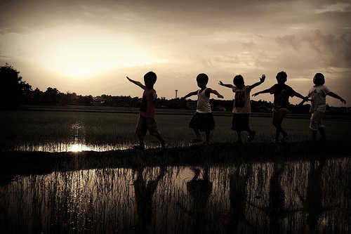

# 热带雨林咖啡

公盟办公室设在双井九龙花园内，一出小区大门，左手边便是开业没多久的热带雨林咖啡，店内清一色的暖色调装潢，看着很舒服。可我几乎是个不喝咖啡的人，过去在律所时，一个法国归来的合伙人曾带着我们几个小喽啰喝过几次，自那之后，便再未喝过。所以我想，大概不会有什么机会去这店里了。 我在公盟所负责的公平教育项目，目前的主要工作，是希望解决外来务工人员随迁子女在京的受教育问题及高考问题。当初离开律所，一方面是因为对商事业务并无太多热情，另一方面，也觉得进入公盟之后可以近距离观察一些公民运动，对现状可有更清晰的了解。此外，考虑到公平教育这个项目，应不那么敏感，故欣然地来了。 接手工作约一个月之后，应家长们的要求，决定在京举办一个关于教育平等问题的研讨会，当时并未觉得有何问题，便悉心地开始了筹备。在距研讨会还有1周时，老许与我谈话，说警察找到他了，大意是这个会坚决不能开。果然第二日便收到了会场方面的电话，说先前预订的场地不能租给我们了。自这时起，我方感到了些紧张，意识到阻力比我所想的要大。 在当时，我尚怀着浓烈的希望，觉得此事合理合法，应无道理受到这样的阻扰。之后，征求了家长们的意见，决定研讨会照常进行。 在距研讨会还有三天的时候，那是个星期三的下午，我接到一个陌生电话，那头说是市局的D警官，希望与我聊聊，我说那您过来吧。时值下午5点半，正是下班高峰期，过了半个小时，D又来电话了，说是堵在半路上了，让我多等会。放下电话，我心里还颇有些愧疚。 不知过了多久，D终于到了，约谈的地点便选在小区门口的热带雨林咖啡。初次见面，彼此都很客气，气氛虽称不上愉快，但也不僵。D很严肃，一副为工作所累的模样，与他同来的另一位警官也不时露出疲态。看得出，他们都希望快点结束。 

 和警官们聊天有一点好处，那便是他们目的单一，不绕弯子，说话开门见山。譬如后来认识的H警官，见面的第一句话便是：“今天找你，说得好听一点叫聊天，说得难听一点就是向你施加压力。” 当我提及法律时，H很坦率地说：“今天与你所谈，无关法律，这是一个单纯的政治问题。你们在法律上没有任何问题。可你也知道，当前中国还不是一个法治国家，很多事情是可以不按法律办的，我们有我们自己的办法。今天你我在此交流，就并非基于一种平等的关系。”老实说，我很欣赏他们这种连羊头都懒得挂的行为模式。 坦诚而言，前后与我交谈的几位警官，待我都算客气，虽然或明或暗地提醒过我，如不配合的话，对我没有好处。但毕竟没有刻薄粗鲁的言语，临了，还主动与我握手。我晓得他们也希望能释出一些善意，毕竟日后还有许多这样的时候。可是，最后的握手在我看来多少有些讽刺，他们如了解握手礼的起源，当知道握手这个动作最初所表达的含义在于“我手里没有武器，我对你没有敌意”。作为个人，他们与我远近无仇。可此刻，他们是国家机器，他们手中握有武器，这武器便是“他们自己的办法”，而不是法律。诚如H所说：“今天让你过来，我们没有任何传唤手续，你完全可以不来。但我觉得你不敢，这样对你不好。因为我想你也清楚，只要我们想，总有办法能找到你。” 每念及此，我便越发想念《悲惨世界》中的沙威。沙威所信仰的是法律，所遵循的亦是法律——明晰且公开的法律，纠缠着冉阿让、却也不放过德纳第的法律。这使人感到安全。沙威是一个苛刻、偏执，但却有原则、有底线的人，这样的人，无疑是令人尊敬的。当他孜孜维护了一生的法律，撞上美好的价值时，他在叹息中选择了后者。 雨果终究还是留给了人们太多希望。在我们的悲惨世界里，没有放走冉阿让的警察沙威，也没有保护作家的监听员卫斯勒。 H与我握手道别时说：“年轻人不简单，以后我们再好好聊。”我点点头，心里晓得日后他们还会找我，这样的接触怕是免不了的。但我确实希望，有那么一日，我不再被冠以异见者的身份，他亦不是执行公务的警察，我们或可坐下来，好好谈许多事，聊聊这个国家到底是怎么了，他又是作何想的。毕竟，H曾对我说：“你现在所说的话，几年前我也说过。” 研讨会顺利如期举行。 一周后，另几位警官来到公盟办公室，以涉嫌“煽动、组织非法集会”将我传唤至派出所。此处“非法集会”所指的应是家长们每个月底赴教育部及市教委递交呼吁材料一事。在此之前，此类的递交活动已进行过10次，并未受到干扰。而据《中华人民共和国集会游行示威法》第二条第二款规定：“ 本法所称集会，是指聚集于露天公共场所，发表意见、表达意愿的活动。”我所不解的是，教育部及市教委何时成了“露天公共场所”。 讯问室的椅子构造很特别，有一种可将嫌疑人固定在座位上的金属装置，锁上之后，上半身便无法动弹。初次坐在这椅子上，任何清白的人都不免要心生疑惑：莫非我真犯了什么罪？好在，那天他们并未将那个装置锁上，大概是觉得我的情况并不严重，也不存在危险性。有意思的是，当警官们在讯问室内向我抛出一个个问题时，铁窗外正传来熟悉的红歌合唱：“共产党辛劳为民族，共产党他一心救中国，他指给了人民解放的道路，他领导中国走向光明，他实行了民主好处多……” 参与讯问的警官中，有一位年轻人，看得出入职时间不长，待我也最和善。当得知我是87年生人后，他笑了笑，道：“我是86年的。”我说：“那你只比我长一岁嘛。”他答道：“对，我弟弟现在的想法，就和你一样。” 后来，年轻的警官劝我：“你说你原来在律所待着不是挺好的嘛，何必呢？我劝你啊，换个工作，这样对你不好。”然后拍了拍我的肩膀。 在讯问之余，我和一位值班的警官探讨了关于公平教育的问题。我以河南与北京为例，阐述了目前高招及教育资源分配的不平等。他不同意道：“相较于河南，北京虽占用了更多的教育资源，但河南也有自己占用的其他资源啊。各有所得嘛。”我希望他能试举一例，他想了一会，答道：“譬如旅游景观资源，河南省内的，北京人就无法占用嘛。”面对如此回答，我只能笑道：“天然形成的东西，我们无法改变。但人为造成的障碍，我们可以改变。” 

 讯问中，那位年轻的警官曾告诉我：“你好好配合，很快就能出去，你的姐姐、姑姑、阿姨什么的，都在门口等你呢。”这让我颇感惊愕，因为我在北京并无一个亲人。待我自派出所出来后，才发现，所谓的姐姐、姑姑、阿姨，原是一些热心的家长，听说我被传唤了，便心急火燎地赶来了，又因非亲属不便探听消息，只好假称是我的姐姐、阿姨。 所幸的是，次日的递交活动还是顺利完成了。虽有几位警察陪同，但全程并没有发生什么冲突，家长保持了理性与克制，这是颇令人欣慰的。我想这应成为日后各类公民运动的基本原则。 几次传唤下来，除了疲倦，便是一点恐慌了。入职公盟之前，对于可能面对的一切，我虽有心理准备，却终究不希望牵累他人。但我知道，这由不得我。毕竟，他们有“他们自己的办法”。 此时，才意识到“免于恐惧的自由”于我而言何等珍贵。但我也晓得，这自由，并不靠施舍而来。不觉中，童年时代对警察的信任及依赖，已被代之以惶恐。我们迟早要发现，原来黑猫警长并非只是森林公民的保护者，也是狮子大王忠实的打手。 到了这样的时候，方才觉得中国太大，人太小。于强大的国家机器面前，任何个体的努力都如蚍蜉撼树，唯有组织且团结的公民合力才能将每一个体的诉求放大。 在我离开派出所之前，所长曾信心满满地说我说：“你还是太年轻，过几年你一定会改变的。我跟你打赌，你一定会变的，到时候你要记得我这句话。” 

 确实，我不知道几年之后我是否会改变，变成何样，也无把握我可以走多远，公盟可以走多远。但我能确信的是，我断不至于后悔今日的所为。如果真如所长所说的那样，我变了，那么我只能说：“对不起，我怂了，但我没错。”在为生计奔忙的间隙，我定会不可抑止地怀念起那个改变前的自己。 一次讯问的间隙，警务办公室内只留了我和另一名警官，先前一直未开口的他对我说：“许志永做的这些项目都挺好。”过了一会，他又小声道：“真是个有梦想的人。” 嗯，有梦想的人。   

(采编：陈轩 责编：陈轩)
