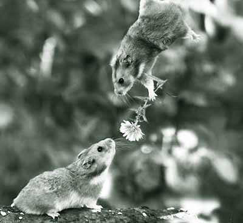
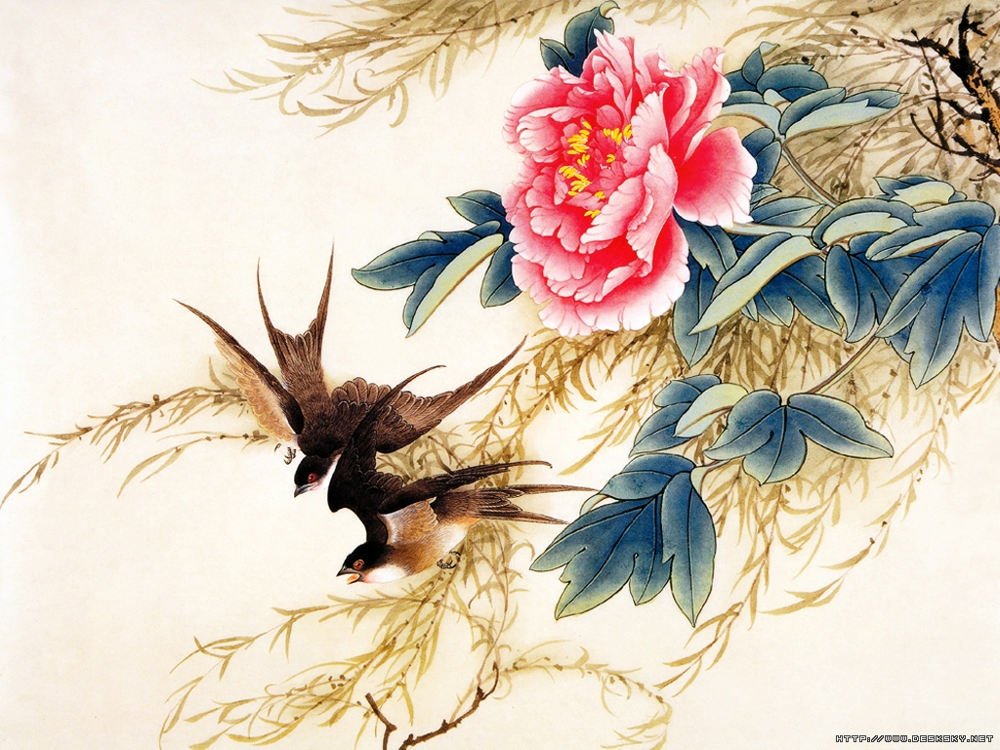

# 燕燕于飞

 每每我意识到，我所爱的女人们终有一日是要出嫁的，就要或多或少地怅惘一阵。这种怅惘不能简单地归罪于一夫一妻制，当然，我不否认，一夫一妻制也是个原因。如果男人说自己未曾有过佳人夜侍寝的宏愿，多半是虚伪的，还有一些是自卑的，剩下的都是gay。吃着碗里的看着锅里的，恐怕是人性使然，何况我们中的好些人手捧空碗愤愤然。 惆怅的源头，并非是纠结于她们为何落入他人碗中而非我碗中，而是，我总觉得，这些可爱的女人不该落入任何人的碗中。但凡所爱之物，是否必须据有己有呢？我想是的，然而一旦为人或为己所有，她是否仍是当初那个可爱之物呢？ 少不更事时，总为方鸿渐惋惜，若那日在雨中多候片刻，唐晓芙就要回心转意了。当时没有细想过“然后呢”，但即便想了，结论也不外乎是王子公主、幸福生活一类的俗物。现在想来，那时自然是幼稚得一塌糊涂。得了唐晓芙，围城便得解了么？逃进了孙柔嘉这座城，却绝望地发现其终不能使自己免于折磨。我并不是说方鸿渐做了错的选择，因为同为人，不难理解那脆弱的心理一旦崩塌后的慌不择路饥不择食之举。但我总相信，吃到嘴里的永远不是最美味的那块肉。那些永不可及的，才是一颗朱砂痣，一道白月光，那些不经意间遗失了的，才是永缠绕心魂的绿衣。唐晓芙，或许不过是另一座城罢了。相较于美好期待撞上残酷实现的潜在危险，我想孙柔嘉这座城未必更糟。 方鸿渐最后不免还是要回到这座城的，因为下一个去处并不明朗，也不见得更好。 

 可爱的女人们，若成了蚊子血、白米饭，我将痛心于这暴殄天物的现实，若成了绿衣，我必受困于这苦苦的萦绕中，永不得脱。相较之下，或许她们嫁作人妇于我而言应是最舒坦的。 然而这不过是口上妄谈的理性分析下之最好结果。我们的一切困扰之根源便在于，无力成为一个绝对理性者。即便追求终身，这仍是我们不可企及的目标，云一样高高在上。 真到了那一日，我一定不开心。若是她们再残忍些，邀我去她们的喜宴，那又该如何是好？这个尚未发生的困扰令我不安了许久。究竟是去还是不去呢？我倒是真想过诸多方案。其一，故作无事地去，因我一向将不愿为而为之视作锻炼心性的不二妙法。但只恐隐忍不足，流露了分毫不舍，引得新人不快。其二，直接无视，不去便不去。如此一来，确实免去了折磨，但似乎显得失礼。其三，编个蹩脚的借口，推脱了。这应是最好的办法，然而，作为一个常常连谎都说不圆的家伙，也是颇有压力的。 是的，尽管思虑了许久，却至今也未能拟出个妥帖的方案。一定要有人笑我无事自扰了，但于我而言，这确实是个颇为实际的困扰。 好在她们还未嫁。好心的女人们，多留给我些时间，让我好好想想，可否？莫要早早地将自己嫁了，可好？ 好在她们还未嫁，我还可时常想起她们，有时梦见她们。 还记得去年春天，愚蠢地摔折了脊椎，以致更衣如厕多有不便，只得遵医嘱卧床休养。那之前曾不止一次地设想，只要给我一张床，排除这个世界的一切干扰，我大概可以一直睡到死吧。卧床之后才发觉这个假设必须被推翻。无聊和空虚，自是不必说，还有那无法排遣的若干情绪，在平时总不易察觉，那时却不依不饶。百无聊奈之际，偶然翻看以前写过的东西，无论小说也罢，杂感也罢，无厘头也罢，篇篇都是伊。 有时会学着伊的样子自言自语一阵，竟也莫名地颇感兴奋。而病榻之上所享有的梦境却似乎在戏弄我，时常使我沉迷，无法辨出自己所处的究竟是真实的情境还是臆想。我清楚地记得那时我和伊正在我家的阁楼上，听见楼下有钥匙转动的声音，是家里人回来了。我匆忙示意伊快躲起来，自己则下楼应付。之后我又回到楼上，却不知伊躲在了哪里，无论怎么叫伊也得不到回应，于是便翻箱倒柜地找，焦虑之余又毫无头绪，连抽屉，床头柜也打开仔细寻查一遍。似乎伊可以将自己变小了藏匿于其中。 这样的寻找到最后被证明是徒劳，而一般在这个时候，就不知缘何醒了过来，所能感觉到的，惟有干得发疼的舌头和喉咙。 伴我怅然的，唯剩得那几句苦涩的诗。 **绿兮衣兮，绿衣黄里。心之忧矣，曷维其已？ 绿兮衣兮，绿衣黄裳。心之忧矣，曷维其亡？绿兮丝兮，女所治兮。我思古人，俾无訧兮。 絺兮绤兮，凄其以风，我思古人，实获我心。** 必须承认，她们之于我，不是全部，也不至于有何可怕的伤害，但如股上的一两肉，割了，死不了，只是留下终身的疤。平日藏于罗绮之下，他人永不知晓，然而那里的痒痛，却总须自己躲在无人处动手抓挠。 昨日绿衣黄里，明日燕燕于飞。从此之后，我将作为一个局外人，看着她们从朱砂痣到蚊子血，从白月光到白米饭。 那是哪年，她们倚着一扇拱门，手持小扇，轻掩皓齿吃吃笑，朱颜映红满树花。那是哪年，她们撑着伞，踱出唐晓芙的宅院，见着全身被淋透的我，不解道：“公子是在等什么人么？何不打伞？”说罢，用伞遮住了我头上的那片天。 这时光，一去不返了。我只能想着她们的种种，心里责备着她们过往的任性与顽皮，口中呓着：“汝啊，汝啊……” 可爱的，善良的女人们啊，莫要这样着急，莫要早早地嫁了他人，可好？ 再不然…… 卿若嫁，莫发喜帖与我，可好？ 

