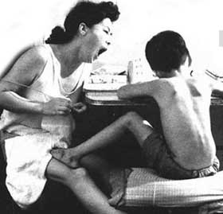

# 父与母

** **

母亲像只老猫，死死盯住门口，她一定不会想到自己亲手封住的窗子竟不敌儿子一把小小的裁纸刀。我捏着火柴，一寸一寸烤软封个密实的蜡，刀子慢慢没入那滩黏塌塌的纸，没有一点声音。

我踩在阁楼外的青砖上，顺着条不知锈了多久的水管挪向一层。弟弟先我一步溜到墙外，戳在树边等我。我想若不是他一时兴起吹起了口哨，父亲也不会冲出屋子，拎起我们的耳朵。

我的脖子很难受，瞧着灰色的地面，又生怕张嘴，吸进一口呛人的烟，咳嗽一声，又记一顿耳光。时隔多年，我依然能记起大厅里的陈设：铁皮大喇叭呜咽着，一个胖老头的照片横在桌子中央，缕缕上升的香火里，他的嘴角也有些上扬，下巴的肉堆出座小山。弟弟尚小，使劲忍着笑，他显然还不明白这间阴沉的房子里发生了些什么。母亲狠狠瞪他一眼，接着抹了一把泪，拉过我，把一只黑色袖箍套在我的胳膊上，轻轻推了我一下，而我又只好重复着一整个下午的动作，俯首、鞠躬，再匍匐在地，咚咚几个响头。傍晚，一束红光经过屋顶时直灌进来，穿过交错的楼梯栏杆，把黑影像蝇拍一样扇在老头红彤彤的脸上。猛一抬头，黑框里似笑非笑的眼睛盯住我，父亲也转过身子，红色的眼白胀得吓人。

父亲总说棍棒底下出孝子，然后便在弟弟又弄污了作业本或打翻汤盆时随手抄起根掌鞋的胶皮棍子啪啪起下。弟弟是个逞强的孩子，即便眼角噙泪，也绝不喊出一声。直到母亲实在看不下去，低声念叨几句，否则父亲会抽肿他的手背，写字时握不住笔，又洒一本子墨水。

母亲远不及父亲那般暴躁。父亲因我与弟弟在那日偷偷溜出去而大发雷霆，母亲便只用寡言宣泄着自己的不满。先前，她总要在早晨我们兄弟俩上学前拉直弟弟蜷成一团的裤脚，再整理一下我领口那块皱得不成样子的红布，叮嘱几句午饭要吃饱、橡皮要磨掉那层黑皮才擦得干净。晚饭时也总喊一声阁楼上的我，尽管这间低矮二层楼板的裂缝几近让风穿过的声音也听个真真切切，而在家人面前话也不多的母亲仿佛又用尽了全身气力唤那一嗓子，自然这回音久久不能散去。弟弟早已坐在桌旁，母亲又把两碗饭倒进灶里，免得父亲夜归时它们变得冰凉。母亲此后再不与我俩说话，有次与弟弟想起要吃晚餐时，母亲已经睡下了，桌上的饭菜没了白烟。

至于母亲何时恢复到从前的样子，我记不得了。也许是两年后，家家户户试着脱下那一身蓝灰起，亦或根本没有。母亲患了风湿，不常走动；父亲出摊到很晚，回来时带着一身酒气。直到我和弟弟进了大学，母亲也不曾再喊过我们一声。尽管她做饭时一手撑住案板才勉强不让腿打弯；尽管父亲用手指死命敲弟弟脑门时母亲仍会上前阻止；尽管我曾见她一个人在我与弟弟即将搬到学校住时偷偷哭泣，但终究没能再听得那一嗓子吆喝。

姑娘低着头，脸颊带一丝红晕。我想再看一眼她的样子，而她又害羞得把手搭在膝上。我明白父亲看不惯学生，在他的世界里，学生意味着无休止的大串联，散漫而任性，像抛荒地里四散的高粱。母亲却很开心，但家信也不过寥寥几行，无非是让我好好待这姑娘，闲时带回家去，让她仔细瞧瞧。回家的路不过一城之隔，这倒颇令人愁怅。也许恰是因为这短途似的隔阂使我苦闷，或是这姑娘的寡言少语仅仅作为与母亲相似的符号让我恍忽寻得某种充斥着负罪感的安慰。

在生命中第二十二个年头里，那次与父亲的冲突想必是我唯一算得上光荣的事了。父亲握着把铁锹，厚实的身子几乎抵住了整个门框，他的喉头一起一伏，破口大骂些什么，只是我早已没了儿时听下去的怯懦。父亲把锹柄举过腰，试图铲倒我的腿，却不知怎么打偏在墙上。我奋力扯过父亲的手臂，用力一推，他跌倒在门坎上。看来父亲老了。

我终于再次听到了母亲喊我的名字，声嘶力竭，后音完全是空洞的呼气声。我想回头，又怕一瞬间软了腿脚，迈不出那道门去。我的脖子很难受，瞧着灰色的地面，闭上眼，又是一口呛人的烟，一只黑到扎眼的袖箍与落日下红白扭曲的脸。

弟弟挥着一面大旗，走在人群中央，他前面也有不少旗帜，大幅大幅流成海洋。我紧紧牵着那姑娘，她不知怎么，偏要与我一起挤进这种地方。我们只聊过几次，本不算熟悉，拉着她有些尴尬，幸好身旁同班好友这时仍不忘揉搓着女伴的头发。

人群涌过大街小巷，汇进了巨大的广场。高耸的石碑阴面让我想起那些父亲手中的胶皮棍子，投射下一个长长的影子，淹没了攀上石阶的人与旗。远处的城门楼成了人的旋涡，校牌与横幅，红色和黑色的标语喷在大尺白布上。我招呼弟弟，他听不到了，自顾自摆弄手里的竹竿，周围是一片嘈杂的议论和呐喊。

我从朋友手里接过条幅，扎在头上。姑娘帮我系紧了它，高出的一端束住了发梢，像顶可笑的毡帽。队伍前端一阵明火起，人们开始亢奋，推搡着，挤压着，一步步向街道的另一头挺进。高音喇叭刺耳的试音声弄得人们心烦意乱，尔后又是一波盖过一波的口号，挥舞着拳头和旗帜，搅碎了闷热的下午。

喇叭声逐渐熄了，街道上开始震动。规律的节奏快速靠近，直到不远出现了几点墨绿的光亮。人群开始骚动，如父亲所想，抛荒地里四散的高粱。喇叭最后一声嚷嚷把后音拖得很长，只能分辨出一声清音，又连了一个缓缓吐出的＂场＂。不知哪里的火光越烧越旺，恶臭的焦糊味很快弥漫开来，夹杂着零星炸豆一样的脆响，给沸腾的旋涡带来刹那间的死寂，转眼又推至风口浪尖的颠狂。

我没有想过面对的姑娘会有如此几近疯狂的热情，以至于她一切矜持与端庄的模样在那一天碎成了浮在半空的烟与云。她搂住我的身子，我可以感受到她发烫的嘴唇与跳动的舌尖划过我的牙齿，而我只后悔那一阵剧烈的咳嗽，还有身边无休止的喧哗、呐喊或是引擎隆隆的轰鸣。脆响变得密集而低沉，连成一片。我想寻找弟弟，前方的旗帜一面面被踩在脚底，机械声与人声重合，顷刻只剩下钢铁辗过地面的生硬。我知道自己找不到他了，不过，我终于可以肯定对这姑娘的情感，她不再是一个符号，仅仅因为赚得片刻的炽烈，或者作为我所有怨恨和忍耐消散的对象。总之，我在松开她的手时明白了这点，再回头看，只有黑压压的人海，还有些东西，至于那是什么，我没时间知道。

弟弟和那姑娘都没有再出现过。几年后又一次站在家门前时，心情却成了一张白纸。经历了那年多少个日夜南去的火车，以及窗口袭来的热浪变成冷风；或者几排闪光灯下的陈辞、题问，终于忘了自己在哪、是谁，只剩下做什么，还有，将要做什么。我幻想着这门后面是个怎样的情景：父亲拿着菜刀冲出来，母亲瞥过一眼，再颤颤巍巍踱回房去。还是——父亲搂过我，拍着我的背，母亲坐在一旁拭泪：回来了，你回来了，咱们一家人，好好过日子。

想来想去我好像都错了。我抬头看看厨房窗外，院子里，父亲一副气急败坏的样子对一个白人推销员比划些什么，而对方显然一脸迷茫。儿子给坐在门廊里的母亲戴上保暖帽子，祝她圣诞快乐。

我知道母亲已不是这个世界的人了，和多年前我踏入家门时看到的一样，母亲像只老猫，瘫坐在轮椅上，死死盯住北方大雪纷飞的天空，残留在人间的肉体偶尔发出几下呼呼噜噜的气声。现在，她又动了动嘴角。

那是盛夏的傍晚，母亲把手伸给自己一路追寻的坦克上的青年。他们刚刚攻占了城中的军械厂，又打了一场漂亮仗。父亲把母亲搂在怀里，给她戴上自己的像章。抛荒的高粱田上，散落一地的种子发疯地长。

＂吃饭吧。＂

 

（采编：楼杭丹；责编：麦静）

 
