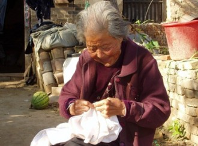
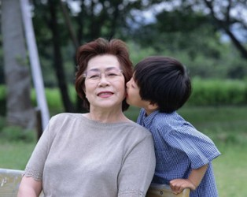

# 父母在，不远游

我十八岁离家，今年虚岁三十六，算起来，迄今的人生里，一半时间都在外。这一半的时间里，驱使我不断离家远走的，无非是所谓“学业”和“事业”。父母在人前夸耀儿子时，所依据的也无非是这两点：学业圆满，事业小成。自己回想起来，也觉得这一切理所应当，从未想过另一种可能。可以说，前三十年，父母和我共享了它的荣耀，但是，从现在起，我们要开始分食它的苦果。

今年春节，父母来上海和我们一起过年，那一天，全家人挤在沙发上看小品，欢声笑语之时，老家一个电话打过来：姥爷去世了。我们的欢乐就此结束，一个多小时后，我们拎着匆忙收拾的行李来到虹桥火车站，四个小时后，我们回到了那个悲伤、破败的北方。一路上，母亲流泪，后悔，如果她不来上海过年，就能看姥爷最后一眼，或许还能救姥爷一命。我一路安慰她，心里却在想：他们来上海过年尚属偶然，我却常年定居在此，有一天，当我的父母老去时，我能侍奉左右吗？我能赶得上最后一眼吗？

牺牲大片乡村和城镇、成就个别大城市的发展路径，造就了今日中国的基本格局，资源极端不平衡，机会极端不均等，迫使广大“不幸”生在欠发达地区的青年人少小离家，一窝蜂地扎堆“北上广”。从正面看，这是社会流动，是资源合理配置，殊不知，隐患早就埋下，代价异常昂贵。当年我兴冲冲离家，眼里只有名校、大都市与锦绣前程，却不知出来混，迟早要还。如今父母年迈，能见到我就是他们最大的福利，见不到我就是对他们最大的折磨，我却吝啬得每年只给他们一两次见面机会。这就是代价，该是我们还债的时候了。

同样的事情也发生在农民工身上，几千年来安土重迁，如今却要背井离乡，他们合力主演了三十年的经济神话，却留下了留守儿童和留守老人——这时代最大的悲剧莫过于此。更可悲的是，我们这些远离故土的人，并未因此获得他们的尊重与谅解——那些“北上广”的当地人，那些一辈子不曾离开父母半步的人，他们嘲笑外地人“报恩”父母的想法太陈旧，他们视回家过年为陋习，视春运为灾难，他们永远无法理解外地人那颗思乡的心，为何如此迫切？如此不通融？你向他们倾诉，他们一句话就给你顶回来：谁让你来的？你老老实实呆在家乡不就没这些麻烦了吗？

古时父母去世，做官的要告“丁忧”，回乡守孝三年，三年后才可陈请复职，

即使普通百姓，三年内也不得婚娶，如有特殊情况，必须在百日之内操办，叫做“借孝”，据说曾国藩当年守孝挂帅，就是由咸丰皇帝亲自下旨借孝的。放在今天，这样的规矩或许多余得可笑，但是现在，我却越来越觉出它的庄重。胡适的儿子出生时，正值新文化运动，这位新文化的领军人给儿子写了一首诗，“我要你做一个堂堂的人，不要你做我的孝顺的儿子”，语出惊人。但说归说，做归做，胡适本人却是极孝顺的儿子，他客居海外时，坚持每天写家书一封，让老母亲时时读到儿子的信息，待到胡适的儿子长大，他也用这标准来要求儿子，全不顾年轻时写的那首诗了。今天，我们的通讯手段无比发达，有谁能做到胡适这样？别说每天一封信，哪怕每天一个短信？

这是一个制度化、结构性地消灭人伦的年代，高铁、网络、中国电信，并没有让亲情更便捷。骨肉被分隔两地，血脉被拉长稀释，年轻人即使有心，也已经无力，在奔走求生的现实重压下，亲情早被挤压得所剩无几。亲子之情，天伦之乐，原本至高无上，任何人无权剥夺，却不料败倒在这坑爹的时代。

网上有人感叹：“这些年，我所有的眼泪都流在春节结束后，父母送我上车离家的时候。”情真意切，却万般无奈。

因为在我们的内心深处，亲情并未褪化到泯灭，它仍然死守在我们内心的底角，当朋友不可靠、爱人不可靠时，父母几乎是我们最后的情感依托。更何况，千疮百孔的养老体系，让子女们更加放不下心，国家不养老，只能“养儿防老”，儿却远在千里之外。另一个原因在于，这一代的中国父母，把全部心思都寄托在子女身上，他们太疼惜孩子了！要知道，牵挂是相互传染的，是要继承的，父母过分的爱，成为子女不能承受的重，要变本加厉地“返还”给父母。如果中国人的亲子关系也像外国人一样相对独立，我们两代人是不是都可以更洒脱一些？

从父母角度来看，他们也有更多的理由牵挂子女。孔子说：父母在，不远游，游必有方。后半句是说：如果子女一定要远游，也要有一个明确的、让父母放心的去处。可是，这恰恰是一个“无方”的年代，青年人漂泊异乡，身心无处寄放，不知道哪里才是真正的家。这正是让父母放心不下的地方。很多年，母亲担心我的早餐，怕我早饭没有着落，潦草应付过去，亏了身子，“不怕一顿不吃，就怕十顿不饱”。我常嘲笑她，说她本末倒置，用我的话说，“早餐是世界上最不重要的事情”，我有那么多人生难题、终极困惑你不关心，偏偏要纠结什么早餐。可是，今年，我体会到了她的深意。稳定的、营养均衡的早餐，正是“家”的首要标志，是“有方”的重要前提。对一个母亲来说，没有什么比这更值得担心。

一位海外学子在日志上说：“我十九岁上曾发誓父母去世之时守孝三年，如今我再发一誓，毕业后五年为期，纵弃前程锦绣，亦绝然回家，以全人子之心”。还有人说：“有人问我，为什么上完学不留在大城市要回来工作？我说，因为家里有我的家人。我自认为，工作不是说签了牛逼的企业或者去了牛逼的地方你就牛逼了，工作不过是为了过一个自己喜欢的生活，我不喜欢去贡献自己的青春建设别人的家乡，等到爹娘老死还要赶着飞机回去，还不一定买得到票！”少数人的回归和反抗，让人钦佩，但另一个事实是，大部分人仍被时代裹挟，急惶惶踏上不归路，却忘了其实身后还有另一条退路。

“人生在世，有的成了面子，有的成了里子。”这话放在亲子关系上也成立，对父母来说，我就是他们的“面子”，我自幼学习好，不惹麻烦，上学工作都没让父母操心，现在混迹大上海，娶了上海的漂亮媳妇，在北方的县城，这些足够他们炫耀了。但其实，我不过是一张“面子”，我一点都不实用，我只有观赏价值，基本没有使用价值，父母不要我的钱，我也没能力为他们托关系走后门，我们相隔六省一市、一千公里，每隔一星期或十天我和他们通一个电话，一年回去一到两次，和他们朝夕相处的时间，加起来也就半个月，对他们来说，我越来越只剩下象征意义。我的父母为了省下一块钱的公交车票，甘愿步行几站路去办事，我在上海，一个月打车费上千块，下一次馆子就够他们一个月生活费，我们好像生活在两个世界。

万幸的是，我的父母还有一张“里子”——我的姐姐，她在省城，衣食无忧，她把父母接到身边共同生活，给他们吃穿，带他们看病，陪他们聊天，忍受他们的争吵和絮叨。姐姐可能没有那么多值得吹嘘的头衔，却是一个尽职贴心的“小棉袄”，正因为有这样一个甘愿牺牲的“里子”，才有了我这个逍遥法外的“面子”。但是，我越来越不能原谅自己，尤其当父母六十岁以后，当父母的父母相继离世后，我越发意识到他们的孤独无助。做父母的，哪怕有十个子女，每一个也都是不可替代的，我不该以任何理由推卸责任。

“今生还能和父母见多少次面？既使父母活到100岁，你每年回家见一次，还能见多少次？”这条微博在网上广为流传，每个人都在默算自己的数字，每一个数字都触目惊心。亲情在倒计时，永别似乎近在眼前。

姥爷去世，我和父母踏上北去的高铁，列车长啸，以300公里的时速追赶猝亡的老人，追赶逝去的亲情。此刻，我的父母已成孤儿，他们只剩下我们，而我们已经成人。那一夜，我在手机上悄悄记下：平生第一次，我发现了比生命、爱情、正义、写作更重要的事情。

（本文载《中国社会工作》）

博客地址：[Visit http://blog.sina.com.cn/0room](http://blog.sina.com.cn/0room)

(采编：孙晓天，责编：佛冉）
