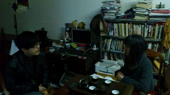
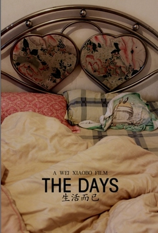

# 独立电影人——专访独立导演魏晓波

魏晓波，本土独立导演。2005年第一次拍片。以纪录片《渔湾市》成名

他说，吴文光的《流浪北京》让他看到拍摄电影的新视角。

2007年拍摄了《我去了北京》《湖南风情画》两部短片，入选北京纪录片交流周，正式踏上纪录片导演之路。

2010年《生活而已》入选“云之南”电影节，由此受到关注，也因其中过于暴露的私生活细节而广受非议。

“要享受生活”还是“要完全电影”这是个边界，如果电影想超过生活，那生活肯定会给作者一个意想不到的答案，而要找到其中的平衡，他要有一个聪明的机灵头脑，他得是一个想用电影和生活搏斗的人，有热闹，有痛苦，还有很多不为人道的细节。他拍自己感兴趣的主题，特立独行，排除了传播的可能性，让大家销毁《生活而已》的光盘，他把自己的生活或者想法融入到自己的作品里，生态，向来是复杂的。

魏导演用“电影而已”作为一个影展的标语。就像是生活而已，他自己说，看独立电影，想睡就睡，不要为难自己。

**一、我开始根本没想过拍《生活而已》******

**Q****：****为什么会拍《生活而已》呢？**

A：有段时间不知道拍什么题材，很痛苦。

这个就类似与文学中的自传、美术中的自画像，不管拍得好不好至少它真诚、真实。

**Q****：你说《生活而已》跟《冬春的日子》差不多，但《冬春》是一部剧情片，为什么不把《生活而已》拍成《冬春》一样呢？******

A:我非常讨厌故事，故事得有结局，得有两个人关系的变化，得严格按照故事的结构起承转合。

**Q:****总有一个主题和线索吧****?**

A:有一个最重要的线索就是“吃”。有好几次重复厨具、做饭的变化，这是一条暗的线索。还有一条情感的线索。就是这样在绕。剪辑的时候就是一个段落正常，下个段落不正常再下个段落又正常一点，像卡农一样是在追的。

**Q:****有人说《生活而已》剪辑散漫、画质粗糙、镜头没有艺术感， 仅以暴露生活隐私为噱头博人眼球？**

A:如果都喜欢这个片子我就完了，我就变成《阿凡达》了。一定只有小部分人说好，其他人都使劲骂你。骂得越多你越有自信。

既然我的片子想法有点超前，有点与众不同，当然要超越他们的审美，不能与普通观众的审美去靠齐，得与自己以前的片子做参照。我得踩着自己的片子往前走，不能只踩着最普通观众。

**Q:****你拍《生活而已》时有一个 “要与别人不同”的想法？******

A:不是与别人不同，是与我以前的片子不同。我的《渔湾市》像电视台的纪录片，非常主流，现在不能这样。

 

**二、等我****70****岁了看自己年轻的时候，还知道我当时的想法是什么。******

** **

**Q:****你认为《生活而已》有些超越普通观众的审美，那你觉得它哪些方面值得赞赏？******

A:你这是要我自己夸自己么（笑）。那就严肃点说。这个片子第一条是虚构，胡说八道这是一种虚构；还有一个是把生活中很多素材提炼出有针对性的、能反应出一些东西的片段堆在一起。我这个片子是虚构的不是什么客观纪实，生活中肯定不是那样的。

**Q:****你们在片中斗嘴什么的都很有趣，平时难道不那么说话么？******

A:平时也这么说话，但那些连生活的十分之一都不到。剪进去的素材大多是我觉得没什么意义的。我想概括出一个惨淡的世俗生活。

**Q:****可你并不是虚构出一个故事，只是把你生活的片段剪辑成了一个片子。******

A:这就是虚构。

**Q:****这么说没有一个纪录片毫无虚构？******

A:是。那么《生活而已》的第一点是虚构。

第二点，有一本书叫《房间里的大象》，说的是房间里有一头大象，我们都看到了，但谁都不说，我们只说看起来感兴趣的事。

拍纪录片我们会选择性的去做一些题材，比如上访、宗教、拆迁。我不是说这些题材不好，首先这些题材本身就是个事了，不管拍得好不好，这个题材本身就具有话题性了，而我想尝试拍摄一个没有任何话题性的，一个最普通的片子。

剪辑时我把政治、社会、性一些看起来有话题的主干都去掉，留下一些在所有片子中都被忽略的小枝小叶。

第三点，“自拍”，这当然是个噱头。别人想我自己拍自己肯定很造作很矫情，完全不是这样的。

如果以一个旁观者的视角拍，被摄对象会有很多表演的成分在里面。别人拍你会有所选择，一定会先定一个主题。

我开始并没有想拍个片子，仅仅是有些剩下的带子自己拍着玩，所以非常从容。自己最了解自己，所以能更深入一些。虽然片子里有两个人但主要是我个人的思想在引导。

再者，拍这个片子我是想看看当时自己是怎么样的，是怎么熬过来的。

**Q:****所以拍《生活而已》是为了纪念？******

A:跟拍照片差不多，等我70岁了看到我年轻的时候，不只是有那些表面的吃喝拉撒，我还知道我当时的想法是什么，这很有意义。

**Q:****你在以前的采访里说**** ****“她（魏晓波女友）每次要钱，我都说等一会儿，我拿摄像机了你再要，不然不给你。每次我都拍下来了。”你们隔着摄像机交流不会不自然吗？******

A:拿着摄像机交流才是最自然的。我随时要看看摄像机的灯亮不亮，表面上我是在生活其实我一直关注着摄像机。我还不如把摄像机直接拿过来。

**Q:****你们在镜头前都是自然状态？没有表演成分？******

A:当然会有所顾忌啊，有所顾忌应该能看出来吧，有所顾忌就让它展现出有所顾忌啊。纪录片没有百分百的真实和自然。

**Q:****拍私人生活的电影吸引观众的是什么？**

A:他们都觉得是床戏吸引观众。

**Q:****你自己觉得呢？ ******

A:开始根本没想过吸引观众，投电影节的时候根本选不上，审片的一看，“哟，摆拍！烂片！”

**Q:****很多好纪录片都有摆拍情节，像《北方的纳努克》、《华氏****911****》。******

A:很多专业人士一看我这个片子就觉得没价值，两个年轻人没事走来走去，干嘛，有病啊。没有任何话题性。他们觉得，操，太无聊了。一，不符合学院的眼光；二，对选片人来说这个片子开头没有任何噱头，他们不会看完的。

**Q:****什么时候开始受到关注呢？******

A:我是10年拍的，那时候没有任何地方放映，《生活而已》是部完全被忽略的片子。对我本人感兴趣的人看这个片子会很震撼，但电影节是完全不会理会这样的片子的。

后来“云之南”的选片人终于坚持看完了片子，把它选入了一个竞赛单元，从这以后就不断有电影节放这部片子。

**Q:****电影节的专业人士给你的反馈是什么？******

A:什么叫专业人士，不过是在学校里学的。他们的观点肯定是把这片子上升到了一个社会的层面。这部片子跟当时社会上一些潮流相符合，蜗居、蚁族、屌丝、80后、新生代农民工这些悲剧词汇都能在这部片子里体现，他们看到的是这些。

还有他们也审美疲劳了，大题材让他们崩溃了。大题材的片子也解决不了任何问题，导演可以名利双收但对被摄者来说没什么实质意义。

 

**三、我不想暴露隐私又想与观众交流******

**Q:****《生活而已》里有很多大尺度的床戏，当时女朋友为什么会答应拍摄呢？**** **

A:没答应，怎么可能答应呢。

**Q:****成片没有给她看吗？她看了之后没有抓狂吗？******

A:看啦，当然很崩溃啊。

**Q:****她没说不能把这部分给人看？她之后有没有什么过激反应？******

A:是啊，说啦，但是（其他人）也看啦。没什么反应，久了就忘啦。

**Q:****她不让你给别人看但你还是给别人看啦？******

A:是啊，我做片子不给别人看那干嘛。

**Q:****会不会有点不尊重她的想法？******

A:会，但纪录片本来就是有攻击性的，你以为别人的都经过了拍摄者的同意？同意个屁，谁会同意你啊。谁会愿意把自己毫无保留的呈现给观众。

不管谁，在生活中很自然，只要被中国这些个独立导演一拍都会变得颓废苦逼。这个侵害性是纪录片的原罪，没法避免。

**Q:****那这些纪录片对你的生活有侵害性吗？******

A:当然有啦。很多人看了我的片子后觉得，我操，又脏又乱又粗，人世间的很多缺点都放在我身上了。

**Q:****可你今天很整洁干净，发型帅气，跟片子里完全不一样。******

A:在片子里我不丑化自己你们会觉得是偶像片的。这发型是照着周杰伦的弄的。（笑）

**Q:****为什么不把自己拍美一点呢？床戏别人也会打点柔光什么的。******

A:我靠，你们怎么就记住了这些。我以前也不敢这么来搞，后来你看贾樟柯人家都敢那么弄，我还怕什么。

**Q:****看过《生活而已》的观众也说导演很个性很前卫，他们这么说是不是因为你的想法跟别人不一样，不去迎合观众？******

A:没有考虑过观众，这片子只能这么拍，观众看也行不看也可以。这片子和票房名声都没什么关系，不会给我带来任何东西的，就是一种自我表达。

**Q:****《生活而已》里的那段床戏尺度可以不那么大吗？******

A:当时摄像机就是在那个位置拍的，没有刻意追求大尺度。

**Q:****床戏有存在的必要吗？******

A:有。《生活而已》里还有一条脉络是两个人的关系。有个说法是床头打架床尾合嘛，夫妻之间不合大多数情况下都是性生活不合。性在家庭关系中占的比例太大了。夫妻吵架过一会睡个觉就好了。性是一种缓冲和粘合剂，所以必须把这个东西放进来。

很多时候就是性导致两人在一起，这是一种基本的动物行为。

**Q:****为什么要让大家销毁《生活而已》的碟片呢？******

A:哎呀，盗版商要啊，他们要给我出啊，这种有床戏的片子可以卖钱呀。盗版商都出了一套“中国地下导演巡展系列”了。

**Q:****你为什么拍这些严重涉及隐私的片子，****放给大家看又让大家销毁，不矛盾吗？**

A:开始除了电影节其他机构我都不给放的，参加电影节的人也不多，后来慢慢的也给放了。

比如拍《北京》是因为那个人很有意思，同时又是我朋友我可以很深入他。我不想暴露人家的隐私又想与观众交流。尽量还是少放。

**Q:****这不矛盾吗？******

A:纪录片本身就是有这样一个没法解决的矛盾在。

 

**四、纪录片没什么意义******

**Q:****《生活而已》没有剧本，没有刻意的情节设置，导演需要付出的最大努力在哪里？******

A:剪辑。

**Q:****剪辑的主导思想是什么呢？******

A:剪辑靠直觉。

**Q:****为什么还会拍《生活而已2****》是因为《生活而已》的反响很好么？ **

A:《生活而已》只是一部分素材剪出来的，另一部分的素材剪辑成了《生活而已2》，并不是拍了1再拍2。

**Q:****刚刚说《生活而已》是要拍摄一些被忽略的东西，有没有想过纪录片也不能太琐碎也应该“文以载道”呢？******

A:文以载道得有对象，纪录片是没有对象的。首先看纪录片的人很少，再者看纪录片的人也不需要传道，不要把纪录片想得太功利。当然有人会因为一部纪录片对一些事有新的看法，但这影响很小很短暂。

**Q:****你觉得纪录片有什么意义呢？******

A:就是一种个人表达吧，不要想太多。有的纪录片把片子的意义看得很重大，比如《归途列车》，导演的目的非常明确，反映农民工群体的生存艰苦。片子拍出来导演各种获奖、上时尚杂志，但片子里的人还是过原来的生活，该干嘛干嘛。

**Q:****但这至少引起了一部分人的注意。******

A:仅仅是注意啊，农民工过年买不到车票，这帮看纪录片的天天抱着电脑，抢票抢得比谁都快。当然有些片子也起到了一些实质性作用，比如《颍州的孩子》《无良的土地》。我没有反对纪录片的这些作用，但这种作用太巧合。

**Q:****有人认为谁都能拍纪录片，架台机器就能记录，成本和技巧都不高。**

A:哪有这么简单，纪录片就是一座冰山，呈现出的画面只是冰山一角，真正的功夫都藏在下面。最基本的：导演的价值观、对当下形势的分析、拍片的真诚度。还有制作能不能推新也是区别一个纪录片好坏的标准。

**Q:****很多纪录片的时间很长，观众容易疲惫瞌睡，有些镜头可以用更快速的表达，为什么不用呢？******

A:片子的好坏跟观众有没有睡觉没关系，看不下去不要为难自己嘛。片子没有一定的时间和镜头，片子要表达的情绪出不来。有话要说，不一定要迎合观众这就是好作品。

**Q:****为什么国外有很多像《朱诺》《音乐人生》等独立片在院线上映，中国的独立片却很少上院线？******

A:中国大陆和国外不太一样。中国的独立片大多是地下的，它的独立是指独立于体制之外。国外都是些商业机构，没有这个体制，它的独立单指经济上的独立。

**Q:****你觉得中国的独立片跟外国的有什么区别？******

A:他们（欧美）仅仅是把片子当片子，把自己当导演，把拍片当做一种职业。但亚洲，尤其是中国日本的导演更像一个作者，把自己都融入进去。

**Q:****什么叫“把自己融进去”？******

A:把自己的生活或者想法融入到自己的作品里,而不是仅仅看别人的生活或者状态.

**Q:****你怎么看待中国的独立片大部分都比外国的粗糙这件事呢****?**

A:资金是一个原因。国外往往是一个团队在做片子，有灯光师、录音师、场务等等，国内团什么队啊，谁会花几年的时间跟着你。我们还觉得把片子做得太精致就脱离了事物的本真，加上也确实不注意细节，觉得能拍下来就不错了，哪还管这么多。

**Q:****很多观众看不起纪录片，认为它在艺术造诣上没有艺术片高。******

A:随便怎么理解，就像看书一样，很多人看不懂不爱看以赛亚柏林的书，但是对于顺着他这条脉络看下来的人，会觉得句句说到心坎里。

**Q:****纪录片的好坏是以真实为标准吗？是不是越真实越好？******

A:除了导演，没人知道这个片子真不真实，没有导演会说我哪里是摆拍哪里不是，真相比真实重要。

**Q:****有没有给自己的片子定个类型？******

A:有选项吗，ABCD我选一个

**Q:****比如有人想让自己的片子看起来像黑色片，有的想要轻喜剧的****FEEL****。******

A:家庭伦理剧。（笑）

**Q:****能给纪录片刚入门的观众一些看片建议吗？******

A:想睡就睡，不要为难自己。

**Q:****很多纪录片网上都没有资源，可以给我们推荐一些观影渠道吗？******

A:参加电影节活动。最近，三月份在昆明有“云之南”电影节。

**Q:瓢虫映像****即将放映你的《生活而已****2****》你有什么想对观众说的吗？******

A:还有床戏，而且拍得很有创意，你猜都猜不到。

(记者：杜青铃，编辑：孙晓天，责编：郑萃颖）
