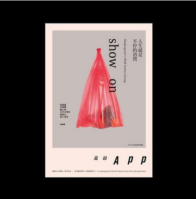

# 現代女性的旁白力量：談莎妹劇團《羞昂ＡＰＰ》演出

我一直到演出前幾天才開始認真地閱讀宅女小紅的部落格。在這之前，宅女小紅對我而言就像是傳說中的人物，赫赫有名但距離遙遠。演出前幾天，抱持著研究生擺脫不掉的那種「作功課」心態，終於來到宅女小紅的部落格。想不到不看則已，一看就著迷，一篇接著一篇津津有味地讀下去，在自己的房間裡大笑不停，只怕隔壁鄰居沒有前來敲門抗議了。幾篇文章讀下來，很快地我發現宅女小紅迷人之處：她的文字兼具了私密和暴露的雙面性。

宅女小紅打破傳統文章的格式，既像是朋友在跟你聊天（直接對著讀者說話），又像是在自言自語（大量使用OS）。這讓上班族在下班後可以享受和宅女小紅聊天一樣的親密感，又因為她喃喃自語的特質，讓讀者在閱讀的當下有偷聽／偷看的快感。不過，部落格到底是公開的，讀者也很清楚宅女小紅透過文字在進行自我暴露，於是這種既像聽朋友說話、又像在公眾場合偷聽別人喃喃自語的閱讀經驗，就構成了小紅文字私密和暴露兼具的雙面性。

編劇簡莉穎、導演Baboo抓住這種喃喃自語的特質，把它連結到廣大的上班族女郎身上，精確點出現代女性善於在內心「OS」的特質，以及「OS」所能夠帶來的解放與快感。雖然有許多觀眾都是小紅的粉絲，期待在舞台上看到偶像「小紅」被再現，不過隨著戲的發展，卻發現她們看到的其實都是自己。劇中最高潮、引發觀眾最強烈反應的橋段之一，就是演員謝盈萱不斷透過「OS」在人前人後的態度上作快速的切換，讓我們看到表面上微笑有禮的女性，在掙脫了束縛以後，也可以如此強勢機伶、張牙舞爪、不受控制。

舞台上羞昂的「OS」讓觀眾爆出大笑，也讓觀眾透過她們看到自己的縮影：其實她們自己就是那一個個表面上溫柔陪笑、內心裡瘋狂幹譙的「羞昂們」。《羞昂》讓原本充滿壓抑的上班族女郎，有了放聲大笑、解放自我的機會。頓時間，實驗劇場迴盪著狂放的女性笑聲，讓我想起法國女性主義者西蘇（Cixous）所說的「梅杜莎之笑」（the laugh of Medusa）。西蘇認為女性應該要狂傲、不羈，如蛇髮女妖梅杜莎一樣放聲大笑。現代女性永不間斷的「OS」與笑聲，帶來的正是一種解放力量，而這樣的解放在小劇場空間被實現了。

《羞昂》更點出現代女性的自我戲謔、自我解嘲與自我分裂。一方面因為被男朋友甩哭得死去活來，另一方面卻又要跳脫出悲情的女性角色，冷靜地談論自己，然後再狠狠地自我嘲弄一番（舞台上，演悲情的謝盈萱故意讓自己倒退走的時候定格在戲劇化的燈光之外，引發觀眾大笑）。表面上安安靜靜，乖乖巧巧，內心裡的女性慾望與牢騷卻如洶湧的暗潮一樣翻滾著。就像幾年前陶晶瑩透過「陶美惠」這個角色自我戲謔，贏得廣大女性觀眾的喜愛，現代的宅女小紅也透過網路分身，以及這次透過謝盈萱的「戲擬」，來一再顯示出現代女性的心理狀態絕對是自我分裂的：對女性角色既投入又疏離，既認同又嘲諷。

這樣的自我分裂與自我嘲諷最可以透過下一段謝盈萱戲謔演出刻板印象下的女性主義者給體現出來。這個「女性主義者」口口聲聲喊著女性權益，卻因為謝盈萱滑稽誇張的演法，而使得這些「女性主義」口號顯得充滿諷刺性。不過，另一方面，這個角色像喬叟筆下結過五次婚、等待第六任丈夫的巴斯婦人（the wife of Bath）一樣，因為大談性事、充滿女性情慾，而深獲觀眾喜愛與認同。編劇巧妙地把宅女小紅知名的幾篇文章編寫進這個橋段，包括小紅幽默討論「三秒就結束」、男性性器官如「錢櫃濕毛巾」等段落，讓小紅粉絲和編劇心照不宣，增加台上台下的默契與互動。這種對女性主義者既認同又疏離的立場，對於女性議題既關心又嘲弄的態度，正是當代「後」女性的集體寫照。

《羞昂》整齣戲維持著一貫的戲謔、疏離與自我分裂，讓謝盈萱繼續扮演著各式角色，一下子成為人前優雅人後抓狂的名媛，消費他人也消費自己，下一秒又搖身一變成為刻板的「憤青」，從演員變成觀眾，從觀眾席走上舞台，大批這部戲空洞無內容，聲稱勞動階層、反核反資本等嚴肅社會議題才值得關注。這部戲本身的形式就很OL，就很「羞昂」，充滿了自我戲謔的幽默、自我嘲諷的勇氣，以及自我分裂的疏離。以羞昂的邏輯來說，這齣戲本身就充滿了各式各樣的「OS」。

via: 後女性的魔鏡夢遊

註：

1.OS意為內心的想法、獨白，是overlapping sound的縮寫。

2.《羞昂App》以超人氣女作家「宅女小紅」（羞昂）的戲謔，自嘲，言不及義的都會生活觀察雜文為起點，由導演Baboo與劇作家簡莉穎共同合作，為新生代劇場女演員謝盈萱量身編寫一部獨角戲。《羞昂App》是ㄧ則以「新女性主義 的日常生活觀察報告」為題的單人全民開講，從身體推衍到身體與周遭的關係--職場、人際、情事、房事，甚至國家大事，從食衣住行育樂的狗屁倒灶，切入日常的荒謬。看現代女性，如何以身體為居所，以身體為戰場，進行一場身體與自身，空間，社會與意識形態的戰鬥。

3.羞昂（宅女小紅）--不著床就要變成高齡產的中年女子；一天不講垃圾話會暴斃的心酸OL；除了吃麻辣堅持要點大辣外其它事情都看得很開的宅女。在文壇，她是狂野的張曼娟；豔派的吳淡如；性感的吳若權；下體界的成英姝；D罩杯的郝廣才；專寫垃圾話的張愛玲。她的書寫毫不保留，ㄧ絲不掛，三點全露，走光貨真價實的宅女心事，道盡前敗犬少女的牢騷，近中年OL的逼哀，後青春期文青的假掰。「胯下界天后」及「垃圾話女王」對她而言都是虛名來著，其實奴性很重，最大願望是永遠有班上！

原文出處：

http://a09201988.pixnet.net/blog/post/31264305

部落格 showon.cc

臉書 http://www.facebook.com/SIAOHONG

採編：Vanessa 責編：余澤霖
