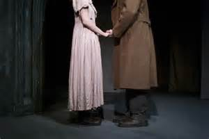
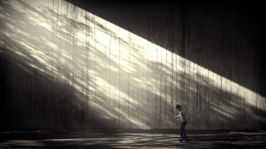

# 琐碎感

深夜重读《罪与罚》。

主角大学生Ralskonikov在杀了在他眼中象征着人性之恶的老太太Aliona和其妹妹Lizaveta之后，经历了一系列神经错乱，怀疑，高烧和幻觉后，来到因偶然际遇结识并帮助了的，不幸沦为妓女的Sonia家里。在这里，发生了如下的场景和对话（我根据Sidney Monas的英译本翻译）：

_五分钟过去了，他来回踱步，没有看她。然后他走向她。他的眼睛闪着光。他两只手扶住她的肩膀，直直地看着她悲伤的脸。他的注视直接，热烈而刺人；他的嘴唇剧烈地颤抖。他突然迅速地弯了下去，趴在了地板上，亲吻了她的脚。索尼娅惊恐地往后退，如同躲开一个疯子。他看起来的确是疯了。_

_ _

_ _

_“__你为什么对我这样做！众人中偏偏是对我！”_ _她的脸变白了，喊着。她的心跳带着剧烈的痛苦。_

_他马上站了起来。“我并不是向你跪下。我是向全人类的受苦跪下，”_

__ _他疯了似的说着，一边向窗边走去。_

这段描写读来精彩绝伦。陀氏的小说只有在随着年月增长而增加的过程中，反复而细致的阅读中，才慢慢一点点突显出其无以伦比的精细和艺术性。他对小说叙事节奏的掌握和思想性的统一，大概可作所有现代小说的范本。

在阅读和欣赏之外，作为一个社交网络的使用者和参与者，我内心却还有一个小小的回音：这段动人的描写单独拿出来放到今天网络上，会得到怎样的回应？ 一个男人向一个女人跪下，说“我是向全人类的受苦跪下。” 是一定会在被奚落和模仿中失去其原有的庄重严肃和热度的吧？

毫无疑问。曾经意见青年们抱怨成年人妄图以童稚化的思维来约束，影响和创造言论环境，从而达到树立威权统治的目的，而今天，我看到的却是另外一种不自觉的童稚化：人们似乎正在逐渐失去理解高尚和严肃，这种成年人的能力，而在一种处处看起来标新立异其实却是互相模仿的奇怪氛围中，把一切人类情感都降低到了一个不可思议的扁平维度。

在这维度中，引导我们对友谊、爱情、亲情等人类情感模式进行思考的，是《欲望都市》和《老友记》这样无关痛痒的流行电视剧。主导主流媒体的对话和讨论的，无论讨论对象是什么，是一种幼稚得无以复加的娇嗔和轻浮语气。

在我看来，幼稚的一个重要表现，是对琐碎之事物（triviality）的关注，以及讨论中所呈现出来的琐碎感本身。什么叫琐碎感？比如，当我们讨论“青春的爱情”这一主题，不妨看看古人在讨论什么。莎士比亚著名的十四行诗第十八首开头， “_Shall I compare thee to a summer’s day? Thou art more lovely and more temperate_.” 暂译作， “我可否比你比作一个夏日？你更可爱，也更温和。” 冬日漫长的欧洲夏天短暂而宝贵，而诗人用夏日来比喻爱人在易逝的青春中的宝贵容颜，其实是正恰当不过的。但是，这样的诗句，在今天的年轻人中，是很可能被嘲笑为矫情的。而能在年轻人中唤起对“青春的爱情”的回想的是什么呢? 是《那些年我们一起追过的女孩》这种追求琐碎的陶醉感的东西。而这种远离了人的存在本质、爱欲真相的琐碎感，似乎在越来越多地支配着我们的讨论和对话。

在这种琐碎和轻浮中，一切都不可避免地走向了两个极端：如果人们表现出深情的话，他们看起来是小清新的样子；如果人们没有表现出深情，他们看起来是以为通过无底线的网络段子手法能够能够“解构”所有的严肃，悲剧和深情的无赖样子。

而目前来看，一切方式都在宽容、多元和平等的口号中得到了谅解，并且像病毒一样被复制和扩散开去。

(采编：周凌希；责编：孙梦予)
