# 甄嬛应该怎么穿？——雍正朝的宫廷女装

以往很少看宫斗剧，受不了近年影视服饰之离谱是很大的一个原因，虽说服饰陈设对于一出古装剧来说不是最重要的方面，但若太扯太粗制滥造也有碍观感，使人往往看过剧照就兴趣索然。这两年《甄嬛传》大获成功，想必是有其过人之处，便想一探究竟。

《后宫甄嬛传》原是历史架空小说，无明确时代，电视剧版选择了雍正朝为背景拍摄。略开剧情不谈，看过之后，发现服饰、陈设倒比预想中的要好很多，至少还是有认真花点功夫做正常衣服而非如有的戏一般彻底乱来，也有钿子、吉服的概念，并且其服饰纹样、妆容还随着人物身份、境遇变化不断有细微改变。对于一出中国影视剧来说，能做到这样实属难得，还算赏心悦目。

但尽管如此，还是不得不说，片中服饰离雍正朝的真实情况依然很远，而主要以晚清旗装为设计基础。其实不止中国，各国历史剧服装，都多少存在用晚期形象设计该朝早期服饰的情况，比如李朝末的服饰通拍李朝，江户末的服饰通拍整个江户时代。毕竟晚期资料多，时间近，标志性造型概念根深蒂固，同时戏剧服装设计时又要考虑到很多视觉上的效果、主要人物的性格塑造等等，也难用复原的标准来看待。清前期宫廷日常服装原本被学界研究的也很少，就更难苛刻要求设计师了。

影视剧归影视剧，不必太较真，今天倒也不妨也单来聊聊雍正朝，以及前后康乾时期的宫廷女装到底是什么样的，或许会与大家一般的印象有很大差异。

雍正在位十余年，留下的服饰实物不算多，但戏中涉及的太后乌雅氏、皇后乌拉那拉氏、熹贵妃钮祜禄氏、果亲王福晋、公主、乾隆皇后富察氏、一般嫔妃倒也均有若干容像和服饰传世，结合当时其他实物、容像、绘画、文献，以及前后时期资料，还是能够窥知大体情况。清代冠服在形制上彻底改变前朝样式，但依然体系庞大琐碎，条律严密，比前朝有过之而无不及。其制度的形成，也经过很长时间的酝酿和修订，直至乾隆中期才完善定型，礼制之外的便服则更是变化剧烈，并非一成不变。单以宫廷女装来说，大致可分为礼服、吉服、常服、便服四类，分别对应祭祀朝会、节庆筵宴、日常闲居等场合，除了便服以外，基本样式均包括马蹄袖长袍和外褂一套两件。

【礼服】 

礼服是后妃在朝会祭祀等重大场合时使用的服饰。清代服制中，礼服几乎可算是和以往历朝差异最大的一种，从交领大袖衣裳一改为马蹄袖披领袍、外套无袖长褂的样式。完整的全套礼服由朝冠、金约、珥、领约、朝珠、彩帨、朝褂、朝袍、朝裙、朝靴十种组成。主要的衣服由外至内分别为朝褂、朝袍、朝裙三件，每件又以不同的纹样排列和构造细节分为若干式。

[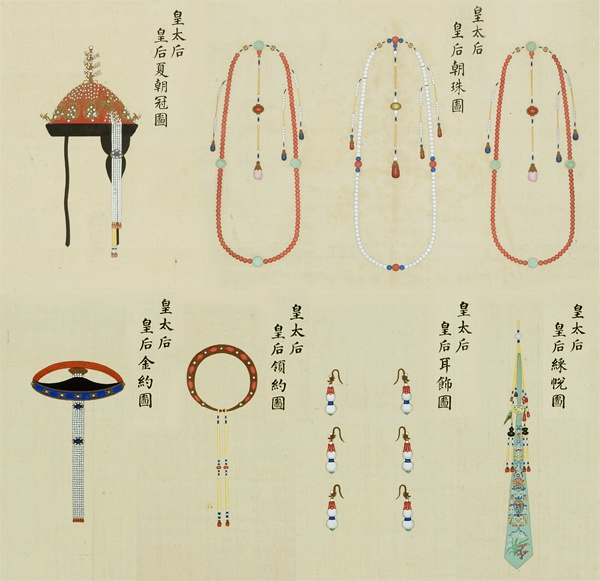](54a09127-338b-4104-9424-8089d0a4c1fd.jpg) [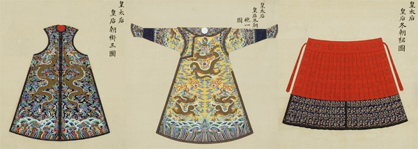](eb995e10-1141-4371-a057-ec9773b2d69b.jpg)

乾隆二十四年 《皇朝礼器图式》内府彩绘本 皇太后、皇后礼服图 [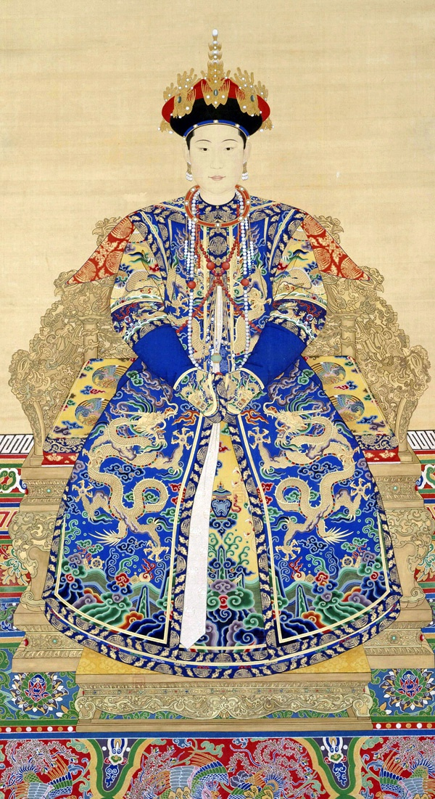](53f3e16b-cf7e-4da7-a9a9-b2c218af1f7e.jpg)

孝敬宪皇后乌喇那拉氏，雍正九年崩，此为其夏朝服像

朝褂罩在朝袍外，“色用青，长裾无袂，织金龙纹”，是一件无袖对襟长褂。纹样样式曾有五六种，第一种为前图雍正的孝敬宪皇后乌喇那拉氏画像所示，青蓝色褂，左右开裾，镶片金缘，前身胸前正龙一，下摆行龙二，下有八宝平水。此式为康雍时期常用，乌拉那拉氏之前的五位皇后画像均着此式，为几乎一致的程式化绘制。同期的一些命妇画像，也多做此式。

[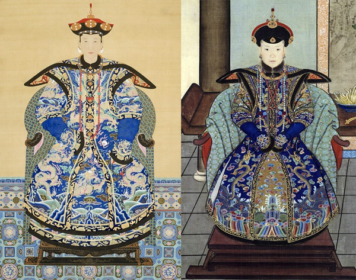](7a898ce9-e85a-4abc-9622-9cc0ed2de959.jpg) 康、乾的一些命妇画像

但此式并未被乾隆中期的三种定制所继承，经过几次调整（如乾隆七年曾定为统一前四后三式），最后确立为皇后朝褂石青色，前后各两大立龙式，乾隆《钦定宫中现行则例》“朝褂，色用石青，片金缘，绣文前后立龙各二”。而皇子福晋以下至县主则使用而前四后三朝褂，自下等级有差不赘述，更加细密明确。甄嬛的原型熹贵妃钮祜禄氏在弘历即位后被尊封为崇庆皇太后，其容像之一夏朝服像尚着三龙朝褂，而其八旬冬朝服像，则改做石青双立龙朝褂，此式在皇后画像中一直延续至清末。

[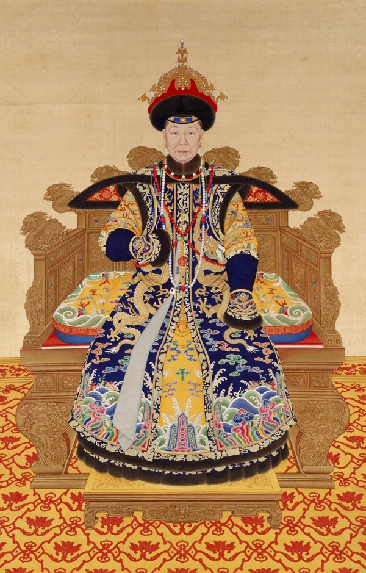](18c2cda5-6a65-4a55-a32a-453d15e5bcc2.jpg)

孝圣宪皇后钮祜禄氏（崇庆皇太后）冬朝服像，为石青两立龙式朝褂

[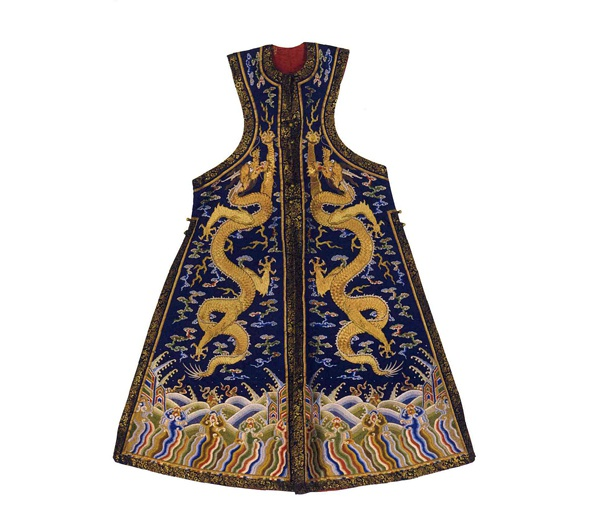](74e2e826-45c2-4aff-9e75-7e28dbeacd1d.jpg)

石青缎绣彩云金龙袷朝褂 前后两立龙式 [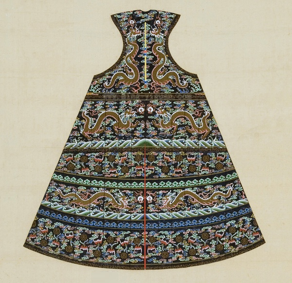](924e4e83-5a1a-4bd0-a600-4d4f52560691.jpg)

《皇朝礼器图式》中的皇太后、皇后有褶朝褂式一之背图 背中开裾

朝褂另有一种对襟后开裾式，即“有褶朝褂”，在胸围线以上前后绣立龙各二条，胸围以下做襞积，并横分为四层，一、三两层前后绣行龙，二四两层各绣万福万寿，彩云相间。这种朝褂唯有嫔妃以上可用，乾隆三十六年，乾隆为崇庆太后在慈宁宫举行盛大寿宴，绘制《慈宁燕喜图》，殿中嫔妃全部身着此式朝褂，太后本人也不例外。

[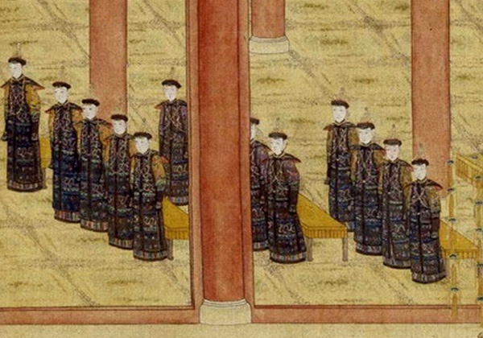](fabc0ee5-ad7a-48d8-860d-39c9986611ca.jpg)

《慈宁燕喜图》殿中嫔妃均身着有褶朝褂

[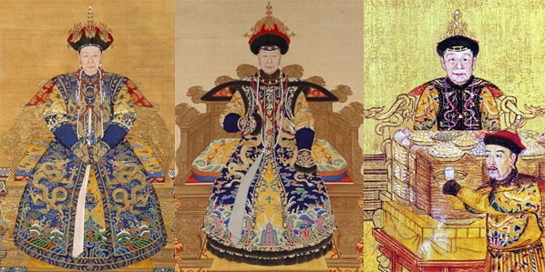](0269e515-4e30-45f4-8139-e4021e2461ff.jpg)

崇庆太后的三幅礼服像，分别穿三龙、双龙、有褶三式朝褂

[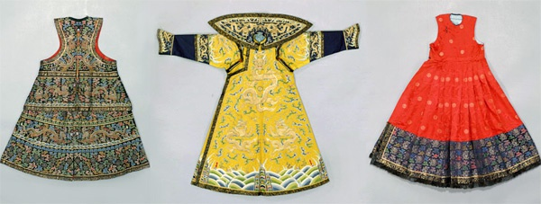](4889c77c-8ebe-42b1-b6f8-6d830308d093.jpg)

雍正 明黄色纱绣彩云九龙纹夹朝袍，及朝褂、朝裙各一件

朝褂之内为朝袍，马蹄袖、披领（此二者为清代冠服制度最重要的标志性元素）、圆领、窄袖右衽，也分两侧开裾，三开裾，下身有褶几种样式，龙纹排列也有数种，以九龙式为常用。太后、皇后、皇贵妃用明黄色，披领及袖石青色。朝袍内有朝裙，从实物看则有带背心和不带两种。

后妃礼服的使用场合很少，仅在重大礼仪庆典使用，比如冬至、元旦、万寿、册封等，以及唯一由皇后主持的祭祀——先蚕坛亲蚕礼，如乾隆九年富察皇后举行的清代第一次先蚕礼。《甄嬛传》中极少出现礼服，选秀女的时候太后穿了一次，而后的大典反而穿吉服，这倒是一个小失误。

[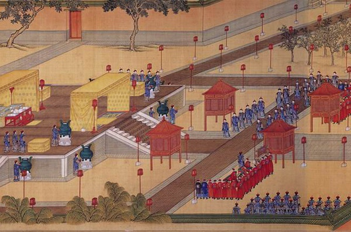](f8c81153-de39-44b4-8b81-46931e496e26.jpg)

郎世宁 《孝贤纯皇后亲蚕图》局部

【吉服】 

礼服之下为吉服，吉服是清代服制中首次明确制定的一种服饰（虽然明代已经形成此概念），界于礼服和常服之间，样式与常服相类，但装饰华丽，所以又称为“彩服”、“花衣”，可算是常服的华丽版，主要用于吉庆节日、筵宴迎銮以及礼仪场合的辅助阶段。

一套后妃吉服包括龙褂和龙袍各一件，表衣为褂，即长平袖（无马蹄袖）的对襟长衣。其开裾方式，一般认为帝王褂为左右后四开，后妃仅后开裾，但从清前中期实物以及画像、绘画上看，早期女褂也有左右开裾的情况，判断清宫旧藏早期吉服褂的属性时需多甄别。（btw，清前期大概是我国历史上男女服差异最小的时期之一了，从头到脚，乍看往往都莫辨男女）

在清前期服制未定时，龙褂衣色和纹样丰富，甚至有明黄色和蓝色褂。但后来便基本定制为石青色。

[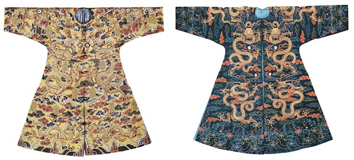](6cd062dc-ab52-4b4f-b6ad-aa7e8ad2d6a8.jpg)

清早期的满地装风云水龙纹吉服褂

[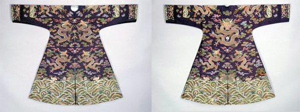](41e21190-3d00-4a39-9a28-9810d652681d.jpg)

雍正 石青色云蟒妆花缎袷女褂正背面 九龙满装风云水式

[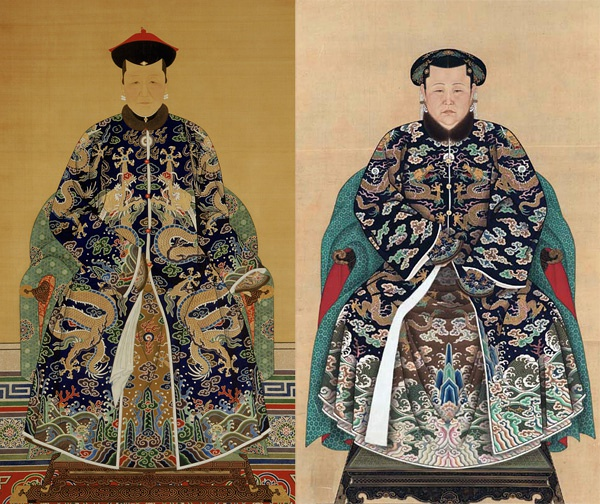](e5f8b3ee-f664-4a75-be3b-db98bd732631.jpg)

清前中期吉服像，一戴吉服冠，一戴钿子，左据说为富察皇后之母

而龙褂的纹样，早期则一般有两大类。一类是“满装”，通身满绣云龙纹，其装饰手法在明后期已经成型，清初有一定的袍褂料还是沿用明宫旧物。康熙二十五年的《苏州织造局志》多有“满装褂”、“风云地龙水褂”之名，即为此类。其中常见的九龙式，为胸背两肩正龙五，下幅行龙四，下有海水江崖纹（即织造档案所称“前龙二尊、后大龙一尊、肩龙二尊、水脚龙四尊”)，如上右图；四龙式则是前后身合对大立龙各两尊，两肩龙各一尊，如上左图。满装褂在当时制作的龙褂中所占比例很高，故宫康雍时期的实物也很多，如前图雍正石青色云蟒妆花缎袷女褂，装饰效果极其华丽，金碧辉煌。

第二类为清地“团龙装”，除了团龙之外，清素无纹。后妃使用八团龙褂，胸背两肩正龙四，下摆行龙前后各二。又以下幅袖端是否有海水江崖纹分为八团有水龙褂和八团无水龙褂两种。此类团龙样式成为后世外褂的主流，而满地装风云水式在雍正之后逐渐少用，在乾隆定制中被彻底废除，仅保留团龙式。

[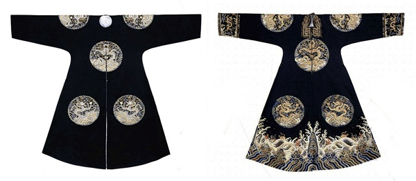](30ef39c3-3a82-46de-9eae-1591e46c7283.jpg)

石青八团无水龙褂，和石青八团有水龙褂

乾隆《万国来朝图》中戴吉服冠，着八团有水龙褂的后妃

康熙末年成书的《万寿盛典初集》，里面绘制了一个很难得的场面，一群贵妇站立在牌坊前，大多穿着吉服，其中便有八团无水龙褂和满地云龙褂两种，并左右后开裾，可见当时吉服褂实际情况。值得注意的是，图中着吉服者，均不戴吉服冠，而戴插满步摇首饰的包髻，似为钿子的雏形（或已经可称为钿子）。距此仅几年的雍正前期，情况想必相去不远。

[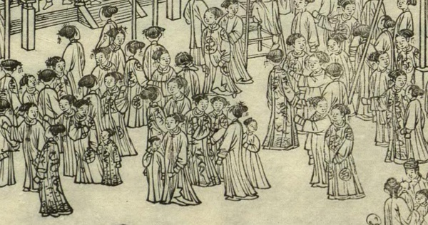](4e873f1c-c446-4551-a7f7-aaf4b71d9755.jpg)

康熙《万寿盛典初集》 八团无水褂与满地云龙褂

龙褂之内穿的，就是我们所熟悉的吉服袍，即龙袍（蟒袍）。为圆领右衽、马蹄袖、左右开裾的紧身长袍，领襟有镶边，除了袖中有花接袖和开踞不同外，其余样式和男吉服袍一致。纹样也分满地和团纹，有水无水几种，除了典制的龙蟒纹外，还有各种装饰题材。与中后期不同，清前期帝后龙袍均有团龙样式（后期仅后妃使用此式）。另外仅有领袖镶边，身无龙纹的袍服一般也被认为是吉服。相比于礼服，吉服袍的用色则丰富的多，除了限定后妃的明黄、金黄几种颜色外，其他几十种颜色均可使用，就是太后、皇后，也并非只能穿明黄。吉服袍实物非常多，属雍正前后的也不少。

[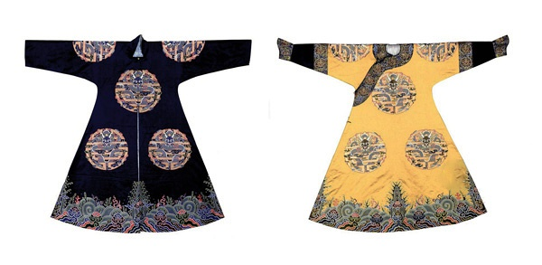](995cbf92-2615-4b39-8b9e-0002b9895bb9.jpg)

康熙 八团龙穿寿字吉服褂和吉服袍一套 推测为孝庄太后御用

[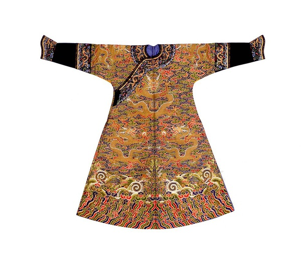](494fa106-71b4-4281-94ff-41495bd3054e.jpg)

雍正 香色满地风云金龙妆花绸绵龙袍

[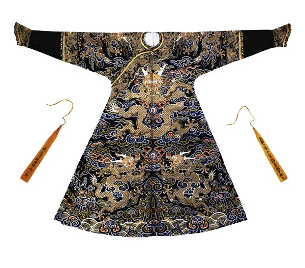](b8f33435-d360-4a7b-9a32-f926d7b0c9e2.jpg)

石青缎满地九龙袍

[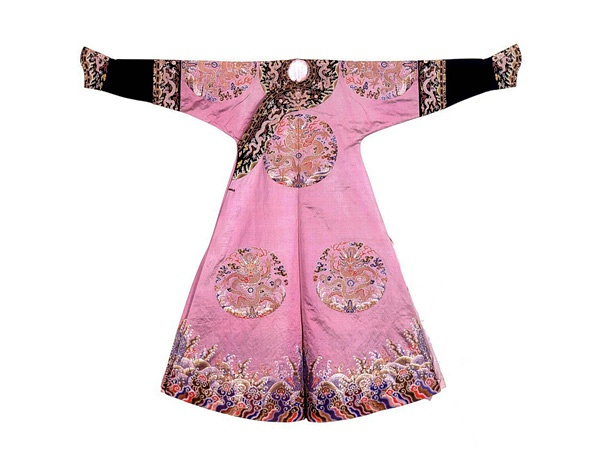](7674989e-842b-4148-8770-988d3720ef2e.jpg)

雍正 藕荷色八团金龙袍 推测为雍正生母孝恭仁太后乌雅氏御用

[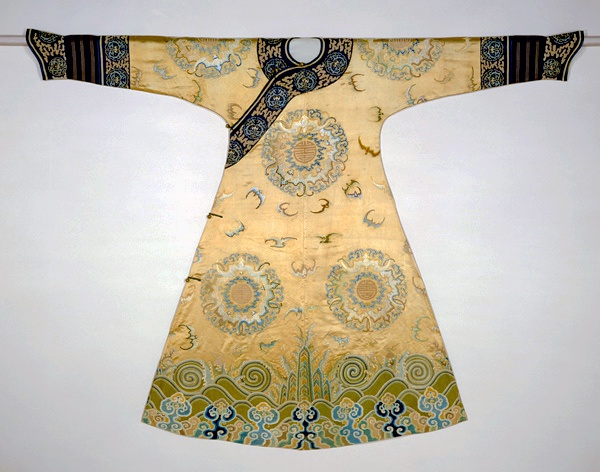](ca629e55-865f-4a84-8eac-c013a6b8a8a3.jpg)

雍正 果亲王墓出土 八团五蝠捧寿吉服袍 大都会博物馆藏

[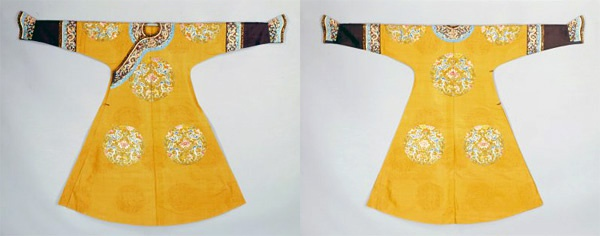](934f39ff-ce02-4bc0-84e3-72d46e703e9e.jpg)

乾隆 香色纱缀绣八团无水夔龙单袍 是嫔位夏季穿用的吉服袍

[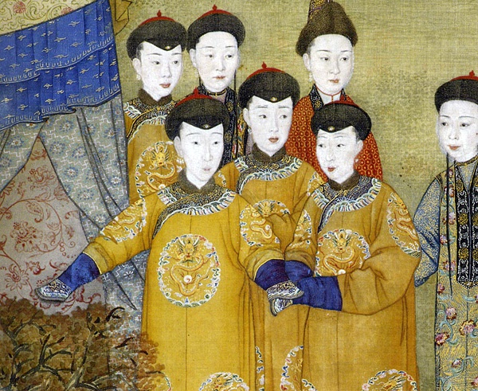](72dde2a7-9f58-49e2-a181-b57dc48fb245.jpg)

吉服袍之外一般要套吉服褂，华丽的装饰大部分都被遮挡在石青褂子之下。但是部分场合也可以单穿袍，如后妃躬桑礼。或许是为华丽效果考虑，我们熟悉的帝后吉服容像恰好是不穿褂的。也因此造成一个严重的影响，现代影视剧和各种艺术创作中，几乎都不给帝后穿褂了。《甄嬛传》中凡宫中宴会，均换吉服，但做成了大袖，嫔妃也都不穿褂（只有外命妇穿），并戴着旗头，其实是当时不存在的一种搭配。

《塞宴四事图》中单穿龙袍的乾隆后妃

[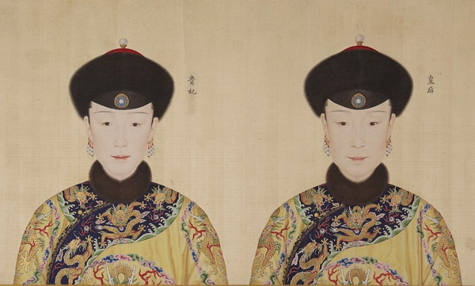](b38bf193-fa37-4137-971b-aaf10fc9465f.jpg)

乾隆初年绘制的《心写治平图》局部 皇后、贵妃

[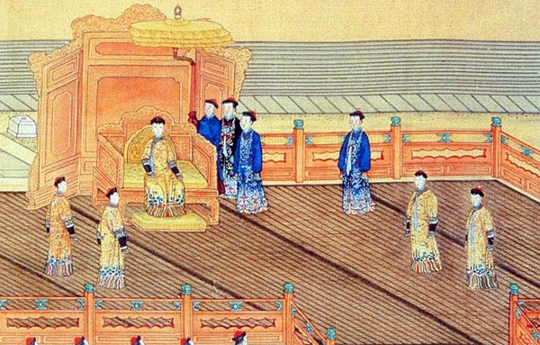](14f7d0ce-0983-44ea-af7d-392d5c6b32fe.jpg) 《孝贤纯皇后亲蚕图》中单穿龙袍的皇后

[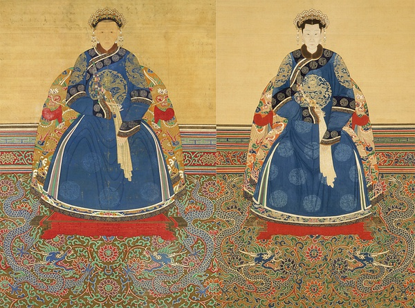](838c9407-235e-45c5-8719-6bc180db622e.jpg)

蓝色四团吉服袍，戴珍珠钿子 [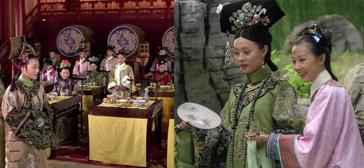](a9361382-5c4a-48e8-81ad-1dc7dfd55c8c.jpg)

《甄嬛传》剧照 宫宴中的吉服袍

按礼制，吉服配吉服冠，绘画中较正式隆重的场合，的确也均戴冠，如前诸图。但也有不少绘画中不戴冠，清初有直接盘辫者，有仅黑巾包头者；至雍乾时期，包头逐渐发展为成型的钿子，上面装饰越来越多的珠翠首饰，成为一种新的不见礼制的“吉服冠”。前举康熙末年《万寿盛典图》中的吉服贵妇头戴插有步摇首饰包头的钿子雏形，而乾隆彩绘摹本，便直接画成了成型钿子，可见雍正朝正处于钿子成型的过渡期。

钿子在清中期以后又经历了几次巨大的变革，最后还出现了高耸的“挑杆”型，在此不赘述。影视剧中不仅单穿吉服袍，绝大多数情况下不戴冠也不戴钿子，而配清末缎旗头。《甄嬛传》用了不少大型钿子，比如皇后几乎自始至终均戴钿子，但并非清前中期的样式，并且有点误解了钿子的结构和戴法，变成一个大帽子，搭配和场合也比较随意。

[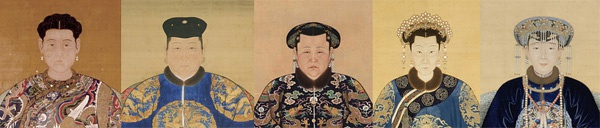](84a33de2-36f3-4658-aec5-324b73ce04be.jpg) 清初至清中期 吉服头饰从辫发到钿子的形成 [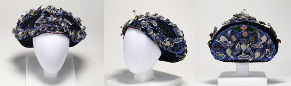](b9becd4b-7224-4e85-90c2-0b9c6ef30837.jpg)

成型之后的钿子戴法示意 [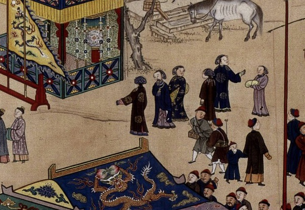](e10d5202-43fa-4c75-96f7-446905703b41.jpg)

乾隆摹本《康熙万寿图》 头戴钿子身穿八团无水褂，或单穿吉服袍

为烘托身份，甄嬛传里皇后基本均戴大型“钿子” 【常服】 

吉服之下便是常服了。常服的形制和吉服一样，也由平袖对襟褂和马蹄袖长袍两件组成，不同的是，常服“不备彩”，常服褂一般为石青色（近黑）或青蓝色，无花纹或仅有暗纹，常服袍颜色不拘，但大多也集中在蓝褐等较沉稳的色系，无镶边，即乾隆《大清会典》所记载的“皇后常服：袍无定色，表衣色用青，织文用龙鳯翟鸟之属，不备采”。对于这种青黑色的服色倾向，朝鲜人也多有记载，朝鲜金昌业在其康熙五十一年所着著《老稼斋燕行日记》中称：“胡人常时所服皆黑色，贵贱无别”、“男女衣服勿论奢俭，其色尚黑”。 洪大容《湛轩书》也说：“色尚黑,或用紫酱色”，“其长衣及踝。狭袖渐窄,口为马蹄形,仅以容手。无事则卷之,有敬事则垂之以覆手背”。

一般来说，常服褂仅后开裾，而常服袍两侧开裾，两者套穿则完全不露内服。头可戴冠，但早期更多情况下仅仅盘辫于顶，或随意插戴少数首饰，或包头，同吉服早期情况类似。这样一套常服袍褂，可称得上是旗人的标志性基本服饰，男女除了开裾方式和长短不同，形制基本无异。

[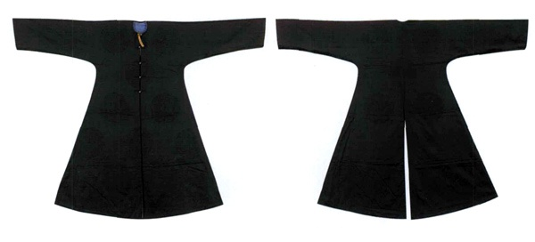](e7312a7e-5f41-4cbd-b72a-c665533d09b7.jpg)

乾隆 石青缎暗团龙纹棉褂 后开裾

[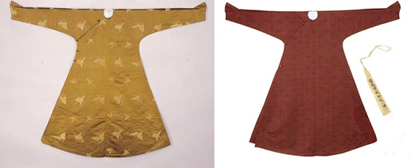](2d65bab9-560c-405d-b0c2-2a17d7c611b3.jpg)

乾隆 古铜色百蝶纹二色金缎绵袍 酱色万字菊漳缎夹袍

后妃常服是我们极其陌生的形象，光绪《大清会典》甚至无载，长期被人遗忘。但实际上，在清前期，常服袍褂应该是宫廷后妃日常使用比较普遍的一套衣服。很难想象，在早期的宫中，嫔妃们日常很可能大多只是穿着青黑色的袍褂，而并非我们所想象的成日花团锦簇争奇斗艳。清代前期的孝庄太后、康熙的孝昭仁皇后，包括孝圣宪皇后（即熙贵妃）均有常服容像传世，早期褂色多为青蓝色系，很快便调整为极深似皂的石青色。大约康雍左右的褂，除了圆领之外，还曾流行方领造型。

[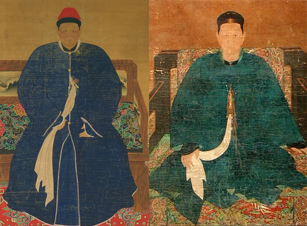](6eb8d4ab-541d-41f8-adc9-f38dec97345d.jpg)

左：清初蓝色常服（传为孝庄），戴冠；右：清初青绿色常服，盘辫

[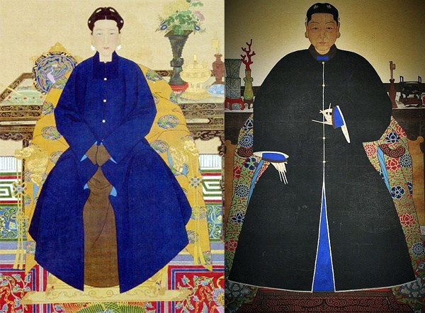](54949b17-f558-4d94-bfa1-c05751924981.jpg)

清初常服容像

[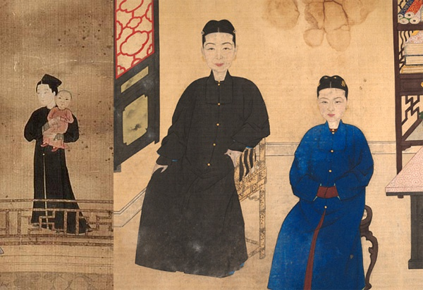](5157dbc2-bde3-4668-a4a3-5f0c520d815c.jpg)

康熙前后一般旗人女性日常服饰，除了暗纹题材和当时皇后并无区别

[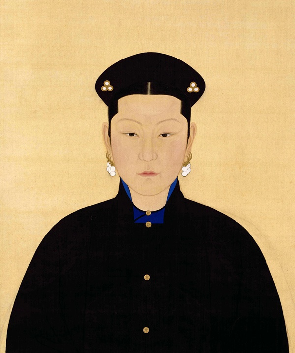](08272d33-5c93-4c3c-bc93-2d22b6eb9e63.jpg)

康熙 孝昭仁皇后 外罩石青暗团龙纹方领常服褂 头戴包头簪钿花

[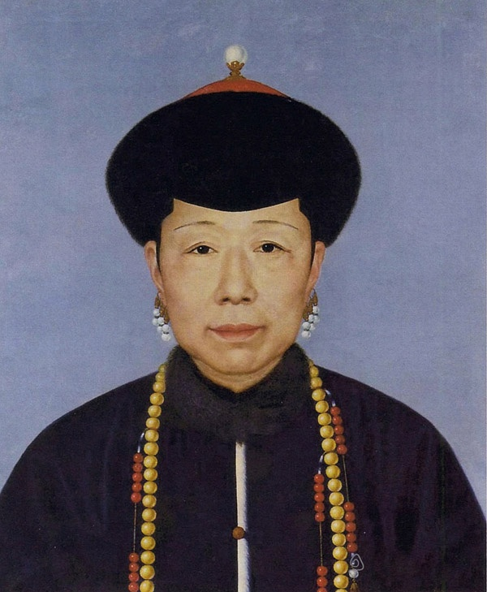](903a4a96-acd2-4c3a-853b-e98ee82b09d5.jpg)

嬛嬛老时，戴冠挂珠，身穿圆领冬袍褂（郎世宁《孝圣宪皇后》）

[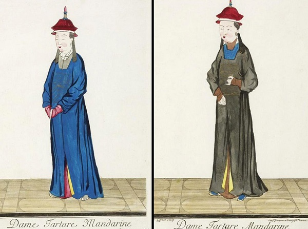](4b5ef005-633d-4f0a-8a36-471ee370f8e7.jpg)

康熙 孝昭仁皇后 外罩石青暗团龙纹方领常服褂 头戴包头簪钿花

和吉服一样，虽然大部分情况下袍褂需同时穿着，但偶尔也可见单穿袍的情况，就像现在西服外套与衬衫为一套，但也可仅穿衬衫一样。如孝庄太后的一副肖像，辫盘于顶，身穿黄褐色常服袍。其内甚至还露出了裙子，这是早期满人除了礼服外，常、吉服也穿裙的一个例子。

[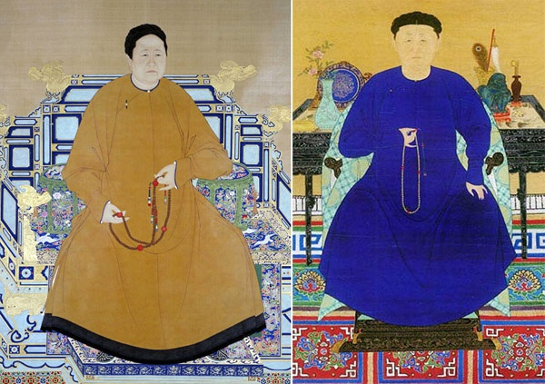](b319b8d7-6f6c-4c6f-bfd6-27d7a57ffd9b.jpg)

清初单穿常服袍，盘辫容像（左为孝庄太后）

[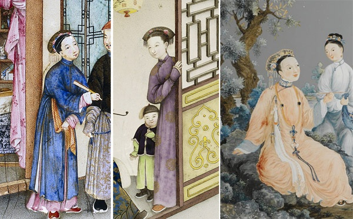](c15a3100-cdd0-4057-8839-bca5043c1e8a.jpg)

乾隆 当时欧洲东方风情画中的旗人女性多穿常服，但已略华丽 [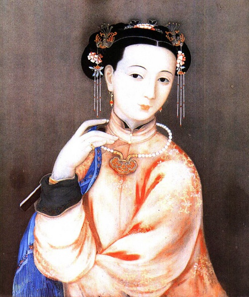](1c9d5797-5b1b-4c7a-8b48-d6670d22fad2.jpg)

外销画中单穿常服袍 马蹄袖翻起 戴钿子的女性

康熙末年的版画《万寿盛典初集》，里面画了成百上千的京城旗人女性，除了少数穿吉服的，其余几乎全部穿常服袍褂，可见当时常服使用之普遍。里面画及几种具有代表性的情况，比如路中骑马、戴冠、身穿袍褂的宫中女子；街头戴大量戴包头，穿袍褂的一般女性；家中、庭园仅穿常服袍的女性。

[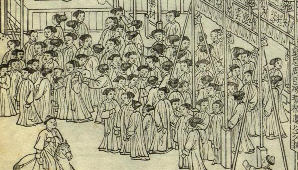](51d1cdb6-4259-4fa1-9e3f-9bcedf9f9db4.jpg)

康熙《万寿盛典初集》 一裙穿常服袍褂，戴包头钿子的女性

[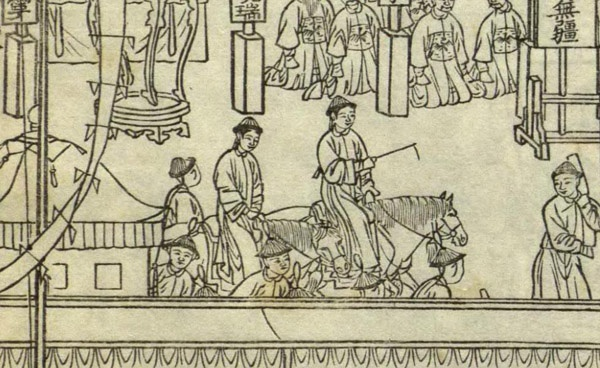](6989299d-165a-4adb-9105-f4b0398a85bf.jpg)

戴冠，着袍褂

[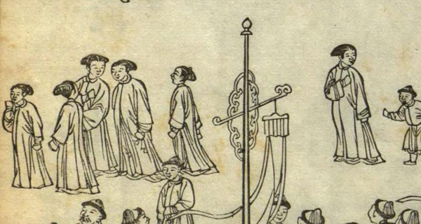](c3365b2a-031e-4acc-b826-4efb482392a4.jpg)

若戴冠，则乍看下男女很难看出区别

[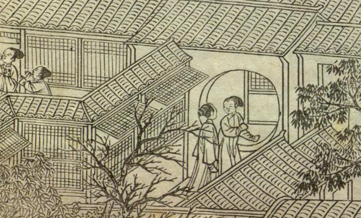](241fe9ca-3588-4d6a-ac23-a62e5eb8103e.jpg)

庭园中仅穿常服袍的女性

[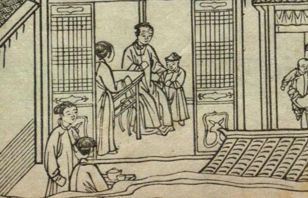](95913dac-a760-440c-a25f-45a8db871388.jpg)

穿方领褂的老妇

[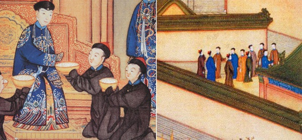](f3957203-b950-4866-8ba0-5938d1db8b63.jpg)

穿吉服的富察皇后，以及穿黑色常服袍的宫女，和殿外常服袍女子

[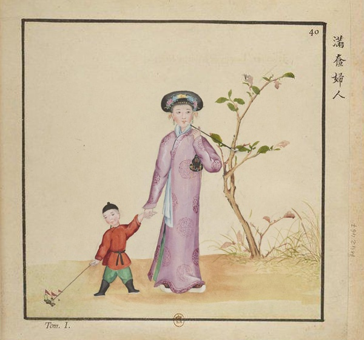](74656802-8a34-4b4f-ba7d-319a3ceccf8c.jpg)

乾隆 外销风俗画 “满奁妇人”，戴钿子，穿常服袍，内有绿衬衣

【便服】 

以上三类服饰，剧中绝少出现，如常服则完全没出现过。最后要说说情况最为复杂的便服，也是和影视剧关系最大、错误最严重的一种服饰。

便服在任何礼制中均无记载和绘制，是后妃燕居闲暇时，最日常随意的穿着。并无明确规范，一直随流行迅速变化，越到后期种类越丰富，使用越频繁。在清早期，旗人几乎就把常服当做便服使用，日常穿着常服，坚持满人马蹄窄袖紧身袍褂的民族特性，如前段所述。但宫廷与八旗贵妇日久逐渐追求安逸舒适，在日常逐渐摒弃了马蹄袖，而渐渐更多地采用便衫便袍。便服与常服最大的区别，就是平袖端，无马蹄袖，以及越来越宽阔的袖口，无外褂，常常因为无礼制上的规定，所以花样百出。

前期便服，基本可分为两类，一类是圆领右衽、平袖舒长、下摆宽阔无开裾的袍衫，穿在其他开衩的服饰内，或者可以在私下场合单独穿着，可称为“衬衣”（此名称最早似乎出现在乾隆的黄签中，之前不知何名，或即称便袍，后一直沿用至清末）。一类则两侧有开衩。

[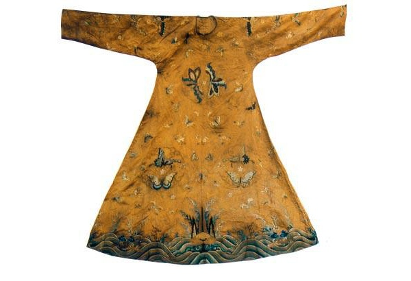](eeb19db9-8972-4be9-8873-ee8ef221c9a8.jpg)

雍正 荣宪公主墓出土彩蝶袍

可考最早的衬衣之一，是大都会博物馆所藏传为果亲王墓出土的一件福金穿用的百鸟纹衬衣，腰身宽松，满身上下百鸟百花，繁而不乱（浣碧在府中倒可穿此件）。而雍正七年下葬的荣宪公主墓所出土的另一件，则更加华丽，虽是圆领平袖的便服形制，却用了精致的八团双蝶，下有平水，全身百蝶飞舞，装饰效果几乎可匹敌吉服（可能也带有部分吉服性质），代表了当时皇家气派。同墓出土的另一件浅绿色杂宝博古纹衬衣，则素雅的多，衣上的画轴甚至还绣出“春城无处不飞花”的诗句。

[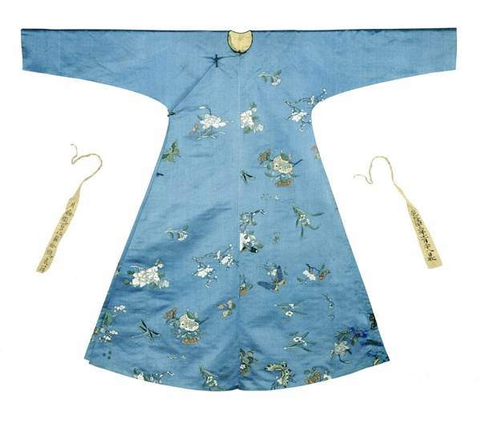](19805551-bdc8-473b-89a9-90163e8b3d34.jpg)

乾隆 月白缎百花妆夹衬衣

故宫中有一件黄条墨书题“乾隆四十三年十一月收”的“月白缎白花妆夹衬衣”，制作时间在此之前，是宫中保存下来的极少的早期衬衣之一，弥足珍贵。这件衬衣，月白色妆花缎面，黄色缠枝暗花绫里，全身以红、绿、香、绛、湖蓝、深灰、浅黑、淡白等十余色丝线织出牡丹、莲花、海棠、梅花、秋海棠、石榴花、水仙、桃花、绣球、兰花等花卉，又有螳螂、蝈蝈、蜻蜓和蝴蝶飞舞。呈现百花盛开、百蝶翻飞之景。织造精良，做工细致，纹样雅丽，是一件乾隆时期的精品。

[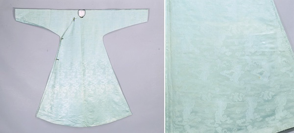](776bdc86-acb0-4c69-8a72-307636be7cd6.jpg)

湖色寿山福海暗花绫袷衬衣

另有一件湖色寿山福海暗花绫袷衬衣，领口所系黄条墨书“嘉庆十七年二月初二日收，四执事交”，背面书“绿绫袷衬衣一件”，形制与前者完全一致，但用色淡雅，暗纹无彩，为为杭州织造局织造，似为乾隆时作品，应该是当时宫中一般嫔妃比较普遍穿着的简便样式。

乾隆《弘旿行乐图轴》单穿衬衣形象，黄衣妇人或穿开裾衫

[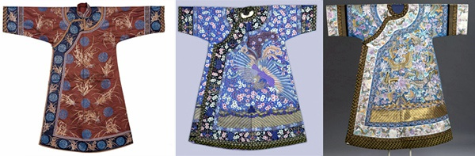](5fb80dc2-22e5-40d2-9511-57ed6542e74f.jpg) 晚清衬衣

晚清的衬衣装饰越发繁琐，镶滚增多，这时的“衬衣”又发展出舒袖和挽袖样式，到慈禧时登峰造极，略提不谈。

[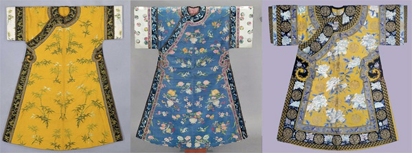](90980e7a-7b82-4cf1-b107-a499cb3d3587.jpg) 晚清同、光年间氅衣实物，镶滚逐渐增加

早期的另一类便服，样式和衬衣一致，唯两侧开裾。但不能单穿，一般套穿在衬衣之外。这种便服，在晚清被称为“氅衣”，也发展为极尽奢华装饰的样式，加上华丽的滚边，并且装上了立领。这种衣服最后修成正果，成为满族服饰的代表，并横扫一切影视剧，是任何清宫戏里后妃绝大部分场合均使用的服饰，《甄嬛传》也不例外，并且戏中的后妃们氅衣内从来都不穿衬衣，直接露着里边的裤子在宫廷中行走。

[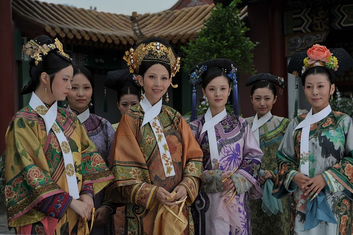](495bab5b-4bf2-4f58-8f7f-761bd697b8e6.jpg)

《甄嬛传》剧照，穿着华丽氅衣的后妃们，皇后头上似乎是钿子

[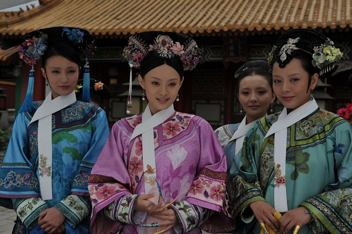](9ac37c50-97d0-4040-9211-9ce25f03b3e2.jpg)

单穿氅衣的嫔妃们，甄嬛头上似是钿子和二把头的结合，敬妃戴钿子

不过实际上，这种华丽的氅衣，在清前中期完全还没出现。早期“氅衣”前身实物，至今似尚未发现实例，但是绘画中倒有不少展现。一般康乾时期的便服女性形象，衬衣之外大多都有一件两侧开裾的圆领袍衫，即氅衣原型，但无镶边，装饰淡雅，腰身宽松。头饰则也和早期吉、常服一样，最简单者仅为辫发于顶，即清前期文献中屡屡提到的“满洲妇人辫发盘髻"、“满洲女髻, 多辫而旋者”、“处女髻发中分绾上”的传统习俗；康雍时期逐渐流行包髻，并且渐渐在髻上插饰越来越多的首饰；便服头饰到了乾隆之后，并非与吉服头饰一样，发展为钿子，而是逐渐走向另一个发展路线，到晚清演变成为二把头。戏中常见的缎子两把头，实为清末民初样式，在雍正朝连影子都还没出现。关于两把头的形成，又是另一个话题了。

[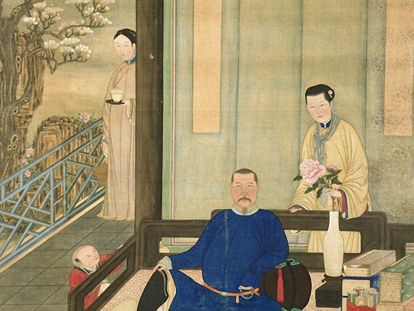](c4abee5d-407d-4f33-8584-0378e5827a3f.jpg)

清早期 某行乐图中的侍妾，外穿浅色衫，内穿红蓝立领衬衣，盘辫

[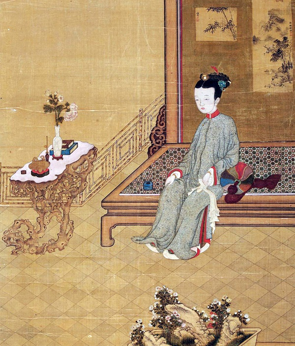](d4d221fd-964f-4b0d-ac34-c6945ba50dd2.jpg)

传焦秉贞旗人仕女图 盘辫簪翠，两件开裾衫，内一件带立领

[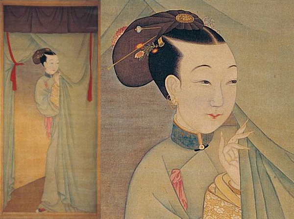](ab26a96f-fe2e-4a10-a828-d49e1369a830.jpg)

康乾时期 包髻上簪花插钗

[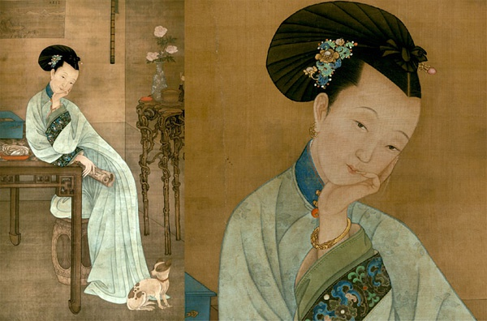](a08e5de9-0011-4e75-9ff7-52ad8925351a.jpg)

雍正二年 冷枚《春闺倦读图》

>

天津博物馆藏有一副冷枚的《春闺倦读图》，作于雍正二年，画中贵妇头戴包髻，插饰珠翠，身着一袭浅绿暗花圆领长袍，细看两侧有开裾，袖口有缘。内穿立领长袍，斜依靠在桌旁。本幅有明确时间，可视为雍正朝初期旗女便装典型。此造型为康雍时期仕女画所常用，故宫著名的雍亲王十二美人图，也可看到类似动作和首饰，只是均做汉装。

[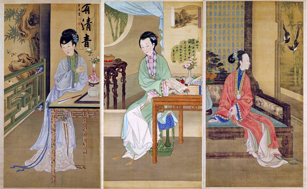](6e2f7220-2273-4e37-bd0d-3c389f8ff4a1.jpg)

雍亲王题十二汉装美人图屏

[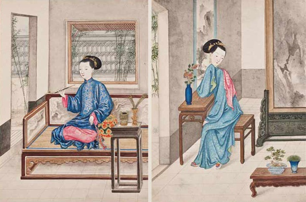](528503dc-5cd6-429a-b9be-1009e2612810.jpg)

某外销风俗画中的旗人妇女便服

[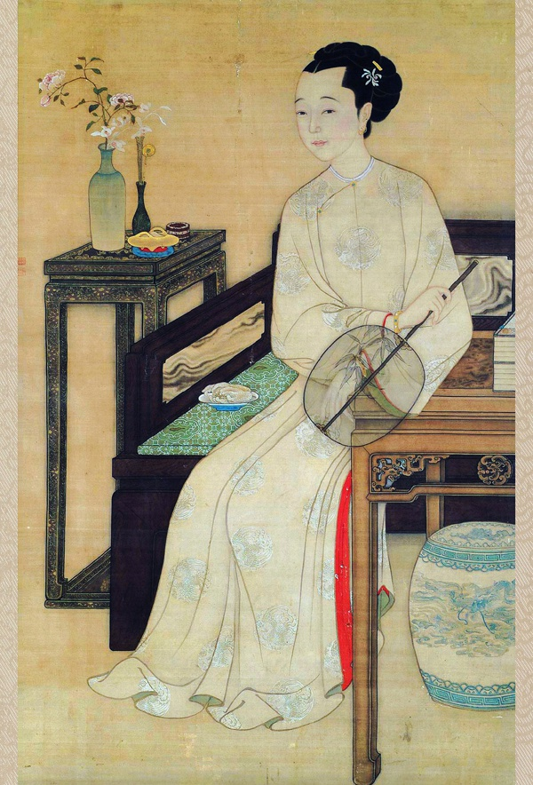](3c435ddd-c3f8-4e42-a841-90207432e42a.jpg)

雍正间的都统兼藩院侍郎莽鹄立精于绘画，曾受命恭绘圣祖御容，也曾绘制果亲王允礼小像。他还有一副作品，描绘一位执扇坐榻的仕女，辫发绾于脑后，鬓边仅插一朵兰花，一耳三钳，外穿一件玉色团凤纹圆领衫，内大红衬衣，身份不凡，极有可能为宫廷嫔妃的便服写照，以此图作为甄嬛入宫不久的妆束参考，就再合适不过了。

最后再来一幅奇妙的画——冷枚、焦秉贞、陈枚合作的《雍正行乐图》，右边第一位头戴钿子，身穿朴素版吉服袍，耳饰三钳，戴领约；第二位头戴钿子，袖口和开裾情况被档，似为便服袍衫（或常服袍）；第三位戴钿子，耳饰三钳，明确为旗妇，但外披汉式雪青披风，中有系带，上加汉式云肩，内穿一件浅绿衬衣，内又有一件藕荷色长袍，满汉混搭；最后一位则全为汉装打扮。这幅画仿佛特地安排的本朝服饰展览会一样，选了当时四种皆然不同的服饰类型让四位嫔妃穿上。

[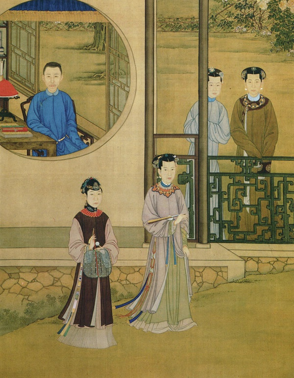](2817ea1a-f2ed-4a37-a7e4-9554a7d91b98.jpg)

此画中出现汉装与满汉元素混搭装，清代嫔妃怎么着汉装？颇让人费解。雍正有大量奇装异服cos照，所以也有人怀疑此画服饰的真实程度。但在其他游戏之画中，雍正本人一般也搭配相应古装异服，而此画雍正和其中两位嫔妃服饰均为极写实的旗装，明显为正常行乐图，那么另两位嫔妃的服饰，似乎也没有凭空捏造的必要。若当时内廷禁着汉装，那就更不会冒天下之大不韪而如此画之。或许与清前中期实际情况，以及雍正个人喜好有关。

其实雍乾以来，旗妇沾染汉习着汉装的情况已经见诸记载，汉军旗中着汉装者则更为普遍，毕竟相对于礼服和男装来说，女便装不是敏感地带。但穿的人多了，也引起皇帝的警惕，乾隆之

后历朝诸帝屡有勅谕禁着汉装。乾隆二十四年，高宗谕曰：“此次阅选秀女，竟有仿汉人妆饰者，实非满洲风俗。在朕前尚尔如此，其在家，恣意服饰，更不待言。嗣后但当以纯朴为贵，断不可任意妆饰。”嘉庆甲子，仁宗谕曰：“今镶黄旗汉军应选秀女，内缠足者竟至十九人，殊为非是。”乾隆几次谕旨秀女不得着汉服妆饰，嘉庆、咸丰间也有禁秀女缠足、“汉式衣服，概不准滥行装饰”之谕，可见乾嘉间实际状况如何。

而此前的雍正朝，汉军旗汉姓嫔妃的比例本即极高，当时对于便服又没什么特别的约束与规范，那么雍正间宫中或园中后妃便装的丰富程度可能会超乎我们想象，若真曾有过汉装元素也并非不可能。史密森协会藏有一幅据题签称为雍正谦妃刘氏的容像（虽不能确定题签的可靠性），画中服饰便是写实的雍正末至乾隆前期汉装造型，或是当时实际情况也未可知。

（采编：李以诺；责编：彭程）
