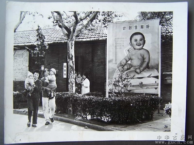
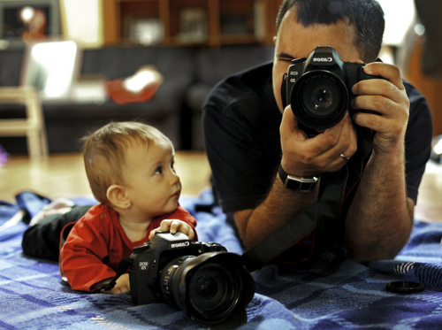

# 生两个好

一个朋友，在女儿四岁的时候又怀孕了。由于夫妻俩都工作繁忙，商量再三之后还是把一个已初具人形的胎儿打掉了。但堕胎完的那一瞬间她就后悔了，看到死婴时的震惊久难驱散，她第一次意识到自己扼杀了一个生命，甚至首次体会到为何堕胎在美国政治中会是那样重要的一个议题。在很长时间里她都无法摆脱一种深深的负罪感，一想起来就掉眼泪。她原本觉得第二个孩子可有可无，到此刻却转变成坚定地想再要一个，直至最终如愿以偿。

她的这一心路历程并不算典型，然而不论出于什么心态，想要两个孩子的中产阶级家庭确实正变得越来越普遍。人们不仅普遍认为有两个孩子是一件好事（哪怕他/她本身由于某些限制不想要或不能要），甚至当你有了一个孩子后，周围的同事朋友还经常会劝诫：“有没有想过再要一个？一个孩子太孤独了。”一对夫妇生育多于一个孩子，十余年前还被小品和通俗故事嘲讽为“超生游击队”的愚昧底层行为，如今却几乎在一夜之间变成了一种中产阶级现象。

在表面的相似底下，这其间有着诸多实质性的差别：与传统的观念不同，中产阶级并不寻求“多子多福”，他们通常觉得“两个刚好，更多也没必要”；他们也并不是为了生男孩才要第二个，因为他们普遍赞同“两个孩子一男一女最好”（这已成为极其强大的共识），他们要的是“孩子”而非“男孩子”；他们既不是为了养儿防老（对此他们并无幻想），也不是出于传递血脉的目的，不管内心究竟怎么想，至少在公开场合他们都宣称是因为喜欢孩子、且不想让一个孩子孤独才这样做的。他们是爱“孩子”本身，而不是为了取悦祖先。最能反映这种变迁和差异的一点是：如今往往反倒是年轻的中产阶级比他们理论上说是“更传统”的父母一辈更想多要个孩子——我的一个同事在确知太太再度怀孕时，高兴地打电话给自己母亲，结果其母一听到这个消息就哭了，因为第一个孩子才两岁，都还没照顾完；相反，得知这一消息的他的所有朋友，都为他高兴（当然，他们也不必替他带孩子）。如果说传统那种多子多福的观念是朝向过去的（为了接续和继承祖先的血脉），而如今这样做却是指向未来的——为了孩子和家庭的一个更美好的将来，至少他们相信如此。

由于抚养孩子在如今的大城市中已普遍被视为一个沉重的负担，尤其是培养孩子成材的支出（有人曾简练地概括道：“关键不是添一张吃饭的嘴，而是多一个书包”），因此我还记得几年前在周围的中产圈子中，抚养两个孩子几乎被看作是有钱人才做的奢侈之举。《有闲阶级论》中曾说：“那些对荣誉性消费要求格外迫切的阶级，其人口出生率都很低，这未尝不是起源于以明显浪费作为生活水准的基础这一点的不容忽视。生下了个孩子，要在很体面的方式下抚养他，由此涉及的明显浪费，也就是由此增出的开支是很可观的，这就造成了生育上的一个强大阻力。”在那时，多生养一个孩子本身几乎就像是一种“炫耀性消费”——有人那时开玩笑说：“多买几个LV不算有钱，多生个孩子才是。”

当然，大概没多少人会抱着这种心态去多要孩子的，而这些年来“生两个好”的观念也渐渐不再仅限于少数人，它事实上正变成一种被普遍认为是正确的观点。而其背后所映衬出的，是一种全新生活方式的涌现：代表着幸福家庭形象的不再是计划生育宣传中的那种一对年轻夫妇加一个孩子的搭配，而变成了一男一女两个孩子。人们倾向于暗示：独生子女的生长环境可能对其人格发育是不利的，最终其人格可能是有缺陷的，而两个孩子则是“最美满的标准配置”。因而并不奇怪，人们为“生两个好”辩护的话语也是典型中产阶级的价值观：两个孩子一起生活可以创造一个对他们人格形成而言更完整的生活环境，并有助于避免独生子女自私等诸多可能的性格弊端。

抱有这些想法的主要原因在于：中产阶层是比社会上任何其他阶层都更重视对子女教育的一个特殊的阶层。他们不把子女当作是一笔到自己晚年时收回的投资，而是把孩子的潜力看作是一个有待开发的项目——他们总是比别的阶层的家长更注重“发展”孩子的能力和个性。如何教育孩子才算合适，是他们永远关注且处于不断焦虑之中的一个重要课题。忽视孩子或严厉管束孩子，都可能使他们心怀严重的负罪感。对于无法请假参加三岁儿子在幼儿园里的一次圣诞节音乐表演，都会在夫妇俩之间引发争执，因为他们总是强调家长理应参与到孩子的成长中去，尤其在孩子展现自己才艺时理应在场予以鼓励。

有一种日渐普遍的感觉是：如何培养孩子，学问很大。中产父母不仅为此经常去学习相关理念，潜意识中还会把与孩子的互动看作是自身人格和经历的完善过程——并不只有孩子才得到成长，新爸爸新妈妈也是。他们虽然是父母，但对施展自己作为家长的权威心怀疑虑，因为他们深信更人性化的商讨、讲道理会是更好的交流方式和社交管控方式。这也促使他们对孩子采取一种更平等的态度，正如《不平等的童年》中所说的，“家长和孩子之间讨论问题是中产阶级抚养孩子的一个重要特征”，这会促使“中产阶级孩子在这个环境场景里学习对成年人提出质疑并以相对平等的身份和成年人讲话”。中产阶级父母还常常十分反感自己父母当年在回答孩子是从哪里来时，给予的“你是捡来的”之类的答复，因为他们觉得这不仅是错误的，也是对孩子心灵的伤害。

为了尊重孩子，孩子的降生往往还意味着一个城市家庭住宅空间的巨大改变。传统社会通常都没有独立的儿童间，但如今的孩子不仅会有自己的房间，还会在家中占据不小的一块活动空间，堆满他/她自己的衣物和玩具。日本也曾发生类似的变迁：家人（尤其是儿童）拥有个人的独立空间，这是欧美文化传入日本后才发生的观念变迁。传统日本住宅的独立性很差，家人之间没有隐私，直到1909年留美六年的桥口信助强烈主张改造住宅以“重视家人之间的自由和平等”。他当时所倡导的以儿童为中心的“儿童本位住宅”在如今的中国城市中产家庭中也随处可见，：家里的空间分隔和陈设实际上是以孩子为中心的，对抚育两个孩子的家庭来说，这一点就更为明显了。许多家长为之苦恼的主要方面之一就在于，如何在这个房价高企的时代，为两个孩子都提供相对独立的空间。有时，正是这一点而不是别的因素，阻止了年轻的中产阶级夫妇生育第二个孩子。

确实，对他们来说，两个孩子将不是一件轻松的事——但常常并不是因为经济负担，而是他们得付出更多精力来陪伴孩子共同成长，以及那种一旦没有这样做时涌起的负罪感。然而尽管如此，人们却依然感到这是值得的，这本身就是中产阶层一系列价值观发生改变的最亮眼的指示灯。

  原文地址：[http://www.douban.com/note/260145770/](http://www.douban.com/note/260145770/)

（采编：黄梅林，责编：佛冉）
