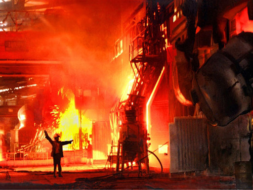

# 生之欢

** **

有人说生于这个年代的人们势必要经历更多的磨练。这个过程就像炼钢，当然，长久锻造的钢未必是块好钢，但总会用于构建起高楼大厦，承载千万吨重量。不过，自儿时记事伊始，父亲便告诉我人生注定是烧煤，他带着一身煤渣和巷口一块二毛的酒味回家，甚至不会去瞟一眼神龛前磕着响头的母亲，就扎进床里，鼾声如雷。

母亲是信佛的，她把仅有的积蓄挤出一些供养那尊粗瓷偶像，净米白面奉上。吃饭时，咽着粟米的我们要屡屡经受一旁供品的酒肉香。活到今天，我忽地记起母亲神叨的话，不敬佛的人注定是要遭报应的。我记得她还没有说完便被父亲的呼噜声打断了。父亲瘫软在床上，窗外锅炉厂的烟囱从容地冒着黑烟。

这就像妹妹死时的光景：母亲把一沓看不懂的经文烧成灰，和上水，掰开妹妹残喘着粗气的嘴，一口灌了，妹妹挣扎着踢倒了桌子，香炉砸个粉碎，呛得我和父亲连连咳嗽，母亲猛地退到一边，嘟囔着阿弥托佛，阿弥陀佛。

父亲死后母亲彻底疯了。

父亲被锅炉厂顶梁脱落的劣质钢砸成肉饼时，母亲正同她的姐妹们坐在门槛上洗衣服。皂角水被击打衣服的木棍溅得满地，母亲突然胸口一紧，险些跌在地上。姐妹们赶忙围了上来，母亲却慢慢恢复了神智，过了一会儿，大家又有说有笑了。

锅炉厂的书记是个和善的老头，他和善地告诉母亲这一切，又和善地说这是人为事故，父亲算不得烈士，也就没有那笔抚恤金。至于那晚还发生了什么，我怎么也回忆不清了。母亲第三天才从外面回来，从此生活全然由我照顾。好在那一年秋天学校纷纷停课，否则衣食无着的我再去上学，即便在这片窝棚里也是遭人笑话的。这样的念头并非出于偶然，邻家大姐的二小子总会把破布一样的衣襟使劲掖进裤腰中，再把粗麻绳系在腰上，藏进裤子里。尽管如此，在那些戴着尖尖帽子游荡的人面前，二小子依然会扭过头去，好像这年代赖以为生的贫穷从未属于过他；好像这年代赖以为生的仇恨从未由那些尖尖的帽子里抽掉；又好像……

学校复课的那一年我顶了父亲的职。看着锅炉厂水泥地上被砸出的大坑，谈不上悲伤，但心悸确是难免。三天后我清理一处坍塌的锅炉，不经意间发现了书记的尸体。这个和善的老头被反绑双手，子弹把颅骨掀飞了一半。他死了有些年头，我凭着一张褪色的工作证认出了他。他的躯体早已腐败不堪，却仍然恶臭不堪。这味道曾飘荡在我的整个少年时代：套着花花绿绿的布片，工装，军服甚至将校呢子的人们被一股脑堆在厂房不远的土堆上，往来的野狗泛滥，个个吃红了眼。

我是在奔出厂房呕吐时认识了妻的，她默默地用扫帚清理了地上的秽物，我看着她，她盯着我，我笑笑，她不说话。我们的婚礼是在离厂房不远的小面馆里举行的。我看看墙上的华主席又看看她，她低下头搓着手。我想笑笑却笑不出声，她一副欲言又止的样子，却不会说话。

我不知自己为何娶了这哑姑娘，也许是疯母没日没夜的哭笑令我心烦，渴望过上清静的日子。这个混账的观念持续了几年，便以母亲的失踪而告终。从那时起，家里彻底熄了人声。我并没有尝试寻找母亲，她或许走出了棚户区，被路人搭救，依旧疯言疯语，直至终老于敬老院温暖的床上；或没有，悄然死在某个垃圾堆里，完成了自己养儿育女，相夫教子又求神问道的一生。我甚至没能做出更好的预计，也没能施舍出几滴泪水给我至亲至爱之人。一如妹妹离世时母亲仅仅上了柱香，焚了一把薄薄的纸钱。我不禁疑问有关父亲罹难后母亲的疯病，可能也谈不上悲极所致，仅仅是出于对前半生劳苦与后半生颠沛的恐惧与无奈吧。

工友孩子满月时我看出了妻的焦虑，她边做晚饭边揉着自己的肚子，对着半挂在烟囱上的残阳皱皱眉头。果不其然，婚后多年，我终于敢于相信这二人世界注定要无限延续下去。至于是谁的问题，是妻还是我，工友半玩笑半嘲讽地问我，也是家常便饭了。至于到底是谁，我不知道，也不想知道，更不会自嘲到把可以忽略不计的存款浪费在检验这个毫无价值的事实上。

我知道自己始终是人生的旁观者，一个忠实的听众，倾听一切美妙的，欢愉的，恶心与腐臭的混合物。我抬头看看父亲昏黄的照片，幻想着他临终的情景：浸泡在腥味里的午后，疼痛尚未来得及蔓延便被彻底撕碎在锈迹斑斑的钢铁上。我一个机灵，好像父亲干枯的脸冲我狞笑，仔细一瞧，那不过是墙上陈年的红纸在阳光下努力榨出最后一点光彩：人…公…正确…伟…万寿无…打倒…打倒…狗！我揉揉眼，妻像个鬼影，蜷缩在墙角择菜，远方工友老王值日班的厂房里袅袅黑烟。

妻和老王一样，是个保守的人。在我学会像父亲那样喝酒时，老王便疏远我。这秀才读过几年书，识得字，平日里当班总要读报，没人听，自然也没人信。老王总是一派君子相，不屑于与他人为伍，却单单说我老实，尚能聊得来。老王时常请我喝酒，喝得愈多，说得愈多，往后便再无联系，不相往来。妻开始躲避我是在一天放工回去。我想学厂里放的电影中那样抱住她，不料扑了个空。我靠近她，她又避开，往复几次，她气喘吁吁，我也没了兴趣。我记起母亲是信佛的，而这或许就是母亲说的报应吧。我倒在地板上，望着旋转的天花板，父亲的鼾声又像儿时那样响起。我几近哭出声来，父亲爽朗地笑着，挽起袖管，抄起棍子，打着酒嗝，拖着一条暴露着白骨的腿。我爬进桌底下，试图寻找母亲，母亲对我微笑，跪在佛龛前咚咚咚咚一阵响头。

所幸，妻还是及时令我苏醒过来，她抱着一罐热茶，烧伤了我的舌头。天花板不再旋转，父亲重新定格在墙上，佛龛还是多年前被人冲进来砸毁的样子，收音机嗡嗡作响：“首都今晚……要认清这一政治事件的反动性……不要听信和传播谣言……”妻关了收音机，厂房的灯光熄了，日子也随之焚了。

有人说生于这个年代的人们势必要经历更多的磨练。这个过程就像炼钢，长久锻造的钢未必是块好钢，但总会用于构建起高楼大厦，承载千万吨重量。不可否认，时至今日，好钢们总可以在任何一片土地上发光，承重，考虑不像一截废铁一样一头栽下来，抑或续写一个接一个春天的故事。在我的几十个春天里，胞妹早殇，父亲罹难，母亲生死未卜，无儿无女。总之，除了放工后可以赶早去抢购粮店的三斤米，别无奢望。我看看窗外，就像我读的那一个个故事，停水停电许久后，春天到底在哪也无所谓了。

二小子说的不假，这片窝棚区不久会变成主干道的起点。二小子是这个厂区唯一出人头地的孩子，后来的他坐着崭新的黑色轿车返乡，扭扭捏捏地挤出两滴泪。一年后，他被枪决时并没有哭泣，却尿了裤子。

高大的烟囱爆破的黑烟带着数十年沉淀的灰尘淹没了城市的一隅。妻清晨从后门溜出去购买食物和水，便再也没有回来。几个黑黝黝的头盔簇拥着她上了卡车。嚎叫的喇叭与发动机的轰鸣中，我锁了门窗，仿佛从未有人记起这里，自己从未来过这里。我知道妻不会说话，这栋危楼中最后一个住户已被安全转移到了别处，可以开工了。天花板上的蜘蛛网簌簌破碎，我闭上眼，第一次聆听白日里的喧嚣。可惜四周一片寂静，空气静止在凋落的墙皮和砖块上，我的眼皮很重，恍惚中看见妻打开房门，悄悄走进屋子，着手择菜洗菜，忙于准备晚餐。

这是千禧年的第一个傍晚，雪在夕阳中花了玻璃。我轻轻抱住妻，这次她没有挣开我的手。斑驳的日光给妻的脸颊涂上新婚时的红胭脂，我亲吻她的脖子，烫得发苦。

妹妹的哭声中我睁开眼睛，她在玩耍时被一根竹签刺到了手。母亲在院子里晾晒洗好的衣服，父亲酒后倒在床上打鼾。

菩萨面前摆上枣花糕时，远方的锅炉厂房响起了鞭炮。又是一年春天。

 

（采编：何凌昊；责编：黄理罡）

 
