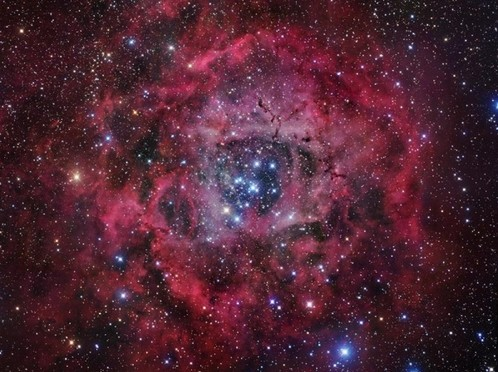
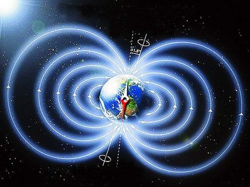
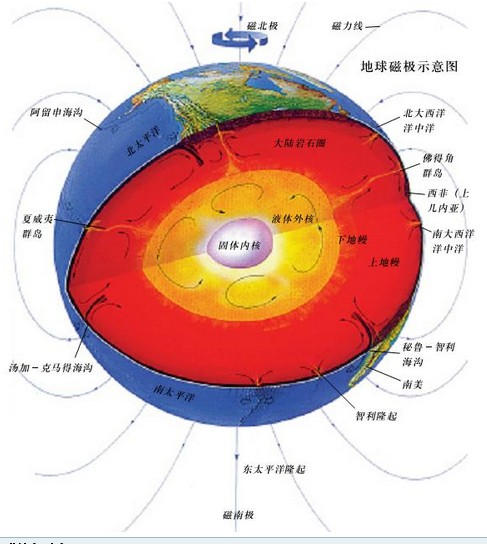

# 用科学的角度看披着科学的流言

** **

解剖材料：普林斯顿大学地球物理学家证实了玛雅人2012的推测，并不是科幻和谎言。25800年一遇的地球磁极倒转和太阳风暴将于2012年12月21日发生，太阳、黑洞、地球一线。地球遭遇太阳风暴袭击，这将造成磁极颠倒、大洪水、火山爆发及其他灾难。

今天看到的状态就是这个 ，本来打算外出吃完饭才写辟谣的。闲话少说开始肢解吧。

首先，第一句的主语是“普林斯顿大学地球物理学家”，这样比起那些一开头就是“国外最新科技研究”（或者据最新的科学研究证明）的卖药（当然也有卖观点的广告）广告好得多了。虽然说“国外”“最新”都是容易让大家信服的好词汇，不过这样死无对证地证明自己，显然动机有问题。所以一般看到这些广告词我就自动将其宣传的物品或者观念打上妖言惑众的标签。类似的词语还有“据统计”“据透露”。

举个例子吧，这个所谓的科学依据被很多脑残者传播，之所以脑残是因为这堆人从来都是先有结论再找论据，看披上了科学的外衣就进行传播：

如果自己的老婆曾经被人睡过，居然当作什么事都没发生过，这样还算是男人吗？即使是生产了，生出来的孩子肯定不是自己的，老婆的子宫已经被其他人的精子污染了。科学依据如下： 在女人和男人交媾的那些日子里，男人的亿万个精子进入了她的体内，精子进入女性体内后，除一部分流出外，其他都发生了自溶。在它们自溶时，会释放出一种遗传物质“核蛋白体”，被女性生殖器官的内腺所吸收，与此同时，精液中还含有多种性激素，这些性激素也被女性吸收。被吸收的精子和性激素中的遗传物质——脱氧核糖核酸（DNA），能使母体性细胞产生遗传变异而被同化，进而引起后次卵细胞也随之变化，因此而产生“无距离遗传”的效果，所以如果和有过性经历的女人结婚，便会出现儿子为什么像其他人的缘故，这种现象虽不普遍，却客观地存在着。

所以既然有了“普林斯顿大学地球物理学家”这么牛逼闪闪的名字，那么求证也是很容易的了。不至于陷入无链接无真相的麻烦当中（我也弄不懂为什么很多人看到信息不去找找链接出处）。因为作为科研的研究成果，肯定是要发表论文的。既然如此的话，论文就可以搜索到的。不过这状态没有提到科学家的名字是什么，不知道是不会翻译还是没想好如何取名呢。

然后说说玛雅预言，很多人相信玛雅预言是因为前几次都预言准确了。不过站在科学的角度来说，前几次准了和这一次是否准确完全不搭边。例子就是费马数：形如Fn=2^(2^n)+1 的数都是质数的猜想。后来人们就把形如2^(2^n)+1的数叫费马数。实际上费马数只有n取值为0、1、2、3、4的时候是质数，但是费马就猜测以后的都是，这样显然就印证了前几次符合不等于全部符合——如果这个例子不好懂，那我来创造一个，我预言汉语中，数字和它的笔画是一样多的。哇塞，一二三我都预测对了……

25800年一遇的地球磁极倒转和太阳风暴将于2012年12月21日发生， 25800年一遇，本来在天朝能看到诸多的五十年不遇，百年不遇就已经够兴奋了。没想到活在这个宇宙还能遇到万年不遇。估计那时候人类还没有进化到文献记载历史吧。不过，来看看这个：人类以石器为主要劳动工具的早期泛称旧石器时代。从距今260万年延续到1万多年以前，相当于地质年代的整个更新世。旧石器时代有250万年的历史，人类遇到了几次万年一遇？那时候的人类一定比现在厉害，居然遇到几百次还没有完蛋。可怜的现代人已经好多人放弃希望等待末日了。

太阳、黑洞、地球一线，突然想起一个笑话，问天上有几个太阳，天上有几个月亮，天上有几颗星星……作为学过天文学的人，我表示只知道太阳和地球指代的什么东西。那黑洞是什么？茫茫黑洞，你要哪颗？不过既然要对地球和太阳都有影响力，那么就选银河系中心那一颗黑洞吧。河外星系什么的影响太小了。然后呢，首先假设太阳、黑洞、地球连成一条直线，那么，下一次连成一条直线需要多久呢？答案：一个恒星年（不懂恒星年的人自己百度，并向高一地理老师道歉）。既然连成直线一年一次，那么说好的万年一遇呢？

接下来呢，太阳风暴爆发，太阳作为一颗大大的氢弹，无时无刻不在形成太阳风暴，不过量大量小而已。还好地球有磁场，量多的时候也不怕，另外，就算没有磁场，那些航天飞机上的宇航员们也没有挂掉（身体是有影响的）。至于是什么影响太阳风暴的量呢？当然不是看太阳的心情，目前来说，和太阳黑子的数目有关。至于其他黑洞什么的。你就想想太阳和月亮有没有引发过地球的火山爆发就明白了。

至于磁极倒转，广大生物学家表示，只要有磁极为广大的生物们阻挡太阳风即可，才不管你是不是上北下南呢。磁极倒转是因为地心液体流动。不过螃蟹可能有意见，螃蟹说，叫你倒转，害的我横着走。

至于太阳风暴能不能引起大洪水、火山爆发。目前看来还真不可能，太阳风暴之所以有害是因为它对生物体产生电离辐射的作用。火山爆发是地壳板块移动的结果，洪水是大气环流造成的。

  

（采编：周冰；责编：黄理罡）

 
