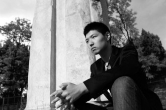

# 用青春触摸深度                    ——专访北京外国语大学校园媒体《107调查》（一）

**“所谓调查性报道，从广义上讲，是有一定探索性质的报道；在狭义上，则可能是针对社会阴暗面的报道，对方可能是社会的边缘人，也可能是强势阶层。”以校园媒体的力量和他们对抗，困难可想而知。** **而北京外国语大学的校园媒体《107调查》，正在做这样的对抗。** **翻开《107调查》早期的报纸，除了《北外女生性调查》外，关注校内问题的还有《北外女大学生吸烟状况调查》《沟通障碍与信任缺失——7号楼卫生检查解码》等；关注学校周边五行八作生存状况的有《北外周边美发从业人员调查》、《北外侧街商贩群体调查》等；再往校外延伸，还有《首批三峡移民生活状况》、《关于打口行业的不完整报道》这些关注社会特殊群体、边缘群体的调查报导。如指导老师王士宇所说，“它（《107调查》）的文章容量比较大，而不是无源之水、空发感慨。”** **“深度决定影响力”，这是《107调查》对外界打出的招牌，也是他们给自己的定位。**

**用青春触摸深度******

——专访北京外国语大学校园媒体《107调查》（一）

 2005年末，一篇名为《北外女生性调查》的报道在社会上引起轩然大波。该报道通过问卷调查、群体采访等方式，从“对北外女生性状态的整体印象”、“性知识掌握程度”以及“性态度”等多个方面对北京外国语大学（以下简称“北外”）的女生进行群体调查。北京市统计局的一位专业人士在了解报道过程后称，该报道虽然在细节设置方面存在不完善的地方,但其调查形式、问题设计、对隐私问题的处理，都能达到统计的基本要求，具有相当的可信度。报道参与者说，她们是“出于对北外女生性状况的关心, 希望知道我们自己真实的状态”。 这一调查报道出自北外英语学院国际新闻与传播系的纸媒《107调查》。诞生于2005年4月，《107调查》的报道内容以深度调查为主、评论文章为辅，内容覆盖校内外社会热点和被主流媒体淡忘的社会问题。  “所谓调查性报道，从广义上讲，是有一定探索性质的报道；在狭义上，则可能是针对社会阴暗面的报道，对方可能是社会的边缘人，也可能是强势阶层。”以校园媒体的力量和他们对抗，困难可想而知。《107调查》从校内出发，“学生、老师、行政人员、食堂大师傅、修鞋大娘、卖水果阿姨、保安……形形色色的角色构筑成一个纷繁复杂的学校群落”；同时放眼校外，聚焦象牙塔外的生活。文章内容多来自于问卷调查、田野考察，用到定量定性、图表展示等社会研究方法。 2011年12月，《107调查》建立起自己的门户网站（http://www.107investigation.com），从此拥有纸媒、网媒两个锻炼平台，二者相互配合又有所区分：网站除了刊载纸媒的调查报道外，还有“新闻视频”、“投票专区”以及“人物专访”、“本站关注”等内容。 “107是工作团队诞生的门牌号。”七年前，一队创始人在英语学院的某个会议室讨论这份特殊校媒的创立，办公室门牌号正是107。“它的特殊性目前还仅存于团队内部，但一段时间之后，它也许会成为一个为更多人所提及的号码。” 创始人之一同时担任报纸指导老师的王士宇如是说。 作为一个立足于深度调查的校园媒体，《107调查》的诞生与王士宇的推动密不可分。七九年生的王士宇现在北外英语学院国际新闻与传播系任教，本科就读于北外英语语言文学专业。在读本科时他常读《南方周末》等报刊杂志，对新闻记者这一职业心生敬意。当时王士宇担任学生校报《北外风》的主编，深感传统校园媒体在选题、报道上的局限，在中国人民大学学习新闻后回母校任教，一手促成了《107调查》的创刊。“我觉得在思想上、在承担责任的能力上，自己比以前强了，所以有了这个可能。 现任主编周昊就读北外国际新闻与传播系（以下简称“新闻系”）大二，在2013年初走马上任，对《107调查》有着自己特殊的情愫与感悟。 ** ****瓢虫君本期人物专访，带你走近王士宇、周昊与《****107****调查》的故事。******    **“****我们是眼睛****”****** **——****专访《****107****调查》现任主编周昊******  在街头的小广告上，周昊找到一位“出老千”机的卖家。周昊假扮作买家，与对方约定了见面时间和地点。 见面后，卖家带着周昊绕路走，过了很久，领他走进一个偏僻的胡同，七拐八拐进了一家四合院。 “看棋牌机的时候（我）被锁到一个小黑屋了，电话什么的都不让拿出来。再加上是假扮身份，第一次干那样的事情还真挺紧张的。”虽然这个选题未能进行下去，周昊对这次经历记忆犹新。 北外新闻系大二学生周昊是《107调查》的现任主编，入校伊始便加入107；经过一年多的历练，他于2013年1月担任主编一职。 “最初加入107是两方面原因：一方面我是学习新闻的，新闻专业最重要的就是实践。另一方面是自己有兴趣。”周昊上大学后有“了解社会”的迫切愿望。他发现在107，自己可以做很多有意义的事、接触很多不曾关注的人。  **“****没有兴趣，坚持下去挺难的****”****** 自2011年末建立起自己的门户网站，《107调查》的团队目前包括纸媒、网媒两部分。两个平台均有三十人左右，有些同学甚至两面兼顾。 周昊说，大部分同学选择加入，最关键还是兴趣使然，因为107的工作并不轻松。《107调查》每学期出两期报纸，那些行程较远、费时较多的选题，同学们会利用假期来做。而平时，问卷设计、群体采访、田野调查等基础工作都需要团队成员利用课余时间来完成。周昊说，大家不会因为107的事而逃课，但会带着电脑去教室，不想听课就偷偷赶稿子――“忙起来真的就是四脚朝天。”周昊自己喜欢在一个固定时间内一口气写完稿子，“有的时候半夜脑袋才清醒，才写的下去，于是莫名其妙就刷了个夜。” 此外，107人还要有随时待命的准备。为使报道尽可能的客观、全面，记者在采访时如有疏漏，例如采访内容不完整或表述过于模糊，就需要记者再次与采访对象沟通进行补采，有时甚至需要补采多次。这对于初次接触调查性报道的同学来说，在心理上、体力上都是不小的挑战。如周昊所说，“要是没有兴趣的话确实挺难坚持下去的。”  **“****我们是眼睛****”****** 在加入107以来，周昊已经参与过“北京助残机构申请‘民非’”、“北京征兵新政策遇冷”、“兼职黑中介”、“北外学生自主创业”等选题，或做记者，或当文编。印象最深的经历有两次：一是去远僻的画家村寻找画裸模人体像的画家，一是假扮成要开棋牌室的商家，去找专门卖“出老千”棋牌机的黑作坊。探访画家村是107一名女生的采访任务，出于安全考虑，周昊决定同去。 该画家村位于北京郊区的通州宋庄，距离北外近三小时的车程，途中要换四次地铁、倒两次公交。到了画家村，两人挨家挨户敲门，一一进门询问、沟通，表达想了解对方生活的愿望。“可能看我们挺诚恳的，画家们大多都很配合，有的还特别健谈。”周昊还总结了这次旅途所得的经验：要真诚，不要功利性地抛问题；倾听最重要；问要问到点子上。 假扮买主调查老千机黑作坊那次，终因找不到切入点且危险性太高而放弃了。这种以实地踩点来判断选题价值的方式，于107也是常事。 除了“远征”和“卧底”，做“北京慧灵助残机构申请‘民非’”选题时的经历也让周昊自觉成长不少。所谓“民非”是指民间非营利机构，经过批准的“民非”不仅可以享受税收方面的优惠政策，还可获得相关部门发放的资金补助，以此减轻运营成本的压力。慧灵助残机构是全国首家智障人士社区化服务机构，其正常运营还有赖于国内外社会各界的捐助。从2010年至今，北京慧灵累计进行了69次民非注册公关，每一次均以失败而告终。 “我一共去过三次，每次都会和那里的朋友待很久。”虽然那次选题的角度是慧灵申请“民非”的艰难之路，但周昊在那儿看到了更多。“我第一次接触到智障人士，发现了他们的美，也试着去了解他们的生活。”周昊后来前往“大福之家”（慧灵创办的智障慈善机构），与那里的学员一起聊天、编手链、教他们英语，彻底让自己融入他们的生活。 采访过程中与残障人群、志愿者的接触让周昊对那些残障学员产生了的情感牵挂，“我更深地认识到生命之美，生活之美。”但这份牵挂也让他在回归选题时，不经意添加了自己的情感，影响了报道的客观性。他开始一再修改报道文章。“因为只有尽量客观地展现现状才能最好地帮助需要帮助的人。” 这次选题中，《107调查》视频组为北京慧灵义务拍摄并制作了公益宣传短片，该短片在慧灵创办的“大福之家”的发布会上正式播出。 除了最实际的新闻采写能力、团队合作能力以及在采访过程中的人际交往能力之外，周昊说自己最大的收获是“坚持”和“相信”。 周昊觉得，107是一个平台，一个渠道，很多时候自己借此接触到社会，接触到不同的人，听到他们的故事、他们的笑和泪：因为看见所以坚持，因为坚持所以相信。 “我本身愿意去听故事，所以我坚持下去想听更多人的故事；往大了说，我愿意去关注那些之前从未关注、或者没被周围的人关注的群体，去还原他们的真实生活和心态，然后把他们的声音展示给更多的人，这是责任也是我坚持下去的原因。” 至于“相信”，周昊说，无论你报道什么，都会接触到一个群体的无奈，甚至发现自己的无力，虽然有人说过新闻改变不了什么，但他相信新闻的价值不在于此。“我们是眼睛，我们的作用是让更多的人看到，什么值得被改变。关注的力量汇集起来，就足以改变很多。” 

 **让无声者有声，让有声者多元****** 作为主编，周昊对报纸和网站的未来也有自己的规划。他觉得首先要在调查性报道主打的基础上开拓更多内容。 周昊认为，专注于做调查性报道有它的益处：对同学来说，能极大提高采编能力，加深对新闻专业主义的理解；对报纸来说，专注深度调查是其他高校媒体所没有的特色和优势。在一次与其他校媒的交流中，《107调查》得到好评，“他们都觉得107专注于调查报道非常有特色，而且角度独到犀利，很值得他们学习。” 不过，专注也会带来缺憾。专注于调查性报道一方面带来的是选题上的限制、“空间”上的压力，一方面也会使文章样式单一化，同学们可能失掉用其他形式学习新闻学写作的机会。周昊希望，在下一阶段，107从采编到宣传都会有一定的调整和改革。 在内容方面，周昊想让107在专注于调查性报道的前提下拓版，加入评论等元素使形式更加多元；其次在发行方面，会更多利用网络平台进行宣传，发布电子刊物，并采取“订阅制”以扩大受众，使报纸“积极送出到其他高校以及社会人士手中”。 2013年初，“南周事件”舆论哗然之际，《107调查》经过成员讨论、征询读者意见，最终明确“保持中立、提供平台”的立场――报纸本身不作单一表态，而是作为发声平台，让同学们表达不同的观点和看法。“让无声者有声，让有声者多元”，周昊说，这既是《107调查》自始至终的坚守，也是它的价值所在。（未完待续） 记者：李东瑶 （《107调查》记者刘一方亦对此文有所贡献） 责编：郑萃颖 **[下文预告]：[“在钢丝上走路”](/?p=29761)****[——专访《107调查》指导老师王士宇](/?p=29761)**
