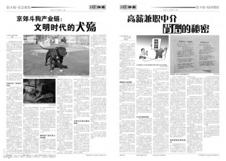
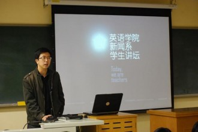

# 用青春触摸深度——专访北京外国语大学校园媒体《107调查》（二）

_“所谓调查性报道，从广义上讲，是有一定探索性质的报道；在狭义上，则可能是针对社会阴暗面的报道，对方可能是社会的边缘人，也可能是强势阶层。”以校园媒体的力量和他们对抗，困难可想而知。_ **而北京外国语大学的校园媒体《107调查》，正在做这样的对抗。** _翻开《107调查》早期的报纸，除了《北外女生性调查》外，关注校内问题的还有《北外女大学生吸烟状况调查》《沟通障碍与信任缺失——7号楼卫生检查解码》等；关注学校周边五行八作生存状况的有《北外周边美发从业人员调查》、《北外侧街商贩群体调查》等；再往校外延伸，还有《首批三峡移民生活状况》、《关于打口行业的不完整报道》这些关注社会特殊群体、边缘群体的调查报导。如指导老师王士宇所说，“它（《107调查》）的文章容量比较大，而不是无源之水、空发感慨。”_ **“深度决定影响力”，这是《107调查》对外界打出的招牌，也是他们给自己的定位。** _**瓢虫君本期人物专访，带你走近王士宇、周昊与《****107****调查》的故事。**_ _****_

**用青春触摸深度******

——专访北京外国语大学校园媒体《107调查》（二）

**“****在钢丝上走路****”****** **——****专访《****107****调查》指导老师王士宇******  2008年，《107调查》刊载了一篇关于“北外杯”足球赛假球事件的调查报道。事件双方为北京外国语大学国际商学院足球队和学校教工队，二者涉嫌踢假球以挤掉日本留学生队，从而保证双方共同出线。107采访了各队球员、裁判、观众，以及体育教研组、校学生会体育部等，用真实数据和谈话记录还原整个事件。 其时王士宇身在国外，未及参与此次调查报道；等回国时，学生们已完成了组稿和版面设计，只等征询老师的发稿意见。“其实我内心里很矛盾。看到这个事情我感到触目惊心……想想象牙塔里再没有一点纯净的东西那就真的很可悲了。”但他深知，这篇报道一旦公诸于众会在校内卷起多大的舆论风潮。再者他本人也是教工队的一员，报道中涉及到身边不少熟人与好友。 虽然有诸多担心，但看完同学们的成果后，王士宇很满意，对学生说：“既然你们已经写完了，而且写得很好，敏感部分用的直接引语，所有人、所有地方都录音了，打到官司都不怕，那你们就大胆地发吧。”  这次报道是107有史以来遇到争议最大的一次。虽然事件本身未能得到令人满意的解决，但王士宇觉得这次报道做得“相当漂亮”，至少它“促进了校园微环境的透明化”。 作为指导老师，王士宇自《107调查》成立之日起就积极参与其报道过程并给与指导。选题是否有价值、有操作性，新闻线索、信息源是否客观公正，报道文章是否客观全面，做报道的学生是否安全……王士宇从各方面关注《107调查》发展，而绝非一个挂名的“指导老师”。“当我看到一篇文章，对《华尔街日报》写法的运用得当，信息使用客观、公正，看到这样的变化的时候，我会非常非常高兴。” 这个疯起来和同学们一起踢足球、严肃起来对一字一句都死抠不放的王士宇，被同学们称呼为“士宇哥”。  **“****在钢丝上走路****”****** “我一直觉得做调查性报道最能锻炼一个新闻人的专业素养、职业精神和采访突破能力。”王士宇相信，对一个年轻记者来讲，调查性报道的实践价值和锻炼意义是最大的。“它能让你体会到什么是新闻，如何去发掘事件背后的一些真相；也是最刺激的，最有趣的。” 出于对调查性报道的志趣和信心，王士宇积极促成《107调查》的诞生。他相信，尽管学生在这样年龄阶段、这样的知识储备、这样的舆论环境社会环境下，所能驾驭的调查性报道并不多，且有一定的局限，但学生从中得到的锻炼，能使他们充分发挥自己的潜能。 107曾做过一个民宅失火事件的调查报道。当时小记者选择的采访对象是火灾中幸存的一位六旬老人。尽管采访中遭遇警察的盘问、制止，107的同学并未放弃，最终完成了一个独家专访。王士宇为学生们的勇气和冲劲感到高兴，他说；“学生有时候获得的采访条件、突破采访困境的感觉，是一些社会媒体未必能做到的。” 让校园媒体做调查性报道无疑是一种冒险的尝试，但王士宇选择坚持：“我们了解报道的风险成本。应该说我们就像在钢丝上走路，有危险，有风险。但是这一路上走来，风景很漂亮。当你能够安全地着陆的时候，你会有一种成就感。”  **“****我们不是举着大棒子****”****** 除却上文提及校内足球赛“假球”事件的报道，类似针对校园问题、关乎校园热点的选题，《107调查》还做过许多。如《我的安全谁做主》一文，针对北外学生在校内屡遭陌生人骚扰的问题，107成员采访了有过此类经历的同学、校园监控中心、学校保卫处副处长等，用事实一一摆出校园安全现存的隐患；《谁为停电买单》一文，调查同学们在未接到通知的情况下遭遇突然停电而遇到的麻烦、危险及损失。《107调查》并未止步于此，兼职黑中介、留京指标背后的灰色运作、助残机构的生存等等社会问题也在调查范围之内。 尽管107凭借其严谨客观的调查态度在校内外获得了良好口碑，但由于所选话题的敏感性，一些被报道的组织机构对报纸并不持肯定态度。“也许他们（指学校官方）是出于好的意愿，或者说这一问题他们早就意识到了只是没来得及解决；但在他们没解决之前，《107调查》把问题拿出来说了，make it public，那么他们会感觉被挑衅被冒犯。” 王士宇认为，这其实也是种锻炼。 “面对这种外界的压力，我跟学生讲，你要锻炼自己的采访突破能力。你的气场，你的人格魅力，会给人一种压迫感。如果他死活不接受你的采访，那么你是否要把他拒绝你的这样一个细节，用客观的文字去描述，放进你的文章里。或者冷静思考，还是什么其他的方法去获取你想要的信息。”王士宇说，做记者要有一个掘取的意识，不放过任何一个可能性。 “另一方面，我也会提醒学生，从采写到最后成文，要注意客观公正，不要一棒子打死。我们不是举着个大棒子。”王士宇说，《１０７调查》不是举着“真相”的大旗到处去找茬、去批判，而是为了事情能得到更好的解决。“那些报道涉及的老师，即使内心很不爽，但只要文字客观真实，他们慢慢会体会到我们的用心，平和下来。” 帮助学生树立新闻理想、锻炼新闻业务能力，促进校园微环境和社会大环境的透明化，这是王士宇所认为的校园媒体职责所在。  **“****很多东西首先要延续、生存，然后才能图发展****”** 有“校媒中的《南方周末》”之称的《１０７调查》，对近期的“南周事件”自然十分关切。但王士宇说，对任何社会争议性的话题，个体或报纸都会产生自己的判断，但在发言之前，首先要有一个清醒的认识。 “这个事情到底来龙去脉到底是怎么样的，这是一个基本。在此基础上你可以选择个人的方式进行表达。如果以报纸的身份站出来，不管是发表声明呀还是别的什么，应该确保首先在团队内部形成一个统一意见，然后再做这样一个事情。”他觉得107成员经过讨论做出的“做一个发声平台、而不发表单一立场”的决定，也是可取的，“而且就此事来说很合理”。 “现在的大环境下很多话题是很敏感的，很多行为也是敏感的，首先要知道自己的focus，学会保护自己。很多东西首先要延续、生存，然后才能图发展。”王士宇说，媒体不应轻易去树立一个对立面。不要轻易地定论某一个人或某一件事谁是绝对的错，谁是绝对的对。“有些事情要看得远一点，看得深一点。当然在这样一个年龄，大学生群体喜欢用一种相对激进的方式来表达也是很正常的。”王士宇觉得，正因如此，不管是校方还是自上而下的外界，对大学生的言行应该有一种宽容、保护的态度。 对于报纸本身的期待，王士宇说：“首先期待（它）能存活，不要因为某一个事件或者某一个调查，因为大环境的变化，让这个报纸就这么完蛋了。第二就是希望能活得好点，有自己一定的话语权，能够为学生获得更多的采访机会、实践机会。”  “深度决定影响力。”这是《107调查》对外界打出的招牌，也是对自己的定位。  记者：李东瑶 （《107调查》记者刘一方亦对此文有所贡献） 责编：郑萃颖  **［相关链接］：《用青春触摸深度（一）——专访北京外国语大学校园媒体〈107调查〉》** ** －－－－ [“](/?p=29737)**[**我们是眼睛****”****——****专访《****107****调查》现任主编周昊**](/?p=29737) 
