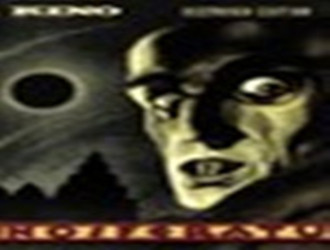
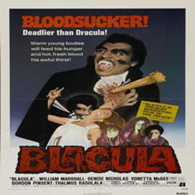

# 由吸血到戏谑 ————接受美学眼中的吸血鬼电影发展史

一、从嗜血幽灵到嗜血破晓

吸血鬼电影作为由布拉姆·斯托克一部小说《德库拉——嗜血幽灵》延伸出来的电影类型，其发展史可以说是丰富多彩，同时又常常与吸血鬼形象的创作初衷大相径庭。在斯托克的作品中，他在吸血鬼和其宿敌——英国的中产阶级和殖民主义者之间设置了一个惊人的照应：吸血鬼即是英国殖民者黑暗的化身。两者都对“血”有近乎病态的着迷：英国殖民者和爱尔兰殖民者的血统差别、地位、阶级的差别正反应了英国殖民者对“血脉”的着迷与固守。因此，书中描述的德库拉之死实际上意味着英国殖民者必须要放弃对“血脉”的执着与着迷，这种痴迷应该随着书中嗜血幽灵的死亡而根除于英国殖民者的心中，这种“血液”同时也不再统治殖民者们的认识。

因此，本书粗看下来像是一部糅杂着奇幻色彩的人鬼斗争故事，但实质上是代表民族和阶级的一次呐喊。本书在以德库拉的消亡预言英格兰人错误价值观的必定消亡。因此，吸血鬼文化——包括在文学和电影上的——之所以能在今后的一百余年风靡全世界，很大一部分是因为它有一个坚实而有深意的奠基，而彼时适逢英国殖民者和爱尔兰殖民者的阶级斗争如日中天，所以可以说这个奠基恰恰讲述了一个当时社会迫切需要的故事，这就是为什么打从一开始吸血鬼文化会风靡的根本原因。

当法国和西德以充满了对女性占有欲的《诺斯费拉图》来刻画吸血鬼之“丑”的同时，极度看重观众反响的好莱坞市场已经做好准备来发觉其“美”的一面，因为毕竟，面对寓意深刻但造型丑陋的吸血鬼，和故事相对浅显但人物设定高贵美丽的吸血鬼时，大多数观众还是会选择后者。这就是为什么四年后托德·布朗宁拍摄的一部《德库拉》会口碑和票房双收了，因为在大多数观众看来，吸血鬼除了其恐怖的一面以外，还具有其独特的魅力，而尽量放大这种魅力就变成了当时好莱坞用来吸引观众的有效手段，贝拉·卢高西在影片中塑造的吸血伯爵形象，无论仪态还是举止都完全摆脱了欧洛克猥琐的“血奴”形象，开始向高贵，体面靠拢，这显然极大地满足了当时好莱坞观众对华丽和美的追求。然而观众的追求肯定不止于此，既然吸血鬼形成了一种文化，那么观众们也相应形成了吸血鬼迷这样一种群体。1972年一部喜剧片《吸血黑王子》横空出世，影片将吸血鬼形象塑造成了黑人，这确实是一个不小的玩笑，整部片子的质量虽然不敢恭维，但无数无厘头的情节告诉我们，至少吸血鬼在银幕上的职责不只是吸血了，还可以是戏谑。

之后，自然地，吸血鬼电影也依据观众各方面的需求诞生了各种新生的分支，极力突出人鬼大战的分支产生了《刀锋战士》和《黑夜传说》为代表的动作片，这类电影的隐含读者自然就是那些热爱动作场面的吸血鬼迷。人鬼情未了的分支，优则产生了《生人勿近》，差则产出了《暮光之城》，将观众对吸血鬼的爱直白地描述成了男女之间的爱情，满足了无数青少年痴男怨女的意淫。也有试图保证吸血鬼电影原本的恐怖气氛，但总给人感觉缺少内核的《三十极夜》等美式流水线恐怖片。至于近期最受好评的吸血鬼科幻电影《嗜血破晓》中圈养人类以供养血液的吸血鬼虽然以充满合理的创意满足了新时代的科幻迷和吸血鬼迷，但已经基本是进化到有名无实了。吸血鬼电影在面对观众之前是属于第一文本，即是说承载了其原本的意思，但在面对了观众几十年后，整个文化要承载的就不只是它原来要承载的意义了，通常还加上了一层观众对它的期待，即是说，过去的吸血鬼的形象和观众的个人、集体期待视野联合对吸血鬼电影的发展进行了二次创造，变成了第二文本。

二、从贝拉·卢高西到罗伯特·帕丁森

观众的观影期望被满足之后，诞生的只会有更多更新的期望。吸血鬼已经从最初恶与丑的寄托慢慢变为华与美的象征。吸血鬼在诞生时的第一文本经过无数代观众的解读，产生了数不胜数的第二文本，以至于就连饰演吸血鬼的演员都要开始适应观众不断变化的需求。

老牌好莱坞明星贝拉·卢高西就是以一个为吸血鬼形象洗白的德库拉伯爵树立了自己从影以来最令人印象深刻的角色。在《惊情四百年》中由老绅士加里·奥德曼饰演的德库拉伯爵又更加深化了这一点，而且还给德库拉伯爵赋予了一个令人怜悯的身世，并将其塑造成一个痴情的汉子，相信看完这部电影之后，没有人会特别觉得反派角色特别可恶，但每个人都会特别记住他。另一部具有分水岭意义的影片就是汤姆·克鲁斯和布拉德·彼特的《夜访吸血鬼》，这部片子本身已经不如它的演员叫的响亮了，似乎大家介绍这部影片时，更加在意的是主角而不是其的剧情，这也就反映了观众对演员的个人崇拜也已经成为衡量一部电影——吸血鬼电影——的标准。人们喜欢贝拉·卢高西在《德库拉》中的表演是因为他定义了吸血鬼的一种新形象；人们喜欢加里·奥德曼在《惊情四百年》里的表演是因为他表现了吸血鬼情感上新的一面；人们喜欢比尔·奈伊在《黑夜传说》里的表演是因为他在新型的吸血鬼动作片里表现了一个给影片增色不少的反派；人们喜欢《暮光之城》里的罗伯特·帕丁森则是因为他表现了其他吸血鬼电影一直没有——或不屑表现的一面：单纯的外表美丽和不加掩饰的善良。这些演员虽然演技造诣各不相同，但都有一个共同点——他们呈现给了观众一些关于吸血鬼的新鲜事，这些新鲜事是观众想看的，他们满足了观众的偏见视界，满足了观众对高质量演技和新型人物的先入之见，而后，他们成功了。

所以可以总结，观众对吸血鬼的需求永远是新的，观众在吸血鬼电影上的期待视野永远只聚焦于他们以前没有见过的方面，不管这个方面是旧瓶装新酒还是完全革新。观众的读者中心论不仅呈现于剧情方面，在对演员的喜好方面也同样适用。因此，吸血鬼电影的发展就是一次电影主创和观众无限次对话的过程，吸血鬼电影的创造严格来说也不完全是导演的工作，观众从某种程度上来讲也是吸血鬼电影的中心，因为观众的意见永远可以修正大部分电影的发展方向，吸血鬼电影也不例外。

（采编：王卜玄；责编：王卜玄）
