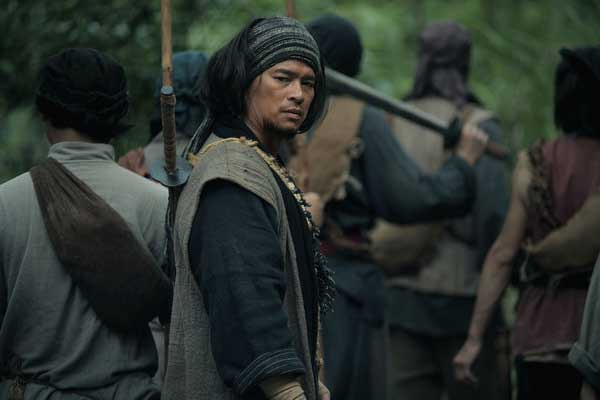
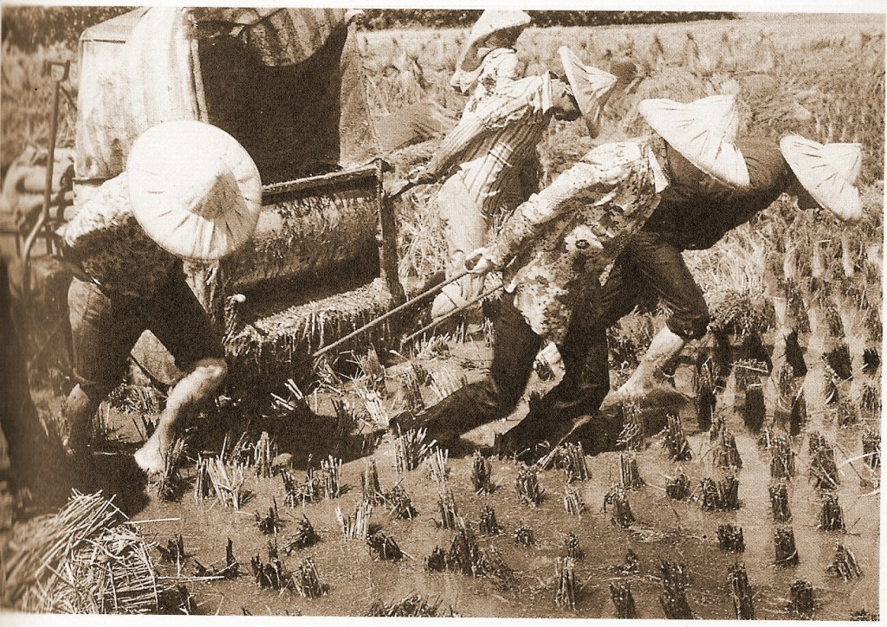
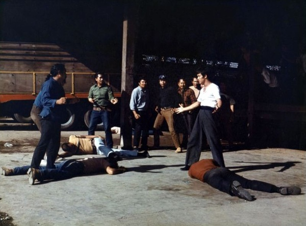

# 电影里的台湾之一：《一八九五》---孤儿的第一滴眼泪

**台湾的政权近400年里就被交易了N次。我无从证实，这样的历史到底对台湾社会目前存在的身份认同的混乱有多大的影响，但是有一点可以值得说明的是，倘若我等对台湾人强烈的“自主意识”感到不舒服的话，我们不妨多想想这段历史。这种感觉，是我们这些从来过没有过“认同危机”的人绝对无从感触到的。**  

# 《一八九五》——孤儿的第一滴眼泪

## 文/ 马军（国立台北大学）

 

总想给朋友们讲讲台湾的故事，然而却始终没有下笔。一方面是感于自己的无知，怕讲一些肤浅的东西出来，贻笑大方；另一方面也是始终找不到适合落笔的角度，于是只得在平日里零零散散的写一些时评和感想，虽也能满足自己的一些表达欲和虚荣心，却始终感觉不太过瘾。

在台湾各地游荡，有的时候总是觉得有似曾相识的感觉，有些地名，有些画面曾经在以前看过的电影里出现过。于是便有了通过电影寻找和记录台湾故事的想法，对于台湾，我是个外人，对于电影，我更是资深的门外汉。由此而写下的东西，定然不会深到哪里去，只希望能够通过自己的文字记录下自己眼里的台湾，也算是给自己在台湾这两年的求学生活，留下一些以后可以回忆的东西。

我挑的第一部电影叫做《一八九五》，知道一点历史的人一看这部电影的名字便知，这部电影讲的肯定和马关条约、台湾割让有关。《一八九五》又名《一八九五 乙未》，英文片名译为《1895 in FORMOSA》。这部片子拍摄于2008年，上映于当年的11月7日，是2009年台湾国片的票房冠军。导演洪智育，主演温升豪、杨谨华等，都不算是台湾最有名的导演和演员。但这部片子是台湾第一部以客家话为主要语言的电影，剧本改编自著名作家李乔的文学小说《情归大地》。当年这部片子跟《海角七号》、《不能没有你》等片子一起，在台湾掀起过一阵国片风暴。当然，《海角七号》和《不能没有你》都是了解台湾历史和社会非常重要的电影，在后面的篇幅中，我也会提到这两部电影。

这部片子大陆并没有引进，当初上映的时候，我还在读大学，只是看到一些关于这个片子的新闻，也没去尝试着下载，现在去买DVD，老板也说已经绝版了，买不到了。还好，网络上还有这部片子的完整视频，所以这部片子我看的是从视频网站上下载的MP4版本。在台湾读书的时候，找不到的电子书和影音资料，大家都习惯去大陆的网站上下，不知道这事儿，值得庆幸，还是哀叹。

片子引用真人真事，讲的是1895年日本派北白川宫能久亲王率领近卫师团，按照《马关条约》来接管台湾的时候，台北百姓奋起抵抗的故事：1894年，中日“甲午战争”爆发，清廷战败，签订《马关条约》，将台湾和澎湖割让给日本。1895年5月，士人丘逢甲等人成立“台湾民主国”，推举唐景崧为总统，年号永清。5月29日，由北白川宫能久亲王率领的近卫军团登陆澳底，准备接收台湾。苗栗客家仕绅吴汤兴奉台湾民主国之命令为义军统领，开始召集地方乡勇组织义民军，准备抵抗“东洋番”占领台湾。日军占领台北后，开始沿山线（台湾西部）向南进攻。由吴汤兴所率领的客家义民军，由于熟悉山地地形，并且采取游击战术，在桃竹苗等地抗日屡屡告捷。日本军队意识到台湾人民的倔强，开始宣告这并非接收，而是战争，并开始实行“无差别扫荡”。义民军由于粮食与伤亡的问题退守苗栗，同时日军也因水土不服，感染霍乱而死亡的人数远比阵亡的多。亲王为了能将战争尽快结束，将义军引诱到南进的关键地八卦山一决胜负。最后吴汤兴及其部下战死殉国，台湾最终被日本占领。

 **福尔摩沙的故事：亚细亚的孤儿** 

我们从小就被教育过一句话：宝岛台湾是我国自古以来神圣不可分割的一部分。当然这句话是一种“维护祖国主权统一”的宣誓。在台湾，罗大佑有一首歌，叫做《亚细亚的孤儿》，旋律非常的简单，歌儿也非常的有名，想必很多人都听过，也都会唱。亚细亚的孤儿，说的就是台湾。为什么“神圣不可分割的部分”在一些人的眼里是亚细亚的孤儿？我想，我们还得从一些历史说起。

台湾位于亚洲东部、太平洋西北侧、吕宋岛北部，面积约3.6万平方公里，长得像一枚长条形的番薯。台湾湿润多雨，气候温暖，是个美丽的岛。十六世纪的时候，航海的葡萄牙人在接近台湾的时候，曾经由衷的发出过感叹：“ILHA FORMOSA（啊，美丽的岛）”。自此，台湾就有了福尔摩沙的称呼，也有了美丽岛的别称。后来与台湾民主化进程密切相关的《美丽岛》杂志的刊名，就来源于此。这部电影的英译名，没有用Taiwan，用的也是Formasa这个词。

三国时期，吴主孙权曾派将军卫温和诸葛直率领1万水军渡海到达台湾。隋朝的时候，据说隋炀帝曾3次派人到台湾，当时的记载叫做“访察异俗”，“慰抚”当地居民。唐宋时期，大陆沿海人民，特别是泉州人和漳州人，为了躲避战乱兵祸，纷纷流入澎湖或迁至台湾，安家落户。而真正汉人大量涌入台湾，应该是大概四百年前，明清的事情了。李登辉曾经在助选的时候说：“台湾这块土地，有400年前来的，有40年前来的。我是400年前来的，他（指的是宋楚瑜）是40年前来的，我们都是台湾人啊。”

相比台湾本岛，澎湖比较早受到中国的关注，1335年，元朝的时候曾经在澎湖设立澎湖巡检司，管辖澎湖和台湾两地的民政。当时这个巡检司归福建泉州的同安县管辖，这是中国第一次在台湾设置政权机构。只是这个机构没活很长，1372年被撤。中国再次在此设立机构，应该就到了将近两个世纪后的1563年了。明嘉靖年间，中国再次在澎湖设置巡检司，但和元朝一样，没过多久最终还是放弃了。

明朝放弃了澎湖之后，荷兰的东印度公司发现了这个地方的重要性，尤其是对日贸易的过程中，澎湖的地理位置显得尤为重要，于是1622年，荷兰舰队就占据了澎湖。当时为了澎湖的所有权，明朝政府和荷兰还发生了战争，结果明朝战胜，俘虏的荷兰主将。荷兰舰队从澎湖逃往台湾本岛，并占据了大员地区（今天的台南安平）。如今台南著名的旅游景点安平古堡，就是在那个时间由荷兰人修建而成的。

当荷兰离开澎湖占据台湾之后，在地理位置更好的台湾大兴土木，又手握从明朝获得的贸易特权，引起了西班牙的侧目，认为荷兰人在台湾的扎根，影响到了他们在东亚的利益。于是，当时已经占据了菲律宾的西班牙从吕宋岛出发，攻下了基隆，从台湾北部登陆，占据了基隆和淡水一带。并且在淡水当地修建了一座圣多明哥城。于是当时的台湾北部和南部各有一块分属于西班牙和荷兰的殖民地。然而西班牙人的好景不长，1642年西班牙人就被北上的荷兰人击败，从台湾撤军。

1642年荷兰人击溃了西班牙人之后，重修了当时因为撤军而被西班牙人自己损毁的圣多明哥城，命名为安东尼堡。由于当时汉人称呼荷兰人为红毛，所以这座城又被称为“红毛城”。这就是现在淡水红毛城的来历，这座城见证了当时西荷两国争夺台湾的历史。

然而荷兰人的好运也没有多长久，在台湾的统治也并不顺利，台湾内部军民也对荷兰人的盘剥进行着抵抗。当时著名海盗郑芝龙的部下郭怀一就曾经在1652年领导过最大的反荷起义，6000人战死。而当时郑芝龙的儿子郑成功也以福建厦门为基地抵抗清军，时刻准备反清复明。1661年，郑成功留下部分兵力守卫厦门、金门，亲自率领2.5万名将士及数百艘战船，从金门料罗湾出发，经澎湖，向台湾进军。农历四月二十九日，郑军在台南鹿耳门内禾寮港登陆，与荷军展开多次激战，最后将荷兰殖民总督和残敌围困在热兰遮城内。在围城9个月之后，荷兰殖民总督于1662年（清康熙元年）农历二月一日不得不签字投降。此时台湾的统治者又变成了中国人，然而与当时的大陆不同，两岸虽同属中国人统治，但却处在不同的政府统治之下。

不知道是不是当时的台湾气候不适合外地人居住，电影里近卫军团长能久亲王占领台湾当年便身染霍乱身亡，三百年前的郑成功也一样，占领台湾几个月之后，便染病身故。其子郑经即位，郑经之后是郑克塽即位。1683年，清政府派施琅进攻台湾，郑克塽率众归顺。自此台湾归属清政府的直接统治之下。

然而当时清朝远程进攻台湾，消灭明郑王朝之后，对台湾依旧采取的是隔离政策，颁布“台湾编查流寓令”，限制两岸渡航往来，虽然当时有不少移民往来两岸（当然，绝大部分是从大陆到台湾），但多属于偷渡性质。

当时的台湾归属于福建省管辖，台湾内部设台湾府于台南。由于当时的清政府对治理台湾并不重视，派去的官员素质非常低劣，再加上言语不通，导致当时的台湾内部矛盾重重，大小叛乱时有发生。直到1874年日本出兵台湾，1884年法军侵占台湾开始，清朝才开始关注台湾的重要性，并终于1885年单独设置台湾省（全称福建台湾省），派遣治吏刘铭传为第一任巡抚。刘铭传在台湾发展军务推动建设，直至1891年告老还乡，这也是清朝治理台湾二百多年里最积极的一段时期。台北有铭传国小和铭传大学，基隆有铭传国中和刘铭传路，都是后来为纪念刘铭传而命名的。

然而随着日本的兴起以及清朝的持续衰落，中日甲午海战爆发之后，台湾于1895年被割让给日本，这就回到了本片的历史状态下。

当我们总结这段历史，可以做出下列的统计。如果我们把1624年荷兰占据台湾本岛开始算起至1945年台湾光复为止，这期间，荷兰曾占据台湾38年，西班牙占据台湾16年（与荷兰有重叠），明郑王朝23年，清王朝212年（仅不到十年的积极治理），日本50年。台湾的政权近400年里就被交易了N次。我无从证实，这样的历史到底对台湾社会目前存在的身份认同的混乱有多大的影响，但是有一点可以值得说明的是，倘若我等对台湾人强烈的“自主意识”感到不舒服的话，我们不妨多想想这段历史。这种感觉，是我们这些从来过没有过“认同危机”的人绝对无从感触到的。

 **客家：不是民族的民族** 

在台湾，每一次总统大选辩论的开始，候选人都要用四种语言跟大家问好，分别是国语（普通话），闽南话，客家话以及原住民的语言。台北的捷运里，每次到站也都是用四种语言报站，只是去掉了原住民语言，增加了英语。一般认为，台湾人口由四个族群构成：本省人、外省人、客家人以及原住民。陈升有一首著名的《欢聚歌》，歌词有这么两句：“不管你是福佬外省原住民客家人，希望天公保佑这土地的老百姓世代都平安；不管伊是芋仔蕃薯在地还是客人，今晚咱要跳舞念歌不分你和我”其中第一句话里的福佬指的就是本省人，第二句话里的番薯指的是本省人，芋仔指的是外省人，在地指的是原住民。而客人，指的就是客家人。

在台湾，由于“二二八”事件的影响和政治上的操弄，导致有一度本省人和外省人对抗非常的激烈（“二二八”和族群撕裂的部分，我会写《悲情城市》这部电影的时候具体提到），顺带着也把客家和原住民加入到了讨论中，造成了一段时间台湾社会的族群撕裂。台湾著名的相声剧社团“相声瓦舍”曾经在其作品《恶邻依依》中影射到“到底是谁，把好好的一国国民活生生地分成了四种”。从而也就造成了一种政治文化现象：强调族群自主和主张族群融合都是政治正确的观念，每个候选人每次选举都会不同程度地强调这一点。而台湾的金曲奖，每年也都会根据这个政治正确的观点，分别颁发国语、台语、客家和原住民的相关歌手和歌曲的奖项。值得一提的是，第十八届金曲奖上，当客家歌手林生祥被宣布获奖之后，他质问为何音乐的奖项要以族群的语言来分类而不以音乐类型来分类，认为这种表面上似乎是“保护”各种语言文化的创作的出发点，实际上却相对巩固了继续边缘化弱势语言族群的意识，于是拒绝领奖。这是我对客家人认知的开始，也让我对客家人非常地钦佩。

客家不是一个民族，而是汉族的一个分支，可以说是一个族群，也可以说是一个民系。客家是在汉族中是一个具有明显特征的一支族群，也是汉族在世界上分布范围广阔、影响深远的民系之一，以至于有一些民族学者和部份客家意识强烈的人，认为客家人应是单一民族。客家族群的形成，主要原因是中原汉族历史上的屡次南迁所致，而比较重大的迁徙主要分成六次：秦始皇统一全国时期、东晋永嘉年间、唐朝僖宗乾符二年、南宋末年、明末清初以及郑成功攻取台湾后。

由于客家族群主要是由于躲避战乱南迁而形成，所以客家人非常团结，也非常的勤劳朴实，渴求安宁。以福建为例，客家人聚居的地方地名都代表着对安定生活的向往，比如永定，永泰等。还记得网上那些被认为是导弹发射井的客家土楼么？客家人的土楼也能代表客家人团结合作，渴求安宁的文化特质。大陆的客家人主要聚居在闽粤赣地区，故有浓厚的山区文化，客家人也被称为“丘陵上的民族”。 由于客家人曾经在一段时期内都在族群内部通婚，现在也有种说法，说客家人是血统最纯正的一批汉人。目前大陆共有客家人约6000多万。

每年的正月二十日即“天穿日”，是台湾的“全国客家日”，设置这个节日的原因是因为客家人传统上在这一天感念女娲补天的恩情。台湾目前有客家人400多万，会说客家话的有200多万，客家人广泛分布在全台湾各地，本片中所讲的新竹、苗栗、桃园一带，是客家人在台湾分布较多的一带。

台湾的客家人大多数都是清朝迁徙至台湾的，比本省人（福佬）要晚。康熙年间的时候，客家人活动区域主要以屏东地区为中心。雍正年前，客家人的屯垦中心就逐渐迁移到了彰化、台中一带，到了乾隆年前，客家人的活动范围就北移到了台北、桃园、新竹、苗栗一带。这一带，是《一八九五》这部片子所讲的故事主要发生的所在。

基本上台湾的客家人主要来自广东及福建，所以光是台湾的客家方言就有四种，口音及用词都有相当大的差异，由于台湾内部族群融合的关系，台湾的客家话和大陆的客家话差距已经很明显了。

由于客家人口有四百多万，所以在历次的选举中，客家的聚居地都成为了候选人必争之地。2012年的大选，身为屏东客家人的蔡英文就打出了客家妹的形象牌吸收选票。选举期间，本人曾经在花莲客家聚居的地区看到蔡英文的文宣，全都是以身着客家传统服饰的形象出现。而祖籍湖南，出生在香港的马英九，也声称自己是客家人，并且每年年初都在苗栗的马家庄祭祖，强化自己的客家人身份。至于宋楚瑜，在选前桃园拜票的时候也声称自己是客家人，并且还拿出家谱来证明。这一方面体现了台湾拉关系套交情的选举文化，一方面也能从侧面印证出客家人团结互助的文化。而从历次的选举情况来看，客家人的政党认同比较偏向于国民党，国家认同比较偏向于中国认同。

政府方面，台湾政府有一个“客委会”，即客家委员会，每年会做很多事情保护和宣传客家的文化，《一八九五》这部片子就是“客委会”投资并监制的影片。

 **台湾民主国：唐山靠不住** 

大家应该都知道李小龙的一部电影，叫做《唐山大兄》。小时候我第一次听说这部电影的时候，还以为这是一部反映唐山大地震的片子，后来读了一些书才知道，原来唐山的唐和唐装、唐人的唐一样，有“中国”的意思，而唐山，指的就是大陆。按片子里所反映的时代，指的就应该是清廷。阿扁任内有一个重要的官员叫做陈唐山，其起这个名字，应该也是取的这个意思。所以当时阿扁任内推行去中国化，要求“中油”“中华电信”等带“中”字的企业改名的时候，民间就有声浪要求阿扁将其儿子陈致中改名为陈致台，陈唐山改名为陈阿里山。

唐山这个词，在这部电影里也出现过，当清朝割让台湾给日本的时候，可以看出主角对唐山的失望。而民间对清廷失望的总和，就使得台湾出现了一段叫做“民主国”的历史。

“台湾民主国”是一段被遗忘的历史。其实这部电影中多多少少有提到一些“台湾民主国”的历史，却也没有正面给予更多的描述。我想，除了政治因素之外，根本上也和所谓“台湾民主国”的政府实在丢人有关系。

马关条约签署，台湾割让给日本之后，台湾内部的一部分百姓实在是想不开为什么中日战争之后被割弃的是自己。虽说清朝在台湾的治理一直都很消极，但是相比于日本，台湾民众对中国的认同要远远大于日本。所以在日本近卫师团登陆台湾的前四天。台湾通电在台的各国领事馆，宣布台湾独立，成立“台湾民主国”（当然，没有任何的国家宣布承认这个国家），国号永清（即永远属于清朝的意思），国旗为蓝地黄虎旗。当时的台湾并不出产老虎，以虎为旗，是为了和中国清朝的黄龙旗对应，取龙兄虎弟之意。军人推举当时的台湾巡抚唐景崧为总统，苗栗士人丘逢甲为副总统，抗法名将刘永福为大将军，准备与日本军队一战，保卫台湾不落到日本人的手里。总统就职典礼的时候，新总统唐景崧先是大哭一通，然后接下官印。升旗仪式的时候，老天爷跟总统一样，也大哭了一通，风雨大作，雨水把刚画好的蓝底黄虎旗上的老虎屁股给浇没了。

当时唐景崧并不愿意当这个总统，只是身在高位迫不得已。在当上总统之后，他曾经给北京的皇帝发过电报，声明台湾民主国的建立只是策略性的办法，意图在于尝试获取国际上的关注和同情，以避免台湾成为日本的领地。这个在近卫师团登陆前四天才坐上总统大位的唐景崧，在日本人登陆后的第六天，一兵未发就化装成妇人逃回了厦门，总统就当了十天。回到大陆后晚景凄凉，死于家中。副总统丘逢甲得知消息后，照葫芦画瓢，携带官印逃到广东，后来还曾以广东省代表的身份参加过孙中山的国民政府，最后死在广东，再也没回过台湾，现在台中建有逢甲大学纪念他。

总统逃掉之后，台北市大乱，军人由于没了发钱的统领，于是变成强盗，在台北城抢劫钱粮。台北城陷入无政府状态，于是民主国三号人物刘永福继任第二任总统。刘永福率领的黑旗军、黎景崧率领的新楚军以及本片所表现的吴汤兴所率领的新苗军和日本正面作战，最后在彰化八卦山和日本决战。战斗中黎景崧和吴汤兴阵亡殉国，刘永福退守台南府城。值得一提的是，当时，黄飞鸿也在刘永福军中，以军医官和福字军技击总教练的身份抵御日本军队。台南被日军攻破后，刘永福也化装成妇人逃回厦门，“台湾民主国”灭亡，日本正式占领台湾。

从1895年5月25日成立，到同年10月19日灭亡，这个号称全亚洲第一个民主国却仅仅存在了150天的共和国便宣告灭亡。这段历史即便是在台湾也并不太多地被提及，原因之一是因为国民党威权时期，为了防止台独运动的出现，对台发生过的任何关于独立、自立的历史均有所避讳，另一原因是这段历史的确太短，不值得被拿来讨论。

当然，后来台湾的一些独派学者开始重视这段历史，他们认为这段历史是台湾独立运动的开始，然而即便这样认为，这里的“独立”也是“独立”于日本，与现在意义上的台独运动，理念上相差很多。

日本占领台湾之后，在台湾施行了50年的统治。为了便于统治，日本在台湾推行了皇民化政策，企图把台湾人变成天照大神的子孙，天皇的子民。在皇民化政策的推行过程中，发生了很多的故事，下一篇，我会通过对《赛德克巴莱》这部电影，来写一些这个阶段的故事。

 

（采编：黄美琳；责编：周拙恒）

 
