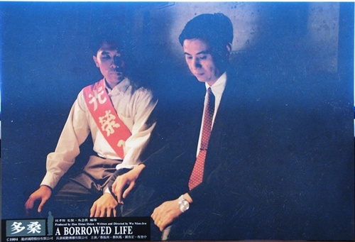
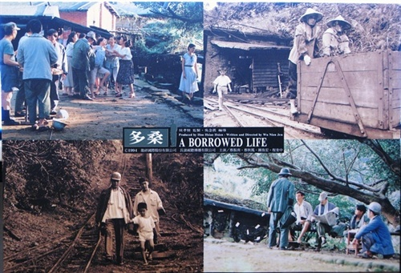

# 电影里的台湾之三：《多桑》——父辈的故事

**“由殖民历史带来的台湾意识的形成，也影响了台湾的国家认同。对国家认同的解释，必须同时解释两个方向完全不同的现象。对内的方向：为何许多群生活在不同地区，具有不同社会地位和背景、有时甚至是不同族群的人，会形成一个一致的、共同的国家认同？对外的方向：为何某一群人会认为他们和其他群人，是属于不同的国家。”**

 

# **电影里的台湾之三：《多桑》——父辈的故事**

## 文/ 马军（国立台北大学）

 

《多桑》上映于1994年，导演是台湾著名的电影人吴念真。吴念真以编剧闻名，曾经写过《光阴的故事》《搭错车》《恋恋风尘》《悲情城市》《鲁冰花》等著名的电影，和侯孝贤合作过多次。《多桑》是吴念真的电影导演处女座，侯孝贤担任监制。至今他也只执导过两部电影长片，另一部是《太平天国》。

在《多桑》里，能够看出很多侯孝贤的影子，固定的机位，较长的镜头，暗淡的色彩，以及电影里无时无刻不展现出的台湾的味道。这是一部很忧伤的片子，以一个孩子的视角描述了一个父亲的一生，也是吴念真对其父亲一生所进行的回顾。

电影里的多桑，是一个在日据时代成长起来的矿工，多桑的形象是我印象中最最典型的闽南男人的样子：义气、自信、大男子主义、满嘴台语脏话、在家庭里有无限权威，偶尔又有一点不靠谱，总体说来，就是伍佰那个德行的吧。当然，闽南男人给我的这种印象大部分源自于我对闽南和台湾农村的印象以及老的台湾电影里传递出来的感觉，现在台湾的男生，似乎更多的名声是白净清透，相比之前，可以说是时代变换了吧。

这是一部非常忧伤的片子，静静的讲述了一个人的一生。片子里的多桑因为生活在日据时代，所以对日本有着浓厚的感情，一辈子最大的理想就是去日本看看富士山，结果因为年轻时候留下采矿的职业病——尘肺，最终没有成行。片尾，“东京初学，多桑无言”的字幕，让人唏嘘。

台湾文化中有很多的苦情的味道，电影里有，歌曲里也有。侯孝贤的《悲情城市》拍出的就是台湾电影里的苦情味儿，这个片子的女主角蔡秋凤，唱出的就是台湾歌曲里的苦情味儿。台湾艺术作品里的苦情来自于台湾文化的苦情，台湾文化的苦情来自于台湾历史的苦情。吴念真讲到《多桑》的时候，说他的父亲那一代人，就是“历史的孤儿”，他拍《多桑》不仅仅是为了纪念自己死去的父亲，也是要拍那一代人，不被理解的和沉默的那一代人。

多桑这一代人不被理解，多桑自己甚至不被自己的孩子所理解。多桑生长于日据时代，每每被问起年纪的时候，都说自己是“昭和四年”出生的。他和女儿争吵国旗上的太阳到底是日本的红色还是民国的白色，被骂成是汉奸走狗汪精卫，晚年听孙子只会国语不会闽南话的时候，又鄙夷的叨咕道：两个台湾人生了个外省孙。

看这部电影的时候，我似乎逐渐理解了一些以前不能理解的东西。记得以前刚刚接触一些台湾新闻和消息的时候，经常在网络上看到大陆网民对台湾人过度亲日的不满。记得艺人杨丞琳“喜欢穿日本和服，看起来很高贵”的言论就被大陆网民骂到臭头，更不用说李登辉“日本武士”的照片以及“岩里政男”的日本名字，更是被贴上了“民族败类”的标签。李登辉一直以来的亲日形象，关于钓鱼岛的言论，也是大陆一直对其批判的点，不久之前一个赴台的大陆交换生还因此和李登辉发生了一场所谓的“激辩”，引起媒体的传播。

从明治维新以来，日本就一直觊觎着台湾，企图将台湾收归其下，这样就可以南下东南亚，西进中国大陆。在甲午战争之前，日台之间就爆发过牡丹社事件，显露出日本要侵占台湾的野心。自从日本占领了台湾之后，就一直面临着各种的抵抗，我们在之前的两篇中分别讲述了来自客家人的抵抗以及原住民的抵抗。那么，既然日本人那么的招人恨，为什么会出现在《多桑》里的日本形象是那么的好，那么的惹人向往。相比长城，富士山成为了当时一部分台湾人心中的圣地，我想，还是要从日本在台湾五十年的功过是非说起。当然，这部分并不太难，在统派史书中不难找到日本人在台湾犯下的种种罪行，在独派的史书中又很容易找到日本在台湾留下的种种建设，这可能就是出版自由的好处，作者各说各话，读者各取所需。

**日本在台湾的统治**

日本在台湾的政策前后可以分为武官统治的时期以及文官统治的时期。

1895年日本根据《马关条约》占据台湾之后，开始了长达半个世纪的殖民统治，在统治的一开始，为了彻底确立自己的统治权，于是就有了半年多的军政统治的时期，并且制定了很多相关的法律和律令，为自己在台湾的统治设立法制基础，其中有一些比较残酷的法律，比如《匪徒刑罚令》《土匪招降策》等，利用这些法律来杀害抗日的志士。

在确定了比较稳固的统治之后，从1896年的4月开始日本总督开始实行所谓的“民政”，放松了一些对抗日民众的压力，导致了各地的反抗不断的发生。不少的汉人和原住民前仆后继的与日本人的殖产政策进行抗争。这里需要插一句的是，在日本统治台湾的前期，并没有大力度的建设台湾，而是把台湾当成是一个天然的物资公司，什么都往日本运，这当然就触及到了当时以农业为主的台湾社会的利益，也就招致了很多的反抗。至今，在日本的靖国神社之前的牌坊所用的侩木就是从台湾的阿里山上搬走的，所谓的“一二三、到台湾、台湾有个阿里山，阿里山上有神木，我们明年回大陆”之中的神木，就是这种侩木，侩木是台湾阿里山盛产的一种名贵木材，质地坚硬，价格昂贵。日本占领台湾前有几万棵千年树龄的“红侩木”，现在只有五十六棵千年树木。“红侩木”不仅树龄很长而且树干也很高、很粗。日本人占领台湾时，大量砍伐“红侩木”，其中有一棵三千年的“红侩木”也被日本人砍伐了，日本人怕遭报应，在阿里山修建了“树灵塔”，也就是树的坟墓，想减轻罪责。现在山上留下了不少树头，基本上都枯萎了，只有少数又重新长了起来，还有些漏网的已长成参天大树，最大的一棵约两千三百年，树高47米，树干直径25米，就算是十个人伸开手也不能合围起来这棵大树。现在残存的“红侩木”依旧是阿里山的一大景观。

此外，为了抵抗汉人的反抗，日本总督府想到了釜底抽薪的办法，就是尽量多的把以前留在台湾的清兵迅速遣返回大陆，并且为了防止汉人和原住民联合抗日实行了“隘勇制度”，防止抗日的汉人逃往山区，并完善和加强了警察系统。在抗日行动稍稍平息之后，又允许日本商社进入台湾山地进行从事伐木和采矿的工作。这是这两个举措，成为了我们之前讲到的“雾社事件”发动的直接原因。

从桦山资纪到安藤利吉，台湾一共经历了19任的台湾总督，其中前六任施行的都是“殖民地自治主义”政策，而从第七任总督名石元二郎开始，开始逐渐的转向了“内地同化主义”。其实早在日本占领台湾的初期，日本国内就一直存在着如何定位台湾的问题，到底是将台湾视作殖民地，还是将台湾视作本土的一部分。这两种不同的定位不仅困扰着日本的统治者，其实也慢慢塑造出了台湾人的两种不同的认同：认为自己是殖民统治下的人，当然对日本的统治相当的不满，认为自己是日本本土的一部分的人，当然认为自己是日本人，天照大神的子孙。这种纠结显然困扰着《赛德克巴莱》里自杀的那个原住民警察，而多桑显然不拧巴，他属于后一种。

日本对台湾的态度从“殖民地自治主义”转移到“内地同化主义”是有着国内外背景的，国内中，日本“内地同化主义”逐渐得势，主张“内地同化政策”的首相原敬上台。另一方面，美国威尔逊总统在1918年提出了“十四项宣言”中民族自决的原则，鼓励各个殖民地要求独立。所以如果日本还是把台湾当成殖民地的话，很有可能台湾会出现独立的运动。再加上各地抗日的举动逐渐平息，所以日本在台湾的统治就慢慢的转向文官制度。

从这个时代开始，日本在台湾的建设开始逐渐的增加，日月潭水力发电的工程就是在当时的背景下启动的。除一些建设之外，政治上也开始有了一些松动，允许一些民间人士进入政府，并开创了一些综合性的大学。如今号称华语世界最好的大学的台湾大学的前身台北帝国大学，就是在1928年创办的。

除此之外，大家比较熟知的政策就是日本统治台湾后期的一些皇民化的政策：1937年总督府下令废止报纸的汉字栏，开始推行日本语普及运动，1940年又修改台湾户口规则，要求汉人改日本姓。此外，日本还在宗教信仰上逐步的改变台湾原有的信仰，比如收购和拆除原有的祠堂，要求民众拜祭日本的天照大神等等。

当然，这些都是日本在文化上切断台湾和中国的联系的一些很重要的手段，但是，我想这些给当今台湾文化认同、民族认同以及国家认同上带来的影响并不是很大。一般说来，认同包括两种层次，一种是文化上的，一种是政治上的，目前来说台湾在中华文化的认同上还没有偏离的很远，但是政治认同上两岸出现了很大的问题，一个很大的原因，就是在日据时代，台湾就出现了渴求自我治理的设置议会的请愿活动，一方面建立了自我政治认同的基础，一方面也为台湾人民之后跟国民政府争取民主权利的行动也奠定了一些基础。当然，这并不能归功于日本的“赏赐”，而是台湾民众争取来的结果。

由于马英九要凸显中华民国政府在台湾执政的合法性，尤其是在台湾历史和中国历史被政治力量操纵成为两本历史教材，逐渐分家的时候，马英九就要借助于历史上的一些事件将台湾的历史和民国的历史做一些连接，其中对抗日本的部分就变成了两岸历史的一个公约数。正是在这种背景之下，《赛德克巴莱》这样的电影才作为一种“政治正确”的电影获得了台湾政府的补助，并且政府大力宣传这样的片子，之前讲到的《一八九五》也是一部受到马英九高度肯定的片子。当然，照此说来，《多桑》这样的片子如果诞生在现在，应该不会受到马政府的多大的待见了。

所以马英九上台之后除了多次提到莫纳鲁道之外，还多次提到的名字就是林献堂和蒋渭水，他们两个都是在日据时期多次向日本总督政府请愿设立台湾民选议会的人。从1921年到1934年间，在林献堂的领导之下，台湾的知识分子（主要是留学生）连年向日本国会请愿，要求设立拥有立法权和预算审议权的民选的台湾议会，前前后后一共十五次。并且在请愿的过程中先后设立了“台湾议会期成同盟会”“台湾民众党”等组织，虽然前前后后的请愿活动都被驳回，但是还是为台湾留下了很多的遗产，一方面，这是台湾第一次广泛传播“三权分立”“议会政治”等先进的政治理念，其所提倡的台湾的自治主义又为以后的以台湾为主体的政治运动也好，独立运动也罢提供了基本的立场。

这些请愿活动和政治活动虽然没有取得完全的胜利，但是随着时间的进行，这些政治活动还是为台湾培养了一系列的台籍的政治精英和人才，1935年之后，台湾总督府开始改革地方自治制度，把以前都是官派的各市、街庄议员改为一半为官派，一半为民选，在这些民选的席次中，请愿活动中有多人当选。这虽然没有完全达到请愿活动的目的，但是还是为近代台湾社会提供了一次非常重要的政治启蒙的训练。

当然，虽然日本建设台湾不如后来建设中国东北那样的认真和热情，但是半个世纪的殖民统治还是给台湾留下了很多的东西。日本在台湾统一了货币和度量衡，逐步的驱逐出了自《天津条约》规定台湾开埠以来进入台湾的各国的外资、建立了一些国营事业和专卖制度，其中台湾的一些特产、比如樟脑、鸦片等都由日本企业独占，烟草酒类等等商品也由官方来专卖。这个专卖制度，也为后来的二二八事件的发生，埋下了导火索。

日本时期还是台湾奠定工业化基础的时期，在日月潭水力发电工程完工之后，台湾的工业慢慢发展起来，酒精、化肥、金属工业等项目逐渐上马。后来由于战争的缘故，造船、汽修等重工业也发展了起来，这使得到1945年日本离开台湾之时，台湾竟成了全中国工业化发展最先进的省份，最起码是之一。

所以，在1945年老蒋从日本手里接手到的台湾要远比1949年老毛从老蒋手里接手的中国大陆要好治理的多，因为不仅日本人给台湾留下了很多的物质基础，还有很多建立起来比较完善的制度建设。“日本占领时期最持久的遗产，还不是生活水平的改善，而是一个相对高素质的人口和一个可持续发展的基础。尽管随着战争的结束和共产党在中国大陆赢得胜利致使大陆人大批涌入台湾，岛上的人均收入优势几乎丧失殆尽。一个高水平的识字率和日本人所移植的经济结构还是保存了下来。但是，日据时期的主要经验是，要开发台湾的经济潜力绝不能仅仅依靠无情的市场力量。它要求深思熟虑的经济政策，这似乎是来自大陆的进入势力很难有可能予以提供的。”

 **日据时期给台湾的影响**

记得我最早读到台湾的文章里有这么一个笑话：一个国民党兵看到台湾的自来水龙头能够自动出水之后，颇为新奇，于是就自己买了一个水龙头插在墙上，但是怎么也不出水。这显然是台湾人笑话初到台湾的国民党兵没见过市面的笑话，却也侧面的体现出了当时台湾的现代化水平要高于大陆。但是，半个世纪的殖民经验给台湾留下的远非如此。

目前在台湾的政治中，一个政治上非常正确的概念就是“台湾意识”。蔡英文在选举时候说不要“九二共识”要“台湾共识”，马英九在讲到和大陆做生意的时候也时刻讲这“台湾优先”。这种台湾主体意识的形成，很大的程度上是因为受了台湾殖民历史的影响。台湾历史上先后受到过西班牙、荷兰、明王朝、清王朝和日本的统治，历史不可谓不悲情，在这种悲情的历史中台湾人逐渐的觉得谁都靠不住，要靠自己“出头天”。

“殖民意识”的形成与日本的“殖民政策”密切相关，最明显的就表现在“皇民化运动”。在这一过程中，普及日语是日本在台实施同化政策的核心，因此台湾人民先后创办了《台湾青年》、《台湾民报》、《台湾新民报》等汉文报纸，介绍中国情况，提倡白话文等，这些就是台湾逐渐在反对日本殖民的政策时发展出的“台湾意识”的具体表现。据统计，当时500多万台湾人中，至1941年底，申请更改姓名的仅仅不到一万户。这体现了除了少数人之外，大多数人对日本在台湾的皇民化政策最起码保留着不主动的态度。

殖民化的过程给台湾带来的另一个影响就是一种优越的意识形态——皇民心态。台湾被日本割占之后，日本殖民当局在台湾进行了一些殖民建设。到光复后，台湾的平均发展水平超过了大陆。在这个背景下，一些台湾民众的“皇民意识”开始发酵。在这些人看来，中国代表的是落后，日本及其统治下的台湾是先进的。虽然1945年收复台湾之后，国民党政府在台湾全面实施“祖国化”教育，使得这种状况迅速扭转，但是作为观念形态的文化，往往很难在短期内转化，吴念真说多桑这一代人是历史的孤儿，原因就在于此，他们这一带上面是清朝传过来的中国文化，下面是国民党带来的大中华教育，在这两个之间夹杂着他们这一代人的皇民心态。而这种皇民心态，后来和恐共心态合流成为了台湾排斥“中国认同”，强调“台湾认同”的一个重要的思想来源。

由殖民历史带来的台湾意识的形成，也影响了台湾的国家认同。对国家认同的解释，要从内和外两个方向来进行解释。对内的方向：为什么许多群生活在不同地区，具有不同社会地位和背景、有时甚至是不同族群的人，会认为自己是一个国家的人？对外的方向：为何某一群人会认为他们和其他群人，是不一个国家的人。

不论是内向或是外向的解释，台湾的殖民地经验似乎都是一个重要的影响因素。在《想象的共同体》一书中，行政单位就是形成国家认同的一个强有力的影响因素。不论是在欧洲从帝国崩溃分解为民族国家，或是拉丁美洲的欧洲人后裔脱离母国的民族之一运动过程中，帝国内部的行政单位和管辖范围，都成为“想象社区”疆界的重要基础。日本的殖民政权在台湾建立了一个现代化的行政官僚体系和现代化的流动社会。也就是说，日本政权在台湾原来那个台湾农业社会中原始的、互相隔离的，地区性的经济单位和社会互动，整合成一种单一的政治、经济和社会体系。这样一个单一的行政单位，单一的经济领域和社会互动场域，虽不必然导致“想象社区”的出现，却是它发展的重要基础。

而在国家认同的外向解释上，从1895年至今，台湾和大陆只有四年的时间同时处于同一个行政单位之内。这种政治分离所带来的经济和社会互动的分离，虽不必然造成想象共同体分离，可却是一个让独立的想象国家可以形成的重要基础。

当然，在台湾人形成“台湾意识”的道路上，还有一个非常重大的事件，这就是1947年发生的著名的二二八事件。下一篇就会说到这个非常著名的电影：《悲情城市》。

 

（采编：姚昕毅；责编：周拙恒）

 
