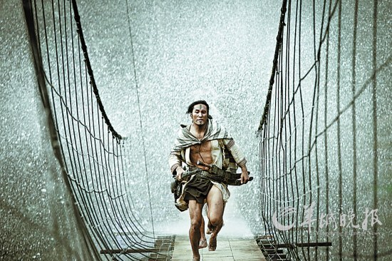

# 电影里的台湾之二：《赛德克巴莱》——纯爷们的故事

** **

这是我来台湾看的第一部电影。

我自诩对台湾了解很多，但是在得知这部电影之前，竟然对雾社事件一无所知，这让我感到非常的羞愧。这是一个非常悲壮的故事，我想通过这部电影，把这个故事讲给大家听。

我们先来聊聊这部电影。我拿到台北大学的offer之后，告知了我的朋友安宇。安宇回邮件的时候，跟我说到了台湾一定要看这部叫做《赛德克巴莱》的电影，并且给我讲了关于这部电影的一些故事：2003年，一个还没有出名的叫做魏德圣的导演就曾经想筹拍这个故事，于是他自筹了250万台币，拍摄了一个5分钟的短片。并且拿着这个试拍片四处展演筹钱，希望能够筹集到两亿新台币，来支持整个片子的拍摄。显然，台湾历史上从来没有如此大手笔的对电影的投资，魏导的筹资也一直不顺利。一年以后，他将这个试拍片上传到网络，希望能够通过小额募捐的方式获得这个片子的资金，然而如此筹钱的速度显然慢的无法让人等待。

于是，魏德圣暂时放下了这个片子，在2008年拍摄了著名的《海角七号》，这个片子不仅狂扫5.3亿台币的票房，而且还使魏德圣获取了极大的名声与自信。于是他决定在资金没有到位的情况下，开始拍摄《赛德克巴莱》，边拍摄边筹钱。所以，若大家听过这部电影，或者关注过魏德圣的新书的话，你就会大概了解，魏德圣拍这部电影之时，大概想的，全都是钱。

当然，这部片子最后还是拍出来了，台湾政府先后补助了上亿，魏德圣也通过朋友筹集了不少资金，我记得这里头还有周杰伦的钱。从1996年魏德圣开始接触原住民的故事，到2011年这个片子上映，15年的时间，魏德圣实现了自己的理想。我不太敢说这是一个台湾梦的典型故事，但是他至少能够证明，台湾，是一个可以实现梦想的地方。也最终证实了一个道理：能用钱解决的问题，都不会是问题。

我看了这个故事，似乎有似曾相识的感觉，当初陈德森为了筹拍《十月围城》，也是前前后后筹备了十年。虽然《赛德克巴莱》、《十月围城》这两部电影和一切电影一样，都有不完美甚至拖沓、穿帮的地方，但是喜欢没事儿找事儿的我，也始终没有尝试去挑剔这两部电影。因为有诚意的电影，不管内容题材是什么，坐在荧幕前的你，总能感觉到心血熬出的味道。据说这部电影5月份会在大陆上映，我衷心的希望我的朋友，能够花钱买票去影院支持一下这部电影，这是一部真诚的片子，值得花时间去欣赏。

这部片子在台湾分成上下两部来上映，总长应该超过了5个小时。但是在大陆上映的会不会是完整版，这个我现在还不敢确定，在威尼斯电影节上，为了配合主办方的时长要求，导演就曾经把这部片子剪成了2.5小时的版本，我没看过这个版本，不知道剪掉的一半场景是哪些，但是大陆上映的版本应该会剪掉很多砍头的场景，因为实在太血腥了，当然，也有可能不会剪掉，因为毕竟电影不是3D，砍头也不是画裸体画儿，观众应该不会伸手去摸前排观众的脑袋。

#### 原住民：台湾真正的主人

在台湾，经常听到四族融合，这四族，指的是四个族群，也就是原住民、客家、本省人以及外省人。然而按照大陆“五十六个民族，五十六枝花，五十六个兄弟姐妹是一家”的分法来分呢，台湾只有两个族，汉族（客家、本省、外省）和高山族（原住民）。其实到底应该叫高山族，还是应该叫原住民，我想，最精彩的论述，应该是罗老师永浩的一段话了：

是吧。说说台湾的历史，台湾本来是谁的？是不是中国人的？什么他妈的神圣不可侵犯，那是台湾土著人的，跟印地安人一样。这块土地上，几千年来生活着一群善良而又落后的土著居民，他们在那儿过着男耕女织，世外桃源般的生活，直到几百年前，停了几艘大船，下来一帮面目狰狞的坏蛋，叫做汉人。一上岸，见到土著落后，上去男的杀女的抢，房子烧光，杀的这帮人屁滚尿流，打不过吗，落后！全躲到深山老林里，不敢下来。于是我们祖先哈哈淫笑，给他们起个名叫“高山族”。台湾来的高山族你不要管他叫高山族，会生气的。他可能到了中国落单了不敢怎么样，但心里是生气的。你管人家叫：‘啊，欢迎高山族的朋友’，是吧。他心里想，你他妈的才高山族呢，又不是猴子，为什么在山上过？是被杀上去的，不敢下来了，然后给人家起名叫高山族，还有比这更缺德的吗？全都一样，是吧，正视一下。我给你们讲的不是什么反动材料，任何一个图书馆，研究台湾史的图书馆一查全都查到，根本就不需要借助什么海外的东西。我也不敢拿海外的东西到班上讲，免得有人说我思想政治有问题，是吧。我不用，就国内的资料就足以证实了。

这就是台湾的历史。所以台独分子说：“我们天赋人权要自由要独立，神圣不可侵犯！”，大陆说：“这是自古以来不可分割的神圣领土，妈的我要打死你。”两边都他妈的神圣不可侵犯的时候，高山族的原居民是什么心情啊？从山上往下一看，妈的两群疯狗，是吧。还他妈的神圣不可侵犯，这是对神圣最大的亵渎，是吧。有没有可能还给他？现在汉人在那儿已经比高山族还多啦，这个也不可能还。所以正视历史保持心态健康地面对国际事务，是吧。

好，我又激动了，又激动了，就是这样，是吧。这就是你们理解的神圣不可侵犯。

其实在台湾，高山族和原住民并不完全是等号的关系。台湾的政府将非汉族的人分为原住民而原住民又分为高山族和平埔族。然而由于历史的关系，高山族这一称号正如罗永浩所说，的确带有种族主义和殖民主义的色彩，所以基本上也就不再使用，而是以“山地原住民”和“平地原住民”来代替高山族和平埔族的说法。并且政府在政治上会给原住民进行特别的保护，比如在台湾的立法委员的选举中，会特别为平地原住民和山地原住民各留出三个名额，仅允许原住民身份的公民进行竞选，以保障原住民的参政议政权。这跟大陆的人大代表一定要有一些是少数民族代表一样，为的都是表面上的公平，在大陆最出名的台湾原住民立委应该就是高金素梅了，2008年奥运会的时候，就是她代表高山族在鸟巢跳舞，把场内的民族，凑成了56个。当然，台湾的代表是一人一票选出来的，至于咱的代表嘛，呃……这个……也是选出来的，嗯。

如果分得再细一点的话，台湾政府把台湾的原住民还分成了阿美族、泰雅族、排湾族、布农族、卑南族、鲁凯族、邹族、赛夏族、雅美族、邵族、噶玛兰族、太鲁阁族以及撒奇莱雅族及赛德克族等14族，若是算上平埔族和南岛民族，则有16族。现在台湾所有的原住民加起来有49万人，占总人数的2%左右，是名副其实的“少数”民族。具体的分布如下：

阿美族：阿美族分布在中央山脉东侧，立雾溪以南，太平洋沿岸的东台纵谷及东海岸平原，大部份居住于平地，只有极少数居于山谷中。范逸臣、张震岳就是阿美族人，萧敬腾和罗志祥也都有二分之一的阿美族血统。

泰雅族：泰雅族分布在台湾中北部山区，包括埔里至花莲连线以北地区。《赛德克巴莱》莫那鲁道的扮演者林庆台虽扮演的是赛德克族，但是他是泰雅族人，张雨生、徐若瑄、言承旭、周渝民等艺人，都有泰雅族的血统。

排湾族：排湾族以台湾南部为活动区域，北起大武山地，南达恒春，西自隘寮，东到太麻里以南海岸。尤秋兴和颜志琳是排湾族人，好吧，我知道大家对这两个名字陌生，我错了，他俩的组合叫做动力火车。

布农族：布农族分布于中央山脉海拔一千至二千公尺的山区，广及于高雄县那玛夏乡、台东县海端乡，而以南投县境为主。唱《千年等一回》的高胜美，就是布农族的。

卑南族：卑南族分布于台东纵谷南部。张惠妹就是卑南族的人。

鲁凯族：鲁凯族分布于高雄县茂林乡、屏东县雾台乡及台东县东兴村等地。梁文音有一半的鲁凯族血统。

邹族：邹族主要居住于嘉义县阿里山乡，亦分布于南投县信义乡，以上合称为「北邹」；而分布于高雄县桃源乡及那玛夏乡两乡者，称之为「南邹」。若没错的话，美如水的阿里山的姑娘，说的应该就是邹族姑娘。

赛夏族：赛夏族居住于新竹县与苗栗县交界的山区，又分为南、北两大族群。北赛夏居住于新竹县五峰乡，南赛夏居住于苗栗县南庄乡与狮潭乡。

雅美族：又叫达悟族。雅美族分布于台东的兰屿岛上的六个村落，为台湾唯一的一支海洋民族。

邵族：邵族分布于南投县鱼池乡及水里乡，大部份邵族人居住日月潭畔的日月村，少部分原来属头社系统的邵人，则住在水里乡顶崁村的大平林。现在还有七百多人。

噶玛兰族：噶玛兰族，过去居住于宜兰，目前迁居到花莲和台东。

太鲁阁族：太鲁阁族大致分布北起于花莲县和平溪，南迄红叶及太平溪这一广大的山麓地带，即现行行政体制下的花莲县秀林乡、万荣乡及少部份的卓溪乡立山、仑山等地。

撒奇莱雅族：撒奇莱雅族的聚落主要分布于台湾东部，大致在今日的花莲县境内。

赛德克族：赛德克族的发源地为德鹿湾(Truwan)，为现今仁爱乡春阳温泉一带，主要以台湾中部及东部地域为其活动范围，约介于北方的泰雅族及南方的布农族之间。2008年才成为第十四个被台湾政府正名的民族，目前台湾的立委孔文吉就有赛德克族的血统，赛德克族历史上最有名的人物，不用说了，就是带领族人出草发动雾社事件的莫那鲁道。

#### 雾社事件：彩虹桥的那端有祖先

台湾用的钞票叫做新台币。面值最小一块，最大的两千。币值分一元、五元、十元、二十元和五十元的硬币，以及一百、两百、五百、一千和两千的纸币。据说还有五毛的硬币，我没见过，可能是因为五毛们都在大陆忙着发帖，不流通了吧。

这些钱里，五百的纸币画的是台湾少年棒球队，一千画的是台湾的小朋友，两千画的是高科技中华卫星。除此之外，基本上都是政治人物的画像，不是蒋介石，就是孙中山，只有20块硬币上刻的是莫那鲁道的头像，可见莫那鲁道在台湾史上是多么著名的人物。（这里插两句闲话，二十块的硬币和两千块的纸币都很少见，二十块为什么很少见，我不清楚。但是据说两千块的台币之所以少见是因为陈水扁当总统的时候受贿只收现金，所以贿赂者为了减轻重量，送的都是两千块的，所以两千块的纸币据说都在阿扁家里的茶叶罐里，市面才会很少见。当然这只是江湖笑谈，基本上就是个谣言。而台湾贿选严重的时代，曾经有小朋友帮忙选举的说法，所谓小朋友，就是一千块纸币上画的小朋友图案，意味用钞票贿选。）

言归正传，为了避免剧透，简单的说说雾社事件。雾社是一个地名，现在在台湾中部的南投县，事发当时归台中管辖。因为雾社四周环山，中间溪水流过水汽较重，所以常年起雾，所以清朝就有“致雾社”的称号。那里生活着民风彪悍、以打猎为生的赛德克族。通往雾社的路上有一个关口叫做人止关，顾名思义，是一个咽喉要地，交通不便。所以，雾社一直是汉人不及之地。赛德克族人在这里按照“Gaya”，也就是族律进行生活。赛德克族的族律就是他们的生活习惯的总和：男人负责打猎，并且要保护自己的猎场不被外人占有，而且还经常侵袭别人的猎场以获取猎物。赛德克人有比较血腥的一个规定，就是男子必须砍杀其他部落的人头才能算成年的标志，成年之后可以纹面，之后才能娶妻。若未能纹面，死后将不能通过彩虹桥到达祖灵之地，而成为孤魂野鬼。

日本在1895年占领台湾之后，便把台湾当做殖民地进行资源的开发，雾社地区因为盛产木材和樟脑，所以便被日本人盯上。日本在开发雾社周边林地的过程中，对原住民采取的是压制和挑拨的政策，一方面高压统治奴役山民，一方面利用原住民不同部落之间的矛盾对山民进行统治。所以这就激起了当地原住民的极度不满，然而一直碍于日本军人警察的强大实力而隐忍不发。日本人为了展示自己的巨大实力，曾经把莫那鲁道等原住民头目带到日本参观军校等军事地点，以实力恐吓原住民头领。

然而火药桶都有爆发的那一天，导火索往往都是小人物，比如基层警察或者城管。突尼斯一个城管查了一个大学生的摊子，阿拉伯就春天了；台北一个城管查了一个老太太的摊子，台湾就二二八了。日本的一个小警察打了莫那鲁道的儿子，然后雾社事件就爆发了。

在莫那鲁道族内的一个婚礼上，莫那鲁道的儿子塔达欧莫那向日本警察吉村敬酒，结果吉村嫌弃塔达欧莫那手脏，不仅没喝酒，还拿棍子打了塔达欧莫那，结果吉村就被赛德克族人海K一顿，负伤回家，并且上报上级。莫那鲁道出于对部落安全的考虑，率儿子去向吉村道歉，结果吉村不仅不接受道歉，而且故意夸大上级的处理方案，将“口头训诫”夸大为要把莫那鲁道一家抓起来坐牢。结果莫那鲁道定下心来，准备出草。

1930年10月27日凌晨，莫那鲁道率领族人及其他同盟部落原住民在起雾时杀进日本举办的运动会现场，杀死一百多人，重伤26人。出手快捷，目标明确，死者除了两位是身着和服的汉人以外，全是日本人。日本军方震惊，派兵进入山林与原住民作战，原住民且战且退，利用山林地形与日本人游击。最后日本人于11月5号开始，使用违反国际公约的新型毒气弹，才逐渐获得战争优势，赛德克族人或战死或自缢，莫那鲁道杀死自己孙子妻子，焚烧尸体之后，饮弹自尽，1933年遗体才被发现，并被日本人做成标本展示。1973年才埋回雾社长眠。

我在台湾翻阅这一段历史的时候，曾经发现有几本书的说法是，雾社事件是台湾高山族人民抵抗日本帝国主义的爱国行为，是中国人民抗日史的一部分。当时我很惊讶，不知道为何这件事跟爱国有啥关系，后来发现，那几本书是大陆的几个学者写的，恩，难怪。

这件事发生在日本占领台湾35年后的1930年，距离日本离开台湾，还有十五年的历史。在这三十年里，日本在台湾的皇民化政策就已经有了效果，台湾人的国家认同就已经悄然发生了一些的变化。以雾社事件为例，在死亡的人里，有两个人，一个叫做花冈一郎，一个叫做花冈二郎（电影里也有这个情节的设置，演员许诣帆还因为扮演花冈一郎获得了48届金马奖的最佳新人奖 ），他们两个不是兄弟，也不是日本人，都是赛德克族人，但是已经皇民化，在日本警察局做事。事发之后，他们两个自杀，而且花冈一郎还是以日本人的方式切腹自杀。一边是祖灵的召唤，一边是大和子孙的荣耀，原住民身份的花冈一郎困境如此，平地的汉人则就更可想而知了。

下一篇，我将通过《多桑》这部电影，讲一些关于日本统治台湾的过程中发生的故事。

 

（采编：姚昕毅；责编：周拙恒）

 
