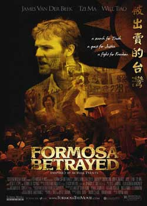
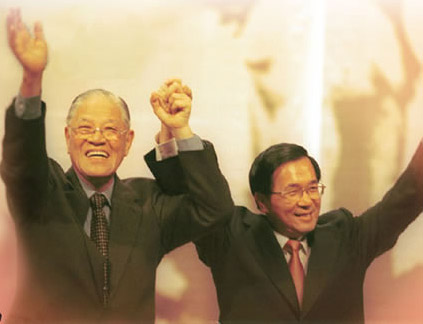
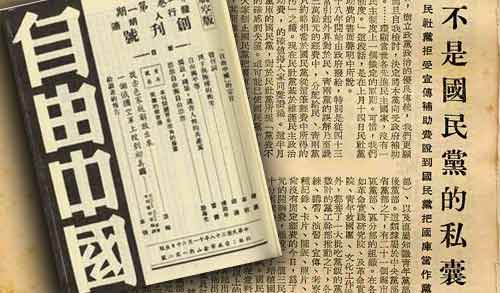
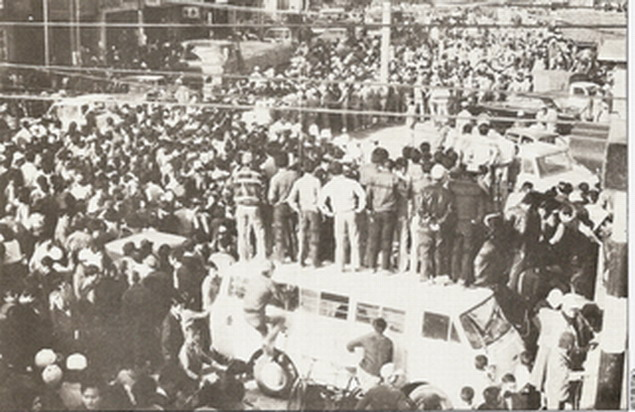

# 电影里的台湾之五：《被出卖的台湾》--白色恐怖

** **

严格意义上说《被出卖的台湾》不是一部台湾电影，而是一部美国电影，原著、编剧和导演都是美国人。按照维基百科上的解释，这部电影的灵感取材于四个历史事实：江南案、陈文成案、美丽岛案以及国民党留学生对在美的台湾学生进行监控。这部片子上映于2010年，类型上算是政治题材惊悚片，在台湾也引起了一些反响，尤其是独派人士的大力推崇，据说还专门召开过针对这部电影的学术研讨会。但我必须要首先说明的是，这是一部烂片，槽点无数，Bug频出，可以说吐不完，如果大家想看这部片子的话，需要做一些心理上的准备。然而之所以还是要在这个系列里选择这么一部电影，是因为这部电影所反映的内容确实是台湾政治史上一个比较重要的时期，即白色恐怖时期。

这部电影看上去制作成本应该很低，拍摄也比较的粗糙。可能导演极力地想把当时国民党政府在台湾的独裁统治拍摄的淋漓尽致，但是显然功力不够，让中国人看起来整部片子显得不伦不类。我记得看过一个帖子，说《哈利波特》的作者J·K·罗琳女士只会写好人，不会写坏蛋。同样的，我觉得美国人只会写民主，不会写独裁。我从头到尾看完过一部叫做《白宫风云》的美剧，发现美国编剧笔下的美国政治和白宫里实际发生的几乎完全一样，连美国政客都说“我们简直就是按照他们的剧本治国”。但是一涉及独裁专制的剧目，从《V字仇杀队》到《被出卖的台湾》，美国编剧就显得弱爆了，把专制行为描写的太过于简单了。很显然，他们过惯了简单的生活，像专制统治这么复杂的事情，显然已经在他们理解范围之外了。

这部电影关于台湾的部分全都是在泰国取景，雇佣的演员也大部分都是泰国人，所以电影里头充斥了大量的泰文招牌、东南亚典型的拥挤小街道以及很费劲才能听懂的东南亚式中文，让观众很容易走神，难以一直专注于影片。其实江南案和白色恐怖是非常好的电影题材，但是被这部电影给毁了。

总之，如果你想了解一点关于台湾白色恐怖时期的历史，这部电影还是多多少少能够提供给你一些相关的内容，但是如果你只是想看一部好电影的话，就建议你直接绕过这部电影了。因为对于我来说，这部电影更像是一部赤裸裸宣传台独思想的政治宣传片。不是说宣传片就一定不好，但是私货携带得太明显，就不免让人厌烦。就比如《地雷战》，你如果把它当战争纪实片，就难免觉得太唬烂，但是如果把它当作是反强拆抗城管题材教学片，则还是有很强的指导意义的。

在上一篇讲二二八的时候，我曾经提到，在台湾总统府的正前方偏左，有一个二二八纪念公园，里头矗立着二二八纪念碑。而二二八纪念公园正对面，总统府的正前方偏右的地方，则立着另一块碑，即白色恐怖政治受难者纪念碑。我不知道马英九的办公室是不是有面向凯道的窗户，如果有的话，只要他站在窗前，视野的左面就是二二八纪念碑，视野的右边就是白色恐怖纪念碑，看着这么个景象，不知道他会如何感想。

白色恐怖纪念碑的碑文是这么写的：

台湾实施戒严期间（1949年5月20日—1987年7月14日）及其前后，有许多仁人志士遭受逮捕、羁押或枪杀，时间长达四十多年。此种惨痛事实形成恐怖气氛，笼罩整个社会，成为台湾人民挥之不去的梦魇，影响社会发展至深且巨，史称“白色恐怖”。

昔日威权体制下，统治者高高在上，迫害人权，剥夺自由，造成无数生命的陨落、家庭的破碎和种种不公不义，举国上下遂长期处于不安与恐惧之中。90年代之后，在国人流血流汗，持续努力下，台湾走出威权统治，逐渐形成自由民主的社会。

保障人权，追求社会公平正义，是民主国家所服膺的普世价值。我们不仅要追求历史真相，追究责任，更应记取教训，使执政者不再重蹈覆辙。因此建立纪念碑，祈愿台湾从此成为民主、自由、人权和正义的国家。

白色恐怖政治受难者纪念碑委员会谨立

2008年4月7日

按照这个碑文的说法，白色恐怖的时期应该长达四十多年，在这四十多年里，台湾出现了非常多的反抗当时国民政府统治的个人、团体和行动，本电影所呈现的江南案、美丽岛等事件都是其中非常重要的事件。接下来，本文就重点的说一些白色恐怖时期台湾政治抗争中一些比较重要的人物和事件。

#### 白色恐怖戒严始

之前在讲到《多桑》的时候，曾经提到了台湾意识的一个很大的来源就是台湾曾被日本殖民50年的经验，而讲到台湾意识萌发的另一个很大的原因就是因为所谓的“恐共心态”，在这一部电影里我们就能明显的看到所谓“恐共心态”的影子。白色恐怖时期，台湾的“恐共心态”主要体现在防止大陆共产党的渗透，其压制的程度是全方面的。左翼思想在台湾被归为“倾共”思想的派系。之后，虽然随着时代的发展以及两岸关系的缓和，在台湾的中央政府取消了戒严，开放台湾老兵大陆探亲，反共政策有所调整。但是其“恐共心态”一直存在。

在李登辉和陈水扁时期，“恐共心态”逐渐变为“恐中心态”，在这种心态的转变过程中，台湾民众的自我意识逐渐的增强。李登辉时期的“千岛湖事件”以及“导弹危机”等两岸之间的不愉快事件被成功的操作成了中国打压台湾的印象，强化了台湾民众的“台湾意识”，使得反共意识和台独主张捆绑在了一起。李登辉时期为台独打下了基础，而陈水扁时期则全力推动着台独，并且把反对共产党和反对国民党成功地捆绑到了一起。

2008年马英九胜选，国民党再次执政，两岸关系有了很大发展。但是这种发展仅仅停留在经济层面，虽然两岸已经签署了ECFA，但是在政治层面上的交流却很少。一方面，碍于台湾目前内部强大的政治压力，马英九及其执政团队不敢在政治领域与中国大陆有很紧密的联系。另一方面，马英九本人其实也是有反共意识的，其曾经明确表示有生之年不会希望与中国统一。

而“恐共心态”的最初表现形式就是戒严，1949年5月20日，对大陆已经取胜无望的国民党政府在台湾施行了戒严令，对内对外都严格管控。对外的方面就是封锁港口，港市宵禁等，对内就是禁止集会、罢工、请愿等等。这些基本上都是战争情况下的常态。但是有一点对台湾政治影响比较大的就是，国民政府迁到台湾之后，因为处于交战状态，或是防共反攻的需要，很多中央级别的官员，包括总统和国大等等都无法改选。于是蒋介石就一直连庄下去，也就有了一个笑话，说蒋介石死后遇到孙中山，孙中山问他卸任后继任者是谁，蒋介石回答于右任（余又任），吴三连（吾三连），赵元任（照原任），赵丽莲（照例连）。

这里就要多说一句了，其实在讲到《多桑》的时候已经提到，日本在撤离台湾的时候，就在台湾已经留下了一个民主制度的雏形，国民政府到台湾之后，当即也开放了县一级的直接选举。所以说，在当时的台湾不能说是没有民主的地方，只是最高级别还没有选举而已，地方行政长官靠选举产生的意识在当时还是存在的。只是因为和共产党交战的原因才使得当时的执政党有“正当的”理由不开放最高级别的选举。这一点和韩国很像，韩国军政府也是因此占据领导位子很久。正是这种强势的政府操控着社会，也操控着经济，才使得当时的韩国和台湾在七八十年代的时候赶上了世界经济起飞的一次大好时机，各自都成为了东亚四小龙之一。当然，这种理由显然并不能撑很久，民众有了低阶官员选举的经验之外，势必会产生对更高的甚至最高级别的官员选举的要求和呼声。我之前经常思考，台湾的民主化过程其实还是比较平顺的，牺牲和流血相对比较少，这和台湾本身就有低阶官员选举的民主制度是有很大关系的，从低到高的争取民主，显然要比从无到有，要容易一些。

#### 雷震与《自由中国》

雷震早年与蒋介石的关系非常好，1949年以前也在国民党内部担任过高官，最高担任过政务委员。因为雷震早年留学，主修宪法学，所以对自由民主宪政的理念比较青睐，属于一个自由派文人。雷震创办《自由中国》的构想最早是在大陆萌发的，1949年在上海他和胡适等人就准备创办这么一个杂志，当时的主要目的还是以反共为主，深受蒋介石赞同，但是因为战局未能办成。当年10月，雷震来到台湾，在当时的教育部长杭立武的帮助下终于办出了《自由中国》的创刊号，身在美国的胡适担任发行人。而当时的蒋介石需要做出一副比较开明开放的姿态，来吸引美国的援助，所以对雷震这批自由派知识分子也是采取重用，再加上《自由中国》早期的反共立场，使得《自由中国》和蒋介石还是有过一段蜜月期的。

然而随着时间的推移，《自由中国》反共的色彩越来越少，民主的呼声越来越强，反蒋独裁的声音也越来越多。再加上蒋介石已经获得了美国的援助，不再需要那么多的自由派知识分子作势，所以雷震与蒋的关系越来越差，到1954年，雷震被蒋介石“双开”，不仅官职没了，连党籍都被注销了。

1960年，雷震参与反对蒋介石“违背宪法”第三任连任总统的连署，并写文章呼吁台湾要成立真正意义上的反对党（因为当时还有民社党和青年党两大花瓶），并筹备成立中国民主党。后因此在当年9月被以“包庇匪谍、煽动叛乱”的罪名判处了十年徒刑。

雷震在监狱里坐满了十年牢，于1970年出狱，1979年逝世。后来一直到了2002年，阿扁在任的时期，中华民国政府才正式宣布雷震案为冤案，算是为雷震平了反。

#### 柏杨的《大力水手》

大家都知道柏杨的《中国人史纲》和《丑陋的中国人》，也可能都知道柏杨先生坐过牢。其实在那个时代坐牢似乎成了文人一定要做的事儿，不坐几年牢不被禁过几本书好像都不好意思称自己是文人。但是柏杨坐牢的原因是很有意思的。

1967年，柏杨任职《中国时报》的时候，翻译美国的漫画《大力水手》。其中有一则故事是大力水手父子两个流落到一个小岛上，两人闲来无事竟然在岛上竞选总统玩儿，其中大力水手演讲时的开场白“Fellows”被柏杨先生顽皮的翻译成了“全国军民同胞们”。要知道，“全国军民同胞们”是蒋介石的演讲御用开场白，其象征意义和辨识度基本等同于“too simple”之于那谁以及“对不起，我们来晚了”之于那谁。所以柏杨先生当即就被国民党政府抓了，以“共产党间谍”以及“打击国家领导中心”的罪名被判处有期徒刑十二年。在坐了九年牢，写了包括《中国人史纲》在内的三部书之后，在美国人的干预下被释放，但是国民政府依旧对柏杨提出四项限制，最有意思的一条是“不许揭示人的本性”。我一直想找到这幅漫画，却一直找不到，如果有读者知道这幅漫画的链接，还烦请告知我。

#### 陈文成案与江南案

他们两个，一个是在美国的台籍大学教授，后来在台湾被杀；一个是在美国的台籍作家，后来在美国被杀。《被出卖的台湾》里头表现了一个在美国的台籍大学教授在美国被杀的故事，其原型大概就是陈文成和江南的综合。

陈文成在台大拿到硕士学位后赴美深造，取得密歇根大学博士文凭，并赴卡内基美隆大学担任助理教授。在美国期间，陈文成就非常关注台湾民主人权的运动和发展，在1981年7月回国探亲的时候，被台湾警备总部约谈喝茶，第二天被发现陈尸台大研究生图书馆旁的草坪上。国民党当局起初认定此事为“畏罪自杀”，但是因为陈文成拥有美国国籍，所以美国验尸官来台验尸，认为陈文成是被毒死的。但是其到底是怎么死的，直到今天仍是一个悬案。

就在今年，台大里还有很多的学生连署要求在陈文成陈尸的草坪处设立一个陈文成纪念碑，但是由于台大的校长和一些老师在这件事上的模糊态度而作罢。

江南，原名刘宜良，以江南的笔名在美国从事写作，以写过《蒋经国传》而闻名。1984年10月15日被三个台湾黑道杀手在旧金山著名的渔人码头开枪打死。由于当时因为中华民国政府被逐出联合国、美国转而和大陆建交不久，美台关系还处于震荡中，再加上江南的美国公民的身份，犯罪地点又是美国，所以此事造成了台美关系的紧张。美国认为，此事是台湾情报部门官员主使，也就是说，此案是一件台湾官方下令的杀死美国公民的案件。后来台湾也承认了江南案是情报官员主使，但是拒绝承认此事是高层授意的，纯属情报官员个人行为，并且把情报局长副局长抓起来入狱。值得注意的是，当时很多人认为此事主谋是蒋经国儿子蒋孝武，但没有证据，只是坊间猜测。此事过后，蒋孝武被派至新加坡，被解读为是“贬谪外放”。

#### “烈士”郑南榕

我在YouTube上无意中看到过一个只有几秒钟的视频，里头一个穿西装带眼镜的男人用台语讲到：“我就是郑南榕，我主张台湾独立”。面对着下面的掌声，这个人露出了一丝成分复杂的微笑。这个人就是被泛绿人士尊称为“建国烈士”的郑南榕。

郑南榕是一个自由作家，报人。其父是福州人，算是半个外省第二代，但是从小就“叛逆”，他大学读的是台大哲学系，但是没能毕业，原因是坚持不修“国父思想”这门必修课。从大学出来之后郑南榕一直参与政治活动，为他人辅选过，也写文章批判当时的政治体制，呼吁台湾独立，创办杂志。在民进党成立以前，他这种人被称为是党外人士。

1987年郑南榕与朋友一同成立了“二二八和平促进会”，要求平反二二八，冲击当时的社会禁忌。1988年他在自己所办的杂志上刊发《台湾共和国宪法草案》，并因此收到“涉嫌叛乱”的法院传票。郑南榕出庭之后就拒绝再次出庭，直到1989年4月7日，台北警方前往郑南榕所在杂志社拘捕郑南榕的时候，郑南榕自焚身亡。一个多月后在支持者给郑南榕举办的葬礼上，另有一名郑南榕的支持者自焚抗议身亡。

当然，对于郑南榕自焚的这件事有不同的说法，绿营基本上认为郑南榕是为了自由民主以及台湾独立事业自焚殉道，而很多蓝营媒体认为郑南榕是以身抗法，在以汽油弹攻击警方的时候不慎点燃汽油引火自焚。目前，绿营执政的台南市已经宣布每年4月7日为“言论自由日”。而在台北，几个月前也刚刚在郑南榕自焚的地方设立“自由巷”，以纪念郑南榕。对于郑南榕，李敖也有评价，他认为现在台面上那些主张台独的政治人物都是借由台独的口号来给自己谋取政治利益，而郑南榕是真台独，是真正的理想主义者。

#### 中坜事件

1977年台湾县市长进行选举，在桃园县的选举中，有两个人参选，一个是国民党提名的欧宪瑜，一个是自行宣布参选的许信良。许信良也曾是国民党党员，而且是国民党籍的台湾省议员，因为和欧宪瑜争夺提名失败，所以宣布自行参选，因此还被国民党开除了党籍。

在戒严时期，虽然台湾也有常规的选举，但是在选举中国民党经常采取买票、窃听等等手段保证自己提名的人当选，再加上欧宪瑜这个人是调查局背景出身的人，政治背景不招选民喜欢，所以此次选举很多选民都和国民党对着干。再加上许信良有一定的号召力，当时的很多党外人士也都站队站在了许信良这一边，所以这次选举格外引人关注。

11月19号，投票当天，因为中坜国小投票所检察主任故意将两位老人的选票说成是废票，恰好被党外人士看到，声称国民党的检票员“做票”，引发了群众的不满。同时其他地区“做票”的消息也传来，群众迅速围攻了中坜警察分局进行示威。在示威过程中，警察开枪打死一名中央大学的学生，这点燃了群众的怒火，他们打烂警察局的门窗，烧毁警车，后来冲进警察局烧毁设施，直到许信良当选的消息传来，民众才散去。

这次事件中，一共烧毁警车8辆，摩托车60辆，中坜警察局被焚为平地，民众参与两万多人，是二二八之后台湾爆发的最大的群众运动。但是在这场运动中，蒋经国并没有采取武力镇压的办法，而是下令不许开枪，基本上挨打受伤的都是警察。这件事给蒋经国政府带来很大的震撼，蒋经国也许就是从这个时候起开始觉得党外势力成了气候，高压政策施行不下去了，而党外势力则在这件事中锻炼了队伍，获得了信心，士气得到了极大的鼓舞。

#### 美丽岛大审与林宅血案

1979年，台湾的一批党外人士创办了一个新的杂志，取名《美丽岛》，这个杂志为后来台湾政局的发展起到了很大的影响。当时的社长就是许信良，副社长是黄天福和吕秀莲，总编是张俊宏，总经理是施明德，都是后来影响台湾政治响当当的人物。这个杂志影响力很大，不到半年发行量就超过了8万册。

1979年的12月10日，是世界人权日，《美丽岛》杂志借此名义在高雄准备游行集会以示纪念。但是多次申请之后高雄警方一直不批准《美丽岛》的游行申请。于是杂志的主办方决定照原计划进行游行。于是高雄警方如临大敌，想尽办法阻碍游行的进行，在游行前一天抓了《美丽岛》的两名义工。这一下引发了众怒，很多本来不想参加游行的党外人士和民众后来都决定要参加这场游行。

12月10日的游行中，爆发了群众和军警的冲突，在冲突中，军警出动装甲车和催泪瓦斯，民众则以石块棍棒进行还击，双方打到半夜。冲突中无人死亡，但是民众有人受伤，军警受伤更多，一时之间游行民众被媒体指责成为暴民，更是激化了官民矛盾。

事情发生之后，政府决定逮捕党外人士，施明德、黄信介、陈菊、吕秀莲、林义雄等人被捕，在军事法庭受审。在受审的过程中，也就是1980年的2月28日，台湾一个很敏感的日子里，被捕的林义雄的母亲和他的双胞胎女儿被杀死在家里，成为了震惊社会的林宅血案，林宅血案和第二年陈文成案一样，到今天都是未破的悬案。

最后，美丽岛的事件的八个主要案犯全都被判有罪，其中施明德判的最重，无期徒刑。黄信介被判14年，剩下的六人都被判了12年。值得一提的是，给美丽岛案犯辩护的15人律师团中，很多人也因此一举成名走上了政治之路，现在活跃在台湾政坛的苏贞昌、谢长廷都是当时的辩护律师，当然，其中最有名的律师还是陈水扁，他借此踏入政治道路，一直坐到总统大位。讽刺的是，阿扁贪腐事发之后，轰轰烈烈的倒扁红衫军的大头目，就是当年被判处无期徒刑的施明德。

总体来说，台湾的民主转型成本的确比较低，没有特别大规模的流血冲突和社会动荡，可以说是通过了一场“宁静革命”来达成的。当然，台湾的选举，尤其是在早期也有很多这样那样的问题，下一篇，我将通过一部叫做《黑金》的电影来讲一些台湾选举中的故事。

 

（采编：姚昕毅；责编：周拙恒）

 
