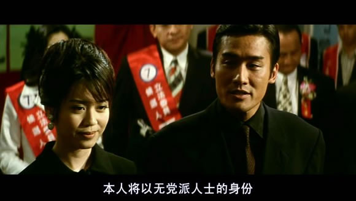
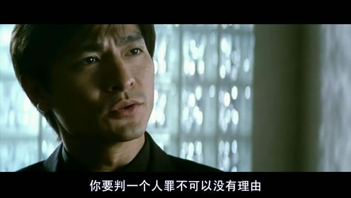

# 电影里的台湾之六：《黑金》----选举那些事

** **

这是一部港片，上映于1997年，出品人是麦当雄和向华强，导演是麦当杰。港片有一个特点，就是喜欢拍黑社会，港人在香港把警匪题材的黑社会片拍绝了，这下又到台湾拍政治题材的黑社会片。说实话，这部片子的剧情设置是非常有台湾风格的，里头的每一个人物几乎都能找得到现实原型，但是整个片子呈现出的视觉，不管是飞车枪战还是最后的高速公路上汽车大战直升飞机，都是很港式的风格，所以这部电影给人的感觉很像是在台湾夜市里卖港式点心的味道。

其实在香港电影里涉及台湾政治的片子不少，1996年上映的《古惑仔之猛龙过江》里，就有三联帮帮主选立法委员的剧情，2000年上映的《古惑仔之胜者为王》也有关于台湾政党轮替的剧情，2010年上映的《弹道》更是取材于2004年大选阿扁中弹的情节。但是这部电影在台湾上映的时候，《黑金》两个字貌似还是惹了一些的麻烦，最后以《情义之西西里岛》的名字上映，可见对当时的台湾来说，“黑金”这两个字还是有一定禁忌的。

“黑金”一词其实指的是两个东西，一个是“黑道”，一个是“金牛”。分别指的是在政治中，尤其是在选举中使用黑社会力量和贿选力量达到胜选目的的行为。这种行为全世界都有，但是在台湾转型的过程中非常的普遍，国民党因为“黑金”政治形象不佳，民进党以清新的形象上台，但是阿扁在任八年，照样因贪污A钱下台入狱，可见黑金在台湾的影响，不是某个党的事，而是整个政坛的事。

这部电影以海协会副会长唐树备访台开始，这也交代了时间，1994年。1994年唐树备的那次访台是中共高级官员第一次访问台湾，所以民进党的人士对唐树备是非常的“热情”，一路上呛声抗议，投掷鸡蛋，并且还跳上了唐树备的车子，据说把雨刮器都给拔下来了。现在唐树备任职北京联合大学台湾研究院的名誉院长，去年还曾去过台湾，不过时代早已变了，即使是在民进党大本营的南部地区，唐树备先生也没有遭受任何的抗议了。

当然，唐树备在电影里以“真人真事”的形式出现是在新闻上呈现的，主要是为了交代一个时间背景，但是电影里头很多人物很多事情还是都有原型的。梁家辉扮演的周朝先在电影里扮演的是一个电玩赌博业的商人，也是一个很有势力的黑社会老大，最后还当选了立法委员。周朝先的原型应该是周人参，在九十年代中期，周人参号称是是台湾的电玩天王，曾经以贿赂的方式勾结警察保护自己的产业。结果1996年此案爆发，涉案警察一百多人，震撼了当时的台湾社会。

刘德华扮演的那个调查局干员的原型应该是侯宽仁，1996年主办周人参电玩弊案的就是这个侯宽仁，他还侦办过太极门养小鬼案等等著名的案件，是台湾非常有名的扫黑人士，现在侯宽仁是台湾高等法院检察署查缉黑金行动中心的检察官。

当然，大家可能都知道的是，电影里面那个长的很帅喜欢跑步的法务部长的原型就是马英九。马英九在1993年被任命为法务部长，在任内马英九最大的政绩就是向选举中的黑金宣战，在马英九三年任内，起诉贿选涉案人七千五百多人，力度很大，赢得了很好的名声。据说当时马英九的施政满意度最高的时候能到88%，比现在他当总统的时候高好几倍，被群众誉为马青天。有意思的是，后来马英九在台北市长任内的特别费案被起诉，起诉他的那个检察官，就是上一段讲到的那位侯宽仁。

其实这个片子里头还有一个人是有原型的，就是那个号称会分身的“宋妙天”大师，他的原型就是在台湾火热一时的宋七力大师。我大概是初中的时候知道宋七力的，那时候听哈狗帮的一首歌，歌名忘记了，但是歌词还记得一句：“我不是宋七力，不会四处分身，只有在这里可以看到我的本尊。”但是当时只知道有这么个名字，却不知道这个人是干嘛的，直到看了这部电影才清楚了一点点。宋七力号称自己能够分身，并因此成为了新型宗教界的一个领袖型人物，信徒众多，最著名的信徒就是台湾政治人物谢长廷，谢长廷的老婆游芳枝还帮忙宋七力写书宣传。1996年台湾著名主持人，时任台北市议员的璩美凤揭发宋七力，说宋七力涉嫌借助宗教活动诈骗敛财，并指责谢长廷收受了宋七力的政治献金，“宋七力事件”爆发。后来经过台湾的法院审理，认为游芳枝宣传宋七力并不涉嫌牟利，所以无罪，宋七力的行为属于宗教行为，法院管不了，所以无罪。至于说分身之术，有人说是骗局，也有人信以为真，心甘情愿的把钱送给宋七力，法院也管不了。

电影里还有一个场景，就是选举中不同阵营的计程车（出租车）斗殴的场面。这个场景也是有原型的，即全民计程车暴动事件。台湾的计程车司机因为常年在街上逛，接触的人三教九流各式各样，所以对时政局势都有自己的看法，这一点貌似两岸的司机都一样。计程车司机平时都以电台联系，台湾的地下电台有很多，所以很容易形成不同的小圈子和政治认同，再加上管理原因导致计程车竞争激烈，不同车队之间的司机经常爆发冲突。1995年大丰车队和全民车队的两辆车碰撞，最后引发了一场大规模的斗殴。除撞车外，斗殴扩大的原因中就有不同政治倾向的原因，所以这部电影就把这个情节拿过来，安在了周朝先的头上。

片子里还有一个情节是真实存在的，这也是为什么周朝先拼了命也要选上立委的原因，那就是“一清专案”。“一清专案”是当时还在戒严时期的台湾政府发起的一次严打，主要针对的是黑帮，后续还有“二清”和“三清”。这次严打的操盘手就是现在国民党的荣誉主席吴伯雄。上一篇讲《被出卖的台湾》的时候有讲到江南案，在美国暗杀江南的那个人叫陈启礼，就是当时竹联帮的老大，在一清专案的时候就被捕了。当然，当时被捕的黑道还有很多，大多数都被关进了台湾的绿岛监狱。我曾经去过绿岛，现在岛上依然还有监狱，也有很多监狱的遗址。这些在一清专案中入狱的黑道分子在狱中还成立了很多的帮派，集中力量介入选举，戏中诸多黑道分子泡温泉的那场戏，反映的就个事。

哦，对了，这部电影里还出了两首好歌，一首是《世界第一等》，一首是《孤星泪》，都是伍佰写的，刘德华唱的。

**台湾的政体**

我的原意是通过《黑金》这部电影给大家讲讲台湾选举中发生的那些事儿，但是为了怕说不清楚，所以还是得从台湾政体的变迁开始说起。

其实说到台湾的政体，得从中华民国在南京开会开始说，因为现在台湾的政体是当年从大陆完整版过来的中华民国政体和经过几十年本土化改革的结合。说来也挺有意思的，1945年台湾光复之后，台湾最高行政长官是陈仪，正式的名称是台湾省行政长官公署主官，但是陈仪干了两年，期间还整出一个二二八事件来，所以就被撤换了。接下来台湾最高长官叫做省主席，一共两任，魏道明和陈诚。但是1949年12月中华民国行政院搬来了台北，台湾最高长官变成了行政院长，当时是阎锡山。后来过了一年，蒋介石又来到了台湾，台湾最大的行政长官就变成总统了。

现在大家知道，台湾延续了孙中山的设想，使用了五院制，即除了总统府之外设五个院。即管行政的行政院，管立法的立法院，管司法的司法院，管公务员的考试院以及管弹劾审计监察的检察院。后三个院的新闻不多，大家关注的新闻大多是总统府、行政院和立法院的消息，立法院就相当于国会，是主要的政党政治运作的平台。但是实际按照孙中山的构想以及最早南京政府的实践来说，最高的权利机关是国民大会，简称国大。也就是先选出国大代表，然后再有国大代表选举出总统副总统。看过《建国大业》的都知道，电影里选举出蒋介石为中华民国总统的那个会议就是1948年召开的第一届国民大会。大家都知道，既然叫做国民大会，就得有一定的国民代表性，也就是说每个省都得有代表才是，所以当这个国大转移到台湾之后，问题就出现了，也就是因为大陆在共产党的手里，没有办法换届，所以就得一直运作下去。第一届的国民大会一直运作到了1991年，这些国大代表被戏称为“万年国代”，后期的时候都是挂着吊瓶尿袋被人推着轮椅抬着担架去国大投票，场面滑稽的实在是没法看。为了反对“万年国代”，台湾的大学生在中正纪念堂还掀起了著名的野百合运动。最后1990年大法官会议决定，强制国大、立法院和其他一些的无限期留任的代表必须退休。随即在台湾又举办了第二次和第三次的国大代表的选举，配合当时的李登辉进行了宪法的修改，并允许了总统的直选，为1996年总统直选奠定了法制的基础。最后，2005年举办了最后一次的国民大会的选举，选举出的国大代表投票，宣布废除了国民大会，被称为任务型国大。值得一提的是，最后一次国大，也就是任务型国大的议长叫做叶菊兰，他就是我们之前讲到的自焚的郑南榕的遗孀。

在上一篇文章中我就曾经讲到，自从日本撤离之后，台湾一直都存在着地方的选举，各县市的县市长以及议员都是民选的，只是涉及到最高级别的官员的选举才不开放直选。总统副总统一直都是万年国代投票选举，台湾省长和福建省长也一直是官派，北高两市也因为是直辖市，直辖之前市长是民选，直辖之后的市长都是官派，一直到1994年北高市长才重新选举，台湾省长也是当年选的，而总统要等到两年以后的1996年才开始选，而选举中也出现了很多有意思的故事，接下来我就捡几个有意思的跟大家分享下。

**1994****年台北市长选举**

1994年的台北市长选举是非常热闹的选举，因为台北直辖之后市长一直都是官派的，在还没有总统直选的当时，首善之区的台北市长选举是当时最高规格的一次选举了，所以在台湾当时特别受到重视，大陆的网站上可以找到1994年台北市长选举的一次竞选辩论，大家可以看看。

此次选举，一共有三个人参加，民进党推出当时的政治明星陈水扁，国民党推出寻求连任的市长黄大洲，而新党则推出了自己的政治明星赵少康。说到国民党，大家肯定很熟悉了，民进党也不陌生，是由当时的一些反对国民党的党外人士在1986年成立的台湾政党，现在是台湾两党政治中很重要的一股政治力量。而新党，则是从国民党分离出来的。在蒋经国死后，李登辉即位，由于李登辉在国民党内推行本土化的政策，导致很多人尤其是外省人对李登辉不满，随即在党内成立“新国民党连线”来冲击党中央，结果被排挤的很厉害。于是这些人在1993年成立新党，最初想在内政部注册“新国民党”的名称，结果内政部不准，于是才改称新党，曾经是台湾第三大党，红极一时，在都市尤其是台北市有一定的影响力，现在依旧是台北市议会的第三大党。

大家如果看过那场辩论就知道，主要是陈水扁和赵少康在进行争夺。由于民进党历来的街头运动经常爆发出暴力事件和台独的政治倾向，所以赵少康在选举的过程中一直以“保卫中华民国”为口号来攻击陈水扁，把民进党和希特勒、义和团对比。而陈水扁则非常的聪明，他打出了“走出悲情、迎向希望”的口号，想摆脱掉民进党过于悲情的形象，因为作为都会区的台北市不太吃这一套。辩论会非常的好看，陈赵二人互相攻击，唯一的共识就是批判国民党的市长黄大洲政绩太烂。至于黄大洲，是国民党传统的那种官员，口才仅限于念稿子，辩论是在是不行，在辩论上被打得乱七八糟。最后，陈水扁获得44%选票，赵少康30%，黄大洲26%，陈水扁当选，蓝营因为分裂，没能选上。

当年的省长选举，国民党提名的宋楚瑜以56%的高票击败民进党的陈定南和新党的朱高正，获得胜利，成为台湾省长。这一点说来有意思，中华民国当时还有两个省长，一个是台湾省长，管着除了台北高雄两大直辖市的台湾本岛的其他地方。一个是福建省长，管着澎湖金门和马祖，政府设在金门。因为台湾省长管辖的地方和总统管辖的地方基本上差不多（总统比省长多管澎湖金门马祖和台北高雄）后来李登辉宣布精省，就是把省政府精简掉了，还保留着机构，但是不运作不上班了，省长都直接官派了。这也惹恼了宋楚瑜，为2000年陈水扁当选总统埋下了伏笔。

**1996****年总统直选和导弹危机**

1996年的总统直选是中华民国历史上第一次的总统直选，所以备受瞩目。当时由于国民党继续提名已经执政八年的李登辉搭档连战参选，所以当时的国民党两个副主席宣布脱党，林洋港和郝伯村在新党的支持下进行参选，而民进党则推出了彭明敏和谢长廷进行选举。由于这次选举打出的是中国五千年历史上第一次国家元首的直选，所以大陆非常紧张，这就引出了1996年的导弹危机。结果这次导弹危机成功的成为了李登辉上任的助选团，大陆越是“打压”，李登辉得票数越高。这件事成功的把以前国民党对共产党那种渲染和宣传而产生的“恐共意识”给打造成了中国人欺负台湾人的“恐中意识”，不仅影响到了台湾的这次选举，而且和1994年的千岛湖事件一起，成为了台湾民意中有关“国家认同”和“族群认同”的黄金分割点。

这里再说多两句千岛湖事件。这个事情大家可能不太熟，一提到千岛湖都知道农夫山泉，不太了解千岛湖事件。1994年3月31号，24个台湾旅客乘船游玩千岛湖时在船舱内被烧死。由于当时处理此次事件的浙江公安部门一直说此事是一个意外，在压力之下后来又改口说是遭到抢劫并纵火。新闻的封锁和案件的遮掩被台湾方面大肆批评，再加上最后破案时案犯身着军绿色衣服，又被台湾媒体认为是此案是有大陆军人所为，政府是共犯，所以掩盖新闻。李登辉在台湾公开演讲说大陆政府是土匪。从那时候起，台湾民意中的认同开始发生变化，支持独立的民众超过了支持统一的民众，认为自己是台湾人不是中国人的民众数量也大幅的攀升。

**2000****年总统大选蓝营分裂，阿扁得力**

2000年大选一共有五组人马进行选举，民进党的陈水扁吕秀莲、国民党的连战萧万长，无党籍的宋楚瑜、新党的李敖以及从民进党脱党参选的许信良。原本宋楚瑜是国民党的人，台湾省长，但是由于李登辉惧怕叶利钦效应，怕宋楚瑜跟自己抢功，于是就主张废掉了省一级的行政机构，省长自然就撤了。而且安排宋楚瑜向时任行政院长的连战提交辞呈，引发连宋二人的心结，于是宋楚瑜辞职之后以无党籍的身份参选，蓝营再次分裂。

这次选举，连战携国民党党机器参选，陈水扁携民进党党机器参选，而宋楚瑜则携省长时期的高支持率参选，三个人竞争非常激烈，以至于选举当天三方全都做好了胜选的准备。这次选举中由于蓝营是分裂参选，所以出现了很多关于“弃保”的传闻，即集中选票，放弃一人支持另一人。但是一直因为连宋的民调相差不多，大家也不知道该弃谁保谁。这是爆发了四件影响选举的事，一是在台湾很有影响力的科学家李远哲公开挺扁，被称为是阿扁当选的临门一脚；二是兴票案爆发，国民党立委指责宋楚瑜借儿子的户口进行政治黑金的操纵，打击了宋楚瑜；三是所谓“假民调”，当时台北市长马英九违反了选前一天不能提民调的选罢法规定，说自己看过内部民调，认为是连扁对决，宋楚瑜已经出局，导致部分蓝营民众弃宋保连，这也后来成为了马宋心结的很大一个原因；四是国务院总理朱镕基的强硬表态，“不管是谁，搞台独就没有好下场”，这句话也为陈水扁增加了不少的选票。最后阿扁以39.3%获胜，宋楚瑜获36.8%落选，连战仅获得23.1%的选票。这次选举之后，阿扁当上了少数总统，台湾朝小野大，长期在野的党执政，长期执政的党在野，大家都不太适应自己的新身份。台湾开始空转，竞争力逐渐衰退，从四小龙之首逐渐滑到最后一名。当时国民党的民众围攻了党中央，要求李登辉下台。马英九作为市长讲话要求民众冷静，被李登辉是为逼宫，马李心结埋下，又被民众认为是护李，被扔了一身鸡蛋。宋楚瑜在落选晚会面对支持者“组党”的呼声，不久后成立了亲民党。而大陆也学乖了，对台喊话也变了样，从“搞台独没有好下场”，变成了“我退休以后，就是爬，也要爬到台湾去”，身段软了很多。

**2004****年总统大选与两颗子弹**

对于85后的我来说，2004年大选应该是第一次直接接触到的总统大选，之前的几次都没怎么直接关注过，都是靠之后的文献和记录才逐渐的了解。2004年的总统大选可以说是有史以来最接近的一次选举，民进党的陈水扁吕秀莲仅仅赢了国民党的连战宋楚瑜千分之2.28，后来被民进党称是二二八冤魂保佑了阿扁的胜利。但大家都知道的就是那两颗子弹的故事了。

投票前一天，即2004年的3月19日，陈水扁和吕秀莲在自己的大本营台南市扫街拜票的时候遭到枪击，一颗子弹打进了吕秀莲的膝盖，而另一颗子弹则打进了陈水扁的衣服，并在阿扁的肚子上蹭出了一条线，弹头落在了阿扁的夹克里。这件事当即就引发了很大的争论，民进党指责国民党阵营玩儿黑的，而国民党则说当时自己一方的民调领先，没必要玩儿黑的，很可能是民进党的苦肉计。当然也有人认为此事是地下赌盘为了影响选举而采取的行动。著名的华裔神探李昌钰也从美国回来调查此事，后来也没发现什么蹊跷的事儿，十天之后，警方在台南海边发现一个叫做陈义雄的死尸，并认定这个陈义雄就是凶手，跳海畏罪自杀，就此结案。

2008年香港拍了一个叫做《弹道》的电影反应的就是这个事情，由任达华出演，大家有兴趣可以看看。

这次选举还出现了一个有意思的事，就是所谓的灌票。在台湾，每次选举都是当天下午结束，然后直接就开票的，晚上就能知道结果。每个电视台为了争取收视率，就在每个开票点设置记者，随时统计数据，实时播报。所以有的电视台为了体现自己比别的电视台消息迅速，就故意的进行灌票，比如现在甲组开出了100票，电视台故意灌水说是120票，反正等过一会儿也能开出120票。结果这次选举有的电视台灌爆了，以至于发生了我听讲座听到的一个故事，很多人在看电视认为连宋稳赢的情况下出门吃了个饭，回来发现阿扁反超了，而且连宋的票不升反降，他们看的应该就是那些给连宋灌票灌多了的人，再加上此次选举废票很多，双方差距很小，导致很多民众，尤其是蓝营民众认为阿扁做票。后来经验票法院裁定阿扁当选，台湾的媒体声誉因为此事大幅下挫。

04年之后的各次选举，大家可能都很了解了，在此，我也就不再赘言了。

（采编：姚昕毅；责编：周拙恒）

