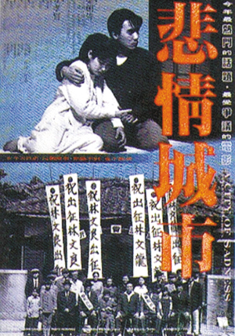
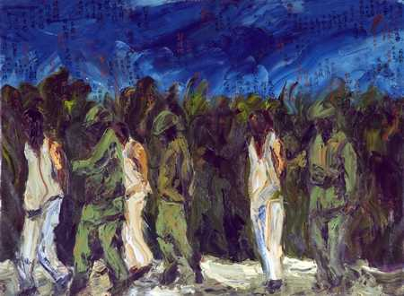
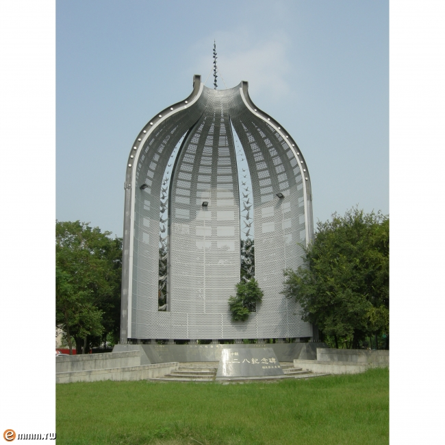

# 电影里的台湾之四：《悲情城市》——光复二二八

** **

我想，只要是对台湾电影有一点点了解的人，都不会没看过这部电影，最起码的，都不会没听说过这部电影。同样的，只要是对台湾政治有一点点了解的人，也不会不知道二二八。我在之前的文章中提到二二八的时候，很多同学都给我留言说知道这件事儿，说这就是台湾政治史上的“六四”事件。的确，二二八是台湾政治史上不得不提的一件大事儿，给当时的执政党国民党的冲击也是非常的大，至今二二八依旧是国民党在台湾统治的一件“原罪”。但是若是将二二八直接等同于“六四”事件，似乎却又有些牵强。的确，二二八事件为之后的台湾民主化起到了非常大的影响，但是就事论事的来看，二二八事件并不是一个单纯的关于民主诉求的事件，更多的是表现对当时执政者的以及外来人士的一些抗议，所以，我想，若是想更多的了解二二八的性质，将二二八和大陆前几年在疆藏地区发生的“七五”事件和“三一四”事件做一个类比，可能更准确一些吧。

还是先来说说电影本身，《悲情城市》是一部侯孝贤的电影，于1989年发行，由于当时台湾刚刚解严不久，社会的开放程度以及舆论的自由程度还远不及今天，所以在当时拍这么一部片子，可以说是直接挑战了台湾的禁忌话题。但是这部片子并未遭到删减，更没有遭到禁播，很大的一个原因就是这部片子在威尼斯拿到了金狮奖，成为了第一部在世界三大影展获奖的台湾电影，这种国际荣誉给了国民党当局比较大的压力，才使得这部片子过审，和观众见面，并引发了台湾关于二二八的一个大讨论。但是也正是因为这个原因，这部电影没有拿到当年金马奖的最佳影片。此外，这部电影还带动起了九份和金瓜石地区的旅行热，很多游客去九份游玩的时候，除了在老街逛，还要找悲情城市的拍摄原址看一下。

插一句，上一篇我讲的《多桑》那部电影，也是以九份和金瓜石为故事背景和拍摄地的，九份和金瓜石以盛产金矿而兴盛，矿藏挖掘殆尽后没落了，其兴盛和衰落的时间和日本占领台湾的时间大致吻合，所以以此地为背景的片子大致都与日本时代有着密切的关系。现在提起九份和日本最为人熟知的关联，恐怕就要数动画大师宫崎骏的《千与千寻》了，这部动画电影里的小镇，就是以九份老街为原型的，若有读者想去台湾旅行，九份是我强力推荐的一个地方，当然，去之前把《悲情城市》看一遍，就再好不过了。

回想一下，这部片子我大概看了三遍。第一次是大学时候看的，只是觉得侯孝贤的镜头很长，整部片子很稳，关于整部电影的内容并无太深的印象。第二次是在厦大听邱毅演讲提到这部电影的时候，回去又看了一遍，并查了一些关于二二八的东西。第三次是在写这篇文章之前，结合最近读到的东西，这才看出片子里的一些细节，这些细节可以说把当时台湾的局势刻画的非常到位，也体现了编剧和导演的功力吧。哦，对了，这部电影的编剧之一，就是之前讲到的那部电影《多桑》的导演，吴念真。

电影在日本天皇的鹤音中和生孩子女人的痛苦呻吟声中开始，陈松勇扮演的林家老大林文雄在电影的一开始得到了一个儿子，取名林光明。日本战败，新生命降生，取名光明，谁都知道这代表着什么。这里有一个细节，就是给林文雄生孩子的这个人是林文雄的小妾，而且是说广东话的，这一方面可以说在1945年的台湾，还保留着重男轻女和娶妾这样的传统，一方面可以说经济上和大陆的往来还是比较密切的，而且经济比较好，会有讲广东话的南洋女性愿意嫁过来作妾。

本片中除了占主体地位的台语，还能在其中听到日语，上海话，山东腔调的国语，广东话以及几乎不能称得上是国语的绍兴方言。从这些复杂的语言中就能听出当时台湾社会的复杂，战败的日本人，经商往来的南洋人，随国民党到台湾的阿山（唐山人，即大陆人），在台湾从事商业甚至不法走私的上海人，还有接管台湾做行政长官的浙江人（陈仪）。这些不同背景不同理念不同利益不同文明程度的人共同交织出了台湾当时的背景。

而林家的背景从历史上和空间上都勾勒出了当时台湾人的生活状态。林家的老爸，台湾著名布袋戏大师李天禄（侯孝贤另一部电影《戏梦人生》就是以其为主演和故事原型拍摄的）扮演的林阿禄，日本时代因为维护村庄的利益被日本人视作流氓而屡受欺负；陈松勇扮演的林家老大林文雄全力经商维持自己大家族的家业，最后被大陆人枪击致死；电影里未露面的林家老二林文森因会医术，随日本军队前往吕宋岛参军做军医，生死未卜；高捷扮演的林家老三林文良在上海为日军做翻译，染病发疯，治愈后因拒绝与大陆人做走私生意被以汉奸罪治罪，旧病复发成为疯子；梁朝伟扮演的林家老四林文清自幼耳聋，开照相馆为生，喜欢读左派书籍，结交文人，最后因为二二八清肃入狱被关。

此外，另外一些人物因二二八的人生轨迹以及其他细节在电影里也有展现：日本战败后日籍人士和台湾人的友谊，日籍人士的撤退，大陆记者在台湾的生活，台湾米糖的外流等等，都能在电影里看得到。侯孝贤通过这些细节的描写从个体的层面反映了当时台湾宏大的历史背景。那么，二二八到底是怎么回事儿，为什么会发生，怎么发生的，又给现在留下了多大的影响，我想，这还是要从1945年开始说起。

#### 祖国若只如初见，何事秋风悲画扇

1945年8月15日，日本投降，中国抗战取得胜利。当时和大陆一样，台湾也陷入了一股喜悦的情绪之中。两个月又十天之后，也就是10月25日，中国台湾行政长官总署兼台湾警备区总司令陈仪在台北市区的中山堂接受了日本末代总督安藤利吉的投降书，也正是因此，每年的10月25日，被定为台湾的光复节。

然而在台湾最初光复的一段时间之内，台湾民众的喜悦情绪一直不敢太过于爆发，原因很简单，因为当时在台湾还有非常多的日本军队的存在，这些军队和警察系统会不会做出狗急跳墙的事情，当时的台湾人谁也摸不准。其实当时的日本人也不敢乱动，也不知道自己上街之后会不会被台湾人暴打一顿。一直到八月底九月初的时候，一些日本人由于迫于生计，捡起手艺，从事一些战前的工作，比如开一些理发店、糕点铺之类的工作。由于这些人以前在日本就是从事这样的职业，所以有些日本人的店铺和生意做得比当时的台湾人要好，再加上日本人受教育程度、现代化程度以及文明程度都要好过于当时的台湾人，所以台湾人对日本人的有着非常微妙的态度：一方面这些是已经战败了的敌人，一方面这些人又很有文化、很文明，甚至有些和台湾人已经建立起了朋友的关系。影片中交代了宽美日本好友的撤离，就能体现这种态度，宽美的日本好友及其父亲是小学的老师和校长，用现在的话说这些人代表了当时先进文化的前进方向，所以日本虽然是敌国，但对台湾人来说，日本人却不见得都是敌人。

对日本感情的微妙并没有影响台湾人回归祖国时的喜悦，10月17日，当国军70军在基隆港登陆的时候，基隆一片欢腾，可以说是锣鼓喧天，鞭炮齐鸣，旌旗招展，人山人海。当时，台湾民众传颂着陆游的诗：“王师北定中原日，家祭无忘告乃翁”，唱着欢迎歌迎接着国军进入台湾，那首歌的歌词是这样的：“台湾今日庆升平，仰首清天白日清，六百万民同快乐，壶浆箪食表欢迎，哈哈！到处欢迎，哈哈！到处欢迎，六百万民同快乐，壶酱箪食表欢迎。”也从这可以说当时民众对光复还是非常高兴的，当时的台湾也没有所谓民族认同和国家认同的撕裂，这些问题都是之后的事情了。

在这里需要说一下的就是，现在在台湾很多的台独理论之中，对于光复的问题和一般的理解还是有一些争论的。一般认为，台湾光复代表着是台湾回到中国怀抱，中华民国对台湾行使主权。但是有一些“台湾地位未定”的观点会认为，当时割让台湾的国家是大清帝国，主权移交的时候是国民政府，所以光复一词并不合适。甚至也有人扣一些字眼，说《开罗宣言》只是新闻公报，不是正式条约，所以不具备法律效力，这些观点还说日本签订的《旧金山和约》只是向同盟国集团放弃对台主权，并没有指定说还给谁，所以将中华民国政府对台湾的管制和之前荷兰、西班牙、明郑、清朝和日本在台湾的统治等同起来，而并未将其视为中国政权在台湾的一次延续，这种历史观点为一些台独理论提供了重要的历史支持。

然而国民政府在台湾的统治却深深的伤害到了台湾人民单纯而又喜悦的心情。当时国民政府派到台湾的第一任长官是陈仪，浙江绍兴人，我们在这部电影里听到的那两次安抚人心的广播，我之前一直以为是蒋介石的声音，后来才反应过来应该是陈仪的声音。陈仪在1935年的时候曾经到过台湾，参观过台湾的一些代表现代化的单位和工程，比如日月潭水电站、基隆港，台北帝大等，再加上其在福建担任过七年多的公职，深谙闽情，所以陈仪应该是当时国民政府能拿出来治理台湾的不二人选了。但是就是这样的不二人选，在台湾的治理可以说是引发了很大的争议，最后引起了二二八。

首先需要在这里交代一下的就是，很多史书和文章包括李敖都认为陈仪这个人是一个廉洁奉公的爱国者，贪污的那些人都是陈仪的手下，制造台湾人和本省人矛盾的甚至也有老百姓的原因，二二八的爆发原因不能都扣在陈仪一个人的脑袋上，陈仪冤啊。我认同这样的说法，但是群体情绪就是这样，怨气不一定，甚至说一定不会撒在直接相关责任人的头上，但是当民间情绪需要爆发的时候，这个历史的名声落在了谁的头上，只好自认倒霉。

二二八的发生是有当时的社会基础的，当时的台湾的社会局势可以分两方面来概括：

首先，民众之间的对立情绪非常的严重。由于台湾在日本的统治下经历了50年的时间，有意无意的都养成了遵守法律的习惯，在这种遵守法律的风习之下，还建立起了一系列的非明文的约定。比如台湾在当时就有提供自行车租赁的服务，不用缴交押金，只需交付租金即可，当大量的外省人初到台湾租赁自行车的时候，很多台湾店家连租金都不收，表示友好，但是这些自行车很多都有去无回，导致后来很多店家再也不租车给外省人。同样的故事还有雨衣等版本。这些小事传播起来很快，也很容易被夹杂进一些谣言和不实，但正是这些小事经过传播，逐渐在人心里，增加了台湾人和外省人之间的隔阂，让台湾人对外省人产生了一种情感上的厌恶。

情感上的厌恶只是内心的隔阂，而工作待遇上的差别就是赤裸裸的利益之争了。国民政府接管了台湾之后，基本上所有的领导岗位都是由外省人把持，本省人从事的几乎都是低层次的工作，甚至干脆失业，这一点在《悲情城市》中也有交代。外省人的祖国心态使得他们对本省人颐指气使，工资津贴又高，本省人受指挥，工资又低，动不动又被看做是奴化教育下长大的人，难免内心不服气，“我们哪里愿意被奴化，还不是清朝割给日本的。”

这仅仅是不同省籍的民众之间互动出的问题，更大的问题则出在官方和民间的一些互动上。首先，在国民党接管的一开始，台湾的工厂很多职员和技术人员的岗位都被安排上了外省人，导致本省人的失业率上升很多。而且物价波动的非常厉害，电影里说在工资不变的情况之下，米价上涨了250倍，而实际上还有米价上涨了400倍的记载。物价上涨、失业率高还引发了很多的治安问题，民众发现生活水平还不如日本在台湾的时候。

此外，官方的贪污、腐败、收受贿赂以及侵吞资产的行为也屡见不鲜。在接收日本留台物资的时候，这些官员通过伪造和销毁清册的手段将很多的资产归为己有。当时一个著名的案件就是台北县长陆桂祥贪污案，陆桂祥贪污五亿元台币，结果在彻查的时候台北县政府着了一把火，所有的单据清册一把火烧光，此事后来不了了之，让民众怨恨不已。

和大陆一样，官员的腐败行为，能够引起的只是民愤，而远不能引起民变，引起民变的一定是和老百姓切身利益相关的事件，比如说是经济问题，或是环保问题，所以贪污处处有，民众上街的地方只有启东和什邡。所以，最让当时台湾老百姓不能忍受的还不是以上的事件，而是官方与民争利的事件。当时的官方制订了非常严苛的产业管制政策，可以说很大程度上断了老百姓的活路。日本时期，台湾的私营煤矿金矿产业是非常发达的，但是国民党接管之后全部归为官方收购，价格由官方指定，官方以定价收购物资，再以市场价卖出，一买一卖之间差价巨大。这种管制，大到煤矿小到文具涵盖范围极广，民众生活受到严重影响。

米糖的走私也是一个问题，台湾盛产米糖，自给自足没有任何问题，但是不管是私人和官方，都大量的通过走私的手段向大陆运送米糖，使得台湾的大米和糖的供应跟不上，导致米荒，引发民众恐慌。影片里的林家老三就是因为拒绝参与米糖的走私才被上海人陷害入狱的。 烟酒的专卖也是一个大问题，如上篇文章所讲，台湾烟酒的专卖制度是由日本建立的，但是日本时期私人小规模的烟酒买卖还是存在的，而由于烟酒有比较大的利润，导致国民党政府全面收归公有专卖，私烟私酒不得买卖，而专卖的烟酒质量极低，该辣的酒清淡如水，不该辣的纸烟则发霉呛鼻。公营的产品质量如此低劣，于是就有人尝试倒卖私烟私酒，这也为二二八的爆发，点燃了导火索。

#### “城管”闯大祸

1947年2月27日傍晚，六个“台北专卖局”的警察在台北延平北路进行“行政执法”的过程中，发现一个名叫林江迈的妇女在偷偷的贩卖私烟，于是决定没收其所有香烟，并且搜走了身上的所有钱财。林江迈育有一子一女，是个寡妇，生活拮据，于是苦苦哀求执法人员能不能归还一部分香烟及钱财，双方发生纠葛摩擦。而此时，围观群众越聚越多，使得执法人员压力山大，准备逃走，情急之下用枪击打了林江迈的头部，导致其当场头破血流。这样一来，围观群众不答应了，开始包围甚至围攻执法警察，在这个过程中，一个警察开了一枪，不小心打死一个在自家门口看热闹的市民。对于这一枪，有说法认为是警察开枪示警误杀民众，有人说是围观群众抢警察的枪导致走火。然而不管怎样，当时的场面是控制不住了，六名警察逃至附近的警察总局，结果警察总局被数百名群情激奋的民众包围，要求立即交出肇事警察并当场击毙，用李敖的话讲，全世界没有任何一个警察局长会答应这样的要求。群众的要求没有得到解决，导致了第二天事态的扩大。值得一提的是，当时的警察总局离中山堂非常的近，一年多前台湾民众刚在这里见证了日本的投降和回归祖国的喜悦，一年多后就爆发了这样的事件，民心转变之迅速，可见一斑。

28日上午，民众们再次围聚到派出所门前抗议，市民纷纷罢工罢市，表示支持。在台北专卖分局的抗议过程中，民众打死了两名工作职员，打伤四名，并烧毁了很多台北专卖分局的物品。之后民众又冲向了陈仪办公所在地的行政长官公署，结果卫兵在无预警的情况之下朝民众开枪，群众死伤数人。这枪声打散了民众，也点燃了本省人和外省人之间的矛盾之火，本省人打不着陈仪，便开始在大街上围攻外省人，首先攻击的是穿中山装、大褂以及旗袍的外省人，其次是殴打不会说台语的外省人，后来是殴打不会说日语的外省人。电影里梁朝伟扮演的林文清就因为耳聋听不见台湾话，差点被打。

二二八当天，据传闻就有十几名外省人被在大街上打死，并且也有外省女性被轮奸的传闻出现，于是警备司令部当天下午紧急宣布台北戒严，并派出军警上街维护治安，在维安过程中又爆发冲突，有本省民众被打死。

在这里必须提到的一点就是，在大街上殴打外省人的本省人主要是一些日本时代流下来的亲日派流氓以及大量从海外回到台湾的无就业的兵士，他们下手狠毒凶残。在电影里也能看出，宽荣在火车站看到的景象中，并非所有本省人都围打外省人，主要的打手基本上都是统一着装的流氓。而当时还有很多本省人保护外省人的新闻与记载。

事情远没有就此结束，在台北发生的事件迅速波及到了台湾岛内其他的地方。台中、嘉义、云林、高雄等地全都爆发了对抗国军的武装冲突事件，就连阿里山的原住民都参与了反抗的活动。以嘉义为例，嘉义市几乎所有学生全体动员参加与国军的战斗，在战斗中，市长公馆被占领，警察局被缴械，军火库被攻陷，民众还成立了“台湾民主联军”，与驻守军队激战。一开始，民众部队占据优势，一直到3月21日，增援部队到达时驻守军队才开始反扑并逐渐掌握局势，并且在嘉义市火车站之前先后枪毙上百人，血染嘉义火车站，成为二二八事件中一个很大的惨剧。

二二八发生之后，在本省籍民意代表和知识分子的建议之下，陈仪政府颁布了几条处理意见，也就是我们在电影里听到的一些关于“不追究责任、释放被捕人员、给予安慰金”等处理意见，在这个过程中，台湾的一些进步乡绅、左派人士就起到了很大的作用，电影里宽荣、林文清等文人被捕，就是因为参与了此事件。在当时的社会，读马克思等左派的书籍被看做是非常进步的事情，就连李登辉，也曾经加入过共产党。所以，二二八事件，在台湾存在着“政府残忍镇压民众”和“政府武力平叛”两种不同意见的争论的情况下，大陆也有其自己对二二八的定位，大概意思就是二二八事件是在台湾的中共地下党带领的反抗国民党暴政的一次起义活动，并举办了很多次的活动纪念，据说还发行了纪念邮票，有意思的很。

在暴力事件逐渐平息，尤其是当大陆援兵到达之后，陈仪开始在台湾推动了清乡运动，对可能对政府进行反抗的人士进行捕杀，其中捕杀的绝大多数都是一些社会名流、乡绅以及一些异议人士，这些异议人士很多都以叛国、联共等罪名被枪决，由于杀害的大多数都是台籍的文化精英，所以清乡行为更遭到台湾民众内心的痛恨，大陆拍的一部电影《云水谣》，里头陈坤所扮演的那个角色，就是在清乡期间从台湾逃出来的左派青年，后来还加入了中国共产党。

二二八事件对后来台湾政局的变化起到了非常深远的影响。到1980年代，整件事几乎还是台湾社会中一个禁忌的话题，官方视二二八事件为一场反对国民政府的民变，也经常拿共产党说事儿。但是这件事丰富了日本时代所留下的“台湾意识”的内涵，“台湾人”的概念正式形成，并且在这个概念里添加了反抗国民政府的理念，甚至添加了反抗中国的理念。之后的历史也证明，台湾之后的“台独运动”很多都以二二八为一个诉求，将反国民党独裁的民主运动与反外来统治的台湾独立运动合流，成为了现在台湾一个很大的政治势力的历史基础。

#### 反思与纪念

  

现在在台北，总统府正前方，有一个二二八公园，里面设立一个二二八的纪念碑，碑文如下:

_“一九四五年日本战败投降，消息传来，万民欢腾，庆幸脱离不公不义之殖民统治。讵料台湾行政长官陈仪，肩负接收治台重任，却不谙民情，施政偏颇，歧视台民，加以官纪败坏，产销失调，物价飞涨，失业严重，民众不满情绪濒于沸点。”_

_“一九四七年二月二十七日，专卖局人员于台北市延平北路查缉私烟，打伤女贩，误杀路人，激起民愤。次日，台北群众游行示威，前往长官公署请求惩凶，不意竟遭枪击，死伤数人，由是点燃全面抗争怒火。为解决争端与消除积怨，各地士绅组成事件处理委员会，居中协调，并提出政治改革要求。不料陈仪颟顸刚愎，一面协商，一面以士绅为奸匪叛徒，迳向南京请兵。国民政府主席蒋中正闻报，即派兵来台。三月八日，二十一师在师长刘雨卿指挥下登陆基隆，十日，全台戒严。警备总司令部参谋总长柯远芬、基隆要塞司令史宏熹、高雄要塞司令彭孟缉及宪兵团长张慕陶等人，在镇压清乡时，株连无辜，数月之间，死伤、失踪者数以万计，其中以基隆、台北、嘉义、高雄最为惨重，事称二二八事件。”_

_“斯后近半世纪，台湾长期戒严，朝野噤若寒蝉，莫敢触及此一禁忌。然冤屈郁积，终须宣泄，省籍猜忌与统独争议，尤属隐忧。一九八七年解严后，各界深感沉疴不治，安和难产，乃有二二八事件之调查研究，国家元首之致歉，受难者与其家属之补偿，以及纪念碑之建立，疗愈社会巨创，有赖全民共尽心力。勒石镌文，旨在告慰亡者之天灵，平抚受难者及其家属悲愤之情，并警示国人，引为殷鉴。自今而后，无分你我，凝为一体，互助以爱，相待以诚，化仇恨于无形，肇和平于永远。天佑宝岛，万古长青。”_ _ “财团法人二二八事件纪念基金会 谨立。”_

爆发于1947年的二二八事件，由于一直被定性为是反政府暴乱，所以一直是一个禁忌。一直到80年代末期才能被公开的提起，真正意义上的平反应该要算到李登辉的公开道歉了。1995年台湾政府宣布定每年的二二八为“和平纪念日”，翌年时任台北市长的陈水扁宣布将台北新公园改名为二二八公园，这才有了上边提到的纪念碑和碑文。

除了官方态度之外，民间和艺术界对此事也有很多的记录和创作，当然，最有名的就是《悲情城市》这部电影。而当时，有一名叫做柯乔治的美国外交官，正好在台湾经历了整个事件，在此的启发下结合一些历史事件写了一部叫做《被出卖的台湾》的小说，后来被拍成了电影。下一篇，我们就来说说这一部电影。

 

（采编：姚昕毅；责编：周拙恒）

 
