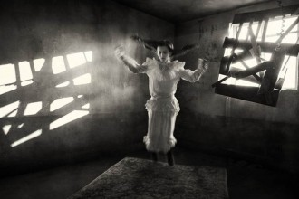

# 疯姑

我是被一个疯子养大的。

我小的时候因为父母都要上班没人照顾而在爷爷家里寄养了一段时间，后来母亲看到我在爷爷家里被养得浑身野劲满口脏话实在不妥，于是就把我领了回来，让我那有脑膜炎后遗症智商只有八九岁孩子水平的四姑接了过来，由她来照顾我。那段和那个疯姑姑一起度过的时光，让我至今仍然怀疑我是捡来的。

四姑是家中最小的，八岁的时候患上了脑膜炎，似乎是因为调理不好而留下了后遗症，然后就一直保持着那个智商，一直像个小孩一样任性脾气暴躁，家里人也都因为她脑子不好而容忍迁就她，甚至是格外地宠她。父亲曾经对我讲过，刚刚改革开放的时候，奶奶就在爷爷工作的医院旁开了一家小卖部，一边照顾生病的四姑一边卖东西。小卖部以卖零食为主，四姑就天天坐在她的母亲旁，几乎没有一刻嘴里不是在嚼着什么的，奶奶也总是宠溺地任由她去，四姑的一口烂牙就是拜此所赐。

四姑被接到我家来照顾我的时候大约就和我现在的年纪差不多，那个时候的我大概是四岁，估计当时父母认为一个智商为八九岁孩子水平的成年人照顾一个四岁的小屁孩应该是绰绰有余的吧。然后她就来了，穿着一件劣质的玫红色T恤，发黄的长发被打成乱糟糟的麻花辫系在脑后，皮肤被晒得黝黑发亮，提一只深色的行李袋红着脸跟在我父亲身后。母亲打开门冲我喊了一声四姑来了，我从客厅里的沙发上一下子站起来探头望了望玄关，她瞪大了眼睛看着我好像在笑。我害羞起来跑进了自己的卧室。

四姑在我家的职责主要是照顾我同时帮着做一些家务，在母亲花了好几个小时教她用电饭锅煮饭但是她煮出来的饭不是烧糊就是夹生的之后，她的职责就仅限定在照顾我这一项上了。

其实我想不出来我究竟有什么好照顾的，由于父母没空带我出去玩也不许我下楼和别人家的孩子一起玩，我打小就培养了良好的自娱自乐能力，一条手帕叠成正方形长方形三角形系在头上系在手上系在绒布狗熊的耳朵上我就能非常投入地玩上一整天，即使没人照顾也不会像其他的熊孩子一样爬阳台攀栏杆惊动消防员叔叔。于是四姑照顾我的内容就变成了每天坐在沙发上一边吃花生瓜子核桃香蕉雪梨荔枝白薯糍一边看各种电视剧。父亲曾经问过她知不知道电视里在演什么，她露出那种智障儿童特有的笑抓了一大把花生塞进嘴里什么都没说。后来一个乡下的亲戚来家里小住了一段时间，每天就陪着四姑看电视，看那部琼瑶的《海鸥飞处彩云飞》。那个亲戚是文盲既看不懂字幕也听不懂普通话，可还是看得很起劲。父亲多年后仍然一遍遍地拿它当笑话来讲，一个文盲一个白痴，什么都看不懂可还是看得咯咯笑。我想父亲这种智商正常的人一定是无法理解他们的欢喜悲伤的吧。

当四姑全神贯注地嗑瓜子看电视时我通常是呆在房间里看小人书玩手帕，两人自得其乐井水不犯河水，但是有时候我也会触怒四姑，虽然我也不大记得好脾气如我究竟是如何惹毛她的。四姑在长大以后也帮着爷爷做一些粗重的活，四肢精壮有力一巴掌下来掌印清晰啪啪作响，我不甘示弱立即哇哇大哭。我一哭四姑就没辙了，因为会吵到她看电视，而她又不能拿个枕头闷死我。最后她想到了一个好主意，每当我哭的时候就把我抱起来拎到楼上通往天台的小阁楼里，然后关起门来就可以继续安心地看电视了，等到我哭得声嘶力竭哭不动了她就再把我拎回来。我小时候本来是很害怕那个小阁楼的，因为母亲为了阻止我没事乱跑让她找不到而编了各种恐怖的妖怪传说，住在那个小阁楼里的妖怪名字叫做山外婆，是专门吃小孩子的红眼睛怪物（在母亲的故事里怪物都是专门吃小孩子的）。四姑一抱我上小阁楼我就哭得更凶了，害怕会被红眼睛的山外婆吃掉。但是后来被抱上小阁楼的次数多了，从来都没遇到过红眼睛的生物，我也就渐渐不害怕那个地方了。有一次四姑把我抱上去之后，估计是磕瓜子磕得太投入，忘记我还在阁楼上这回事了，结果等到父亲下班回来问她我在那里时她才跑上阁楼把正在玩蚂蚁的我抱下来。父亲知道这件事后训了她一顿，从此我就再也没被抱上阁楼过。不过无缘无故挨打倒是经常有的，四姑那个时候病情还不太稳定，有时候会陷入歇斯底里用她的长指甲掐我，那种钻心的疼深深地烙在了我的记忆里，以至于四岁前后的事情都不记得了唯独记得和四姑在一起的日子，她用长指甲掐得我生疼。

四姑是个很爱美的人，在这一点上我觉得她已经超过八九岁孩子的水平了。她住在我家的那段时间每天早上都要拿一只锡碗装满水放进冰箱的冷藏室里，等到中午冻成结实的冰块再拿出来敷脸或者说是在脸上蹭来蹭去，她说这样可以变白。我不知道她是打哪儿听说的这个偏方，也不知道她哪儿来的勇气把那么冷的一大块冰块抓在手里往脸上蹭，手和鼻尖都给冻得通红。我已经不记得四姑最后离开我家的时候到底有没有变白了，但是既然她能如此坚持不懈地每天拿冰块冻自己一次这个偏方想必也还是有点效果的吧，尽管此后的这么多年怕冷的我从未敢尝试过它。

四姑还特别爱给自己编辫子，如果她在看电视的时候没有在磕瓜子或者是吃别的东西，那她就一定是在给自己梳辫子。尽管她这么热爱梳头，她的辫子还是弄的一团糟，因为脑膜炎后遗症使得她不能灵活地控制自己的手指；我很难想象奶奶生前是如何一遍遍地教会她给自己梳头编辫子的。

四姑大概来照顾了我半年之后，母亲觉得她不会做家务脾气又坏成天疯疯癫癫的，于是就把她打发回了爷爷家，另请了一个小保姆。四姑回去之后不久，就经人介绍嫁给了一个开客车的司机。那司机原本是租客运公司的客车来开的，他以给他买一辆自己的客车为条件娶了四姑。当时家中的几个兄弟姐妹东拼西凑买了一辆大客车，还包了所有婚宴的费用，终于把四姑嫁出去了。她嫁过去之后不久就怀孕了，生了个女儿，结果那个司机的态度一下子就变了，开始常常和她吵架。四姑说话不利索思维跟不上打架也打不过，于是就只能靠摔东西来表达愤怒。后来有一天那个司机拿了家里的积蓄一溜烟跑了，丢下一个女儿给她，四姑连自己都养不活更别说养孩子了，那个可怜的小女孩就被送到了一个乡下亲戚的家里；四姑去看过她两次，然后就再也没去过了，好像忘了她还有这么个女儿。

过了几年四姑快要三十岁了，家里人觉得再嫁不出去就完了，于是又备了丰厚的彩礼，把她嫁到了一个偏僻的山村里。那次去参加她的婚礼可能是我人生中最刻骨铭心的一次了，因为一路上各种盘山公路弯弯绕绕颠簸不平，我坐在车上吐得死去活来生不如死，到了目的地翻着白眼就只剩半口气了。那天四姑穿了一件毛色的高领毛衣和枣红色的西装外套，辫子估计是别人给她梳的格外地整齐，脸颊红红的就和我小时候看见她拿冰块敷脸之后被冻得通红的那样。她一看见我就露出特有的傻傻的笑伸出手来抓住我的胳膊，长指甲掐得我生疼。婚宴结束后我一想到又要走几个小时的盘山公路我就难过得一屁股跌坐在门槛上大哭起来，父亲以为我是舍不得四姑就安慰我说以后常带我来看四姑，我一听哭得更凶了。

后来四姑生了个大胖小子，长得和他父亲一样丑。过年的时候四姑给他穿上土里土气的大红衣裳戴着他奶奶给织的绒线帽子抱着他回娘家，激动得本来就讲不利索的话讲得更不利索了，于是就一路龇着牙皱起鼻子露出当年看《海鸥归处彩云飞》时的咯咯的笑。

今年年初的时候爷爷中风了，神经似乎受到了损伤变得疯疯癫癫的谁也不认得了，四姑坐车从盘山公路上一路绕回来看他，他当头就给了她一个耳光。四姑坐在旁边脸上带着那个火辣辣的巴掌印，豆大的眼泪啪嗒啪嗒往下掉。我站在一旁看着她，突然发现她长了好多皱纹和白头发。我一直以为四姑是不会老的，她一直像个八九岁的任性的小姑娘。

我记得她住在我家的那个夏天，每个中午用冰块敷完脸之后都会向我父亲要几块钱去买两个冰淇淋，然后和我坐在大院里的树荫底下一边舔着冰淇淋一边聊天。我实在想不起来那时我们究竟聊了些什么，也不知道一个四岁的小孩能和一个疯子聊些什么，只是依稀记得那是很快乐的时光，中午刺眼灼热的阳光，深色的随风而动的树叶的影子，冰淇淋上油腻的奶油融化滴在地上招来细小的蚂蚁被我用手指一个个碾死。此后这么多年我都不断回想起那段时光，在那段时光里我和一个疯子达成了和解与共识。

(采编：刘迎；责编：刘迎)
