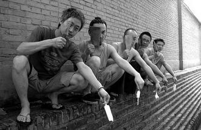
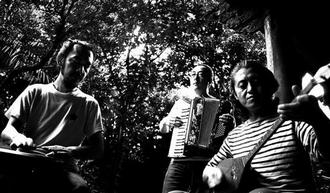

# 白银饭店

念初中时，我的一个同学假期去东北老家探亲，某天出门不幸遭遇流氓。

他们拦住我同学问：搁哪来的？我同学回答：白银。

他们冷笑：别整事啊，再问你一次，搁哪来的？

我同学又回答：大哥，真是白银。

他们给了我同学一记恶拳：白银，你还黄金的呢。

他真是白银的，我也是白银的。白银是一座工业小城，在西北戈壁滩里的一片戈壁滩上。

形容那里最贴切的语言来自一位国际友人。数年前的某天，她怀着对西部传奇土地的向往坐在开往白银的大巴上。望着外面无边的戈壁滩，国际友人陷入了沉默。良久，她回顾问我：你家是在月球上吗？

那里是地球，东经一百零三度与北纬三十五度之间，孤零零的白银。

五十多年前，在那片戈壁滩上发现了一个巨大的矿，随后很多人从各地来到了那里。他们架起各种大型机械不停地往地下挖，直到把那片荒凉的戈壁滩挖得灯火通明，兔走狼奔。

当年怀着建设祖国大西北理想闯进无人区的时髦工人们，在那里生根发芽。而我们，就是那些芽。

白银饭店本来是供各路开拓者落脚的国营招待所，九十年代初被私人承包，修建后一举成为城中最好的宾馆。我们和它的关系源自它的一楼，那里曾经有个舞会。

在众多娱乐方式还没有诞生的年代，率先亮起霓虹灯招牌的舞会，像通往新世界的入口一样挤满了年轻人。不会跳两步交际舞的人，成了孤独的人。

每晚各厂矿的红男绿女们换掉工作服准时来到白银饭店，舞会中间的舞池像条河一样，把他们分隔在两岸。开场后小伙子们前赴后继地奔赴对岸，一手放在背后一手伸向心仪的姑娘，装作很得体的说一句：姑娘，给个面子吧！

做出这个手势，其实需要很大的勇气。戈壁上长大的姑娘们不讲究温婉，每支这样伸出去的手，都要准备好面对冰冷的拒绝。因此很多人在舞池旁整夜徘徊，最终也没能把手从自己坚硬的自尊心里伸出去。

每晚都在那里，却不惹红尘的人只有我们，舞台上的伴奏乐队。我们要做的是：当他们需要灯光看清舞伴时，给他们一首明亮的快曲子；当他们不需要灯光让别人看清自己和舞伴时，给他们一首缠绵的慢曲子。

我们乐队的灵魂是台电子琴，这种来自日本的神奇机器有个叫“自动节奏”的功能，按一个键，吉他贝斯鼓就都有了。所以我们演奏乐曲的方式很简单：电子琴的自动节奏打底，大家用各自的乐器，把那些曲子的主旋律轮流奏出来就行。

别人演奏时，其他人就在台上干站着等着轮到自己。没有谁会觉得这种方式很傻，每个人演奏时情绪都很饱满，把自己弄得如痴如醉。

越是寂寞的地方，音乐就越受欢迎。这是经过了这个星球所有沙漠戈壁居民共同认证的真理。所以白银饭店里不论在冷艳路线上走得多么坚决的姑娘，当我们乐队成员出现时，也多少会给出个温暖些的表情。台下的情种们更是主动地和我们接触，因为这样可以在某个时候打开方便之门。譬如，在演奏某曲前帮他们当众念出：

“某霞，某钢为你点播这首歌曲。他说昨晚我们去看电影，电影没你好看，你比电影精彩。”

在这个充满荷尔蒙的舞会里，几乎每天都会发生不同程度的武力摩擦。附近的警察很快发现这里是个永不停息的麻烦之源，就在白银饭店门口设立了一个治安岗亭，每天派一位治安联防人员坐在里面，震慑着舞会里那些蒸腾的荷尔蒙们。可尽管有了这种震慑，荷尔蒙们之间的摩擦却从没有停止过。

戈壁上长大的小伙子们，斗殴前通常没有太多对白，双方互致最质朴的恶言后立刻争分夺秒出手。每当斗殴发生，舞会的工作人员便会打开所有的灯，等着治安人员赶到。这些治安岗亭里的人被荷尔蒙们统称为“公家”，斗殴中吃亏的人宁可说自己撞到墙上了，也不会对他们出卖自己的对手。

就像戈壁滩上突然刮过的狂风一样，荷尔蒙们之间的摩擦来去激烈而简短。大家稍作歇息后，又踩着两步开始跳舞了。而我们也在那里养出了处乱不惊的气质，不管台下发生了什么，我们也不会停止手里正在演奏的曲子。

数年后，我在电影院里看《泰坦尼克号》，当船上的乐队演奏着乐曲随船沈入大海时，我为我们伟大的职业素养流下了眼泪。

九十年代，刚成为一名舞厅伴奏乐队学徒的我，傻楞楞地站在台上等着自己的段落到来。屋顶老式彩灯打出的光圈在舞厅里旋转，所有人都在这些光圈里忽明忽暗。那个永不疲倦的主旋律还在循环着，慢慢地我就注意不到那个旋律了。时间变得缓慢无比，好像稍不留神大家就会和白银饭店一起，从这片戈壁滩上风化了。

有一天舞会中场突然停电，我们的电子琴像块烫衣板一样趴在架子上没有了声响，荷尔蒙们躁动了起来。队长只好从后台取出一把破木吉他来救场，路边吉他手出身的他，终于摆脱了那台他也不是很能驾驭的日本机器。在几根蜡烛的光里，九十年代那些失魂落魄的港台情歌被他开闸放水般的唱了出来。

身边蒸腾的荷尔蒙们出乎意料地平静了下来，他们放下手头的爱恨情仇，一首首地跟着队长合唱。那个惨兮兮的戈壁停电夜，白银饭店里面暗流涌动，某种说不清的东西打动了每一个人。那些晚上还要穿过漆黑戈壁去上大夜班的荷尔蒙们，隐藏在心里的茫然和卑微被哀伤的歌曲牵引着，在黑暗中弥漫开来。

舞会散场，大家都舍不得离开。就坐在白银饭店门前的马路边上，喝酒弹吉他继续唱歌。当晚，正好赶上冶炼厂的大烟囱定期排放积聚的废烟。我们坐在路边，远处的浓烟像大雾一样朝我们笼罩过来。大家都有点醉了，看着四周慢慢变得模糊起来。

有个人喝多了，在浓烟里激动地走来走去。在他旁边，正坐在马路边上给一帮小屁孩讲宇宙飞碟史的青年，就是郭龙。

某位西方著名人士的墓志铭上写着：生命不论怎样度过，都是遗憾的。而革命电影“红岩”里小萝卜头的故事告诉我们，生命不论怎样度过，都是幸福的。

十八年前，在西北戈壁滩上的白银饭店，两个青年开始了他们的音乐生涯。

我和郭龙第一次见面时一九八九年的秋天。还有一周升中学的我，拿着家里人给的两毛五分钱去新华书店买三角板。途经一片沙枣树林，突然出现了几个穿着黑背心的人，毫不留情地抢走了我的两毛五分钱。郭龙就是其中一个。

中学开学，我在同校学生里发现了沙枣树林里的那几位。胆战心惊地过了一个学期后，我和郭龙成了朋友。

我们都出生在一九七六年。那年一月敬爱的周总理去世，举国悲恸之后的夏天，郭龙先我一步出生。之后朱德总司令去世，唐山大地震，毛主席去世，神州大地在接踵而至的追悼会哀乐里乌云密布。我，出生了。因为多了这短短半年的胎教，使得日后不论何时何地，我的表情总会显得比郭龙苦那么一些。

我们住在一墙相隔的两个工厂家属院里，都是家里最小的孩子。郭龙的父亲是工程师，我的父亲是音乐教师。小时候他在墙那边躺在床上看科幻世界，我在墙这边对着五线谱数蝌蚪。

白天，大人都在工厂里面，整个白银安静得像座空城。工厂喇叭里定时响起的号声从远处传过来，那声音如同宗教一样召唤着我们。对于我们来说，工厂就是世界的中心。迷宫一般的大小车间里面，庞大的机器喘着节奏均匀的粗气，下白班的人们和上夜班的人们在路口交错而过。那里的一切都平静地重复着，好像永远也不会停下来。

五线谱上的蝌蚪和科幻世界里的飞碟，只属于外面那个世界。我们曾经走到那片戈壁滩上向外张望，无边的荒野上风吹着野草，几只蜥蜴飞快闪过，那里什么都没有。

我和郭龙认识以后，迅速结伴成为了问题学生。我们经常一起旷课，在郭龙他们厂家属院的凉亭里度过整个下午。我们在那个凉亭里学会了抽烟，很当真的结拜过兄弟。我们说着漫无边际的玩笑，一直等到学校放学，才混在同学的队伍里面回家。

也是在那个凉亭，我们认识了一位在监狱里苦练过三年吉他的人，他就是白银饭店弹电子琴的那位队长。队长曾是小城里的传奇人物，带着系红纱巾的军裤，骑着自行车在大街小巷呼啸而过。八十年代初那场著名的“严打”开始后，他被政府送到监狱里住了几年。在那里他学会了吉他，从此苦练指法，走上了音乐之路。

他会唱很多监狱里的牢歌。那些歌的歌词都很长，唱起来远远的，很伤感。他说那些歌都是西北传唱了很多年的老歌，在监狱寂寞的夜里，大家都要唱着那些歌才能睡着。无数烟酒嗓子合唱出的歌声，从一扇扇铁窗里传出来，在空荡荡的院子里飘荡。这个场景，让我身上从小被父亲用竹棍逼出来的音乐细胞，彻底变异了。

从那时起，音乐成了我们最热衷的事情。我们拜队长为师父，成天端茶递烟地跟在他的屁股后面，一路跟进了白银饭店。

当我们开始在家属院凉亭里抱起吉他的时候，新的时代也降临在这座小城。它快得像台碎纸机，转眼就把戈壁滩上的那幅社会主义蓝图报废了。发廊音像店雨后春笋般出现在每条街道上，来自外面那个世界的声音逐渐笼罩全城，它淹没了工厂喇叭里的号声，也吵醒了小城白银做了几十年的集体梦。

戈壁上的风夹着沙粒打在每家每户的窗户上，父辈开拓者们在百思不得其解的变化中彻夜难眠。而我们却在窗外的大街上唱着新鲜的歌，从他们设计的轨道里脱缰而去。

白银饭店就屹立在那个交替的缝隙里，我们在那些忽明忽暗的光圈里面旋转着。家人认为我们在那里无非就是虚度时光，可她们没想到我们竟然从那里越走越远，一直走出了她们的视线。

在那个惨兮兮的戈壁停电夜，我们坐在白银饭店门口的马路边上，弹着吉他喝酒唱歌。像是从上辈子那么远的地方喷出来的最后一口浓烟，大雾一样朝我们笼罩而来。大家都有点醉了，看着四周慢慢变得模糊起来。

有个人喝醉了，不停地对别人说他要走了，要永远离开白银了。大家很冷淡地任由他掏心挖肺告别，因为所有人都习惯了，这个人每次喝醉都要和大家玩这个生离死别的游戏，谁都知道明天醒来他仍然还在，哪儿也不会去。

那个人就是我。如同前年冬天我就告诉别人这张专辑隔月就要出版一样，本性确实难移。可这张专辑终究会出版，我们也终究会离开白银。

九十年代末，北京成了又一个黄金世界，很多人从各地来到了那里。他们骑着单车坐着公交不停地忙活，直到把那座古老的城市忙的灯火通明，车水马龙。

当年怀着各自理想闯进首都的青年们，在那里生根发芽。而我们，就是他们。

二零零九年，我和郭龙住在东直门一桥相隔的两个小区里。在北京生活了十年后，我们终于开始着手做这张专辑。平时除了排练，郭龙在桥那边给他的四只猫把手风琴，我在桥这边抱着吉他写这些歌。

我把写好的旋律录下来，一遍遍地循环播放，然后就在那个永不疲倦的旋律里坐着，等着歌词自己长出来。慢慢地我就注意不到那个旋律了，时间变得缓慢无比，好像稍不留神我就会和我的房间一起，从这个城市里消失掉。

我想起了小时候在家里的情景。那时候每周二的下午学校都会放假，家人午休过后，就把我锁在屋子里上班去了。整个下午，屋子里静悄悄的一丝风都没有，灰尘在阳光里飘来飘去，工厂喇叭里的号声正从远处飘过来。我就那么在房间里坐着，什么也没想，什么也没做。两个卖菜的大妈坐在窗外的树荫下面，等着人们从工厂下班。一个大妈说：今年的洋芋特别沙，撒上些白糖，就是苹果的味道。

是啊，那年的洋芋特别的沙。就像那年的我们一样，坐在命运给我们的故事里，看着幕布缓缓拉开。当列车驶过戈壁滩上的戈壁滩，当我们背着乐器走在异乡的路上，多希望自己有个温润封面的过往，可我们只有这个故事可讲。

当年父辈开拓者来到白银，把青春埋葬在那片戈壁滩上。小城白银掏空自己完成了使命，最后只剩下城中那个残破的纪念碑。白银饭店里的那些红男绿女，如今也被戈壁滩上的大风吹得黯然失色。她们沉默地路过那个纪念碑，纪念碑上两个意气奋发的青年正举起一块巨大的矿石。

当我想起那片荒凉的戈壁，我就写：

向左向右风筝和飞鸟

站在荒野上面看天色变暗

你让我猜猜中会有奖

将我的手表上面时针倒转

当我想起冶炼厂烟囱里的浓烟，我就写：

黑夜白天迷雾已笼罩

那座名叫白银饭店的孤岛

此刻我在在那里奔跑

奔跑在那片深远未知的蓝

2012年3月 上海

(采编：王卜玄；责编：王卜玄)
