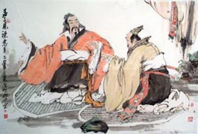

# 百步笑五十步

亚圣孟子在跟梁惠王聊天的时候，说了这么一段话，打算教育梁惠王：“（指临阵脱逃的士兵）……或百步而后止，或五十步而后止。以五十步笑百步，则何如？”（《孟子•梁惠王上》）孟子他老人家说了这话以后，我们后代都很信服。圣人说的话嘛，自然有道理，要不然怎么叫圣人。这话放到现如今来理解，大致是这样子：小红考52分没及格，你小刚考58分，也没好到哪儿去，不要笑话人家；老孙你一天抽两包烟，也别去批评隔壁老刘一天抽三包的习惯不健康；如是等等。

不过，在下倒有个和老孟不一样的看法。我斗胆说一句，不仅“五十步笑百步”没什么问题，连“百步笑五十步”都是值得肯定的事。我认为，事实判断，要优先于立场、道德、是非、价值判断。而事实判断的对错，只与客观事实的真伪有关，和评判者的个人身份和品行无关。怎么讲？比如说，我们的共识是“临阵脱逃可耻”，那么接下来只需进行事实判断：你逃跑了没有？逃跑了多少步？只要你逃了，行为发生了，那么在“逃跑可耻”的前提下，你的确做出了可耻的行为。无论是五十步，还是一百步，都是错误的。更重要的是，凡是发生了的事实，任何人都有资格去指出和批评，就像任何人（无论是纳粹还是恐怖分子）都有资格陈述“二加二等于四”这一事实一样。

为什么我偏要和亚圣他老先生对着干，来指出这一点？因为我深感我们的社会对于批评的容忍度太低了。我们华语社会（特别是中国大陆），是一个弊病诸多、需要批评，但又恰恰缺乏诤言的社会。我们不仅要求批评本身在事实层面上是对的，还要进一步苛责讲话者、批评者个人的身份、立场、动机、学养、水平甚至私德。而如果批评者身上有哪条未能臻于完美，那从他口中说出来的话，特别是那些我们不愿意听的话，我们便有了拒绝接受的理由。例如，我们经常听到这样的辩驳：“你们有什么资格批评XXX，换了你到他那个位置上，你能做的比他好么？！”听起来，很有道理，翻译成文言文，就是告诫我们“不可百步笑五十步”。然而如果社会真的成了这个样子，那我们还能剩下多少有益的批评！试想，影评人不可以评论导演的失误，足球迷不可以抱怨中国男足的水准，歌迷不能谈论音乐家作品质量的下滑，而广大民众——只要达不到优秀政治家的条件——就完全没资格批评政府和官员！

所以我才说，不仅“五十步”可以笑“百步”，甚至“百步”也可以去笑“五十步”。我们应该就事论事，应该坚持真伪先于善恶、事实先于立场的原则。只有这样，我们的社会才可以最大限度的鼓励、倾听批评的声音，进而去解决社会弊病。警察审讯犯人，不就是这样吗？一个偷窃犯也可以检举杀人犯，杀人犯可以检举连环杀人狂。如果我们用一句“五十步笑百步”堵住他们的嘴，真是不知道这世界上会多出多少逍遥法外的罪犯。

PS.至于大陆政府发布《美国人权白皮书》——厚道地说一句，它的确指出了美国客观存在的人权问题，这谁也不否认。促进一下美国的人权事业，帮助督促美国政府改正错误，也是好事一桩。此乃是非层面。至于我天朝自己身上的确不太干净，或者说比老美更不干净，让这种指斥显得无耻，那是道德层面的另一回事了。(还是那个例子，想象一个连环杀人狂谴责一个普通杀人犯残忍、没人性吧。)

（荐稿：刘一舟；采编：张舸；责编：张舸）
