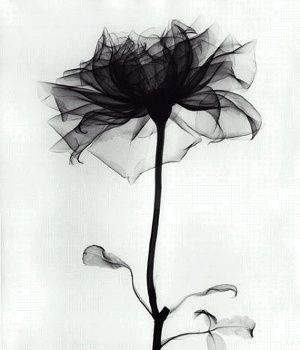

# 砰！跑！

**孩子依旧哇哇的哭着，闭着眼睛哭，睁着眼睛也还是哭。终于，它好像看到了自己的母亲，不会说话的嘴巴里发着“么”“妈”难辨的声音，一边把自己的脑袋毫不犹豫地埋进母亲沉甸甸的乳房之间。** **于是，谢里夫决定回到餐馆去找那个女服务员。**

# 砰！跑！

## 文/阮卒（南京大学）

 

被云过滤得很干净的月光照在无人的石头路上，上面点缀着马粪或是人粪；照在路旁的树叶上，上面落满了呛人的尘土；照在窗台上，那里摆放着死了很久的盆栽。而有时候，月光也会不辞辛劳地照进肮脏的出租屋里，那里有刚住进来的谢里夫。

出租屋里，墙面被粉刷成白色，月光照在上面，让它显得很脏。窗户没有关好，风徐徐吹进来，纱制的窗帘飘浮在空气里，像展开的孔雀尾，目光所及，有的是各种污渍和各色血迹。谢里夫在哪里？燃烧的烟草里飘出蓝灰色的烟，低头看看，他正在那里呢：躺在一张房东赠送或者说是来不及丢弃的旧床垫上，睁着眼睛，那蓝灰色的烟从口鼻里冒出来。如果忽视那张刻画满无眠两个字的脸，谢里夫就像是一堆正在喘气的烂肉。

谢里夫，37岁，刚刚放弃了之前的工作。我知道他之前做什么，但先不说这个。

有工作，就会有一堆麻烦；没有工作，搞不好就会饿死。

“死？我是什么时候知道有这么回事的？”

刚知道自己会死的时候，小小的谢里夫扶着父亲的膝盖哭了很久。

“我不想死……呜呜呜，爸爸，我不要死……”

父亲总是值得信赖的，母亲也是。他们在家，谢里夫就感觉到有什么东西活着；他们不在家，谢里夫就觉得什么东西死了。可后来谢里夫才知道：原来父亲也是会死的，母亲也会。终会有一天，父亲死了，母亲也死了，他们便不再回家。但是，也许那时谢里夫却还活着，就像现在一样。

“然后到了晚上，就会黑魆魆一片，看不见什么，也听不见什么，”谢里夫把快要烫到手的烟头在旁边的破收音机上熄灭，“就像死了一样，就像现在一样。”

这就是死亡，在我们还喘气的时候，被称作孤独，或者其它的什么。

谢里夫一直像个死人，现在没了工作，就更加接近了。他不缺少休息，他想熬过这么一个让人焦躁的晚上——嗯，死上一夜，如果撑不过去。

“就干掉这个杂种。”谢里夫打开了手枪的保险。

睡不着，就打手枪。把枪管塞进嘴巴里，枪口抵住上腭，扣动扳机，它打爆你的脑袋，就像打爆一个易拉罐。“砰”得一声，血浆向下流，烟尘向上飘——然后一切都不再和你有关，你的问题都解决了。聒噪的人群不见了，只剩下你和死亡在一起。

像死了一样，孤独地熬过一夜。然后，因为疲惫，睡了一天，像死了一样。

傍晚的时候，啤酒经过带着燃烧后烟草气味和口臭的口腔，顺着食管，直下谢里夫的胃。他的白衬衫外面套着黑色的夹克，浅蓝色的裤子下面是咖啡色的旅行鞋。旅行鞋踩扁了空罐子，右手把手枪放进了夹克的内袋。

酒精、疲劳、孤独都可以让人产生漂浮感，谢里夫就像鬼一样出门了。

天已经差不多黑了，谢里夫依然不知道自己要去哪里——他工作了这么久，不习惯这种闲逛；他离开旧市也很久了，连小时候住的破公寓都找不到。

他正要从一条小巷的阴影里走出来的时候，他被几个男人拦住了去路。

“不想死的话，就把身上的钱交出来。”一个男人掏出匕首。

“那就快点让我死吧，我不想看见你们。”谢里夫掏出手枪。

“他有枪！”吓破胆的都一哄而散，只丢下一个吓软腿的倒在地上，两手捂着脑袋。

谢里夫收起枪，向着地上的人走过去。地上的人使劲地蹬着两腿想要站起来逃跑，可是挣扎了很久也只是在地上扭动着，像只蠕虫。他哆哆嗦嗦地打开一只手，惊恐地看着谢里夫。

“马特？”

谢里夫没有认错，地上的人正是他孩童时期的邻居。

马特，男，34岁，不知道几岁的时候因煤气中毒导致脑损伤，无业。

餐厅假装自己很华美，谢里夫假装自己很富有——他装得是如此逼真，几乎连他的钱包都快要相信这一切都是真的。坐在这里，你甚至不知道什么不是假装的。可是，一切又那么相得益彰，如此自然，未经雕琢。

“两位先生，这是您要的。”一个长相和餐厅一样不那么精致的女服务员走了过来，脸上架着眼镜。

谢里夫把手伸进夹克的内袋里，马特看着另一边，自顾自地傻笑着。

远远的，是另外一群用餐的人。他们有的穿着成这样，有的打扮成那样。他们假装自己的每句话都经过了大脑。而她们听到了，则轻轻地笑着，回答着，假装自己的每句话都经过了内心。

“先生，您还没有付钱。”服务员提醒着，脸上露出了微笑。

“哦，对不起。”漂浮着的谢里夫好像忽然撞在了什么软绵绵的东西上，他抬起头，端详着女服务员的脸，“嗯，对不起。”

谢里夫竟然有些慌乱。他的手在口袋里掏着，摸到了里面的手枪，便轻轻地让手指躲开了枪身，在靠内的一侧找到了钱包。而拿出来的时候，一块谢里夫用了很久的手帕也夹在钱包中间跑了出来，掉到了地面上。谢里夫急忙弯下腰用左手去捡，右手攥着钱包摁在桌子上。而当枪就要从倾斜的口袋里滑出来的时候，谢里夫的右手又不得不丢下钱包去护住口袋的开口。

经过这狼狈的一阵，谢里夫的额头微微沁出了点汗。掏钱的时候，女服务员已经忍不住轻轻地笑了起来。谢里夫把钱递给她时，不禁也尴尬地笑了笑。

“我以为只有我父亲那个年纪的人才会随身带这种样式的手帕。”女服务员说着，声音里带着笑意。说完便仿佛很高兴地走了。

马特还是自顾自的傻笑着，不过更加欢快了。谢里夫把钱包和手帕放回内袋里，忽然觉得女服务员的影子里仿佛有些颜色，不禁多看了一小会儿。

他们本想在餐厅在多聊那么一会儿，可是最终还是没能实现：一来，脑损伤的马特如过去一样，其实并没什么会说的，你也无法知道他有没有听懂你说什么；二来，马特不知道什么时候把精液射在了裤裆里，在没有穿内裤的情况下。

于是，马特回家了，剩下谢里夫一个人趁着更新后的醉意漂浮在路灯下的街上。

“看来这傻逼的妈妈活了这么久还没死呢。”谢里夫漂浮着，东张西望着，嘀咕着，“这女人可真是个倒霉鬼。”

转过一条街，就是另一条街，再转过去，还有。

“没完没了。”

嘴上说着没完没了，谢里夫却在小镇唯一的医院门口停了下来。他也曾从这个门里走出来过，最后一次则是在母亲去世的时候，再早些是父亲去世的时候，中间只隔了四个月——当然，这时间对于当时的谢里夫可真是久。母亲死了以后，谢里夫离开医院，也离开了旧市，直到这次回来。也不知道他这样算是出去度了个长假回来了，还是回来休一个长假。

“谁知道呢，”谢里夫抬着头。

父母去世了，父母同辈的人差不多也都死了。可是……

“医院却总能有人可死。”

谢里夫不禁想到了小时候看到父亲在床上把母亲压在身下的场景，哈哈大笑了起来。

正巧这时，一个女人抱着自己生病的孩子出来了：孩子小的看不出是男是女。谢里夫没养过孩子，也不知道这孩子有多大。但不管这些，孩子却结结实实地被谢里夫的笑声吓醒了，它睁开眼，看着谢里夫方向，停了停，然后哇哇大哭。

年轻的母亲没有时间呵斥粗鲁的谢里夫，她手忙脚乱：把双手移到孩子的腋下，把孩子的脸从对着谢里夫的方向转到了自己这边，重新抱进怀里。

孩子依旧哇哇的哭着，闭着眼睛哭，睁着眼睛也还是哭。终于，它好像看到了自己的母亲，不会说话的嘴巴里发着“么”“妈”难辨的声音，一边把自己的脑袋毫不犹豫地埋进母亲沉甸甸的乳房之间。

于是，谢里夫决定回到餐馆去找那个女服务员。

漂浮了快一整天的谢里夫不再是漂浮着的了，他像一辆开足了马力的汽车：转过了一条街，转过了另一条街。餐厅会不会已经打烊了？谁知道，谢里夫也不去管——即便他现在“砰”一下被一辆横着开出来的汽车撞死，我猜他的脸也是朝着餐厅那个方向的。

他走着走着就开始跑，跑着跑着，兜里的手枪就好象要颠着跑出来。开始谢里夫还用一只手扶着内袋，后来扶也不扶。

“掉了就掉了吧，”谢里夫想，“反正我再也用不着它了。”

手枪也很配合，在谢里夫的左胸前晃着，仿佛甩动着的被切了一半的乳房，又仿佛跳动的心脏。

餐厅当然已经打烊了。所以，他们的第二次相遇在离餐厅最近的电车站台。

谢里夫跑上去。女孩儿转过头，没有戴眼镜。她眯着眼睛，看着谢里夫，又是一个轻轻的微笑。

“你好。”谢里夫仿佛到了长跑的终点一样。

女孩儿愣了下，从口袋里拿出眼镜，戴上，看着谢里夫。她最后说：

“不好意思，你是？”

谢里夫没有脑损伤，可他可能不知道：陌生人间的微笑在餐厅酒吧之类可不稀罕，何况对方是个服务员呢？

他就这么傻站着，他听到起跑发令枪的声音了么？哦，不，是继续跑的发令枪的声音。

傻X的老母说：“马特，你刚刚有没有听见焰火的声音？”

傻X：“呵呵。”

“各位听众，播送一条紧急新闻，今天晚上在玫瑰街发生了一起枪杀案……”破收音机里传来了生了锈的人声。

什么焰火的声音？那是谢里夫继续奔跑的发令枪的声音。谢里夫正在收拾行李，他又要继续跑了。

对于杀手来说，谢里夫这也算是干回老本行了。

（采编：应鹏华；责编：楼杭丹）

 
