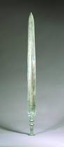

# 磨剑

** 一**

他磨那把剑磨了十年。

十年前，那时正当秦朝，造反是理所当然的。他的爸爸为了不服徭役，也跟着别人造反。

当地的县长把他爸爸那伙人抓住之后杀了。他当时才十七岁，别人跟他说，你老子是被县长干掉的，你要为你老子报仇，杀了县长。所以他就立志要报仇了，至于县长是谁，长什么样子，怎么杀的他爸爸，爸爸为何会被杀，他并没有理性认识。

他妈早死，所以家里只剩下他一个人，本来有几家相处得不错的邻居，也大多因为苦役和造反死掉了。人渐渐少，村子也就渐渐荒废，本来房子四周是水田，如今也成了荒地。他一个人住在荒地里。他本来有机会成为哲学家或者诗人，在一个月夜随风羽化，或者上山去采薇。然而他要报仇，也就不得不饥一顿饱一顿地苟活着。

始皇帝为了艺术的崇高和民族的尊严，铸了十二金人作为秦朝的吉祥物，进而收购了大量金属。民间的兵器便绝了迹，农民都用石头耕地，过年杀猪用的是竹片，所以猪肉吃着有股雅致的味道。人民起义也就只能用石刀木剑，偶尔投掷蘸了猪油的火把。这样的初级装备，面对开坦克的政府军，失败是注定的。据说北方有的起义军在冬天把报纸沾上水放在室外做成冰刀，效果奇佳。然而他住在北纬三十度附近，一辈子没有见过冰，也就找不到合适的工具报仇。生产工具是生产力中的核心要素，杀人亦是如此，所以他非常渴望能有好的武器。

虽然如此想，他却有几分奥博洛莫夫习气，每天都坐在那片破败的荒地里，等待着上帝赐给他一把神兵，这样他就能大显神威，演一出哈姆雷特的好戏。就这样过了三年。没有九天玄女下凡赐予南北精铁，在田沟里挖红薯时也并没有掘出蚩尤的股骨，他也就饥一顿、饱一顿地苟活着。他时常在睡觉之前提醒自己这件人生大事。然而最近几日来，在他因为饥饿而变得恍惚的思绪里，爸爸那张沟壑万千的脸已经渐渐模糊了。

那一夜格外闷热，他身上起了湿疹，又痒又潮，便去井边打水冲凉。那口井没有汲水的轱辘，旁边有一棵树，树上系着一根霉烂的麻绳，麻绳另一头自然是一个霉烂的木桶，桶的一侧固定着一块石头，想要打水时，便把木桶扔进井里，石头会让桶倾斜，水就进桶里，然后再拉上来。他把木桶扔下去，谁知桶侧的石头掉了，桶飘在了水面上，不管怎么弄，都打不起水。他热得发疯，只是把绳子往身上一绕，就跳进了井里。

浸在死水里，闻着清新自然的水臭味，手摸着井壁的青苔，脚踩着井底的淤泥，泥鳅在他的裤裆里钻来钻去，月光从头上的一小块投进来，井口的影子印在他年轻的脸上，好似长了胡子。他好不痛快。一辈子都这样待着该多好，他想。

突然间他右脚似乎踩到了一块尖利的石头，而且似乎划破了，而且似乎在流血。他探身一抹，是很大的一条口子。他吓坏了，怕得破伤风，便抓着麻绳往上爬。但他灵光一闪，俯身往水底的淤泥里一抓，竟摸到一个冰凉、光滑而细腻的事物。他对于这种事物并没有任何感性层面的接触，只知道这绝不是石头。他没力气把那事物捞出来，便把绳子系在上面，自己攀井壁出去了。

脚上的伤让他惊叹不已：再锐利的石头也不至于造成这样细长而深的伤口。他突然回忆起了些什么。第二天他把那事物弄了上来。长约三尺二分半，宽约五分，比石头还要沉，一端尖锐，另一端好像是一个烂掉的木头做的柄，隐约有一点精美的花纹。他知道这一定就是老人们常提到的叫做“剑”的器具。这种器具不能耕田，不能盖房子，也不能杀猪屠狗，唯一的作用就是伤人和杀人。

“啐！也能保家卫国呢！”他脑海里浮现出三叔公那张满是伤痕的脸。三叔公以前当过兵，给项燕将军的副官开过车。跟秦国打仗时，有刺客来行刺楚王，项燕将军用背去掩护王，副官用手去掩护将军，三叔公实在来不及伸腿，便把脸伸了过去。立了三等功后，三叔公带着一把楚王赏赐的剑、两头牛和一个媳妇衣锦还乡，那张被砍得跟烂柿子一般的脸也成了他光荣的勋章。后来楚国灭亡，屈原大夫带头殉国，三叔公也殉，没留下一个子嗣。他媳妇最终跟了一个入驻的秦军士兵。那士兵也有一张烂柿子般的脸。至于那两头牛和楚王赏赐的剑，则无影无踪。

“嘿，其实还能当乐器。”他脑海中又出现了彪舅舅那颗黝黑肥硕的脑袋。作为负责精神文明建设的巫师，彪舅舅有个不好的习性就是好女色。村里好几个小孩子的爸爸不是他们平时叫爸爸的那个人。楚亡秦替，秦朝人崇尚科学发展观，不信巫蛊之术，派来公务员整风。爸爸们怨恨彪舅舅，便写了匿名的联名信。据说彪舅舅被活埋的前一天，关在牢里，还抱着个石头边敲边唱屈原作词的小夜曲，他说，如果这时我的宫商八音剑在身边就好了，唯有弹剑时的寒气金声，方配得上屈大夫的歌。神职人员彪舅舅回归天堂之后，那首屈大夫的小夜曲也随之失传。

“啊！定情信物也是可以的。”他脑海里回响着他奶奶的话。他爷爷是个小官吏，平时的工作是给一个地方上的大夫削铅笔。他奶奶却是大户人家的女儿，家里不许他们处对象，非要他爷爷有房有车有郢都户口，于是便私奔。他奶奶走得匆忙，顺手抄了一把壁上装饰用的古剑当嫁妆。在穷乡僻壤定居、生了八个孩子之后，他爷爷因为有在前朝供事的履历，加上私藏了几本孔孟学派的教材，便被抓去筑长城。他奶奶一个人种田养猪洗衣做饭，奇迹般地把八个孩子全拉扯大了。他还记得那一天他刚刚学会写自己的名字，奶奶在旁边看着，笑得很开心。那天晚上，一大群儿孙围着奶奶的床，看着她那双沉重的眼睑永远地合拢。她穿着私奔那天穿着的少女的衣服，生满老茧的手紧紧抱住那把装饰用的古剑。奶奶下葬之后，那把剑也就再也没有见到过，大概是合葬了。

这把剑，是三叔公的，彪舅舅的，还是奶奶的，他没有充足的材料去考证。他摩挲着剑身，虽然上面生着无数暗红的不知名的癣，但依然能感受到一股又寒又暖的气息，从刃口流进手指，又从手指流向四肢百骸。他仿佛觉得自己强壮了，握着这把剑，手臂仿佛延长了三尺二分半，无所不能。许多早已被遗忘的先祖的魂灵，也凭依在身上，翩翩起舞。他惊异又愉快地把玩着这黯然无光的古老器具，连身上的瘙痒、脚上的疼痛和酷热也抛在脑后。时光飞逝，夕阳西下，他把剑平放在地上，就着那最后的一抹阳光，用最虔诚的姿态向天神匍匐跪拜。

我终于能报仇了，他心想。感谢你，东皇太一，感谢你们，水神河伯，公正无私的大司命王。

夜幕渐渐降临，草丛里的蟋蟀开始了悲歌，旁边的丘陵上生着一片树林，在月色下只剩下轮廓，黑洞洞的，好似一只伺机而动的食肉大兽；风把暑热慢慢吹散，也吹得那片树林呲呲作响，好似兽嚎；风不住地吹着，树丛之间偶尔露出一些天幕的空白，其实也不全是空白，还有几颗稀稀落落的星辰，猩红的荧惑，猩红的大火，像是血光，又像是剑身上的红色苔藓，最像的是野兽的眼，死死盯着，眨也不眨。暗红的剑身在星光下变得猩红，他的脸也被隐隐约约映射得猩红。他累了，猩红色的生满老茧的手紧紧抱住那把猩红色的剑，疲惫的双眼合上。明天要去弄一块磨刀石，他睡着之前昏昏沉沉地想着。

猩红色的梦开始了。

**二**

猩红色的梦结束后，只有惨白的黎明等待着他。剑又沉又大，根本不适合行刺。秦朝没有铁匠这个行业。他想要弄到一块磨刀石，把剑改造一下。

他于是上集市询问。由于战乱，通货膨胀，始皇帝好不容易统一的货币失效，以物易物之风盛行。在集市的西头，一个姓赵的赵国商人对他说，要磨刀石，就得拿新鲜的猪头肉来换。他便去找新鲜的猪头肉。集市的东头，一个姓钱的齐国商人对他说，要新鲜的猪头肉，就要用一只鹦鹉来换。他便去找鹦鹉。集市的南头，一个姓孙的越国商人对他说，鹦鹉有很多，但得用戎地产的马鞍来换。他便去找戎地出产的马鞍。集市的北头，一个姓李的秦国商人对他说，马鞍很便宜，但要用蜀国产的桑蚕布来交易。他便去找蜀国产的桑蚕布。集市的中央，一个姓周的魏国商人说，蜀国的桑蚕布并不珍贵，但是非得上好的磨刀石才能换得一匹。他迷惘了，空手而回。

第二天，他又去集市上找磨刀石。姓赵的赵国商人对他说，要磨刀石，就得拿新鲜的猪头肉来换。他抄起一把小竹片，把自己的一只耳朵风雅地割了下来，血淋淋地放在赵商人的案上，说猪头肉没有，人头肉有，卖不卖。赵商人吓哭了，免费送了他一块上好的磨刀石，上面还有优美的猪头花纹。

他开始磨剑。他先弄来几张砂纸，把那些红色的苔藓（集市上的老人说那叫锈，是金属流的血）磨掉，露出里面黝黑的铁质。他专门从河边汲来几大桶清亮的水，蘸在剑身上磨。他并不懂得怎么磨，只是一个劲瞎蹭，很快地，黝黑的铁质被磨得灰亮，但剑锋却卷了刃，歪歪扭扭不成样子。他思索了很久，总结了之前的劳动经验，找到不少诀窍。渐渐地他也就上手熟练了，时间却已经过了半年，剑被磨得瘦了一圈，河水也已经用光了好几大缸。

剑身上隐隐约约有个字符，磨光之后看，似乎并非篆字，而是一个用楚国古文写的“欧”字。他想这应该就是剑的主人或是铸剑人的名字。他觉得如今这剑已经属于自己，其他人的名字也就不配留在上面，便把那个字磨掉了。

从他把第一只耳朵割下来换磨刀石的那天起，打磨这把剑变成了他生命的全部。他在那片荒地里搭了一个工棚，里面有他用耳朵、头发和小尾指换来的一大堆磨刀石，上面都有优美的猪头花纹，还有两口大缸，里面是清亮的河水，只用来磨剑。那把剑被他端端正正供在一张从破庙里搬来的神案上。他还去建筑工地上给人打工，赚来钱，买上好的油回来擦拭剑身，以免生锈，自己偶尔挖几个红薯、打几只鸟充饥。冬天穿一身单薄，烤烤火也不觉得冷，只要把剑抱在手里，透过屋顶的大洞看看稀薄夜空中的繁星，他便满足了。夏天燥热也无所谓，跳进井里泡凉水澡。偶尔下雨时，他就蜷缩在屋角较干燥的地方，一边嚼吃着飞到屋里避雨的甲虫，一边用上好的松节油擦拭剑身。

剑长三尺二分半，握在手里，仿佛手也延长了三尺二分半，变得无所不能了。他终于在漫长的磨剑过程中悟出了存在主义的哲学。如果想要磨出传说中的惊涛骇浪纹，就得首先对什么是惊涛骇浪有一个感性和理性的双重认识，为了这个，他不惜走了几百里路去了一趟云梦泽，觉得不够气魄，又沿途乞讨着往东海方向行进，在路上被一群土匪截住，没有钱，就被迫入伙，干了一些杀人放火奸淫妇女的事情后趁机逃脱，又往东方去，却水土不服得了热病，不得不回家。走了这一遭，他竟然领悟了“惊”与“骇”的本质，也就磨出了相对完美的纹，但当天晚上他又不满意了，把惊涛骇浪纹尽数磨去，也不再搞其他花样，只是看着月亮沉思。剑越磨越瘦，本是宽大且银白色的，被他用红土掺和上砂石，磨成绛色；有时他厌烦了绛色，就用黑曜石故意把剑身磨花，让它几乎不反光，变成了原初的黑色；黑色却让他老是觉得忧郁，便弄来杨木生火，把剑烤成宝蓝色；但宝蓝色是很俗的颜色，看久了伤眼，他只能又把剑打磨成白色。如此循环往复，他发明了无数种方法来改变剑的外观、颜色和花纹，但每一种都不令他完全满意，不能趋近艺术的极致，他也就继续雕琢着。偶尔晚上做梦，他会觉得自己变成一个名将，拿着这把绝世神兵，东征西讨，百战荣归，娶几百个老婆，生几千个儿子；有时他会梦见自己是一个高洁傲岸的世外隐士，用这把剑奏出无数的正宫变徵、鸾凤求凰，讲述一个个怀才不遇的故事；有时他还幻想着自己是一个剑客，武功高强，惩恶扬善，与女侠以剑定情，闯荡江湖，留下了一对神仙眷侣的传说。曾经杀人放火、奸淫妇女的历史渐渐淡褪了，浸泡在污泥里、腿间穿梭着泥鳅的生活仍然在延续着，却也不以为意。

他成了一个伟大的梦想家，白天磨剑，晚上做梦，透过屋顶大洞看到的星星和没头没脑飞来飞去的甲虫曾是他为数不多的交谈对象，后来也不再交谈，只有剑成了他唯一的朋友，只要抚摸着冰凉的刃，脸侧的疼痛、腹内的空虚和皮肤的瘙痒也就不复存在了。偶尔有野兽来到他的门前，见了他的眼神，也吓得撒腿就跑。人和剑已经浑然一体，人在磨着剑，剑也在磨着他的人。磨刀石上的猪头被磨去了一个又一个，整片荒原之上，秋天般肃杀的剑气笼罩着方圆数里，除了冬天偶尔吹来一阵风沙之外，再也没有别的事物踏入。寒暑交替，第十次看见法国梧桐的树叶飘落时，他惊觉自己的胡子已经有了尺余。而那把剑已经由五分宽变成了三分，锋锐无比，单是在月色下轻轻挥动，那明晃晃的白色剑光也能激射到数里之外，把沉思中的猫头鹰吓得四处乱飞。他还想继续磨下去，因为他想要一把完美的剑，那把梦里的、不知颜色的剑。

有一天，天气万分晴好，他从缸里舀水时，意外地看到了自己满是皱纹的脸。他不认识这张脸，看了许久，竟似乎是爸爸的脸。两张脸在水光天色中渐渐重合，一行大雁飞过，数声清啸，水面起了微微的一圈涟漪。脸渐渐模糊了，他也就只能回忆。回忆了许久，许多熟悉的脸也慢慢浮现在脑海里，三叔公、彪舅舅、奶奶的脸，虽然模糊但又异常鲜明。他不禁松开了手里的剑，一双生满老茧的手抚摸着脸上的沟壑万千，慢慢地，许久未流的两行浊泪从眼屎的缝隙里流了下来，被皱纹的渠道改变了方向，流向了原本属于耳朵、如今只剩下两团发臭的黑痂的区域，在那里汇聚，刺得他火辣辣地疼。他膝盖渐渐弯曲，就像当初匍匐在东皇太一们脚下那样，他匍匐在水缸面前，向着脸跪拜着。在他的身边，剑懒懒地躺在草地上，被正午白热的阳光镀上一层朦胧的膜，十年磨出的锋锐也被膜给模糊掉了。风吹得远处的树林飒飒地响，荒原上寂寥无人，大地是一片令人昏沉的空白。

他磨那把剑磨了十年。他终于想起来要报仇了。

**三**

他在井里把自己洗了个不干不净，剃掉尺余长的头发和胡须，叠了被子，用石灰刷了牙，把喉咙里的蜘蛛网清理掉后，练习了一阵说话。临走前，他把房顶的大洞给补上了。他不知道自己还能不能回来。他觉得，如果自己不能回来，房子以后还能留给过路的难民。但他也并未想到十年来从未有过难民从他门前经过。这片荒原从来不曾有人来过。

他用一块旧麻布把剑包好，紧紧缠在自己的背上。他从早上就开始准备出门，挖红薯做早饭、洗衣服、晾衣服、收拾房间、清理厕所、坐在地上发呆、清理厕所、收拾房间、收衣服、挖红薯做晚饭、坐在地上发呆……所以出发时大概已经二更天了，而且没有月亮，还好并无山路，沿着平原大道，第二天就可以到县城。他慢慢地走，虽然黑灯瞎火，并无风景可看，他还是慢慢地走。旷野上不时吹来一阵没有温度的风，把沉默的他吹得更加沉默。他忽然觉着自己应该是个英雄，心中浮生了一丝慷慨豪情，就想唱歌。嘶哑的喉咙里刚飙出一句“啊乎呜呼兮哀乎呜呼”，却由于并没有文采，不知下面该如何处理，卡了壳，也就只能重复着这一句，唱了一会儿，觉着无聊，也就不再唱，旷野上又回归了亘古不变的沉默。夜路漫漫，他走得也慢慢，然而毕竟还是走完了。第二天正午，他已经站在了县政府的大门前。

县政府的门上贴着告示——欢迎上访，他惊觉气氛不大对了。四周的行人的脸上都欢天喜地的。他还看见县政府旁边的空地上有一群人聚在一起，似乎是在开会，他也凑过去听。人太多，他太瘦小，没能挤得进去，只听见隐隐约约“人民政府”、“广大群众”、“土地改革”云云。他便问旁边的一个老农。老农重听，口齿也不伶俐，讲了半天，他只明白了一件事：换朝廷了。再回过头看看县政府，门前的旗杆上分明是个隶书的“汉”字。

他周遭打听，知道了大概情况。原来这十年里发生了大革命，项燕将军的后人项籍带人闯进咸阳，杀了子婴，烧了秦宫，自称“西楚霸王”；项籍的结拜兄弟刘邦在背后捅刀子，把项籍害死之后统一了天下，并且当了皇帝。刘邦是平民出身，当年起来闹革命时走的是民粹主义的路子，所以建立政权之后要兑现承诺，实行民主普选制和土地公有制。所有的贵族都反对，被镇压了。现在的县政府据说是人民政府，连县长都是人民选出来的。

他心里顿时紧张起来。他去县政府里，自称是上访群众，县长便亲自出来接见。这县长四十多岁，生得高大英俊，浓眉大眼，见了上访群众，亲切地想要握手。谁知他劈头就问：你姓石么。县长一愣，忙说，本官姓牛，孺子牛的牛；本县的书记姓马，做牛做马的马，本县并无姓石的公务员。

晴天霹雳，他浑身震颤着，大脑放空，天地玄黄宇宙洪荒全都变成了白色的飞来飞去的萤火虫，在黑夜里渐渐弥散，最终看不见了。他没了念头，没了思维，什么都不想，什么都不做。他只想永远站在那里，站一辈子。但很快他又释然。由有到无，又由无到有，不过几秒钟的事情。情绪稳定下来之后，他便跟县长握了手，反映了乡下的雨水情况和婚姻观念，闲谈了几句，就把背上的剑取下来。

“你们是高尚的，是楚国人的骄傲。然而你们的革命尚未完全成功，要打倒秦朝的封建残余势力，仍需努力，现在金属依然紧缺，这把剑送给你们了。”

他平静地说。

县长说：“虽然金属的确紧缺，但我们汉朝的部队是人民的部队，不能要群众一针一线，剑你还是拿回去。”

“我已经用不着这把剑了。他把剑塞进县长手里，便往外走。县长叫道，同志，我可以收下这把剑，但得给你钱。”说着便掏出两块金子。他也不推辞，拿了就走。

这次走得很快，黄昏前就走回了他荒地间的家。挖了红薯充饥、跳进井里洗澡之后，他躺在荒地里看着天边渐渐淡去的晚霞，渐渐睡熟了。上半夜睡得很香，下半夜就开始做梦。

他梦见了一座高耸入云的山，山被晴朗的阳光笼罩着，树荫的轮廓模糊。山和天地是同样的颜色。他向着山走去，却发现山壁垂直而陡峭，人根本不可能上去。但由于是做梦，他竟飞上去了。在山顶他向下俯瞰，发现了一片一望无际的平原，平原被晴朗的阳光笼罩着，草地的轮廓模糊。平原和天地是同样的颜色。他向着平原走去，却发现山壁垂直而陡峭，人根本不可能下去。但由于是做梦，他竟飞下去了。但这一飞却又坠入了另一个黑色玄妙的空间，他不断地往下落，处于求生的意志，他想向上飞，却又不断地往上升。他恐惧于这双脚无所依傍的凭空悬浮，然而他知道这不过是个梦，心中也并不十分恐惧。但他还是恐惧，因为他无所依傍。梦于是醒来。

他醒来就再也睡不着。大脑昏昏沉沉，便去那原本用来磨剑的工棚，伸手去拿神龛上的剑，却捞了个空。他回忆起了自己昨天的轻率，摸摸脸侧的伤痕，感到不知名的疲惫，便倒地又睡。

这次的梦意外地清晰。他看到漆黑无光的不知名空间里，一个衣着华贵的中年男子正抚摩着自己用十年时光打磨出来的宝剑。良久，那男子用水蛇般的咝咝嗓音对不知道谁说道，暴秦之亡，因其刚虐不仁。朕以仁义承接天命，以德得天下，治天下，要剑何用。

不知道谁在虚空中说：

“陛下仁义，天下皆知，但剑素有百兵之君的美誉，有至高无上的象征意义，虽是刀兵之物，也有王者威仪的内涵。秦君之剑，乃暴君之剑；项王之剑，乃霸者之剑；陛下之剑，乃王者之剑，与周天子之剑类。王者之剑，承天以保民也，礼器也，仁义也，无锋无锐，是故无敌。”

那男子点头称是，喝道：“来人，把这把剑拿去，除掉它的刃，王剑无锋，全天下的锐气都要除去。”

剑被几个黑色的人带到一台黑色的巨兽模样的机器前，用一种黑色的火焰烘烤，再用一种黑色的锯齿摩擦，很快地，剑身变得柔软而脆，刃口也渐渐钝化，最终变成了一根漆黑无光的铁棍。那男子欣喜若狂，给这根漆黑无光铁棍配上一副嵌满红蓝宝石的鞘壳，佩带着出席各种场合。最终那男子老而死去，这根漆黑无光的铁棍也跟他的尸体一起，被埋进了一座漆黑无光的坟茔。

这个梦自然而然地醒了。他看看外边，天色大亮，立马跳将起来，直奔县城，冲进县政府，找到牛县长，想要回那把剑。牛县长沉默不语，把那把连外面包着的旧麻布也未曾拆开的剑交还给了他，两块金子也并未要回。

我实在……太爱这把剑，希望领导你理解。

没有关系，你拿去吧，我们政府军，不拿群众一针一线的。以后有事，还可以来这里找我。我是你的朋友。

牛县长微笑着说，亲切地跟他握了握手，把他送出了办公室。他很是感动，泪都快下来了。

他前脚刚踏出去，一个老师爷后脚踏进了办公室，口里还喊着，石县长，组织上的急件……

“跟你说了多少次，别再叫我石县长，那都是旧社会的事了。我现在是牛县长，孺子牛的牛。什么急件……”

他并没有走远，这话听得清清楚楚。

他于是开始了奔跑。从县政府没命地飞奔而出，在县城大街上飞奔，在郊外飞奔，在旷野上飞奔，沿途无数的人侧目，他不在意，脸畔的旧伤口发热，沁出血来，他也不在意。他只是飞奔，没有目的地飞奔，撒丫子飞奔，向着路的尽头飞奔，没有了路也要飞奔，跑得肺快要炸裂了也要飞奔，死了也要飞奔，死而复生也要飞奔，宇宙终结也要飞奔，宇宙重生也要飞奔。一片树叶掉落也要飞奔。

他终于被一条波涛汹涌的大河所阻拦，停止了飞奔。他大口喷着血色的粗气，双膝又酸又软，扑通一声跪倒在地。他匍匐在大河之前，就像当初匍匐在东皇太一们面前一样，也像当初匍匐在父亲的脸面前一样。紫红色的夜空突然降临，紫红色的星辰恶意地闪烁着，嘲弄着他。十年来，他第一次觉得这星空如此可憎。他抓起一团土砾往上扔去，土砾变成沙尘掉下来，掉在他的头上，碎土掉进了他的眼睛里。他刺痛难忍，跳进河里去洗，河里却有什么毒虫，咬了他的手臂，顿时肿了一大块。他挣扎着爬上岸，无力地躺在一堆有倒刺的草丛里，他知道自己将死而终于不会死，也就终于哭了。

四下寂寥无声，河水不动声色地流着，草地上躺着这样一具肉体，肉体在颤动着，喉咙里传出带血的嘶吼，像是一只被陷阱夹瘸了爪子的颓败的狼。那把剑安安静静地躺在一旁，旧麻布的缝隙里隐约透出一点玄妙的辉光。

他逐渐冷静下来，把自己的伤口细细包扎，回到工棚，啃几个红薯充饥，打好水，点燃火堆，调好松节油，继续研磨着那把剑。县长给的那两块黄金被随便丢在了房间的角落里，时间一长，沾了油渍和灰尘，竟变成了大便的颜色。

**四**

那年春天大旱，附近的河全都干涸，荒原也更加荒芜。他只能去好几十里外的大河取水，回来种小米充饥。由于大旱，民不聊生，旧秦势力、匈奴人、大奴隶商人和闲人们都心怀不轨，在一些地区策划了革命，宣布自治。汉朝为了稳定与和谐，想要镇压，便选择战争，也就有了难民。他在河边遇见不少这样的人，有士兵，有商人，有农民，还有连逃难途中也要每天早上花三个时辰化妆的贵族。他一般不与这些人交流，这些人也不想和这个无耳断指、浑身疥疮的野人交流。只要他在河边打水，那些来饮马洗衣的人必然绕到上游。

在河边时常能够听到难民的歌声。逃兵不好意思唱战歌，大多哼的是家乡小调；倒是一些骄矜的旧贵族，喜欢唱《无衣》、《公刘》或者《黍离》之类；而一些闲人流氓则爱唱淫词猥曲作乐，老贵族们听了，纷纷作羞涩状，用团扇遮住自己傅粉的脸。他听了许多，然而最爱的歌还是那些年轻贵族唱的《溱洧》。听多了，他竟慢慢学会了这首歌，晚上磨剑时就唱，一开始只是压着枯干的喉咙哼哼，后来就愈加抒情，以至于经常把剑锋磨得过于尖锐，割得双手疤痕无数。睡觉也不再梦见猩红色的大星压在胸口，而更多是一些朦胧而甜蜜的邂逅。早上醒来，总要换掉亵衣。

他不知道自己竟然还能被爱情捕获。那天早上他赶了几十里路去打水，远远地就听见一阵歌声。他从来没有听见过这么美好的女高音，像梦里的那种境界，他不由得想去一探究竟。走近河岸，歌词渐渐清晰了，却是鲜明的楚调：

“望夫君兮未来……隐思君兮陫侧……”

他记得这是幼时听彪舅舅唱过的《湘君》，词是屈大夫作的，缠绵悱恻，听得他心驰神摇。他走近了看，是一个极美的少女，十七八岁的样子，衣着华丽，赤着脚坐在河边，黑的发下是黑的眼，看着河对岸极远的地方，神色里有几分哀伤。他料想这定是某家贵族女儿逃难至此，正待上前询问，却见几个丫鬟跑了过来，给那少女穿上鞋袜，把她簇拥到一辆装饰华丽马车前。他躲在一旁的枯草丛里看着她的车绝尘而去，好半天没有动弹，连眼也忘了眨，直到被干燥的草叶刺痛了眼球，他才跳起来，水也未打，奔回了家中。当晚他又做了温柔而甜美的梦。早上醒来，换了亵衣，看着那把被磨得光彩夺目踌躇满志的剑，便决定要恋爱了。

当年他曾奸淫过妇女，但那不是恋爱，所以他心中一直有个洞没有填上。他又去河边，潜伏在草丛里。那少女果然来了，这一次竟解开了外衫，只剩了一两件单衣，露出胴体的曲线，脱了鞋袜，露出雪白如鸽的脚，伸进河水里，黑的发下是黑的眼，看着河对岸极远的地方。这次唱的是《湘夫人》。他听得满脸绯红，身下的热气跟春天下午的地热共鸣了起来，呼吸变得急促。那少女的脸色也绯红，歌声渐乱，不过黑的眼还是看着河对岸极远的地方。他的双手紧紧抓住两旁的干草，生怕自己按捺不住，又干出以往的荒唐来。而那少女的双手也紧紧抓住自己单薄的衣衫，生怕自己按捺不住，把这最后的一层也自然而然。就这样，人和春天彼此僵持着，直到日头渐西，地热慢慢散去。几个丫鬟跑了过来，给那少女穿好衣衫鞋袜。马车绝尘而去，他也大松一口气，瘫在原地，动弹不得。晚上回去，换了亵衣后，他决定明天就去搭讪。

少女一如既往地来到河边，唱的是《山鬼》。他迟疑不决地走到河边，装出汲水的样子，慢慢走近，眼角留意着那少女的神色。少女打量了一下他，并未像以前那些人一样皱眉头、咧嘴角，而是友好地一笑。他受到了鼓励，便装出汲水的样子，慢慢走近，直到她的身边。

打水啊。少女竟然主动开口了。

他黑而癞，看不大出绯红来，结结巴巴地说，是的，是的。你呢。

唱歌。这么好的时光，憋在家里难受，不出来玩玩，太可惜了。

哦，是，你说得很对。你唱歌，很好听。屈大夫的《山鬼》，我以前听过。

你也听过？这是楚国祭祀时才能唱的歌，你——怎么会听过。

他瞳孔略放大了些，嘴也紧抿起来，不再开口。那少女也觉得自己说错了什么，忙说，不好意思，你也是逃难的贵族吧。这话刚说完，看看他的手和脸，她又觉得自己说错了，只得沉默不语。

他也沉默不语，弯下身汲了两桶水，便往回走。她黑的发下黑的眼看了看他那佝偻而去的背影，又转头看着河对岸极远的地方，唱起歌来。他听见这歌声，呼吸开始急促，越走越快，却一不注意踩着石头，滑倒在地。他也不顾自己磕得流血的膝盖，爬起来拎着两个空桶继续走，到后来干脆跑了起来，肺里往外冒血气。跑远了，歌声渐渐淡了，他却还喘着粗气继续跑。跑回家里，抱着剑便往被窝里钻。他那一夜什么都没有梦见，因为他一入睡，锋锐的剑刃便会在他的手脚躯干上划出口子来。第二天早上他没有换亵衣。从那以后，他不管做什么事情都把剑随身带着，只要地热开始干扰自己的血液流向，他就拔出剑来看那冰冷的锋光，如果热力还不减，就在手臂上划一刀，把猩红的血排掉一些。于是那个春天的他又平添了许多伤痕，两只手上已经找不到完整的皮肤了。

过了几天，他的心情逐渐平复，加上小米还得灌溉，就不得不去河边汲水。谁知她还在那里，赤裸着双脚，袒露着肩膀，唱的竟然是《溱洧》。他那天恰好把剑背在身上，远远地听见这歌声，便把剑往大腿上刺，血一丝丝流到地上。然而热力却越来越强盛了，他觉得自己脸侧本该是耳朵的地方正在往外冒着青烟。他一咬牙，扑了过去。

明晃晃的剑，一个无耳断指、浑身疥疮与伤痕的野人，眼里闪烁着欲望的火，向着少女扑来。

她不知道发生了什么事，很快地屈服了。然而虽然被压倒在地，黑的发下黑的眼却依然看着河对岸极远的地方。一只羽毛丰美的雄鸟在一旁的树上欢快地唱着歌，吸引着异性的注意。三月的阳光灿烂，那年春天大旱，每一个生命都很渴。

他一会儿之后回归理性，看着她那张惨白无色的脸，凌乱的黑的长发下黑的双眼正死死地盯着自己。

她恨我。他想。我是个畜牲。但是，那又怎么样呢。她若是贞洁，应当以死相抗。再说她不该诱惑我，男人是禁不起诱惑的。他一直在想这些事情。

我会去你家里提亲。

“不用了。我不是第一次。以前的上祀节，像你这样的人很多。不过，他们都没有你这么野蛮。”

她嘴角竟然是一丝嘲讽的笑意。

“再说，你不是贵族，没有资格到我家提亲的。”

他也并不生气。她原来不是在引诱我，她等的人不是我。但那又怎么样呢。在这里她只能等到我。他一直在想这些事情。

“你滚吧，别跟人说今天的事，我也不想再见到你。”

他于是滚了。当天夜里，他也没有抱着剑睡觉，少女黑的双眼好似两把剑，一直在刮着他的脊背。他觉得全身都冰凉，一种沁入骨髓的瘙痒让他烦乱不已。他又彻夜未眠。

第二天他又去了河边。少女还在那里，却没有唱歌，衣衫也整整齐齐。他迎着她愤怒的黑的眼光走上去，不待她开口，拔出剑来砍下了她的头颅。

他就着河边把她的尸身埋葬了，却带回了她的头颅，与剑供在一起，不时亲吻几下。几个月后头颅彻底腐烂，他便用头盖骨做成酒杯，偶尔酿些小米酒，在孤独的下午一边磨剑，一边独酌。许多年后，他一想起当年的血气方刚，就会哑然失笑。终于有一天，他把那个酒杯也埋葬了，还修筑了一个小小的坟墓。他一旦做了温柔而甜美的梦，换过亵衣之后，便会到坟前，弹着自己珍贵的宝剑，兴高采烈地唱上一首《溱洧》。

**五**

那一夜的月色很好，是银白的，不带半点血光。他觉得非常舒服，就想到野外去走。正要出门，自己也说不清为什么，顺手把剑也带上了。当天他把剑磨成了一种月色般的银白，并不耀眼，剑柄也换了一个新的，上面雕着一只可笑的青皮黄头大蛤蟆。

走到野地里，树稀稀落落，冬天的草地上满是霜气，他觉得脚踝很凉，就走得极快，结果走得很远，以至于迷了路。天地之间弥漫着一股诡谲的霜气，刚柔不定的白光缠绕着他单薄的身子，那些结了紫痂的伤口被镀上了冷意。他并不害怕，就地想睡，待明早日出再回。刚闭上眼，便有人声传来。借着微薄的月光一看，是三个黑色的蒙脸壮汉。

“给……给……给钱……吃的。不给……给……就杀……”

原来是强盗，还是结巴的。他觉得好笑，也就真笑了出来。强盗见他不怕，就掏出刀来。三把银白色的刀尖正对着他的鼻尖。他站了起来，还是笑。

强盗冲上去想杀。他手一抬，三把银白色的刀乒乒乓乓地掉在了结霜的草丛中，几根手指也啪啪啪啪地掉在了结霜的草丛中。三个强盗杀猪般地惨叫，转身想跑。他冲上去，一剑只放倒两个，那个带头的结巴却兀自逃去。他不知为何起了仁念，也就让他去了。

磨剑十多年，他把自己也磨成了剑术高手。当他握着剑的时候，他就成了剑本身，而剑也就成为了他。他撕下一个强盗的衣袖把剑上的血迹拭去，倒地就睡。睡得很香，第二天醒来时天已大亮。他看看那两具已然发黄发臭的尸体，心想埋了太费劲，便踏上了回家的路，走时不忘又撕下一片衣袖把剑擦了擦。

他当年也当过强盗，知道这种职业只有在乱世才会成为时尚，进而推断外面肯定又是一场大乱。过几天上镇里一问，原来是吴王造反，楚地将要打仗。他心想跟我无关，就去集市把种的小米卖掉，买了点烟酒茶叶。正走着，老远看见牛县长，虽然年龄大了，背却未驼，脸上还是红光满面。他想装作没有看见，径直往前走，却被叫住了。

“同志，好久不见。如果不是你背上这把缠了麻布的剑，我还认不出你来。”

“嗯啊，好久不见……”

他径直往前走，却被拉住了。

“我还有事……”他想挣脱，牛县长却不让。

“最近吴王反了，组织上需要人才，你跟我们去打仗吧。”

“我是种田的，不会打仗……”

牛县长红光满面的脸沉下来了，松开了他的胳膊。

他便低着头走开，却听见背后传来一个声音：

“还以为天下尚有能为国为民出一份力的英雄！”

他惭愧了，脚步慢了下来。四周闹市喧嚣，他觉得万分烦躁不安。

那个声音大起来了：

“还以为天下尚有仗剑杀敌的侠客！有脱离低级趣味、甘赴沙场的战士！”

他转过头盯着牛县长冠冕堂皇的脸。

那张脸见他有反应，呈现出更加义愤填膺的表情来，嗓门又提高了一倍：

“还以为天下尚有公理！尚有正义！”

他快步走上：“我去。”

牛县长嘴角露出一个勉强的笑容，叫他松开抓着自己衣领的手。

他加入骠骑将军麾下一三六师第五步兵营第十八连九排三班一个月后，部队驻军地点外围发生了一起大规模的夜袭。从三更到黎明，算上打扫战场时感染病毒死掉的十个，全军总共死了两千余人。由于这次被动防守出人意料地打成了防守反击，敌军猝不及防，被打得退避三舍。总参谋部把这场战役判定为胜利，全营通宵狂欢。他所在的连里有一个士兵因为刚战死了哥哥，躲在角落里哭，不肯跟排长喝酒，被排长叫人轮番着揍。他看不过去，便用剑指着排长的鼻尖。排长吃软怕硬，就让他把那个士兵带去了医务室。那个士兵姓陈，手上有残疾，虽然被打得颈椎错位，不能说话，但非常感激他，浑身缠满绷带也要给他磕头。他受不住，也跪下磕头，两人对磕了好几次，后来成了朋友。

战争在继续。吴王被打得溃不成军，想要来一次绝地反扑，发动了一场疯狂的阵地战，把所有的战斗力量都调来围攻一三六师第五步兵营。第五步兵营被围困在一个峡谷中，援军久等不来，断水断粮，但直到除夕夜没有人投降。那天轮到他站岗，陈姓士兵要报他的救命之恩，便拄着拐杖来陪他，还把自己的馒头分给他。他很感动，说什么也不要。陈姓士兵脖子包着石膏，说不出话来。他在磨剑，也不想说话。两人就在寒风中背靠背坐着，嘴里啃着咸菜与馒头，无言地过了年。没有月亮，峡谷里阴森恐怖，时不时有奇异的鸟飞过，呜呼呜呼地叫着。剑因为最近沾染了许多的血，越磨越红，红得发亮，就连剑柄上那只青皮黄头的可笑蛤蟆也似乎变成了一只猩红色的睚眦。

第二天吴王军杀进了谷里。陈姓士兵拄着拐杖也来陪他砍人，他宝剑锋利，转眼间做掉了十七八个，但已经接近筋疲力尽了。他一马当先，杀到了一处高地上，往下一看，无数个带着红盔的政府军与无数个带着黑盔的叛军密密麻麻地挤在谷底，像两股巨绳缠绕在一起，刀光剑影，弓弩飞石，支离破碎，血肉模糊。他那一刻忽然想起了田野间的蚂蚁，为了争一只蝼蛄的尸体可以牺牲成千上万的部众。他觉得这些能够用最好的钢铁自我武装的智慧生物实际上与蚂蚁并没有什么区别。一带上头盔，就没有了脸孔，没有了脸孔，嘴里又衔着筷子，不能言语，这也就不能算是他曾经以为的人。

他一下子迷惘了。宝剑挥舞了许久，却发现自己并非在杀人，自己也并不是人。那些被自己砍杀的，只不过是空无一物。天地晃晃沉沉，日月无光，乌黑的云遮住了一切。那些自己曾坚信着的，也就不再能够继续为他所坚信。那一刻，他站住了，握剑的手停止了挥舞，渐渐放松，眼看就要滑落在地上。这时，一只暗箭飞来射中了他的大腿。他不由得跪倒在地，露出极大的破绽，几个叛军趁机冲上，要砍下他的头颅。陈姓士兵飞奔而来，想要掩护，伸手却已经来不及，只能把脸迎上去。叛军的刀剑落在了陈姓士兵的脸上，把他砍得跟烂柿子一般。

他终于悲愤而疯狂了。剑光一闪，几个叛军支离破碎。磨剑十多年，他把自己也磨成了剑术高手。当他握着剑的时候，他就成了剑，而剑也就成为了他。

他抱着陈姓士兵将死的身体，握着他的手，想说些什么，脖子上却也像是打了石膏，什么也说不出。陈姓士兵却伸出颤抖的手把脖子上的石膏摘下来了，用微弱的声音说：

“对……对……对不起，我要……先……先……先走一……一步了……”

这个结结巴巴的声音他是熟悉的。那个有很好月色的杀戮的晚上，自己曾经听到过这个声音。他落下泪来。这时天上的乌云霎时间弥散开去，太阳又露出了头，是很好的大年初一的晴天。远方看不见的地方，有许多人怀着各自的希望，纷纷开始了新的生活。

援军终于来了，吴王的残余势力被一网打尽。回到家中，他把陈姓士兵那颗被砍得跟烂柿子一样的头颅埋葬在之前的墓边。一到霜天朗月的冬夜，他就会带上那把渐渐恢复银白色的宝剑，坐在两座坟墓前，弹一曲《溱洧》，又弹一曲《无衣》，感受蚂蚁爬在皮肤上的微痒，抚摩剑柄上那只又变得十分可笑的青皮黄头大蛤蟆，在草丛中静静地睡去。

**六**

剑。

**七**

**八**

时光如长河滔滔，川流不息。他打完胜仗、衣锦还乡后，名剑客的威名不胫而走。远近的人都知道他十多年来都在磨剑练剑，是有品位、有追求的艺术家和侠客，对他心生敬畏。他前几年每次进城身上都会背着那把剑，显然是怕被人闯空门偷走。十多年又过去了，他的背变得微驼，脚步也略显不稳起来，背上却渐渐看不到那把剑的踪影。有贼人趁他进城，把他荒原上的草屋翻了个遍，连那口水井也钻进去搜索了多次，什么也没有。贼们认为他把剑埋在了荒原上的某处，而且极隐蔽，除了他本人外谁也找不到。

没有剑的辉映，他于是也就渐渐不再是一个剑客而完全成了种小米的老农。关于他的传说却越来越多。有人自称在半夜看见过他在荒原上偷偷地舞剑，剑气纵横，把方圆数丈的草木薙得精光。闲人们到荒原上看，并无痕迹，不知是草生长急速，把割削屠戮的历史淹没，还是压根儿就不曾有过这样的历史。

谣言越来越多。终于，屋后的两座坟也挖掘了，他痛不欲生，却只能默默地把土填上，立新的墓碑。剑还是不知所踪。过了好些年，往昔的神话渐渐被人淡忘，镇上的人也开始不认识他。

一个秋高气爽的傍晚，他推开门，准备去喂猪，却看见猪圈前跪着一个披头散发的小孩。

“听说你是曾经行刺过始皇帝的天下第一剑客，我想拜你为师，为父报仇。”

小孩满脸乌黑，唯有双眼闪闪发亮。他啼笑皆非，把小孩拉起来。

“我并未行刺过始皇帝，也不是什么天下第一，更非剑客。你看我这里哪里有剑。要报仇，你得去找人民法院，去找警察，找人大代表，找我何用。哪怕我会剑术，教了你，让你杀了仇人，那你仇人的儿子又来找我学剑术，要杀你，我该怎么办。我可不想成天间接杀人。”

他勉强挤出一个笑容，看着孩子闪闪发亮的眼睛。

“我要报仇的对象就是大法官，找警察、人大代表没有用，他们是把兄弟。你若会剑术，那就应该传授给我复仇，若不为了复仇杀敌，剑术又有什么用。”

他哑然失笑，直起身来去喂猪。

“你回去吧，从哪里来，回哪里去。”

他把猪草倒进槽里，头也不回。

“我仇不能报，能回哪里去。”

孩子又跪下了，头也不抬。

他再也不搭理，喂了猪进去睡觉。第二天早上起来，发现那孩子还跪在门外，披了一身银白的露水，脏兮兮的长发上吊着一只蜘蛛，已经昏倒了。

他给孩子灌了小米粥，生火暖身。待孩子醒来，他说，以后你跟着我种地吧，明天陪我进城。孩子眼泪下来了，挣扎着想起身下跪，被他一把扶住。

太阳刚升起来，孩子就急急忙忙跑来牵他的手，他竟然不由得微笑了，也牵着孩子的手，两人走在进城的山路上，天空湛蓝，万里无云，金色的太阳在东方伸展着四肢。

城里一如既往地繁华。他带着孩子到东市的王老板处，用小米换了两个瓦罐，又到西市蒋掌柜那里，用瓦罐换了一只小羊羔，牵着路过南市，在梅大姐处换了一筐哈密瓜，在北市找到卖海带的夷人张，哈密瓜也出了手，最后到了市中央，海带给了早已开了几处连锁店的赵商人，换了有猪头图案的磨刀石。孩子想起昨晚在院子角落里看见过一堆这样的磨刀石，忍不住想问缘由。但最终还是忍住了没有问，心下揣度着如何哄他教自己剑术。

走到最繁华的商业街，他领着孩子在一个面摊前坐下，叫了两碗馄饨。这时不远处人声汹涌，人头攒动。孩子好奇，便跑过去围观，只见是“天下X一剑XX高手座X会”——虽不认识所有的字，但一激动，便挤到了第一排。

只见一个俊俏青年，背着一把由名工巧匠打造、镶满珍珠玛瑙绿宝石的七星龙泉牡丹霹雳剑，一个惊龙腾跃跳上了台，搔首弄姿，眉目传情，做了一个花哨的亮相，引得满堂喝彩。青年正待炫耀，一把不知几百斤重的玄铁大剑从人群中飞出，剑柄沉沉地撞在他肚子上。青年惨叫一声，大吐几口血，掉到台下瞬间没了影踪。

玄铁大剑的主人是一个红脸长须汉子。他大步迈上台，足有九尺高，胳膊水桶一样粗，双目精光一闪，霸气十足，震得台下群众噤若寒蝉。汉子朗声扯了一通“剑客盖聂之后，打遍天下无敌手，希望能够在楚国以剑会友”云云，但没有一个人敢上台。良久，一个白须矍铄老者双手笼于袖中，从人群里缓缓踱上来。

“来比试的么，你的剑呢。”汉子不解，问道。

老者一笑，不答话，只是向汉子走去。汉子盯着老者白色眉毛下的双眼，霎时间九尺长的身躯竟一动也不能动，好似被镇住一般，一会儿工夫，汉子再也撑不住，双膝一软，跪倒在地。因为面色本是重枣色，也就看不出脸红。

“我认输了。原来前辈已达手中无剑、剑在心中的境界！后学自叹不如。”

汉子垂头丧气，转身跳下台，瞬间没了影踪。

场下掌声雷动。老者站在台上，手抚银须，笑而不语。这时，一条黑影突然蹦上台来，趁着老者陶醉于胜利喜悦，手里一块七棱八角的石块便砸向他仙风道骨的额头。老者猝不及防，头上开花，血流了下来，染红了银白的眉毛和胡须，红一片白一片煞是好看。

你好卑鄙！老者捂着伤口，指着来人叫道。台下群众也愤怒起来。

来人是一个黑须黑皮的邋遢胖道士，面带邪气，一双斜斜的三角眼，一边躲开飞来的鸡蛋和番茄，一边奸笑着说：“你老先生手中无剑、剑在心中，固然是高境界，但怎么敌得过我圆融大化——手中无剑、心中也无剑？早早回家洗洗睡吧。”

老者大惊失色，脸色一下变得跟头发一样白，手捂着额上伤口，沉默不语，许久之后，竟是恍然大悟的模样，颤颤巍巍走下台去，瞬间没了影踪。人群缄默无语，只是看着胖道士在台上耀武扬威、不可一世。

“你这样也算剑客，不怕被全天下懂剑的人耻笑吗！”

一个尖锐的声音传来。胖道士大怒。

“谁在唧唧歪歪，不服的出来跟道爷单挑！”

却见一个蓬头垢面的小孩，双眼闪闪发亮，从人群中走出。胖道士一看，三角眼一转，笑道：“凭你这般小孩，想来挑战我不成。”

小孩用尖细而颤抖的声音叫道：

“我或许打不过你，但我老师一定能打赢你！”

“你老师？在哪里？出来跟我打啊。”胖道士大笑起来。

孩子便跑到面摊上去拖他。他正吃着馄饨，便连碗也端着一起过去了。胖道士一看，一个弯腰驼背、浑身疮疤、没有耳朵、目光呆滞的畸形老农，一边喝着馄饨汤，一边茫然地盯着自己——这就是扬言要跟自己比剑的人——胖道士不禁怒了。

“死小孩，道爷没空跟你开玩笑，趁早带着这个白痴滚蛋，不然免得自取其辱。”

“老师，上，教训他。”

小孩在一旁策动。他却傻傻地蹲在台下，慢慢喝着馄饨汤。人群里开始有人忍不住发出笑声了，进而绵延成全场的窃笑。道士也在台上微笑。

只有小孩难过得快要哭了：“老师，上啊，上啊。”

他并不搭理，只是喝汤，喝完了，舔了舔碗底，便转身往外走。小孩想拖住他，却拖不住。道士在台上见了，终于放声地大笑起来。群众也放声大笑起来。

只有一个人终于哭了。老师，你上，上啊。

他并不上，挠挠头上的疥疮疤，越走越远，渐渐地人群的笑声也就淡漠了，耳边只有孩子的哭声。孩子一直跟着他，不断地请求着。他并不搭理，只是往前走，穿过闹市的喧嚣，穿过人群里那密集而无神的眼光网络，穿过无数张不认识的人的脸。他往前走，他想回家。

老师你上啊。

老师。

老师，你。

老师，你是个懦夫。

你不是我老师。

我看不起你。

孩子终于跑掉了，身影渐渐消失在了闹市的人群里。他并未追赶。于是再也没有人跟随在他的身后。日薄西山，他一个人走在了回家的山路上，天空火红，晚霞千里，几颗寂寞的星在东方的云层背后露出了头。

他推开家门，走进工棚，把新换来的磨刀石打量了一番，扔在墙角。墙角有几十块磨刀石，有的被磨成了薄薄的一片，有的却还像是新的一般，从未使用过。他把那几十块磨刀石搬开，下面压着一堆铁屑。他用生满老茧的手抚摸着那堆铁屑，沉默不语。

一只猫头鹰从窗外飞过，发出噗呲噗呲的振翅声，秋夜的月色把一根漆黑的羽毛送进了屋里。那根羽毛随着秋天的气息，缓缓地飘落，落到正在抚摩铁屑的沉默的他身上，无声地断成整齐的两截。

**九**

他慢慢老去，直到牙齿松脱，走路不稳。他平日不大出走，只是坐在树下扪虱打盹。猪不养了，城也不进了，小米也不再操心，收成全看老天。

那一天是夏末快要入秋的时候，傍晚，西方天空中遍布紫色的火烧云，一线黄天从中露出，像一张神祇温柔的嘴，把一只只飞鸟吞没，吞进浩荡的穹苍。他静静躺在留有阳光余温的草地上，梧桐树的影子在荒原上拖得极长，像条条墨绿色的道路，通向无边无际的旷野，通向深蓝色的东方地平线。就在那条深蓝色的地平线上，一个黑点浮现了，逐渐变大，变成一个人形，越来越大，又不似人形，但变得极大，到了眼前，却的确是一个人，弓腰驼背，拄着拐杖，在夕阳的余光下，满是皱纹的脸上是挤成一团的五官。他不禁感叹起时光流逝的可怖，正要站起来，牙床一阵发酸，沉重的肉身抽搐着，使他终于也想起来时光流逝的可怖。

——好久不见。

来人还是像当年那样，亲切地伸出手来。

——县长同志，你好。

他也像当年那样，亲切地伸出手去。

——我知道，大家都老了……但这次这件事很棘手，实在对不起……

——来找我叙旧可以，但……

——为国为民。

——我现在只为我自己。

——不给面子？

——不给面子。

牛县长沉默不语。而他拖着沉重的肉身，想要离去。只听见背后有刀剑出鞘的声音，他忙转身，牛县长已经把自己的心脏剜了出来，郑重地递到他的手里。一滴血未流，尚在冒着热气，怦怦跳动。

“给，这是我的心。你知道吗，你和你父亲长得极像。当初你拿着剑来找我时，我就已经做好心理准备了……其实，我一直想要跟你说一声对不起……有时又怕你杀我，就怂恿你当兵送死……在其位，必谋其政，没有人想要无缘无故杀人……我良心上在纠缠……”

他惊讶了顷刻，也恢复了常态，把心脏拿了，揣进怀里。

——说吧，什么事。

——皇帝要到我们县来建上林苑，要把后山整个开辟成度假中心。但山上有山神，凶恶无比，好吃人肉。我们县要在三天之内把山神赶走……我实在没有办法，全县都会遭殃，会杀我全家……我以这条老命求你……

“山神是什么样的。”

“头如笆斗，眼似铜铃，毛发直竖，腰阔十围，貌似笨拙，行如猿猱。据说他曾是天上巨灵神，名叫秦洪海，后来革命被镇压，罚到人间，化为妖孽，为祸苍生。”

“这等魔物，我怎么能斗得过。”

见他面露难色，县长并不再说，胸口开始潺潺地流出酱红色的血，倒地死去。他把怀里的心拿出来一看，也已不再跳动，叹了口气，把县长的尸身拖到屋后埋好，便回去睡觉。第二天，他在井里把自己洗了个不干不净，把尺余长的头发和尺余长的胡须剃掉，叠了被子。当天他早上就开始准备着出门，煮小米做早饭、洗衣服、晾衣服、收拾房间、清理厕所、坐在地上发呆、清理厕所、收拾房间、收衣服、煮小米做晚饭、坐在地上发呆……所以出发时大概已经二更天了，而且没有月亮，还好并无山路，沿着平原大道，第二天就可以到后山。他便慢慢地走，虽然黑灯瞎火，并无风景可看，他还是慢慢地走。旷野上不时吹来一阵没有温度的风，把沉默的他吹得更加沉默了。他并没有唱歌，旷野上也就一直保持着亘古不变的沉默。夜路漫漫，他走得也慢慢，然而毕竟还是走完了。第二天正午，他已经走到了后山。

“老人家您要上山吗。”一个路过的柴夫问。

“我要去杀山神秦洪海。”

“您别开玩笑了。山神凶恶无比，我们都不敢上山……您这把年纪……”

他上去了。这个村里有不少人的亲属被山神吃掉了，听说县长要找天下第一剑术高手来除掉山神，便一直盼望着，谁知盼来这样一个空着手的干瘪老头，已然非常绝望。这个老头上山了三天，还没有下来，他们于是完全绝望了。

然而老头竟然完完整整地下来了。全身是血，身后拖着一只乌篷船般巨大的耳朵。

“山神已死。”

他把那只巨大的耳朵放在村口，头也不回地走了。

于是村里开始狂欢，喝光了所有的酒不说，还把那只大耳朵分而食之。第二天政府的施工队和记者团就来到了现场，准备好水泥、脚手架、起重机、塔吊，山下搭了几十里长的工棚，准备黄道吉日开工。那天是立秋，晚上骤降暴雨，后山暴发了空前的泥石流，半座山狂泻下来，把施工队、记者团和村子全部吞没。据统计局的不完全数据，大概只死了两万多人。

他听说了这个新闻，并不感到意外，只是躺在树下，让秋天的豪雨尽情泼洒在自己苍老而血腥的身躯上。

他想起那个巨人，被自己杀死的那个巨人。那几十丈高的身躯像一块巨大的岩石，矗立在群山深处，餐风饮露，身上长满了青苔，肩膀上扛负着即将坍塌的万吨山壁，脸上挂着神秘的笑容。巨人已经成为了山，而巨人还在对抗着山，他是永恒，却又瞬间倒下。

这个神灵——被他杀死了。他回想起自己弑神的罪孽，不由得流下了几十年未流的眼泪，是浑浊的黄色，流到草地上，与秋天的雨水混为一体。

他老朽的身躯站起来，向着远方走去。他不知道自己想要去哪里，只是向前走。大雨把世界变得模糊了，天地混沌，不辨牛马也不辨人鬼。他觉得自己是荒野上的孤魂野鬼，又觉得自己是埋没于黄土的血腥利器，最后觉得自己是宇宙间最为孤独的冢中枯骨。他只是向前走，他不知道前面有什么，冰冷的雨水就像那巨人炽热的鲜血，洒落在他老朽的身躯上。

他脑海里浮现出一张张面孔：爸爸、三叔公、彪舅舅、奶奶、牛县长、河边的她、陈士兵、小孩、秦洪海……最后他想起了当年那把剑，自己从古井里捞出的绝世好剑。这种器具不能耕田，不能盖房子，也不能杀猪，唯一的作用就是伤人和杀人。

“爸爸要去做一件伟大的事，很快就回来。”他想起来那时自己还不懂得什么叫“伟大”。

“啐！也能保家卫国呢！”他脑海里浮现出当年三叔公那张满是伤痕的脸。

“嘿，其实还能当乐器。”他脑海中又出现了彪舅舅那颗黝黑肥硕的脑袋。

“啊！定情信物也不错吧！”他脑海里回响着奶奶的话。

“同志，我们是人民的政府，不拿群众一针一线。”牛县长郑重其事地说。

“以后再让我见到你，我一定会杀了你。”她恨恨地说。

“我要……先……先……先走……一步了……”结巴的毛病，似乎永远不会变。

“老师，你是个懦夫。”孩子头也不回地跑掉了。

秦洪海那山一般的身躯静静矗立着，脸上带着神秘的笑容，静静地看着他。

他终于走到了河边，河水高涨，无法再走下去。暴雨不断地下着，河水涨潮，夏末的土气蒸腾而起，把他老迈的躯体淹没在一片云雾之中。他终于瘫倒在地，一阵睡意袭来。他于是闭上了眼睛。

一只蚂蚱跳进了他本应是耳朵的那个空洞里，把他唤醒了。雨过天晴，金黄色的光线刺得他双眼发痛。他听到了好久没有听到过的歌声，似乎是《溱洧》，又像是《无衣》，仔细听来却又像是“啊乎呜呼兮哀乎呜呼”——但最后他发现，那只是秋天的河水拍打着浅黄色的沙岸所发出的汹涌澎湃。他脱去全身的衣衫，站在浅黄色的沙岸上，一身的疮疤与伤痕在阳光下闪耀着金黄色的光泽。几片黄叶被风带来，落在他的身上，全都无声地断成整齐的两截。天地间只有他一个人、一柄剑，在涛声的应和下发出无声的呐喊。

他向前走，走向汹涌澎湃的大河。他看到了浑浊的水流。他不知道是水流浑浊，还是自己的双眼浑浊。他听见了巨大的水声。他不知道是水声巨大，还是自己的心声巨大。

他于是向前走，走向那一片金黄色的天地与长河，走向正午的浩瀚无边。

几百年后，河流上游有一个亟待报仇的少年偶然打捞到一把剑，长约三尺二分半，宽约五分，比石头还要沉，一端尖锐，另一端好像是一个木头做的柄。剑身上隐约有个字符，磨光之后就着阳光看，似乎是一个用古文写的“欧”字。少年想这应该就是剑的主人或是铸剑人的名字。他觉得这剑如今已经属于自己，其他人的名字也就不配留在上面，便把那个字磨掉了。

荒原上至今还有三座荒坟，坟前是一座被风雨摧残成废墟的草屋。草屋旁有一个坍塌的竹棚，竹棚的角落里堆着几百块磨刀石，上面都有优美华丽的猪头图案。

 

（采编：孙梦予；责编：应鹏华）

 
