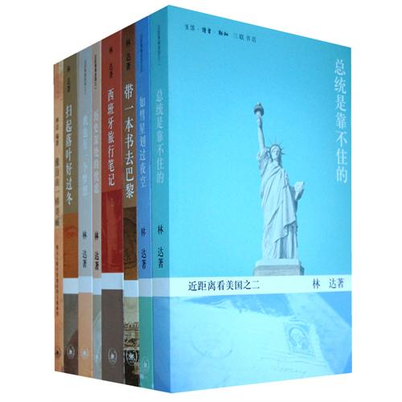
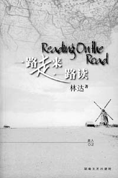

# 社会最重要的是正义  ——《常识》专访林达

** **

林达，是美籍华人作家丁鸿富与李晓林共用的笔名。他们出版的作品包括“近距离看美国系列”、《西班牙旅行笔记》、《带一本书去巴黎》、译著《汉娜的手提箱》等，被誉为介绍美国最好的作者之一。

然而林达一贯行事低调，读者对他们所之甚少。6月中旬，《常识》得到机会采访丁鸿富先生。丁先生告诉《常识》记者：“以前所有的媒体采访我们都谢绝了，但接受学生采访是应该的，我们应该多接触学生，从学生那里感觉到我们的未来在什么地方，使内心增加一点光明”。

（因丁鸿富先生和李晓林女士的家规便是不在公众场合曝光，《常识》尊重其意愿，故不载出丁先生的图像资料）。

 **常识：您是1991年出国的，出国前在国内有些怎样的经历呢?** **丁鸿富：**我和妻子这一代，俗称“老三届”，就是文革时正好在读中学。我们都是老三届中的最后一届，读的是当时上海最好的中学——复兴中学。妻子是引人注目的优秀学生，什么功课都好，连体育都好。 她的父亲是一位教授，文革开始后被叫做“资产阶级反动学术权威”，于是妻子首当其冲受到迫害，连她的老师也受到当时政治观念的影响，认为阶级感情是最要紧的，对待敌人就应该冷酷，对敌人的冷酷才是对人民的温暖。 多年后，这位老师拜访妻子家，表示很后悔，每年圣诞给我们寄卡片。后来我相信人是有天生良知的，人可能受各种各样因素的干扰，天生良知被遮盖、被扭曲了，但归根结底，每个人都是有天生良知的。 我家在爷爷这代非常穷，父亲带着叔叔到上海学徒，干最苦的活——打铁。后来父亲开了一个打铁作坊，然后变成小工厂，成了“资本家”。叔叔一直在工厂做工，最后做了车间党支部书记，党组织就要求他和父亲划清界限。这是当时我父亲最难以接受的事。 文革就是我们这一代人的心结，对于我们这代人，自从经历了文革，就摆脱不了它。在我们的内心，文革的阴影永远存在，我们对于文革的批判和愤怒，对文革的耿耿于怀，会一直伴随我们，直到我们走向坟墓。我们不会摆脱文革这个词，因为它是我们青少年时期如此惨痛的经历。 虽然我们国家还没有走出文革，可是文革对你们来说也许是古代史。所以我希望年轻一代，读一点有关文革的历史，不要对这一段历史茫然无知，因为实际上文革还在延续，还在继续。  **常识：文革以后呢?** **丁鸿富：**文革时我们去黑龙江插队，文革后进大学，毕业以后我们才结婚，恋爱十年。妻子在同济大学留校任教，我在上海铁道学院。读大学以前，我和20几个里弄里的中老年妇女组装小日光灯，每天在那里拎螺丝，一天挣7毛钱。  **常识：88年你们从大学辞职，为什么辞职呢?当时在大学里做老师不是一份很让人羡慕的工作吗?** **丁鸿富：**我们这一代人在80年代有一种苦闷，盼着国家变化，但总觉得变化迟迟不来。80年代我们盼着政治体制改革、新闻更自由、出版更自由、说话更自由。在85、86年有过一些希望，但87年开始，出现了“反对资产阶级自由化”，我很尊敬的方教授被开除出党，气氛一下子很肃杀。 到了88年，妻子的系主任找到她，让她“不要乱想，不要做不该做的事。以你的才华，我退了休，系主任就是你了”。妻子站在窗口，说：“我在这里混几十年就是变成你啊”。于是，当天下午她就辞职了。 我也受不了当时大学的那种氛围，价值观开始扭曲。大学的党的系统对我也不好，认为我反动。其实，我只是在错误的时间说了一句正确的话。接着我也辞职了。 辞职后，我们到建筑工地给人家管工地，挺有意思。和工人们住工棚，晚上在草地上喝喝酒，也蛮好的。  **常识：那后来是因为怎样的机缘的美国呢?** **丁鸿富：**辞职后，我们要养活自己，妻子就办了一个设计事务所，做园林设计，赚钱赚得不错。但是，89年整顿个体户和私营企业，说个体户和私营企业是动乱的社会基础。我们的银行账户被冻结了，罚款后只剩下700块。 于是我们就去了广东，帮一位港商盖海边别墅，他喜欢和我们聊天，说你们这样的人应该出去看看，看看西方社会是怎样的，他们为什么就没有我们这些乱七八糟的事情。然后就有各式各样的人帮助我们，91年，我们很顺利就去美国了。  **常识：您到美国后从事的工作是什么呢?** **丁鸿富：**刚去的前几年做搬运工人、开卡车，也和妻子一起摆小摊，现在在佐治亚大学工作。我们没想做更大的事业，因为一开始想的就是观察美国。  **常识：你们一开始就是报着观察美国社会的目的去的，但是为什么直到6年以后97年你们才出版了第一本书《历史深处的忧虑》?** **丁鸿富：**写书是有很多偶然原因的。有一个原因是因为我妻子摆小摊，有时间。我有一段时间失业，就有时间看书。失业半年，很开心，有钱拿，还可以坐在图书馆看书。 当然，真正导致我们写书是因为妻子写过一封很长的信给她的一个大学同学。结果，大学同学回信说你的信好看，大家都说好看。我觉得这个办法好，我们用书信的方式避免了系统地写一本东西，这样可以掩盖我们训练不够的缺点，我们用写信的办法讲故事，讲故事是我的强项。这样对我们也有好处，因为开始动笔了，就会观察得更仔细，会有意识地去读书。  **常识：谈谈您的一些观察吧。** **丁鸿富：**举个例子，我在美国最愉快的经历就是图书馆。去任何一个图书馆，工作人员都一个劲的谢你：Thank you for coming。 为什么呢?它是有道理的，图书馆建设的钱是哪里来的?图书馆是不挣钱的，图书馆是一个花钱的地方。钱从哪里来?公共图书馆的钱来自于税收，税收是通过政府拨款给它的，那么在制度上必须有一个安排，就是它必须是值得给的。什么样的图书馆是值得给钱的?它提供好的服务，好的服务里头包括：Thank you for coming。 在美国的图书馆，读者不叫“reader”，而是“patron”，翻译成中文就是“事主”、“恩主”。因为你借书，帮了图书馆一个大忙。公共图书馆的的钱来源于税收，图书馆的出借率、收藏率、馆际互借率都是自动统计的，比较这些统计数据，政府和基金会根据这些数据给图书馆钱。如果一个图书馆得到的资金多了，就可以雇更多的员工，或者已经雇佣的人的job security 就会更好，不会被fire掉，这一切都来自于读者来读你的书，所以读者去他们就一个劲感谢。  **常识：刚刚提到税收，中国人和美国人纳税人的观念差别很大?** **丁鸿富：**对老百姓来说，纳税人的观念要深入人心。美国为什么连不怎么有文化的乡下人也有这个观念呢?因为他们对政治的直接接触都是local的。每一个小镇，每年都要开会讨论这个镇的钱怎么用，讨论小镇是需要改善图书馆还是改善老年活动中心。有时候太需要钱了，老百姓讨论结果“咱们加点local的税吧”。 在美国，税收是这样分流的。比如说income tax 是federal government 拿去的，州政府就有一个州收入税，叫做state income tax ，还有各个州的消费税，买东西的时候标价9.99元实际上要你付10.05元。多出来的那几分钱就是给州政府的消费税。这样老百姓的概念机清楚了，原来税收点点滴滴是我们给的。 中国是中央政府把大部分税收收起来以后再用下去，老百姓觉得这是个恩赐，体会不到自己实际创造了财富。  **常识：也就是说制度不同会使人产生不一样的观念?** **丁鸿富：**我在中国的时候就觉得中国人立法的时候往往比较粗糙，结果这些发立了以后不是让人们遵守的，而是让人们破坏的，因为这法把人们的生路堵上了，不违法也得违法。 所以我们从法制建设这个角度来讲的话，立法本身必须经过相关利益者的充分讨论、权衡。  **常识：而在中国很多时候条例、行政法规比法律管用。** **丁鸿富：**对，中国出现了这样的现象，宪法成了最摆设最没有人信的东西，更有效力的是国务院自己立的条例。 这和我们的三权分立原则没有确立起来是有关系的。其实，在美国也有这种现象，美国人通常认为三权分立的立法权属于议会，而政府不是。所谓的行政分支，只不过是执行这些法令的。但是政府也有自己的执行细则，所以就会有“总统行政命令”这样的概念，为了执行某一个法律，总统作出一个命令，而其实这个命令带有很大范围的立法的概念，这种命令全国是要执行、要服从的。 这个问题在美国法律上也是一直有争议的。如果说总统行政命令一概而论全部都属于法律的话，它实际上破坏三权分立原则，因为它让行政分支也有了立法权，所以答案肯定是no;但是如果说总统一点没有下达行政命令的权力，那么有些时候有些法例，总统就很难实行了。于是就出现了这样的情况：总统继续发布他的命令，但是这个命令是可以被挑战的，如果你发现有地方不对，那么就去挑战吧，告他的行政命令违法，有一点是很明确的：总统是可以告的。  **常识：您的书里有很多司法故事，您对美国的司法特别感兴趣，是因为我们特别缺乏这一方面的知识吗?** **丁鸿富：**对司法感兴趣，大概就像年轻人对武侠感兴趣一样，首先因为它好看、好玩。 一开始，我们想介绍一点美国的制度的时候，想介绍的是三权分立、制约平衡、司法独立、军队国家化，最重要的一个思想是政府权力是需要限制、需要防范的。这几句话我已经说过很多遍了，如果我要把它写成一本书，有两个选择，我可以写美国制度的特点，第一三权分立;第二制约平衡;第三司法独立的理论和来源。可是这样写，大家会看吗?另外一个方法：讲个故事。讲理论是我们的弱项，我们没有在大学课堂上学过这个，但讲故事就是我们的强项了。我和妻子经常互相讲故事，讲得都很有意思。 讲司法比较多，因为司法体系本身有意思，而且美国的司法在法庭上把美国政府、老百姓的方方面面都展现出来了。为什么这么说呢?一个社会对老百姓来讲，最重要的是什么?老百姓希望生活在一个什么样的社会里头?  **常识：安全。** **丁鸿富：**正义的社会。一个社会至少应该正气，应该好人当道，好人可能受苦、可能吃亏、可能输了甚至蒙冤了，这些都是有可能发生的。但是整个社会应该是好人抬头的社会。在美国，这一点我们体会是很深的，尤其是这法庭上，法庭是维护社会正义最重要的地方。 我做过半天陪审员，对我教育很大。法庭这个地方是open to public，任何人都可以进去，但是他塑造了一种氛围，无论来的人有多少，法庭都不是开玩笑的地方，这里是要寻求正义的。 正义，是我们到美国以后很快感觉到的，因为我们是带着文革的伤痕去的。一开始写东西的时候并不打算为你们这些年轻人写，而是为我们这个年龄，经历过文革的人写。事实上你们也可以感觉到我们的书里往往一个字也没有说中国，但每一句话都在说中国。  **常识：您书中大部分的观点是在90年代形成的，那么现在有没有改变呢?** **丁鸿富：**如果有不一样的话，并不是因为时间或者认识的深化，而是因为发生了911。911使美国人的生活发生了很大变化，美国人出现了一个共识，就是要防范恐怖事件。所以以前觉得不可思议的事情也开始做了，比如摄像监控、允许司法部窃听。 有一个很有名的案子，美国禁止种大麻。但是在以前，种大麻是很普遍的事情，有些人把大麻种在家里，用灯光照射它，给它一些光线和热量，它就可以生长。在屋里种，警察是查不出来的，因为警察不能进入家里。后来，美国警察发现红外探测仪可以探测出墙壁温度，只要弄一辆车，装一个探测仪，一间间房子照射，哪间房子温度特别高，就说明这件房子可能是有问题的。 这个案子里警察开一辆装有探测设备的车在街上巡逻，检测每间房子的温度。后来引起了美国人权组织的抗议，状告警察违反了宪法第四条修正案：不得侵犯公民的家。警察辩解说他们没有侵犯，只是使用仪器，并没有触碰。案子后来一路告到最高法院，争执不下，一位女士在联邦最高法院上的一句话对案件起到了决定性的作用，她说：一位美国女公民，如果她每天都要洗桑拿浴，她有权利不愿意让别人知道她是什么时间洗的。 然而911以后，警察是有可能打赢这样的官司的，只要不妨碍生活，这种监视是被允许的。也就是说，911以后，为了安全，美国人牺牲了很大一部分自由。  **常识：所以对美国人来说，安全其实仍然是首要的?** **丁鸿富：**现在应该说，安全是更基本的需要，而公正的需要是一种比较抽象的理念的需要。可是，一个社会如果没有公正的话，是非常没有意思的。 我认为公正又是和个人责任有很大关系的。公正不是等来的，这个概念在美国很清晰：每个人对自己的行为负责。如果你认为自己是一个公正的人，你才有资格去要求社会是一个公正的社会;如果你自己是一个苟且偷生、屈服于不公正的人，你就没有权利要求公正。  **常识：这涉及到公民责任的问题，身为一个国家的公民，不仅有权利也有义务。那么华人参与美国政治生活的程度怎么样呢?** **丁鸿富：**华人是一个很宽泛的概念。比如骆家辉，他是美籍华人，不能把他算做中国人。中国移民在美国的政治参与度是很低的，文化因素是其中一个原因，但主要的原因还是language skill和human skill。中国人在这方面比较差，另外还有一个原因是缺乏把政治作为使命来对待的那种志向。  **常识：再回到您的书上来，林达的书如此受欢迎，和你们的语言风格关系很大，你们的语言风格都受过什么人的影响?** **丁鸿富：**我们小时候在江南农村，偶尔会有游走江湖的流浪艺人，他们是最贫穷最潦倒的但是却是很有艺术气质的人。通常夫妻二人，提一个三弦或者一个琵琶，走到各个村子里去，天黑以后，点一盏小灯，借一个条凳，两人往上一站，就开始说书。他们实际上是很会讲故事的，懂得如何起承转合，他们讲故事的方式对我影响很大。 在语言方式上，我坚决主张用常人的方式说话。写给大众读的东西，要用大家都能读懂的语言来写。最重要的道理往往是最基本的道理，最基本的道理往往都是用最浅显的语言写出来的。  **常识：最近两年国内兴起很多讲座、沙龙，您有没有想过回国办一些沙龙或者讲座?** **丁鸿富：**没有，这是我们家的家规。我和王怡聊天，跟王牧师请教这个问题。到了我们这个年纪，一般来说不受名利的诱惑了，但是，面对这个纷繁的世界，应该怎样来控制自己的行为才是恰当的?王牧师说：中国人有谨慎、不为名利诱惑的传统，你们夫妇，大家也都知道你们是很克己的。但是，你们得知道，名不是世俗的一种东西，名是一种责任，你们应该完成自己的责任。做什么或者不做什么，是你们自己的来决定的，但你们应该意识到这是一种责任。 我们的选择是不自己办这样的活动，但是我们愿意参加别人的活动。 

 

（采编：周凌希；责编：周拙恒）

 
