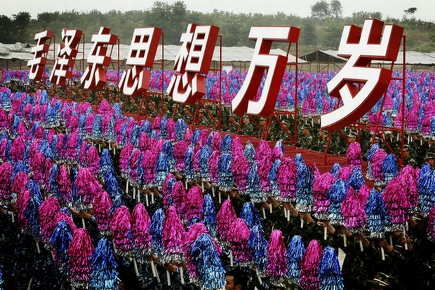

# 神马姜主意（五）：我的青春与党代会

** **

上大学的时候，记得我的系主任曾经说过：革命是罗曼蒂克的，爱情也是罗曼蒂克的。当时不大明白这句话的意思。革命是要流血的，爱情并不需要流血。当然，做爱的话可能会流血。与成千上万单位的做爱次数相比，流血的肯定占据着其中的少数。在我的印象中，革命应该是一副切格瓦拉的样子，桀骜不驯的眼神，英俊不凡的相貌。最重要的当然是需要一个好的摄影师。我高中的时候，手机的壁纸就是切格瓦拉的照片。到了我大学的时候，手机换了，手机的壁纸也换了，换成了奥黛丽赫本。而我也从一个理想主义者变成了一个正常的人。有时候，女神除了呵呵之外，你还可以把她放进相框里。

后来我渐渐地明白了。革命与爱情之间是有那么一点关系的。但是，革命终究还是革命，爱情却不是爱情。起码不是柏拉图式的爱情。而是大岛渚式的，猛烈而持久。回忆了一下自己看过的电影，革命的主题中，永远有着一对，两对甚至是人数是单数的单身男女。他们的幅度随着革命的号角而前后摇摆。《戏梦巴黎》中就是三个年轻人的故事。伊娃·格林不是我所喜欢的类型，但是真的把我惊艳到了。

革命离绝大多数人肯定是很遥远的。爱情呢？有时候很远，有时候很近。在革命与爱情的面前，一切理想主义都失去了颜色。甚至包括理想主义自己的底色。

几天前，十八大闭幕了。团结的大会，胜利的大会。所有的程序与五年前并无二致。而我自己却与五年前的我截然不同了。再看一眼涛哥，再望一眼宝宝。最后与人民大会堂来个亲切的拥抱。

看到高中生，初中生，小学生的时候，总是会让人回忆起自己的青春。现在想想，代表自己青春的东西是不是太多了？罗纳尔多的阿福头、周杰伦的双节棍、柯南与小兰、一课一练等等的这些，都让我们难以释怀。人的青春很短暂，匆匆十几年。回忆却太多。我小时候住的地方靠近一个医院，路过医院门口的时候，会看到一些蓝白条子衫的人。这个童年的回忆带给我的直接影响就是，我喜欢蓝色，也喜欢白色。但是绝对不能接受蓝白条纹的东西。在我的心目中，我认为只有品味最恶俗的人，才会喜欢这种独特的搭配。

成长是十几年的事情，而成熟却是那么几个瞬间。

1992年党代会的时候，我只有两岁。我相信任何一个两岁的孩子，都不会懂得政治为何物，中国共产党为何物。当然，也有例外。除非你像边沁一样是个天才，又或者你正好被选为了宣传的工具。过了很多年之后，我才知道，1992年的党代会并不是这一年发生在中国最重要的事情。这一年发生在中国的最重要的事情是邓小平的南巡。不是有一首歌唱到嘛：“1992年，那是一个春天，有一位老人在中国的南海边画了一个圈······。”可惜，歌词入选了高中生的语文教材。而演唱者却消失了将近十年的时间。我只记得，我的父母这样跟我说过，1992年的时候，上海的房价好像只有几百上千一平方。电影院很少，好人很多。装个固定电话要几千块钱，那时有BB机还有大哥大。

五年之后，我上小学了。1997年，香港回归的日子。那一天我清楚的记得，我和我的父母守在电视机前，观看完了香港回归的整个交接仪式。其实，一个刚进小学的孩子，什么都不懂嘛。只记得英国大兵走路的时候，是同手同脚的。而我第一次知道了香港这个地方。对于当年召开的十五大，没有任何的印象。我甚至都不知道十五大的召开。那个年代，有电脑的人家很少，网络那就更不用谈了。那一年我觉得发生在我身上最好玩的事情就是，我报了一个兴趣班，学的是国画。又一次在课上，我画了几块很大的墨团。我的国画老师问我画的是什么，我想也没想，甚至连头也没有抬起来就说：“我画的是蛤蟆。”当时的我，单纯地认为，蛤蟆就是蛤蟆。而现在，蛤蟆有了被赋予了新的含义。自此，我开始相信，冥冥之中自有主宰。蛤蟆不是蛤蟆，白马非马。看来，古人更聪明。

从时间的跨度上来说，朱镕基当总理的那五年基本上就是我的小学生涯。那个时候，光明酸奶1.4元一杯，肯德基还是很上档次的东西。而我每天放学后，必须画国画，当然，我每天画的就是蛤蟆。一只又一只的蛤蟆。很多时候，我一直幻想着，这些纸上的蛤蟆会变成真的，跳出纸来，我可以去捉他们。真的是幼稚青涩的孩子。人大立法通过的法律条文，很多时候都不可能变成真的，一个傻孩子画的蛤蟆怎么可能变成真的呢？

朱镕基是一位个性鲜明，充满各种才华的天才式人物。但是，不能因为“地雷阵和万丈深渊”就把其他的一切抹消了。大学生在我读小学的时候，绝对是个稀罕物。而现在，变得廉价了。现在的国企，许多人趋之若鹜，殊不知那个时候，“减员增效”这四个字不是唬人的。我的一个亲戚，就差点被裁了。求爷爷告奶奶地保住了自己的铁饭碗。现在她对我说的最多的话就是，当初要是下岗的话，一了百了，说不定现在就是“娇东北”的女老板了。这话，我相信一半。一了百了是真的，“娇东北”的女老板不大可能。因为我的这位亲戚，心太善。而心太善，是不大可能成为一个大老板的。心太善的人，可以干嘛呢？我考虑了这个问题很久，终于想出了一个答案。可以做网络管理员。因为心中看不得别人悲惨的经历，不但看不得，还不愿意承认。

在十五大与十六大之间，有一个年份，这个年份是1999年。国庆五十周年的大日子。同志们好，首长好。同志们辛苦了，为人民服务。那个气势，那个口号的振奋人心，直到今天我还心有余悸。可惜，口号喊得响，却没有执行力。我喊的最多的口号是，我要学英语。可惜，英语如今还是像小蝌蚪一样，在我的眼前游晃。再这样下去，它们都可以孕育出小生命了。为人民服务。在中国，人民的地位是最低的。没有钱，没有权，谁给你服务啊。至此，我知道，光喊口号没用，得看具体行动。你看哪一个贪官污吏，说自己贪污了多少亿的？人人清廉，奉公守法。还是那句话，懂法的人犯大法，法盲犯小法。你不信啊？难道一个农民工有能力去包养田朴珺？也想包，可惜包不起。这个才是根本。

转眼又是三年，十六大热热闹闹地召开了。当今的圣上正式登基加冕了。不容易啊，熬了十年了，终于出头了。所以年轻人不要急，当皇帝都要等位。你平时去排个队吃饭，等的时间久了，还要抱怨。你看看人家，所以人家当皇帝。你们搬砖。我一直认为胡帝的长相是很帅的，可惜，十年之后，他面部肿胀。更可惜的是，他竟然得了一个面瘫的绰号。其实，胡帝不面瘫啊。你排队排久了，脚不酸啊？仔细想想，一个道理。所以，指责别人之前，先看看自己。这句话永远是那么的颠扑不破。

我一点也不喜欢我所在的初中。对它只有恨，没有任何的爱。从老师到同学，很少有喜欢的。但是我在初中结识了一位非常要好的张姓同学，差不多十年之后，我们已然成为了兄弟。我的初中其实很好，老师很负责，一切东西都追求数据。不断地加大作业量，把学生们都留到很晚。这种近乎“维稳式”的教育，让我产生了很大的反感。想来，结识的那一位好兄弟，也是因为我们之间性格相合，对于千篇一律的教育很是痛恨吧！我的兄弟高考考的比我好，人在复旦。很有科学大师的潜质。希望，院士墙上，早日镌刻上他的名字。

也就是从十五大开始，中国的房价攀上了一个又一个的高峰。

比较可惜的是，朱镕基没有能够连任中央政治局常委，也就是说，他的总理只干了一届。宝宝顶替了他的位置。当然，觉得可惜的是当时的我。现在一点也不觉得可惜了。我的很多朋友中，都是朱镕基的粉丝。这一点让我感到很奇怪。后来，渐渐地想明白了。在中共这样一个压抑人性的环境中，突然来了一个异类。再加上中国人历来就有的“贤相”情节，从感情上来说，给他加了不少分。其实，没有完美的政策，也没有不犯错误的官吏，对未来要有一个远见，我觉得这才是最重要的。政治上或者经济上的政策总归有一定时间的迟滞的，满足最广大人民的根本利益才是正确的。其实，三个代表可以改一改，光代表有什么用，要拿出实际行动的。不是代表最广大人民的根本利益，而是去满足人民的利益。人民已经被代表很多次了，他们需要的是真材实料。当时社会上有一种说法，第三代是最腐败的，某某某是最没用的。五年后的事实证明，当时的人都错了。十年后的今天，我觉得已经可以证明，对于政治人物的评判，远远不是几年，十几年，甚至是几十年可以盖棺定论的事情。

五年前的十七大，当时的我正在读高二。我高中的时候，养成了一个习惯，每天早上去学校的路上，会买一份报纸看看。有时候会买两份，一份是《新闻晨报》，一份是《东方体育日报》。这也是我第一次全程地参与了党代会。当然是自己参与，自己投票的。就好像1999年和2009年阅兵的时候一样，主席们在现场阅，大家在电视机前阅，效果也差不了多少。

突然间有一天的中午，所有教室的电视机都打开了，全班也只有我一个人知道，电视机里会放些什么。果然一帮老家伙们，信步走来，号称亚洲第一天团。那个时候宝宝的头发不少，胡帝还偶尔能露出笑容。但是，全班学生似乎对于这些都没有兴趣。有好多同学问我，他们是谁？是干什么的？于是乎，我就从党代会开始讲起，一直讲到每一个人的生辰八字。这应该是我目前为止人生最高光的时刻。如今，十八大的常委们向人们走来了。但是，身边的同学们却都不在了。我想问你们一声，五年了，你们还好吗？很喜欢一句话，此间的少年从未离去，只是世界从一扇门后涌来。我把这句话稍微更改了一下： 此间的少年一直安在，门后的世界不停涌来。如今回忆起高中时期的点点滴滴，真的是风化正茂中带有一点懵懂，同学少年之中夹杂着丝丝的情谊。

大学快毕业了，至今没有拿到offer，心里不免有些着急。但是，与高考前的自己相比，已不可同日而语。而十八大的闭幕，应该正式预示着一代人结束了自己的青春，走向了社会。不再是孩子，也不再是小朋友了。每每听到别人这样叫我，心里虽有不甘，却不敢反驳。自己的确是孩子，也的确是个小朋友。没有社会的历练，没有经历过人情冷暖。一个人在大马路上，倒是痛痛快快地哭过一次（不是因为爱情问题，是因为工作原因）。大学生的激情与活力，这个是谁都无法否认的。但是，大学生的思想真的是非常简单的。而且，大学越好，自我感觉越棒。渐渐地脱离了群众，脱离了社会。几天之前，去了一次复旦，参加了一个宣讲会。除了让我更深刻地感受到现在学生的势力与现实之外，更让我觉得，他们依然感觉自己高高在上。其实，我所在的大学也有这个问题。我刚进大学的时候也是如此。后来，我发现了，这个习惯与腔调不改正的话，与科学发展观的距离是一辈子也追不上的。就是一个普通的人，从最底层做起。可惜的是，从最高层到最底层，人人懂，无人做。于是乎，一个新的恶性循环开始了。帽子是别人给的，不是自己加上去的。

无意中写了那么多，自己也没有想到。想到哪，写到哪了。等着明天的常委们，也等待着自己的青春未来。

 

（采编：孙梦予；责编：徐海星）

 
