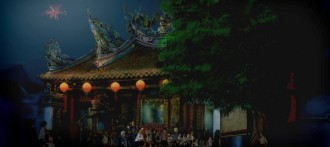
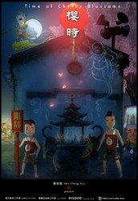
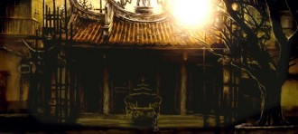

# 祭如在，祭神如神在。

“囝仔人，無乖乖

小心變成憨大呆

不信你試看麥，後悔你卡知

囝仔人，不聽話

就會乎鬼怪抓去賣”

黃煙縷縷，鈴聲空靈。童稚的話音念著悠遠的童謠。雖然台語不是我的母語，但當我身處台灣這樣一個傳統與現代交錯的地方，不管是穿街過巷看到披覆著紅瓦的龍山寺，臨街隔路走過的青磚砌成的行天宮，頗具現代感的善導寺。還是走下南部的村莊內，於小道旁隱然於世的小小土地廟。但每當聽起,那神佛前三兩聲呢喃，竟也喚醒沉睡在我回憶深處的那一抹驚豔的紅瓦白墻，青燈黃卷，香火渺渺。

櫻時，櫻息，就在你漸漸忘懷時，內心的那個孩子虛弱地站出來，用他的單純與勇敢，重新點亮你的眼睛，你能看到那現實中那無數的無知和魯莽嗎？還記得一段段真實，美好，淳樸的往事嗎？你還能記起，當初還在，如今漸行漸遠的傳統和信仰嗎？

不管你是社會的齒輪還是社會的大腦，我們每一個人，在現今高速飛轉的社會裡，庸庸碌碌。但根在何處，我們敬什麽，我們又畏什麽？你又是否一直在尋找著，疑問著？信仰這個曖昧的概念。那是否就像孩子一個人的捉迷藏，直到自己摔了一跤才知道，自己一直追逐著的事物竟如水中月一般，不管你對於它有多麼好奇，不管它有多麼好玩，對於孩子而言，可能現實中，卻還是不如一部PSP來的實在。

想起小時，每當遇到雷雨的夜晚，每當你被噩夢驚醒，相信每一個孩子都會和我一樣，總是不自覺得想去尋找媽媽的懷抱。但遺憾的是，小時候，父母總是很忙很忙，忙著工作，忙著掙錢，忙的整日整夜的不在我的身邊，而這個時候，我總是哭，不知所措，害怕的哭，現在想想，自己總是能很快習慣一個陌生的環境，習慣一個人生活，也許和小時的一個人長大分不開吧？

而當我總是哭總是鬧，被老師批評是哭，不被批評也是哭，自然很容易被其他的小孩討厭。後來漸漸的，大家都不和我這個愛哭鬼玩。這個時候的自己只能默默地蹲在角落里，看著書，起碼書不會罵你打你嘲笑你，它們就安安靜靜的在那裡，那是一個只有自己和知識的世界，讓我很安心。但每次又到了電閃交加的夜晚，每次又是一個人的夜晚，又一次在一個噩夢交織的夜晚時，那個時候，我相信身為一個孩子的我，並沒有太多選項，只能默默地在被窩里哭，因為如果大聲哭，會有舍監老師來罵人，上下鋪的孩子被吵醒了也許會跑來揍你。

而這個時候，無能為力的我默默地握緊了媽媽給我的護身符。那個夜裡，我就緊緊地把那冰涼的金符攥在手上，攥得久了竟然有種清涼的安心，不久便又沉沉睡去，那一夜再無可怕的鬼魅纏著你，因為時隔已久，我早已想不起當年的一些情節，但我還依稀記得直到天明，那冰涼的金符被我緊緊攥在手裡，早已如同身體的一部份，溫熱，讓人心生依靠，不再畏懼。那是一張很小的時候老媽給我的金符，我還記得剛剛拿到的那天，太陽滑過那磨得光亮的表面，我注視著上面雕刻著的並非精緻的菩薩像，摸起來竟有溫暖陽光的感覺。現在想起來，信仰，也許就是這麼簡單的一件事，沒有過多的信奉，有的是一份普通的敬畏，一份簡單的虔誠。或許當世界上第一個人類開始思考世界並直立行走的時候，火光賦予肉體的溫暖與信仰賦予的精神光明，便是神明賜給人們的第一份垂青和厚愛，給予了他向前進化的勇氣

只不過，大家卻早已忘記。

成長是十幾年的事情，而成熟卻是那麼幾個瞬間，漸漸地，當世道伴隨著時間的變化和流逝，當年的金符仍在我的錢包里，卻早已鏽跡斑斑。現在回想起來，那是當年的美好，那是當年的單純，只是這麼多年來，我們卻忘記了當年的一切。回憶開始發黃，於是我們把它裝進箱子，封上膠布，收進後院的倉庫里，一晃就是十年，二十年。曾經的孩子，早已不見，曾經的歲月，也和那堆發黃的回憶一起，靜靜地沉睡在那裡。如果有人問起，曾經和我一起玩的那些美麗的夢呢？說出來，只怕眾人先用異樣的眼光看著你，再是止不住的哈哈大笑。是的，那是個曾經美麗的夢，一個寄託在每一個在土地裡長大的孩子心中，最簡單的理想，哪怕今時今日我們早已不會像當年那般，在青石的小巷裡玩著捉迷藏，為了隔天要逛廟會而興奮的整晚睡不著覺，在佛祖老君面前，用調皮的語氣，問著童稚的問題，也早已沒有求神問卦的習慣了，有時甚至聽起別人談起自己的信仰的時候，看著他們的一臉虔誠，我們竟然從心裡感到一絲恐懼。深怕是哪個詐騙集團，打著神明在上的頭銜，招搖撞騙。

也許這便是歲月施加在你身上的魔咒吧？小的時候看世界總是那麼豐富多彩。你聽著老奶奶講起王少伯愛上了芙蓉花精，末了加上一句“洛陽親友如相問，一片冰心在玉壺。”；你看著那比你爺爺的爺爺還老的宅院，小時的你總是覺得，這偌大的房子便是世界的全部。你喜歡觸摸著窗戶上老舊的雕花，看著那白蓮，看著那折梅，感受當年雕琢師傅掌心的溫度，再喜歡和一群孩子一道，搬起椅子凳子，坐在寬敞的大廳堂裡，專注地聽著老人大談虎牢關三英戰呂布。這便是一種信仰，一種活在傳統之中的靈魂，正如一年有四季，鳥兒秋去春來，萬事萬物，是如此自然地在我們的內心生根，成長。

那麼之後的故事呢？

今時今日，當年的家還在嗎？

前些日子，和朋友聊起天，我和他說起我很羡慕還能在台北市中心找到老宅子，找到有些狹窄但是古樸的小巷，古舊與現代，相敬如賓。結果他居然用很驚奇的眼光看著我，“這不是應該是理所應當的嗎？”語畢，我有些愕然的不知如何回答他，但腦海裡卻止不住。我想起了佛山的東華里的昔日與今朝。“改造”完之後，第一次去的時候，看著那加上了歐式風格和現代感濃厚的落地窗的“仿古建築”，摸著那些被砸碎後再重新立起的古老的外牆，我仿佛聽到了，誰的暗自啜泣。還記得一個朋友淡淡的和我說起他曾經的家，說起這裡的青磚青牆，白灰條石，說起趟櫳屋的木門，說那是他出生的地方，那是他長大的地方，但是，現在卻再也回不去了。東華里之後，再無東華里。而你是否和他一樣，早已失去了可以回去的家？

而你說，人總是要告別過去的東西，人總是要長大。但當你開始長大，當你開始知道了很多，自以為世界就是如此的時候。當你開始追求過去毫不嚮往的東西，當你開始選擇面對傳統的東西望而卻步的時候。現代化也好，生活節奏加快也好，人的欲求越來越大也好。在這一切一切的錯亂中，昔日心中的少年迷茫了，迷失了，迷路了。是啊，我們總是在索求，我們總是不滿足，所以我們迷失了最初的方向，淹沒了真正的心。

不過也許你我并不用害怕，畢竟這是伴隨著成長的無可奈何，你自然可以選擇離開，因為也許你的心中還有著那麼一株幼芽，縱使狂風驟雨，縱使斗轉星移，它依然在那裡，堅強地扛著風雨，發芽長大。當某日，孩子會問你，什麽是神明公仔，什麽是麒麟，什麽是童子？它和鋼彈比起來哪個比較厲害。你是會告訴他真相，還是會笑一笑，像當年一樣，說起王少伯與芙蓉花精的故事呢？

我已經很難說清自己信什麽，或者不信什麽，我早已是不去信奉神明的人了，不過我心中深信著，哪怕生活如此晦澀，如此陰暗，信仰就是信仰,不是慾望,亦不是索取，若是那樣，與其是信神，更像信魔。總有人選擇去相信且願意去相信.就算今時今日，心中的香火早已不在，但靈魂深處，相信那一份信仰，雖不能令你無比強大，卻可以讓你學會勇敢和敬畏。

而那也終會回來，帶你回歸最初，最簡單的希望

櫻桃桑椹與菖蒲，更買雄黃酒一壺。門外高懸黃紙帖，卻疑帳主怕靈符。

往事舊事，春風過爾，櫻時，櫻息，花開，花謝

採編:余澤霖 責編:余澤霖
