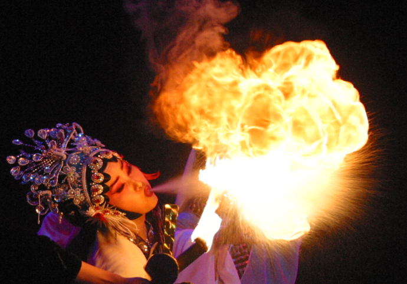
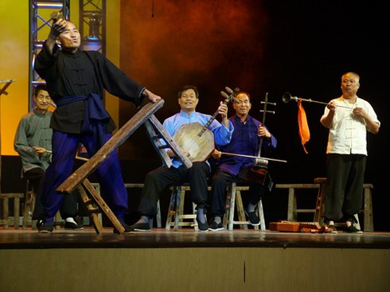
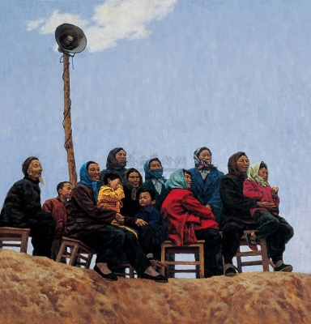

# 秦腔是咸的

** **

贾平凹的《秦腔》已经在枕边躺了近两个月了，这大概创下我读书耗时长的记录了，仔细想来，读得慢大概是两个缘故，一是因这书太重，五百多页的纸推起来有两指多厚，单手掂一会儿便累的酸疼，每次也就能看个那么十来页左右。二也是因这书太重，繁杂的人物，细碎的情节，从村头的杂草到屋后的老树，从巷子里觅食的野狗到土里打滚的孩童，让人读来倒不像是一本小说，而是一本村民自编的县志，作者向这一尺见方的空间里砸下了黄土地上太多的爱恨情仇。

说来可笑，“人不可貌相”这谚语在英文中对应的一句是“Don’t judge a book by its cover”，而我买这本书纯属奔着封皮去的，书皮上毛笔写就的秦腔二字占去了大部分空间，运笔古拙有力，笔画的架构却如孩童临摹般工整，隐隐带着稚趣，煞是好看。除开字，剩下的就是一片大红，红得生动，红得扎眼，借贾先生的话讲，红得艳仄，这红除了嫁衣上能见，其余别处再很难寻得。而就是这红底黑字迷住了我，仿佛这就是专门用来给《秦腔》这书做封面的，换了任何书都不行，这一红一黑，恰是我所理解的《秦腔》和秦腔。

秦腔难写，除了土生土长的陕北人贾平凹，很少见人写过。它扎进土里太深，要不是吃长线辣子，喝西凤酒，睡米脂婆姨的人很难有这种共鸣，秦腔也确实不受他乡人待见，单就这高亢的音调，近乎嘶喊的发声方式就让人很难把它纳入艺术殿堂。

第一次听秦腔是在西安。要是真有轮回这回事儿，毫不矫情的说，我宁愿相信自己上辈子是个西安人，刚从火车站出来，经环城北路进城，这青砖垒砌的城墙，钟楼鼓楼，庭院里的石榴树就开始在脑海里一一映现，也不知这印象何来，但真等看到它们，才知道真实的样子与想象中竟相差无几。再等发现泡馍馆里的男女老少都用房梁般粗的海碗进食，吃得窸窣作响，大汗淋漓时，我再也不能把自己从这片土地上剥离。我是和母亲一同来的，母亲是因公出差，我是自费旅游，路上结个伴儿相互照应，因为是公事，西安这边自然有接待方的热情招待，我就顺带揩个油，一路上随着他们到处吃喝。在逛了一天的西安城后，晚上我们去了鼓楼边久负盛名的回民一条街，楼洞外还是一片井然，穿过楼洞，一片欢腾繁闹的景象竟让人有了恍若隔世的错觉，负责接待的大叔是老西安了，当我看到这街边琳琅满目的吃食，早已是挪不动步时，他却丝毫没有停脚的意思，他回头对我们说，这前面的一片早已被游客占据，本地市民很少来，往里走才真正到了西安人嘴里常说的“坊上”，那里才最能体现古都人的夜生活。既然有行家带路，自是少言快走为上。最终我们落脚在一家汤包馆，在母亲惊愕的眼神里，那大叔大概点了二十笼汤包之多，再加上隔壁烧烤摊上叫来的五十多串烤肉，两米见方的桌子竟找不到一个放碗筷的地方，我一面欣喜若狂，一面劝着母亲入乡随俗，随即便全身心的投入到大快朵颐中，自是无话。

就在觥筹交错，抿嘴咂舌间，远远的传来几声月琴和铜板声，一时提起了我的兴趣，这声音在断断续续间由弱变强，像一把剪子把四周的寂静划开，接着一个沙哑的男音插了进来，这声音像是来自病人嘴里，可又带着一股子不认命的倔劲儿，将唱词硬生生地吐出来，砸在地上，慢慢地，调子转高，这沙哑竟转成了长啸，将那个最高的音符推上了黑色的天空，这一低一高间，感觉自己的五脏六腑竟跟着震颤了起来，经大叔提醒方才知晓，这便是秦腔了。待这高音落下，隔壁桌的几位老汉也依依呀呀跟着哼唱了起来，估计还没怎么找着调子，唱的不算太整齐，声音也不甚好听，但是他们摇头晃脑，以碗筷做板的神韵，让我第一次意识到，秦腔在他们血脉里究竟扎下了多深的根。以前练二胡时倒是听过赵震霄、鲁日融两位先生创作的《秦腔主题随想曲》，最喜欢其中大范围换把滑弦的一段华彩，高低音的转换就在一瞬间，连贯而不拖沓，像极了信天游里的小调，但这二胡曲比起人唱的秦腔来总觉得有些隔靴搔痒的味道，而这夜市里听见的这一段，虽没有那么真切，但足以令人动容，就是这若隐若现的一嗓子，能把我远远带走，引向一个汗水，泪水和黄土混成的世界。

要勉强能懂秦腔，还真得看看这八百里秦川的土，火车过了秦岭，窗边就再也没有绿色，一望无际的黄褐色的丘陵，像极了老人冬天里皴裂的手，隆起的土堆似打结的静脉，又像是一块块肌肉疙瘩，偶然能看见几口井，唇干舌燥的向天喊着，在这片至贫至瘠的土里，诉说着生存和希望的故事，这样的实在与广阔，让人恨不得跳下车来在这片黄色里认认真真地打几个滚，抚平她千百年来的辛苦与伤痛。这片黄土上的人，腰时刻是弯着的，弯腰撒种，弯腰犁地，弯腰拾穗，弯腰洗衣，弯腰打水，腰弯久了，就得发泄，就得想法高兴，这吼出来的秦腔是再合适不过了，像是在胸腔里燃起一把烈火，待它按耐不住，从口中炸出来，便是这响彻天地的呼号，若是有苏轼笔下关中大汉铜牙板击节当然最好，什么都没有，单是在自家的院里吹胡子瞪眼地喊几嗓子，也是一种能熨平一切的美，当然这秦腔男人唱，女人也唱，能高兴地唱，也能悲伤着唱，名旦商芳会的《朱春登哭坟》里头一句：“朱春登跪席棚泪如泉涌”，几乎就是哭喊着唱出来的，这哭绝非是梨花带雨，断没有嘤嘤咛咛，只剩揪心裂肠的哀嚎，哭就哭他个呼天抢地，哭他个死去活来，哭他个草木含悲，哭他个风云变色。在这片土地上，断没有含蓄和委婉，是喜是悲都得真真切切地唱出来，吼出来，只有这些外人听来近乎刺耳的声音，才让这里的人与天地走得更近。

听西安人讲，以前乡下村民婚丧嫁娶，大多会包一场秦腔，请同村的人一起热闹，这倒是与小说《秦腔》里描述的一致，秦川里的人一辈子离不开它，生也秦腔，死也秦腔。因为自然条件的恶劣，关中人带着与生俱来的悲剧色彩，所有的伦理和道义硬生生地建立在米和水的基础上，灵与肉的界限在这里似乎没有那么分明，他们朴拙，憨厚，内心却能荡起千帆百浪，给他们一个火引子，他们就敢把生命燃烧给你看，他们的汗水和泪水，成了滋养这片黄土最有营养的源泉。

而这咸的汗，咸的泪，滴在这干涸的土里，蒸腾起来，大概就成了这咸的秦腔。

2012年四月三十日整饬旧文而得

 

（采编：麦静；责编：麦静）

 
