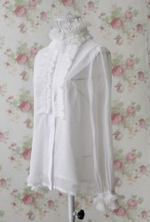
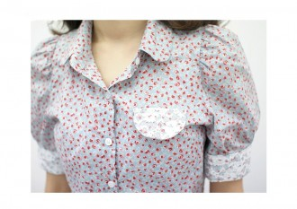

# 穿衬衣的女人

这一切废话都始于今天身上穿的衬衣。

早上又赖床，爬起来匆匆拾掇了十五分钟就奔出门去挤地铁上班，直到在公司的洗手间镜中看见自己，才发现今天穿了一件新衬衣。衬衣是雪纺的料子，柔和的桃粉色，米白袖口与衣领，非常女人。这真不像我，我感到像在与一个陌生人对望。像沃尔科特的一首诗：_“you will greet yourself arriving__／__ at your own door, in your own mirror __／__and each will smile at the other's welcome”__。__ ___

我从前是抗拒衬衣的，特别是女人的衬衣。

从小爱出汗，我妈拉我去剪头发的时候，总是让剪发的大妈把短发的发尾铲起来，变成一个无比凉快又无比难看的鸭屁股头。至今我都怀疑，我这为了多睡十分钟总是蓬头垢面就跑去上班的懒女人恶习，就是那个时候养成的。但是我妈是个非常奇怪的人，她让我剪了个“男仔头”，却又总爱逼迫我穿各种各样的花边衬衣，通常是白色的，有蕾丝花边的，假珍珠纽扣的，高领的，颈上还有绑带的。那种脖子上有绑带的衬衣在夏天穿起来简直比上吊还要难受，我对衬衣的厌恶大约就是从那个时候开始的。

我觉得穿衬衣是件特别规矩的事，而我讨厌规矩。比如说小时候我妈让我穿花边衬衣时，她总会说，女孩子要有女孩子的样子。再比如说我高中时学校发了礼仪服，白衬衫，格子裙，要求周一晨会升旗时统一穿着。那件衬衫质地坚硬，像是一块浆洗挺括的纸皮，能让好端端的一脸淳朴的高中女生一秒钟变身饭堂帮厨大妈。

大一暑假去面试外企的实习，买了第一件衬衣，麻质，白色，薄而透，穿上能看见内衣的颜色，可我还觉得挺好，微微起皱的质地让我觉得它没那么规矩。现在想起来，那时候穿的真像个纺织工厂宣传办新来的女同志，明明循规蹈矩按部就班地走着人生轨迹，却还非以为自己有多特立独行，不拘一格。

大二开始衬衫就多了起来，那时候参加SIFE，组织学生会活动，还每两周就要去亚组委接受一次外事礼仪培训，准备亚运会上接待国际要人。也开始有了正儿八经的衬衣，白底紫色条纹，纽扣扣上就能散发出成功学的光芒。

后来到了大三，转了心思想要考研，骨子里那股波西米亚小清新劲头又释放出来了。有一段时间特别喜欢碎花的棉质长衬衫，因为很多人对我说，你高，穿长衬衫好看。直到有一天我那时的恋人跟我说，我觉得你穿这个碎花衬衫吧，看着像村口东边刘二狗家的小媳妇。于是我才闷闷不乐地放弃了采买更多碎花衬衫的想法。波伏娃说，女人不是天生的，而是后天形成的，我浅显地曲解一下，至少多数女人的外在往往是在旁人的观点，特别是在男人的观点中逐渐形成的。

从前的恋人厌恶指甲油，认识他以后我就再未涂过。长发麻烦，夏天出汗黏糊糊，冬天有静电就干燥、断裂、群魔乱舞，但世上还是留长发的女人居多。减肥剥夺许多生活乐趣，节食容易导致痛经、心情沮丧，冬天冷到发抖不能入眠，可世上还是那么大群的女人每天都在减肥。

当然，作为骄傲的、和男人挣的一样多的，受教育程度不分伯仲甚至更高的现代女性，我们一定会宣称，这都是为了美，美是为了自己高兴。但问题是，美的标准从何而来？真的来自女性本身吗，还是来自男人？为什么瘦的女人一定比胖的美？胸大的就比平胸的好看？话语权其实依然在男人手上。

女人有了独立的经济基础，却因为被爱的需求而始终不能得到真正的独立和自由。出于一种被爱的需要，女人总是更容易妥协，从顺于种种外界订立的规矩，以换取被爱的权利。所以女儿往往更易服从家长的意志，而大部分女人与父母决裂通常都是因为爱情。女人是一种感情动物，多愁善感大约是一种典型的女性特质。

而衬衣是一种去女性化的衣物，职场上并不需要过多的女性特质。规矩没有性别。加班面前人人平等。所以穿衬衣的女人是种奇特的存在，她们用女性的身体像男人一样去战斗，而当中的大部分，下班以后脱下衬衣，暂时从职场的规矩中抽身，却又旋即沉入家庭的规矩当中，囿于昼夜、厨房和爱。

于是我又想起小时候我妈对我说的那句，女孩子要有女孩子的样子。

女孩子就这样成为母亲，又亲手为她的女儿穿上花边衬衣，绑好蝴蝶结，把她锁入女性的命运当中。

前几天我新买的一件衬衣，和小时候妈妈让我穿的，我所讨厌的“很女人的衬衣”同样，也是那样的纱质，那样的精致秀气，颈上有绑带可以打成蝴蝶结。颜色是我小时候所讨厌的粉色。

我看着镜中的陌生人，这个穿衬衣的女人，幸而想起了沃尔科特的诗还有另一句：

_“You will love again the stranger who was yourself.”_

请坐，请享用你的一生。请爱这个面目全非的陌生女人。

_“Give wine. Give bread. Give back your heart /to itself, to the stranger who has loved you/ all your life, whom you ignored for another, /who knows you by heart.” _

上酒。上面包。把你的心交还给它自己，交还给这终生爱你的陌生人，你为了另一个人而忘了她，她却还记着你。

作为女人，除了更爱自己，我们别无他法。

（采编：吴子衿；责编：欧阳银华）
