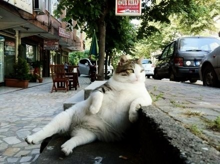
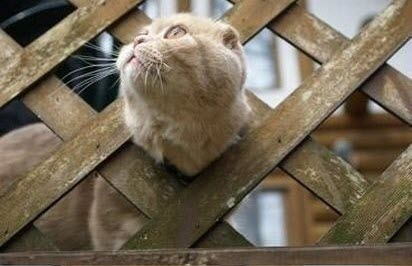
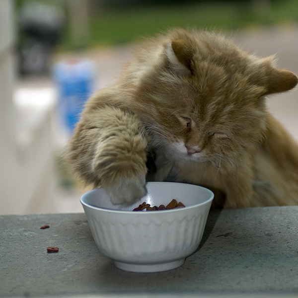

# 窗户上的猫咪很无聊

窗户上的猫咪很无聊，光着屁股满街跑，哎呀哎呀怎么得了，哎呀哎呀不害臊。

阿福躺在永福巷39号的窗台上晒太阳。

这是一条潮湿阴暗的小巷子，两面都是有年头的筒子楼，就算是正午的时候阳光也探不到底，地面永远都泥泞不堪，横七竖八躺满了菜叶和烟头。永福巷39号在一楼，坐北朝南。此时正好是夕照，阿福四脚朝天摊开肚子享受南方难得的好太阳，肚肠里填满了欲仙欲死的快慰。

静静拉开窗帘正好见着阿福躺在她家窗台上，眯着一双眼睛往窗户里面看。常年不见天日的房间里烟雾缭绕，鼓囊囊地都是淫靡昏黄的气味，烟雾里还站着一个牛高马大敞胸露怀的汉子。静静突然觉得这畜生像是什么都明白似的，心里蓦然有些恼羞成怒起来，挥起手臂要把阿福赶下去。

路路这会儿刚好走过来把静静抱了个满怀：“你还怕给它看。”

“它这俩眼儿看得我心里发毛！”

“一个大眼睛畜生！什么都不懂，发什么毛。”路路顿了一顿，“一对儿猫眼儿，又不是针眼摄像机。怕得你！”

“谁知道！我那做姑子的姨妈跟我说了，这猫啊狗啊的都是上辈子造了孽才罚做畜生，其实心里面儿跟人似的，亮堂着呢！”静静嘴里这么说，却没再管阿福，回身搂住路路的腰，扭着身子就往上蹭。

路路给蹭得心头火起，两个人就又扭作一团。静静伸手一扯窗帘儿，房间里又暗了几分。

阿福于是偏过头，正好撞见阿慧气势汹汹往楼里走，杀气把阿福惊得翻身站起，弓着腰炸着毛不知所以。

阿慧进去没多久静静家门就给砸得震天响，门外还传来阿慧底气十足的叫骂声：“你个作死的死狐狸精！坏了别人家男人还不够！祸害俺大表弟做么子！给老娘开门！老娘今天就是拼着白刀子进红刀子出也要大表弟跟你这下作娼妇作个了断！”

带着河南口音的普通话在巷子里和着砸门的砰砰声久久回荡。阿福纵身一跃跳到地面，回头一看路路正只穿了条裤衩儿光着脚就往窗户外面钻，手里的衣服裤子给紧紧攥成一团，都分不清哪件是哪件了。

侯阿姨竖着耳朵听了老半天这才回头冲柯叔撇了撇嘴儿：“啊呀！我就晓得，弄堂里个小妖妇老结棍饿。你看看呀，三天两头闹。啧啧啧……”

柯叔抬起手砸吧一口搪瓷缸里的茶水，头仍然埋在报纸里面，闷着声音说：“你管那么多干嘛！孩子快回来了，饭都还没做好！”

侯阿姨一听这个话，心里无名火起：“你说的撒话！你也和那个小妖妇看对眼是伐！你也不看看你个钢笔样子，还想搞三搞四！呸！”

一番话里普通话夹上海话，把柯叔骂得落荒而逃：“算啦算啦！我不和你吵！我就去巷子口，瞅瞅有什么好菜炒两个回来！”话音未落就弯着腰窜出门去。

“跑撒跑！有赤佬跟你啊！”侯阿姨威风凛凛地挥着炒菜铲子在后面大吼，心下气不过，把门狠狠摔上坐在沙发上生闷气。

她想到她刚从上海嫁过来那会儿，盘子亮水色好，公爹婆妈都夸她有福相，柯叔更是疼她跟疼眼珠子似的。就算是刚生囡囡，路上遇到十五六岁的小姑娘都要叫她一声阿姐，嘴甜的还要赞她像她们同龄人。但是这才多少年，自己天天在家里忙，脸上肉都掉得露出狰狞的颧骨来，好容易把他父女两个收拾清爽了，结果还要被嫌！

侯阿姨整个人像被折下半截的草藤，软麻麻地摊在沙发上，一边想一边抹眼泪，突然听到窗口一声猫叫，转头见到阿福正蹭着她家防盗窗扭来扭去，忍不住生气极了，随手抄起一只拖鞋砸过去，吓得阿福纵身一窜跳到隔壁阳台上去。

拖鞋砸在防盗窗上又弹回客厅里，侯阿姨木呆呆地看着它骨碌碌地滚到茶几边，骂了句“错气！”，又忍不住掉下一滴泪来。

柯叔从家里急吼吼地出来，正好在巷口撞破自己家大妞儿跟何婶子家的锋锋你侬我侬啃在一起。柯叔当机立断拿出自己长辈的威严，冲过去就给大妞儿一耳刮子：“不学好！给老子回家去！”大妞儿挂着两泡泪，捂着脸就往家里跑。柯叔又踹了锋锋一脚：“以后再让我见着你勾搭我家闺女儿，老子打断你的腿！”觉得自己终于得到一点平衡了，整整衣服斜睨锋锋一眼，鼻腔里大大地哼了一声，抬脚往出走。

刚走出没几步柯叔就像想起什么似的，四面看看确定没有人看到，鬼鬼祟祟就钻进永福巷39号去了。

静静刚刚赌咒发誓把阿慧打发走，还红着双眼睛坐在床头，听见有人敲门，打开一看是搭头耸脑的柯叔，心里疙疙瘩瘩的：“你还来做什么！嫌今天我事儿还不够多么！”

柯叔一闪身钻进屋来：“我这不是担心你有事儿么！那老处女没把你怎么着吧？”

“她能把我怎么着！你出去，我不要你假好心！”静静对着柯叔胸口软绵绵一阵乱锤，嘴噘得老高。

柯叔这会儿心旌荡漾，低头就把静静箍了个牢实：“我说！你不会真和她家那大表弟有一手吧？”

“关你什么事！你又不和你家那黄脸婆离了，难不成我还得为你守贞不成？路路他可真是对我好，别以为他跟你似的！”

柯叔心里吃起酸来，嘴里却不放口，花言巧语一股脑儿往外蹦，直把静静磨得半边身子都酥软了，心里甜得跟什么似的。

阿福此时正趴在对面的窗台上，耳朵塌成飞机耳，听见巷子那头何婶婶和侯阿姨吵得沸反连天：“我日你仙人板板儿！你家死鬼干饭胀多球老！我家儿子是他踢得的？！”“何阿姐讲讲道理好伐！分明是你家小赤佬来黏我家囡囡！小瘪三个港卵，赖三伐？！”

洪美东在屋里听得心烦，抬头一看对面柯叔正涎着脸贴在静静身上，好像外面吵得翻天去都不管他的事一样，心下一阵恶心，把窗帘一拉干脆来个眼不见心不烦。

她心里对静静鄙夷得很，一个姑娘家没有点姑娘家的样子，正经男朋友没有一个，穿得花枝招展的给谁看哪！那家里整天人来人往的，问起来还嗲兮兮地眯着眼睛笑：“都是朋友！”朋友！哪里有朋友一见面就搂搂抱抱的！

想到静静那些“朋友”，美东又忍不住黯然起来，连自己妹妹都在恨铁不成钢：“你呀！要是有那小娼妇十分之一的胆子，都不至于这把年纪了还没结婚！整天闷在家里，能闷出个男人来！”

想到旭旭说这话的时候那种关心中又带点鄙夷的神色，再想到她偎在男朋友身边看着自己那种又同情又自以为是的眼神，美东终于鼓起了一点勇气来，端起煮好的面出门往楼上走去。

她一直对楼上的徐二有点说不清楚的心思。现在的姑娘都喜欢那种嘴甜的，但是这年头的男人，谁知道是不是嘴甜心苦的。言情小说里多的不是这样儿的，嘴里说得好听，一肚子的坏水儿。所以这就更显出徐二的可贵来，徐二人长得老实，见着个姑娘就慌得眼珠子都找不到放处，又是知名技工学校的优秀毕业生，有一手好手艺，虽说没有大富大贵，但是日子还是过得不错，就是太老实了，这把年纪了还是光棍儿一个。

美东不仅又想起旭旭对自己的谆谆教导：“一个大男人！哪里懂该怎么照顾自己！你平时多关心关心他，有什么吃的给他也做一份儿，这事儿就成啦！”但是走到徐二门前，她又忍不住东想西想，他会不会觉着自个儿这样儿太不知羞了，孤男寡女的，跑上来送吃的，这不是把心思摊明了给人看么！他要是领情还好，要是不领情那是多大的笑话！其他人还不知道会怎么说呢，她还活不活了！再说了，见了他怎么说啊，难道说“我下面给你吃”么！美东越想越忐忑，敲了门把面放在门口就做了什么亏心事似地跑下楼了。

徐二站在窗前目不转睛地盯着对面楼下的活春宫，正看得兴起，突然阿福七窜八跳就跳到了他的窗台上，对着他喵呜一声，徐二视线被挡，伸手把阿福捉到地上，笑骂一句“不通人事的小畜生。”这时门口有人敲门，徐二悉悉索索一阵，慢悠悠跺到门口，从猫眼往外看没见着人，打开门一看门口放着一碗面，端起来还是热乎的。

徐二站着想了一想，咧嘴笑起来，找出一个没洗的小碗，给阿福装了一点，一人一猫坐在地上西里呼噜地吃起来。

（采编：杨松子；责编：刘铮）
