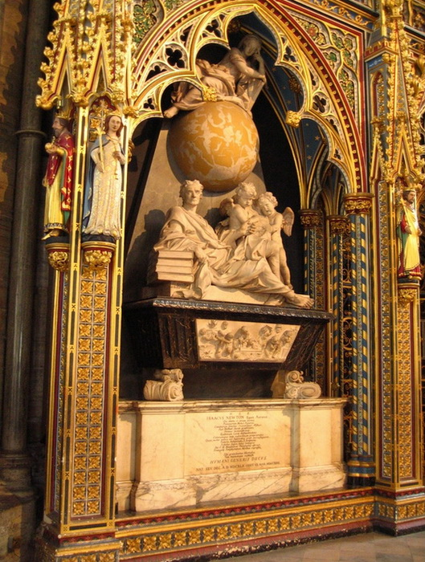
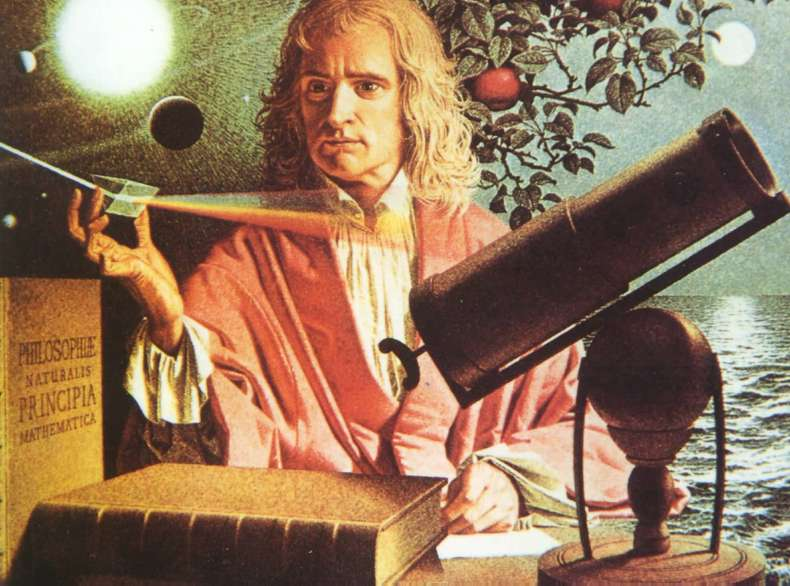
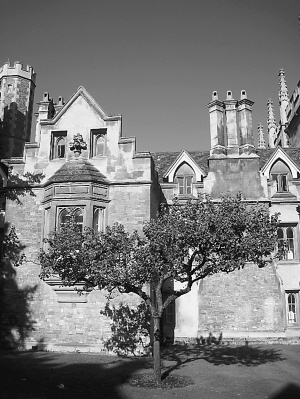
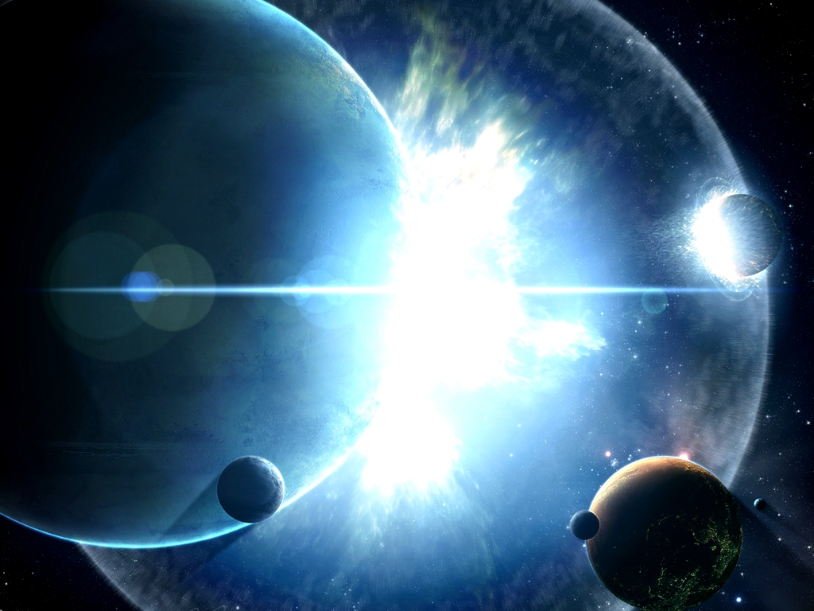

# 站在牛顿墓前

**如果你是牛顿，没有什么可以阻止你走到全人类的最前排，王侯将相、国家首脑在你面前就是凡夫俗子芸芸众生，只有鼓掌的份。可你不是。你是一个凡人，你就算被铅球砸一下也想不出什么，你只是这个世界机器的螺丝钉。**  

# 站在牛顿墓前

## 文/张琦（北京大学）

 

终究很难在放假的时候窝在屋子里学习，于是关好水电煤，背好小书包，深夜跳上前往伦敦的车。本来出于愧疚放了几本电子书要在路上看，但这番心思很快就在愤怒的小鸟2011圣诞特别版面前烟消云散。后半夜睡得撒手人寰，天蒙蒙亮时醒来，完全不知身在何处。目光搜索到第一块路牌，赫然写着Buckingham Palace Road。随即下车环顾四周，往北不到一公里便是白金汉宫。但在我非常俗气地跑去拗造型留影之前，还是决定先跟着大本钟的指引，由另一条路转弯向泰晤士河东行，前往另一个目的地。步行十来分钟之后，扑面而来一股并不像是千年以上的建筑所应有的味道、气场和客流量。但Google地图告诉我，眼前的庞然大物，应该就是威斯敏斯特大教堂了。

从职能上说，这儿基本就是大英帝国的八宝山。拿亨利、查理、乔治、威廉之类的名字，再拿一世、二世、三世之类的称号排列组合一下，很多都可以在这儿找到。不过，我对于这么多雷同的名字实在没有太多的情感。走马观花地看过一遍，旋即踱到教堂的南区——这里是诗人角。不知道为什么总觉得这个名字很搞笑。仔细想了一下，可能是总把“某某角”和“英语角”联系起来，然后脑中瞬间幻想出几个诗人晚上从棺材里爬出来锻炼口语，上演西敏寺奇妙夜的情景。想到这里就笑出了声，却突然在空旷的环境里被自己的笑声惊到。在这样一个被无数双在天堂或者地狱里的眼睛注视着的地方，还是端正姿态，严肃面容为好。

诗人角是一个牛人爆棚的地方。如果拍张照的话，效果大概和那张著名的物理学家合影差不多。按照姓氏字母为序，见到的名字里大约有：奥斯丁、拜伦、乔叟、狄更斯、德莱顿、哈代、济慈、吉卜林、马洛、弥尔顿、蒲柏、莎士比亚、雪莱、斯宾塞、王尔德、华兹华斯。乍一看以为是英国文学史的教学大纲。不过值得八卦一下的是，这当中许多人的骸骨其实没有埋在这儿，只不过是立碑以示纪念。比如莎士比亚1616年死后葬在了郊区的埃文河畔，谁知百多年后声望仍然如日中天，三百多年之后他的八卦都能拿奥斯卡奖，于是1740年立碑。毕竟，要把人挖出来再搬过来总不是太合适。

教堂里还摆着一把很著名的椅子，叫圣爱德华宝座。当然和乾清宫的龙椅一样，一般人是坐不了的。其实一想，要出名也很简单，我只要冲上去一坐，明早就能红遍英伦。但其实这样气场强大的椅子，通常阴森得像电椅。而且考虑到它七个世纪以来可能都没有洗过，一下更没有了坐的冲动。当然不坐的最重要的原因是，当日该椅子没有展出。自1308年爱德华二世加冕礼后，每一代君主都是坐在这里接掌帝国的最高权力象征。从这个意义上说，那棵被砍下来做这把椅子的树真是树中少有的幸运儿。在他的同伴们已经埋到地下，并等待亿万年的演变成为煤炭的时候，它还是伫立在这里，挺过了王朝更替，度过了腥风血雨，见证了《圣经》在这里被译成英语，庆祝了威廉王子在这里迎娶他老婆。七百年的时间，和穹顶的檐牙高啄朝夕相对，风雨无阻。就好像伊丽莎白一世和死对头玛丽埋在了同一个墓室里，就好像济慈和雪莱挂在同一面墙上。

威斯敏斯特大教堂见证了帝国所有重大的婚礼和葬礼，但大多仅限于头衔是HM的皇室成员，或者是极其出名的HRH（譬如戴妃）。正因如此，有一尊棺椁在整个教堂里显得极其特殊。它的主人以一介平民出身，却在1727年3月28日在此接受了帝国最高规格的国葬，并最终超越所有帝王，破天荒地埋在了整个威斯敏斯特大教堂的中轴线上，与另一位科学家达尔文相对，占据着最为广阔和明亮的正殿中央。因此，找到它很容易，其位置相当于故宫中的太和殿，远远就能看到灰白色大理石撑起的一个独立的壁龛。石棺上雕刻着一个男人，右肘倚靠在一摞叫做《自然哲学的数学原理》的书上，左手似乎在比划着什么。背后两个天使，头顶一个天球。这里，便是艾萨克·牛顿的坟墓。

有文明的地方，就应该听说过这个人。从人类的祖先的祖先爬上陆地，退化掉鳃和尾巴成为人类至今，这个物种里曾出现过最接近神的人，除了耶稣，应该就是牛爵爷了。两人连名义上的生日都是同一天。依稀记得大一上吴国盛教授讲到科学革命时，开篇便说，人类历史上第二伟大的科学家是有争议的，但最伟大的科学家没有争议。不想重复一遍他的成就和这些成就的意义，因为篇幅实在不够。从一个侧面来说，平常的名人，在维基百科的词条里都会有“早年生活”这样的段落。而“牛顿的早年生活”单独就是一个词条。与此类似的词条还有“牛顿的中年生活”、“牛顿的晚年生活”、“牛顿的宗教思想”、“牛顿的作品”（由此可以点开《原理》）。而到了“牛顿的运动定律”，一点开便可以重新定向到“经典力学”，并可由此链接不断向下，点出整个近代科学的完整轮廓，乃至整个近代文明的全部面貌。

从小到大，牛顿都会被划在一群特殊的人里，他们以一种神奇的方式存在于这个星球之上。比如你不能想象毛泽东是一个人。其实这个名字只是一个概念，只是同时出现在天安门和人民币上的一张照片。牛顿也是一样。他在高数书中不以一个人名的形式出现，而引用他的结论时也不需要作参考文献，就像你写下1+1=2不需要引注一样。其实仔细想一下，你根本不能记起是什么时候第一次知道这个名字，就像你从来不是猛然有一天抬起头，才突然发现这世界上有天空、有飞鸟，或者有这世界本身一样。牛顿这样的名字和太阳、月亮没有什么区别，是每个人生命中的默认设置。我以前总是在想用一个什么词来概括这类人的特点。当我发现此时此刻拜谒牛顿的感受，和拜谒耶稣其实没有太大区别的时候，我突然想到了这个词：神性。

神性，大概类似于圣斗士星矢中的沙加。简要地说，丫就不是凡人。所有人世间可以纠结的东西，都不足以对这个人产生任何影响。当然，牛顿也需要喝水睡觉吃苹果。他虽然终身未婚，但和他的数学家小情人尼古拉·法蒂奥·丢勒之间的“密切关系”基本让人确信他也有七情六欲，还是很前卫的那种。后来丢勒开始和莱布尼茨（也是个终身未婚的主）通信之后，这三人所上演的恩怨情仇更是整个科学界最大的八卦。但撇开牛顿这一生孤傲乖戾的性格，和始终想把莱布尼茨和胡克搞臭的小心眼，跑回乡下构思《原理》时候的牛顿根本不是以凡人的身份出现的。当他自己写下F=ma的时候，心里应该非常清楚这意味着什么。翻一翻《原理》你就知道，牛顿从一开始就是抱着宇宙立法者的态度来完成这部作品的。这书难道是写论文的格式吗？有哪篇Science或者Nature上的文章敢以这种形式发表吗？Definition I II III…, Book I II III…, Section I II III…, Rule 1 2 3…, Proposition 1 2 3 4 5 6 7 … 这哪是在写论文，这根本是写宪法的格式，写摩西十诫的姿态。

说到这儿，另一个问题来了。牛顿干这些事情的动机是什么呢？显然不是为了钱，不是为了泡妞，更不是为了诺贝尔奖。马斯洛的人类需求层次理论把最高的一级给了自我实现，其次是社会尊重。这个需求金字塔基本可以解释世上的所有人，但这个模型套到牛顿头上似乎并不合适。什么是自我实现？就是把自己的价值发挥到最大程度，做最适合自己的工作，成为自己想要成为的人，实现自己的理想和抱负。这差不多也是各种心灵鸡汤日志的核心思想。奥普拉是自我实现，俞敏洪是自我实现，可能学校里的某个大牛人是自我实现。但牛顿决不是。他的成就是如此的宏大，以至于早就超过了对于自身抱负和社会尊重的需求。那个皇家学会会长的牛顿，那个造币局局长的牛顿或许是出于社会尊重，那个跟上帝掏心掏肺的牛顿，那个整天捣鼓炼金术的牛顿或许是出于自我实现，但那个靠一张纸一支笔就序寰宇而朝同列的牛顿决不是。这就好比普罗米修斯盗火给人类不是为了自我实现一样——这便是神性。或许一个更适合的模型是冯友兰的“境界说”，所谓的自然境界、功利境界、道德境界、天地境界。而这最后的天地境界，正是马斯洛三角不能包括的。什么是天地境界？便是清楚地知道人在宇宙中的地位，不停留在“行义”，而在“事天”。

说了这么多大到没边的话，照例该收回到中心思想上来了。在此之前应该先交代一下来伦敦拜谒牛爵爷的原因。过去的半个月，作了一些痛苦的决定，并开始严肃地考虑职业的选择。因为自己，因为一些人，因为许多不甘心。可能我已经读了太久“没有用”的学科，可能已经丧失了很多机会，而我也不能理解自己为什么如此迫切地想要成为这个轰隆运作的世界机器中的一颗螺丝钉，一颗GPA很高、做过很多实习的螺丝钉，一颗充满了数理分析能力和语言表达能力的螺丝钉，一颗我曾经窃以为不屑的螺丝钉。但最终，我也加入那所有投简历、做网申的焦虑之中，我也把马斯洛三角的第二第三层作为自己最迫切的追求，我也开始像一条狗一样向投行和咨询行业兜售自己所有的东西。

但我决不会扯一些什么人文教育的重要性之类的crap，然后再把现世追求猛批一通。这不过是个人选择，谁都没有资格站上一个道德的制高点，或者不由分说地认为文学那么崇高，哲学那么纯粹，而赚钱那么肮脏。可尽管这样，还是很难说服自己义无反顾地把自己物质化，唯恐丢掉什么“伟大的、灵魂的、真正的”，却又感觉很可笑的东西。

于是，跑来伦敦，期待这个世界机器的设计师能给渺小的我一个答案。为什么活得艰难？为什么难觅成功？为什么理想和现实有不可调和的矛盾？为什么我拿不到这个实习？为什么我申不到那个学校？为什么我博士读得痛不欲生？……牛顿不是观音菩萨，许不了愿，但却可以给一个答案。

艾萨克·牛顿，早产儿，上中学之前没受过启蒙教育，上大学之前没参加过牛逼活动，本科毕业之后便无所事事，回到家里天天坐苹果树下面。没有牛逼的导师，没有先进的仪器。22岁徒手证明二项式定理，开始独立发明微积分，24岁初步构架起光学和力学体系，开始思考分光计和万有引力，25岁发明反射式望远镜，26岁执掌卢卡斯教席，30岁之前基本完成所有重大成就，任何一项单独拿出来都是永垂不朽。牛顿的一生，没有什么理想和现实的矛盾，没有什么读不下来的学科，也没有什么年龄的限制——你如果觉得有，只是不够牛逼罢了。

如果是在小学里讲这些，老师应该会问：牛顿的故事告诉我们什么？是说要努力学习，勤奋工作，最终获得成功吗？可我们就算不用吃饭，不用睡觉，再怎么努力，不过是能在高数A上拿个满分，或者发几篇核心期刊，搞几个金融模型。给你一叠草稿纸，让你发明个微积分看看。这种事业是凡人可以靠努力做得了的吗？有时候会觉得很搞笑，有人写文章说自己放弃了理想云云，然后举例竟然说自己小时候想当一个科学家。可试问谁小时候的理想不是要当一名科学家？这理想又有什么意义呢？想起前阵子看某个美国网站上的帖子，网友问某资深人士，拿一个博士学位能帮我进入投行吗？如果我是下一个牛顿呢？资深人士回答道，如果你聪明到能写出《原理》，你不需要来投行，直接去拿诺贝尔奖就行了。

说这些，只想表达一个意思。有时候，其实我们不是放弃了什么理想，而是我们根本就没有能力完成这个理想，或者从来没有严肃地要去实现自己的理想。GPA2.0，DOTA打到天亮，校内连续登录一千天，问及理想，要拿诺贝尔奖。可无奈党国专政弄权，氛围乌烟瘴气，社会人心浮躁，这才最终导致自己大业未竟，怀才不遇。Are you kidding me？如果你是牛顿，没有什么可以阻止你走到全人类的最前排，王侯将相、国家首脑在你面前就是凡夫俗子芸芸众生，只有鼓掌的份。可你不是。你是一个凡人，你就算被铅球砸一下也想不出什么，你只是这个世界机器的螺丝钉。

可谁又不是呢？小时候觉得小学里的老师好厉害，什么都会，于是想成为他们；后来发现他们其实毕业于现在的自己看不上眼的大学，很多人只是被迫成了老师。中学的时候觉得年级里的第一名好厉害，怎么考这么高；后来去了上海某个还不错的院校，做着得体却没有惊喜的工作，还着房贷车贷。大学里觉得社团的头头好厉害，惴惴不安地修改了好几遍简历希望能进，虽然根本没有人看；后来发现可能头头们跟你申着同一个学校，暗恋同一个人，有着同样的悲哀，在万籁寂静刷夜之时从隔壁桌上向你微微点头，完全没有白天的神采。

于是慢慢地便明白这个世界的运作方式，知道了对周围人的评价标准。那个绩点很高的学长，那个周游世界的学姐，那个在面试里把你整得体无完肤的强势HR，这一切让你觉得难以超越的人，最终都只是和你一样的凡人而已。就像乔帮主告诉我们的那样，“你必须要意识到，这个你称为生活的世界，是由一群并不比你聪明多少的人所组成的。”他们可能比你聪明一些，他们更努力一些。可大多数凡人能做的事，你总可以做到。

这么说来，牛顿成为一个标尺。他是一个维度以光年计算的标尺，让所有凡人之间的毫厘之差变得难以辨别，不再重要。坐在白宫椭圆办公室里的奥巴马和坐在富士康地下工厂里的深圳打工仔，在这个现实世界里相差天地。可如果他们此刻和我一同站在牛顿面前，又有多少大不了的区别。

所以，安静下来。感受此时此刻正在周围律动的空气，在门外沙沙作响的树林和波澜不惊的泰晤士河，在万里之外华尔街写字楼里同时启动的系统终端，在非洲大草原上奔跑着的羚羊和猎豹，在整个地球上空传送着的无线电信号，在飞速转动着的九大行星，在最宏伟的维度上变化着的浩瀚星云，在你胸腔内随着时代脉搏跳动着的拳头大小的心脏，在兆亿万年的时空里回响着的永恒寂静，这时空中存在过的所有世界，这世界中挣扎过的所有人……这一切，都受制于同一个系统，效忠于同一个神灵，可以被同一个公式验算。我们会湮灭于时间当中，就像我们从来没有存在过一样。你便明白，天地不仁，以万物为刍狗。

想到这里，会感到透进骨子的震撼。因为某一刻我终于意识到，这个神灵就在此处，他曾以血肉之躯的形式存在于这里：在可观测宇宙1700亿个星系中的处女座超星系团，在1.1亿光年直径星团中的银河，在银河3000亿个恒星中的猎户旋臂，在旋臂距银河中心27000光年的古尔德带星环，在星环中心以外325光年的太阳系，在距太阳系中心1.5亿公里的第三颗行星——地球，北纬51度29分58秒，西经0度7分39秒，在我面前三步之遥，就在这区区几米的大理石灵柩中，如同世界尽头最后一个人类站在这里将会看到的那样。苍茫宇宙，一声钟响。

我向前鞠了一躬，如同向天空致敬。远古时代的人类鼻祖，大概正是因为见证了苍穹之神力，才赢得勇气征服这天空之下的所有飞禽走兽。因为畏惧，便站得更低；因为惊异，便看得更高——抬起头，石棺上用拉丁语镌刻着如下一段文字：

这里安葬着艾萨克·牛顿爵士。

他以近乎于神的智力，及其独创的数学原理，

第一次证明了行星的运动与形状，

彗星的轨道和海洋的潮汐，

并前所未有地探索了光线的折射和颜色的性质。

勤奋，睿智，虔诚，

他在对于自然和经典的研究中，

用他的哲学确证了上帝的尊严，

用他的方式传播了福音的真谛。

欢呼吧，凡人！

为人类曾有过如此伟大的荣光！

他生于西元一六四二年十二月廿五日，

卒于西元一七二七年三月廿日。

 

（采编：楼杭丹；责编：麦静）

 
