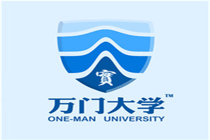
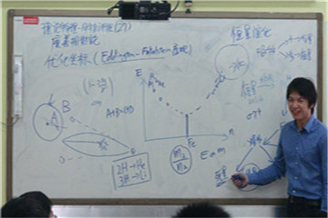
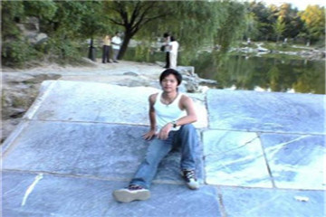

# 童哲 生活在自己的世界里

2008年4月17日，满头银发的德国教授鲍喜慈穿着花格子衬衫，在北京大学理科教学楼讲大三物理。临下课时，老人俯身往黑板左下角用力写4个大写字母“LIFE”，侧身挥臂说：“不要太在乎成绩，很多优秀的学生赢了分数，却输了最大的考试——‘人生’。”第3排一个男生趁机举起手机拍照，在图片底部注上：“鲍老师，耿直的德国老头活在自己的世界里，我也想这样。”

2012年，这个学生从巴黎高等师范学院硕士毕业，放弃前往诞生21位诺贝尔奖得主的苏黎世联邦理工学院攻读博士，没敢告诉父母就登上了回国的飞机。

他叫童哲，从欧洲理论物理研究者转型成为中国第一所网络大学校长，他说鲍教授是一生中帮助最大的老师。

**不设围墙的大学**

《纽约时报》撰稿人劳拉·帕帕诺称2012年为“网络公开课之年”，在线教育公司Coursera在一年内吸引了170多万用户注册，另一家网络教学机构可汗学院的课程开始被美国公立中学采用。6月，Coursera创始人达芙妮·科勒在TED演讲中分析网络公开课的力量：“斯坦福大学机器研究课程的课容量是400人，当主讲人安德鲁教授把这门课公开到网上后，有10万人注册课程。若想通过斯坦福的课堂来影响这么多人，他需要250年。”

受美国在线教育浪潮的启发，童哲想回国办网络大学，以消除国内对转基因食品、自由市场等议题的偏见，因为眷恋家乡厦门、敬重学术圣地巴黎高等师范学院，取名“厦门高等师范学院”。然而coursera创始人演讲前2个月，童哲被苏黎世联邦理工学院选拔为全奖博士生，离高中的“理论物理学家”梦一步之遥。

犹豫间童哲到意大利海港Trieste散心。5月26日午后，坐在38路巴士上看风景的童哲玩起《三国志12》游戏，最初2局都凭借加入实力最强的阵营轻松获胜。无聊感随之钻入心孔，童哲刻意并入弱小团体去血拼，赢取胜负以外的乐趣。

“人生也是这样，结果不是最重要的。”童哲感到富足的欧洲中产阶级生活没有吸引力，他向往充满未知的生活，渴望留下痕迹。

 <small>童哲在巴黎留影（图片来源于受访人）</small>

回国后童哲首先到学而思教育集团试讲，找工作糊口。

这不是童哲第一次讲课。2012年4月，他在巴黎的宿舍里录了一段《阿哲的物理小课》传到网上，1个月内突破6万次点击量。但试讲高中数学题时，童哲不习惯面对真人用大音量解释高中难度的题目，被听课老师批评“表达不清，思路混乱”。

经本科同学推荐，童哲还是被学而思高中物理组录用。他以熟能生巧为策，与讲台“死磕”，每天讲课8小时，几乎没有度1个周末。童哲习惯随手擦拭板书，半年过去，右手手指脱皮，同时体会到进步。“童哲能把无论多难的物理公式翻译成大白话让学生听懂。”童哲当老师一年后，学生苏茂回忆。

讲台下，厦门高师的筹建工作也紧锣密鼓地进行。童哲设计的课程结构不涉及人文类，同时绕开中国民间公益教育组织与政府的常发冲突，以把超离政治的知识普及做好为内部共识，“如果加入游戏却不顾设定，走一步终止游戏的棋，那未免太冲动了。”

借助学术圈的人脉，童哲邀请普林斯顿大学经济学博士柯绍韡、加拿大滑铁卢大学复杂科学系博士马正等人拟定自学书单。但寻觅录制授课视频的教授不容易，至今没有出现能把化学领域串通讲完的老师。

2012年10月，童哲在大学生扎堆的人人网注册公共主页，分享书单，设自由讨论区，正式将“厦门高等师范学院”更名为“万门大学”，寓意每个人能通过自学打开万千知识的大门。为吸引学生，他设计学生证，免费用平信寄给在公邮中留下地址的网友，6个月后，寄学生证花去童哲1991元工资，与此同时，万门大学公共主页的关注者超过5万人，接近北京大学本科人数的三分之一。

万门大学不为建设者提供报酬，参与者全部志愿服务。2013年4月，童哲在人民大学的沙龙上偶然结识张明达和刘晓楠，3人拉面馆结义，万门大学的核心团队成形。

2013年5月起，以复旦大学为首的45所高校邀请万门大学举行分享会。童哲、张明达、刘晓楠取出半年积蓄结伴前往，以传播万门大学的理念：“每个人都可以成为自己的终身大学，为自己完成质量不低的高等教育。”

演讲结束后，张明达向学生会提议成立“万门大学X项目”，试图通过在校跨专业的讨论来完成自主学习，“万门大学相信学生间的讨论虽然不一定有最正确的结论，但是这种讨论和自主学习本身才是最重要的锻炼。”

巡回分享会使万门大学得到更多认可，在比利时、新加坡和美国读博士的王彧弋、张袆星、唐乐超，先后为万门大学录授课视频。2014年1月21日，万门大学开放独立网站，当天被《人民日报》整版报道，“我们需要媒体宣传，交朋友要广泛。”童哲说。

 <small>万门大学校徽（图片来源于受访人）</small>

**不会结束的特训班**

网友对童哲的印象多是天南地北的巡回演讲，但童哲在万门大学主要负责录制和审核授课视频。

2013年3月，童哲想在学而思开特训班，用集团的场地、设备录制课程视频，同时弥补在北大读本科时没听到老师用一个月串讲本科物理的遗憾。随后，报名方式公布到人人网公共主页，每人2850元的报名费被直接打进公司账户。

2013年7月1日，来自北京大学、清华大学、香港科技大学、中国科技大学等高校的13名学生坐进北京科学院南路45号的学而思401教室，以后34天他们将面对同一个老师——童哲。

第一天站上讲台，童哲感到眩晕，“中国以前没有人尝试过这样快的授课进度和这么大的课时量，我告诉自己，一定要撑下来，无论精神上还是体力上。”

童哲的课堂允许随时提问，随着课程的开展，学生提问的频率越来越高，平均每3到5分钟一次，甚至无关的玩笑话也频频冒出。第14天上午10点，童哲正准备讲量子统计力学，他板书“玻色爱因斯坦分布”和“费米狄拉克分布”后，立刻被插话：“它们哪能放在量子统计力学里面？顶多算是热学课内容嘛！”童哲停下来，愣了2秒钟，轻轻说声：“对不起”，面无表情地走出教室，手里还捏着笔。

面面相觑的学生迅速交换眼神，一起追出去，看到童哲独自坐在教室隔壁的逃生楼梯口。北大学弟张晨（化名）和天津大学研究生泽光（化名）上前说：“我们都是你最大的粉丝才报这个班的。你有意见尽管提，不要有隔阂。”

童哲平静地说：“课程进行快一半了，完全不能跟上进度安排，你们随意打断我，浪费了太多时间。其实很多问题不是我不讲，是还没来及讲就被你们打断了，感觉.....你们不是很信任我的样子。而且授课视频的录制效果也会受影响。”

张晨安慰他：“我们是无意的，我们都是你的铁杆粉丝，我们以后一定改。”

童哲要求单独静一静，让学生先回教室，1个人面对螺旋形逃生楼梯沉思了70分钟。

11:30，泽光下楼给童哲买了份盖浇饭，童哲回教室吃完饭对全班说：“请你们相信我，这个课我一定会给你们上好，让你们满意的！”学生齐喊：“支持！”大家商量以后课上计时提问，玩笑话课后说。张晨劝童哲休息，自告奋勇代课1个下午，得到一致同意。

下午3点，张晨解释微分方程应用时，童哲从办公室回到教室，泽光注意到坐在最后一排的童哲气色好多了。

“我从这次停课明白了索取时也要考虑对方感受。”泽光说第二天授课恢复正常，停课没留下后遗症。这一周的周考，童哲出的倒数第二题是：请尽可能多地写出特训班同学的名字或外号。北京信息科学技术大学的苏茂没写完这题，结课19天后特意在博客里补齐。

 <small>童哲在特训班上课（图片来源于受访人）</small>

周考结束，童哲和所有学生去电玩城。学生看到童哲在头文字D赛车游戏中连赢30场，开始和老师车轮大战，结果却是全军覆没。玩兴未尽的师生比赛扳手腕，依然是童哲全胜，从此他多了1个绰号：绿巨人。傍晚6:30，这14人组成一支队伍，向面馆进军。

研究物理并不是所有报名学生的理想，张晨是童哲的厦门同乡，出于对童哲的支持和理解参与特训班。“童哲想教给学生的不仅是物理知识，更是在物理道路上继续前进的方法，他想带领渴望真理的人推开通往真理的大门，因为曾有无数学子没遇到好教材或好老师，被拍死在那扇门上”，苏茂在特训班学到读懂原版英文教材和真正学通物理的能力，现在他翻开当时的笔记，看到知识点并不生疏。

“我们是很好的朋友，甚至可能成为人生的战友。”童哲说讲完最后一节课的感觉像失恋。

2013年8月4日结课后，微信群“大特物班”建立，偶尔为网友对万门大学的质疑感到郁闷时，童哲会在此得到安慰。

“特训班使我真正理解难忘的含义：看到的虽是空教室，但他们13个都在。”童哲用左手按住微微向后收拢的下巴，脸上泛起的红晕显示出理科男生的羞涩。

结课第2天，童哲的人人网主页上多了个相册《永远的理论物理特训班》，与穿了6年没舍得扔的解体球鞋一并留念。

**不需要答案的加分题**

特训班的师生习惯9点晚自习结束后，留下玩局三国杀。熟读《三国演义》的童哲喜欢雄才大略的曹操和恪守原则的徐庶。“现在谁还记得那些富甲一方的豪杰？一个人应该被历史记住，有好似物理定律的长久影响力。”

本科毕业6年后，童哲的同级校友曹文雯说：“在北大物理学院知道童哲的人心中，他就是个‘只要听到立刻想扶额’的形象。”2013年4月曹文雯在人人网发现万门大学时觉得学校的英文名“one man university”是个不错的冷笑话，1个月后听同学介绍创建人是童哲，“于是一秒钟对万门大学好感值正无穷，与我们物理学院本届及上下届学生的态度基本一致”。

曹文雯对童哲的最初印象来自未名BBS。

2007年10月，读大三的童哲在未名BBS实名举报党员同学冒领国家助学金：“学院一直没有行动，直到作为校园人气之星的我在博客上披露这件事。”童哲的行为使物理学院最终举行了听证会。月底，面对“放暗箭、抓住别人小辫子不放、不和谐”的评价，童哲在论坛声明：“我叫童哲，文章是我写的，作为一个成年人我愿意承担一切连带责任……您说对了，我就是一个不和谐的人。”

2008年6月期末考试期间，童哲又在论坛揭发同学求老师加分，“学问的荣誉与学术的尊严，在委曲求全的旗号下荡然无存。这就是当今世界带给我们的。”

童哲的北大校友、原《南方周末》记者方可成在博客中记录：“也许有人会觉得这样的人很碍眼，但是如果连这样的牛人都没有了，北大便和其他校园没有区别。”

万门大学使童哲受到更多关注，公共主页建立4个月后，童哲位列人人网北大人气之星第五位。“我的确想留下存在的痕迹，也可以说是留名，但实现的方式一定是对社会有正面贡献，包括做万门大学。”

 <small>北大时期的童哲（图片来源于受访人）</small>

2013年12月1日上午10点，童哲在人人网发起“万门大学杯理论物理知识竞赛”，用公共邮箱回收所有20道判断题的答案，最先提交的3位满分者分别获得iPad Mini (retina)，万门大学物理系资料硬盘，与童哲同款的CASIO手表。

第五道题立刻被围观，网友留言：“题目写错了？校长卖萌？”或是在“第5题”的后面留下一串感叹号、省略号，却没有得到任何回复。

第五题的原题是：“第5题、本题的陈述是错的。”下午18:56，童哲在人人网发表日志《这是一道加分题》解释，第5题是经典悖论，判断为对或错都可以，拒绝回答或说明矛盾的答题者被额外加1分。

“没有答案的题目，本就应该没有答案。”童哲举自己崇拜的爱因斯坦为例，“爱因斯坦正是根据麦克斯韦方程组和伽利略变换的逻辑矛盾，提出新的时空观相对论。悖论是科学的突破口，坚持科学信念才能创造出杰出动人的成果，这是历史对质疑精神的加分。希望万门大学的学生也能通过人生的各种加分题。”

**不考虑稿费的作者**

万门大学的活动让童哲体会到存在的意义，但等中国的网络公开课发展到无需万门大学时，童哲打算关掉网站。“我可以同时做许多事情。如果将来能统领一个行业，我很希望在经济领域有所贡献。”教育创业不耽误童哲玩比特币、写金融科普文、熬夜炒美股。同时，童哲相信文字可以一针见血地戳中社会症结，憧憬成为作家。

他正在构思的书有27本，包括《误解美国》，针对国内对美国的莫名仇恨，整理外交史，如巴拿马运河归属事件，证明美国大部分情况下没有称霸意图；《新国富论》，结合国家存在的意义，福利制度的负面影响，后发国家的盲从等，分析使国家富裕的原理，同时驳斥身居高位者的盲目言论；《有意义的言说》，摘录著名的空谈，如薄一波的回忆录、金正日的演讲，对比胡锦涛与奥巴马的发言，以阐明有意义的话语在当下中国的重要性……

“我的书应该和万门大学的学习资源一样，放在网上供人免费下载。”本科出的第一本书脱销让童哲有信心不主动联系出版商以保证写作自由。

2007年9月，读大三的童哲首次自费印刷博客，取名《暴走米花集》，用自己的黑白头像做封皮，成本是每本5.9元。10月2日中午，童哲和5名同学在北大三角地叫卖售书，依据爱吃的大碗加蛋刀削面价位，敲定零售价6元，本院同学享受成本价。

物理学院的同级学生吴铭（化名）听说童哲“神经有问题”，好奇地买下这本书，看了4篇日志后在百度空间写了1571字的读后感。

吴铭在书中看见深埋心底的自己，“不安分的强人不可避免与大众产生摩擦，却对世界充满不可动摇的善意。谁人精神上没任何问题？我从童哲身上看到的是躁动和天才，我们要宽容他。”

这篇读后感的标题是《做自己！》，取自童哲大二下学期的日记：“做自己喜欢的事，结果甚至过程都不重要，只管是否站在自己这一边，是否尊重自己，是否问心无愧。”

*文中部分学生姓名系化名

（记者：吕晴川  编辑：李卓  责编：李卓）