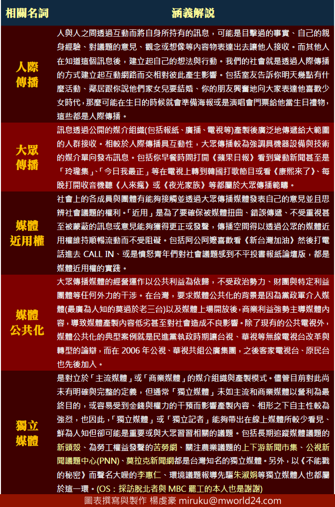

# 米嚕酷傳播教室：人際與大眾傳播、媒體近用權、公共化、獨立媒體  還有...極不像話的NCC*

**在1****月10****日行政院審查NCC****委員候選人汪用和與江幽芬的會議上**，民進黨籍立委林淑芬向兩人ㄧ大眾傳播理論的若干字詞解釋與舉例，包括「人際傳播」、「大眾傳播」等問題，兩人皆以「並非相關領域學者出身」為由，無法清楚解釋相關名詞，另外當林淑芬問及「何謂媒體近用權」時，兩人也僅以片面字義解釋「讓人民在取得資訊上面沒有障礙」、「我想它所指的人民應該可以很方便的擷取各種資訊」。而在談論「媒體公共化」時，汪用和只談及「公共電視」，江幽芬則回答「媒體要考慮到公共利益與言論多元化」。

最讓人覺得驚訝的是，當林淑芬要求兩位候選人舉例「獨立媒體」時，江幽芬回答不知道，而汪用和則揣測「我想大概是像維基解密這樣的媒體，並不是由財團所控制的。」

聽了兩位候選人這樣的回答實在令人汗顏。我原先認為，對於初上備詢台的兩人而言，或許可能緊張或缺乏經驗，但應該不至於到五個問題幾乎全軍覆沒，尤其在反媒體壟斷議題成為社會關注的焦點時，對於這些名詞的思辨都是重要的。姑且不論比較具有學理性的「人際傳播」與「大眾傳播」，「媒體公共化」與「獨立媒體」都與實務緊密連結，在近來台灣媒體議題上都是耳熟能詳，何況在台視華視公共化問題炒得如火如荼時,汪主播還在線上，其定義與舉例應該能說得出來才是，而曾主持過政論節目的她當然也和「媒體近用權」有所連接,照理來說五個問題中汪主播應可回答出兩個以上才是。連台灣的「獨立媒體」都不知道有哪些的NCC被提名人，他們對媒體生態的理解還停留在主流商業環境的陳腐思維下，不知道外於主流環境還有其他力量正提供不同於商業媒體低劣品質的新聞報導、比主流媒體更忠誠的堅守職責與發揮功能，這些人幾近與社會脫鉤，能夠要他們去處理反媒體壟斷問題、要他們提出具體對策強化媒體職責與監督功能？這實在極為荒唐。

本人以下就將林淑芬委員所提問的幾個名次進行完整闡述，包括人際傳播和大眾傳播的比較、媒體近用權的意義與目的、媒體公共化的主要意涵、獨立媒體定義的試解與舉例。抱歉，我也不是新聞科班出身，更不是什麼學者專家，但這些東西我大多能不用看稿生活化地解釋並舉例出來。我還要再次強調，連獨立媒體都答不出來有哪些的人，代表他其對媒體的定義還停留極其保守的思維框架中，若獨立媒體不受重視，則在被台灣惡質商業與主流媒體所極端扭曲的環境下，許多重要的社會議題將被刻意忽視，媒體到最後僅淪為特定權力的機器。你絕對無法期待這群人能夠如何積極地改善台灣的媒體生態以及處理反壟斷問題。

最後，我認為問題並不在這兩位被提名人，最荒唐的而且也最應該被檢討應該是將他們放入候選名單內的行政院長陳冲以及送上審議台的NCC主委石世豪，把連獨立媒體都舉例不出來的人提名做主管媒體事業的專責要員，很難不讓人有政治酬庸的聯想，如同擔任陸委會主位的王郁琦認不出賈慶林一樣，這次主管單位再度鬧了大笑話。執政者行事如此草率，媒體事業主管者還跟著沆瀣一氣，不好好考量與安排新的提名人選彌補這個大出包，竟然還有餘力夜半緊急圖擋廣電三法，看了都令人覺得動機完全不單純。

* * *

編者注： 

1.NCC: 國家通訊傳播委員會（簡稱通傳會、NCC）是中華民國電信、通訊、傳播等訊息流通事業的最高主管機構，乃附屬於行政院之下的獨立機關；該機關的創設，係仿效自美國聯邦通信委員會。在此之前，通訊傳播事業之監理與審查業務由行政院新聞局、交通部電信總局等多個機關負責。

2.本文評述新聞事件來自：（http://newtalk.tw/news/2013/01/10/32728.html），內容如下：

立法院交通委員會今（10）日針對行政院提名的NCC委員候選人汪用和、江幽芬人事遞補案進行審理，立委紛紛提出各式各樣的難題考驗2人，立委林淑芬質詢時，要求汪用和、江幽芬舉出3個獨立媒體，汪用和想了一下，回答「我想應該是像維基揭密這樣的媒體」。

林淑芬在質詢一開始時說，「要先問一些專業的問題」。隨即問汪、江2人在傳播學領域中，何謂大眾傳播、人際傳播、何謂媒體公共化，2人皆招架不住，汪用和則數次強調，她的專長在實務經驗，不是學術理論。

林淑芬又問「何謂媒體近用權？」，汪用和回答「人民可以很方便的接觸到媒體提供的資訊」；江幽芬則回答「人民沒有取得資訊的障礙」。

林淑芬接著又問2人「你們聽過獨立媒體嗎？」，並要求2人舉出3個例子。江幽芬說，她不知道；汪用和則說，「我想應該是像維基揭密這樣的媒體」，且不以營利為目的。林淑芬痛批，汪用和與江幽芬的表現太離譜了，都在羞辱國家和NCC。

林淑芬說，她問的都是不涉及利益衝突、意識形態的常識題，2位委員候選人沒有能力、常識、基本概念，讓人「笑掉大牙」。

歡迎關注北斗兩岸：[https://www.facebook.com/BeiDouLiangAn](https://www.facebook.com/BeiDouLiangAn)（facebook粉絲頁） [http://www.renren.com/601607819 ](http://www.renren.com/601607819)（人人公共主頁）

採編：Vanessa 責編：余澤霖
