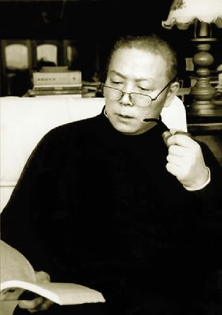
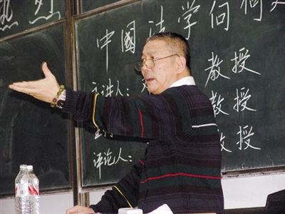

# 纪念邓正来先生

今天又监考一天，每每在这几天的监考过程中看到那些学生对本可以自己努力背背就能回答出来题目偏要营营苟苟、偷偷摸摸“作弊”，一种悲哀、失望、鄙视、激愤、怅惘等诸多感情混合的东西油然从心底升起，最后它形成了一种唯一经验性的体会——感觉身心疲惫的累。我不知他们为何要选择这么一种没有尊严的方式面对考试——也许尊严从来没在他们那里构成一个问题。他们选择在自己看来很自然的这样一种方式考试，难道能推论出他们会选择截然相反的方式去生活？他们为何选择这样去活？多元的社会不是增加了人的选择，让人在更多的选择中更加自由了么？但在自由中他们为何不由自主地都选择一种“快乐地在泥地里打滚的猪”这样一种活的方式呢？

在自己经受这种身心“煎熬”的时候，我的一个学生——一个有志于以学术为志业的学生——给我发短信，说正在看着邓正来书有诸多疑问和看不懂的时候，看到了邓正来老师仙逝的消息。在我这里，没有震惊，没有格外的悲伤，这种好像“漠然”的感情不是因为邓正来其人与我自己无关，而是因为一种在其微博发表的公开信中所表达的那种对肉身来去欣然接受之豁达的体谅与理解。肉身来去无所谓，他应该欣慰的是：他以有限的肉身为其思想的载体，为诸多喜欢他、服膺他的学生带来了学术范式的革命。从某种意义上说，他是改革开放之后一代学者中掀起中国学术范式革命的先驱式人物。——说到这里肯定会被诸多人扔砖，在我的周围不喜欢他的人远比喜欢他的人多得多。但是有一点我可以肯定，那些不喜欢他的人大多没有看过他的书，或者即使看过也没有看下去，或者即使看下去了也没有看懂。不论别人怎么说，我坚定地认为在当今中国社会科学界，邓正来是中国学术水准的试金石——那些动辄扬言不喜欢他的人大多是些学术不入门的人。

我与邓正来先生素昧平生，但当孩子入睡，一个人这样坐着的时候。除了尽量去纪念他，我不想做什么别的。一个无钱无权的书生，又能为他做什么呢？我能做的就是这样通过电脑敲打，如果可以不顾语法、不顾言辞之达意与否，只是语无伦次地诉说，以一种“意识流”的方式对自己所想进行文字的捕获，我真的会并且愿意就这样在电脑上敲打一整夜或者加上一整天，直到困得意识无法流动。但这又有什么意义呢？上课我给学生讲邓正来先生，讲他的《中国法学向何处去》；讲他的“小南湖读书小组”；讲他的“体制内的体制外”；讲他的五年闭关读哈耶克；讲他在地铁站“借宿”的轶事；讲那些对他的牛唇不对马嘴并且自以为是的学术回应。并且总是以一种违反学术规范的非价值中立的态度告诉学生邓正来先生是我佩服的不多的国内学者；告诉学生邓正来先生是国内不多的真正懂社会科学的学者；告诉学生他的“闭关”才是成就一个学者的真理性道路；我也让自己在无知状态下告诉学生那些无的放矢、不知所云并自诩在和邓正来先生对话的教授、学者大多学术不入门。就是这样，他曾经是自己的榜样乃至神话，他和他的话题也曾是构成我课堂激昂讲课的话题。他每一出版的书，自己见到一定收集。很多人说他的语言看不懂，他的句子长的憋死人。但我看着是那么顺畅，读着心里是那么舒畅。自己碌碌无为，但是却喜欢经常看他那张勤恳中叼着烟斗的照片——我想那张不知谁拍的照片也一定是邓先生最喜欢的一张之一吧。

自己自揣学术上无法做到像他那样，但是自己愿意并喜欢像他那样去做。像他那带着问题去思考，带着对生活的某些东西（意义、价值）去思考。如他所说去思考秩序的逻辑和其构建的合法性。邓正来先生是一位非常“规范”的学者，他所有的写作与其说逻辑清晰不如说是框架清晰。他在自己严格限定的框架内谈问题，从而让问题能够成为一个问题。而很少一味自说自话地“漫谈”。这让他区别于那些和没上过什么学的人差不多的所谓教授和学者。他的这种“规范”已经、正在并且将来还会强烈冲击中国学术界的“不规范”。如果中国学术人还能体认学术积累的重要，还有为学之心，那邓先生最先示范的“规范”的价值作为一种范式革命性的东西应将一直有助于中国学术界。如果中国学术界如同某些政治现象一样要腐败得一塌糊涂，那就毋宁说“规范”问题了，中国以后是否还有学术都成问题了。

中国的希望在邓先生以及像他这样的学者培养出了一批学术的“接班人”。这种“接班”应不仅限于“规范”的接班，更应关注对其学术精神的传承。如果让我概括，我想邓先生一生一直在怀着一种追求自由的决心和勇气在为自由而挣。这种“骨气”和“正气”化成了他的学术问题意识，他要搞清楚：“是谁规定了这样的权力把我——和现在的你们一样拥有独立思想和自由意志的人投掷并捆缚在这样一种社会秩序中？这个问题再提升一步，是谁规定了这样的权力把我和我的同时代人投掷并捆缚在这样一种社会秩序中？是谁规定了这样的权力把几亿中国人投掷并捆缚在这样一种社会秩序中？是谁规定了这样的权力不仅把几亿中国人而且把他们的下一代人也强制性地投掷并捆缚在这样一种社会秩序中？” 为此他试图“螳臂当车”，以自己有限的肉身和无限的勇气在现存的体制与秩序之外尝试一种没有强制的生活。这种生活是艰辛的：“我是在体制外生活了18年的。那段时间，我和我太太没有分文收入，全靠我的稿费赖以谋生，我太太是一个非常贤惠非常美丽的人，她从未向我要过化妆品。那个时候我住遍了北京的地下室。在北京地铁站也睡过。北京的第一班地铁是凌晨4：30，我在地铁站冷了就起来跑步，热了就开始读书，就盼着第一班地铁赶快到来，因为里面是有暖气的。”为了保住这种“体制外”——实际是保住自身不被体制奴役保持独立与自由而拒绝了北大、清华等学校的邀请。如果不是吉林大学的张文显教授，邓正来先生恐怕还要在体制外生活好多年吧。即使因为各种原因无奈进入了体制，但邓先生一直追求一种“体制内的体制外”。以一种独立严谨的精神追求自己心中宽广的自由——如同生活在那小镇中的康德。邓先生很多时候谈到对“学术政治化”、“学术行政化”的厌恶。其实表达的是对体制滥用自己权力扼杀学术自由的厌恶。一个依附于学术体制讨生活的人首先面临的问题是如何能获得一个独立的人格，成为不役于物的君子；其次是他如何成为一个具有独立思考能力的学者——一个依附于体制的人最后的宿命就是在体制内思考——成天沉浸于“和谐社会”的思考和研究概就是典型的例子吧（看看教育部和国家社会科学的课题，多少涉及和谐社会的？而那些因为申报了和谐社会构建研究的课题成功率非常高。但在这样一种课题争夺中，一个学者的“学术品格”也就开始流失，最后，原来还有的那点“格”肯定随着课题结题，课题经费到手的欣喜而彻底丧失殆尽了。为了“讨生活”而在学术体制内混得风生水起的人绝大部分是些没什么学术品格的人。他们当然也是些社会科学不规范，不入门的人。因为他们不具备成为学术人的基本品格，没有在长期阅读中培养起学术品格的前提条件——爱学术、爱自由。邓先生以身作则，为一个学者趟出了一条类似“理想类型”的路。

邓先生在自由中追“善”。他遵循柏拉图传统，在柏拉图那里对善的定义是“各安其分”或者说“安于本分”。一个学者的本分就是读书。一个教师的本分就是通过读书育人。而这两者邓先生都堪称中国的学术和教育的楷模——尽管“楷模”之称谓因为有太多体制印痕而肯定会不为邓先生肯认。但其意了解他的人应自明。此盖“意识流”描述所致辞不达意了。但浪漫和现实的组合有两种，一种是现实的浪漫主义，一种是浪漫的现实主义。我们选哪一种呢？邓先生选择了前者，他立基于现实（闭关读书、开“小南湖读书小组”读书），而读书的背后指向的绝非一种功利的现实，而是一种现实基础上的浪漫——独立、自由、人格、正义等诸多品质的获致，即柏拉图的善和美。他说：“关于理想化的问题，我想如果连最基本的理想、最基本的想象力都丧失的话，那么未来也就没有了。”一个不考虑未来的人，一个只愿意生活在现实的当下的人概就是那种和善与美相对的“像猪一样快乐地在泥地里打滚儿”的人之写照了。邓先生告诉我们一个学者不能做这样的人。这样的人也一定成不了一个学者。由此，他也曾清晰地表达了自己对读书和大学的看法：“无论从事什么职业，无论你在哪一行，这都不是道德的表现，这只是一种生活的选择，绝不是说做学问就更加道德高尚，绝无此事，没有高低贵贱之分。但是我之所以对你们如此大谈学术的重要性，是因为我觉得，中国今天世风日下的重要原因之一，就是人们都失去了方位感、失去了本位、失去了本分，做老师的不像做老师的，做父母的不像做父母的，而在大学里，作为学生，你的本分就是要把书读好，无论你将来想要做什么，在这个阶段，在这几年，读书就是你必须守住的最大本分。”他作为一个师者谆谆善诱让大学生——这些国家的未来和希望——认真对待大学，做到有责任和担当“大学是什么？大学是University。University是什么？University是研究和关心universal的地方。大学不是旅馆、不是酒店，不是让你如过客一般来去匆匆，不带走一片云彩。你们是将人生中最华彩、绚烂的四年时间、三年时间停驻在这里，来关心和思考那些普世性的问题和人类之命运的。老师教不好是老师的原因，学校管不好是学校的原因，但你们自身首先也要有一个自省和反思，你们自己也必须意识到自己的这种责任和担当。”读书、责任和担当是大学生三位一体性的“本分”。不读书无以形成责任和担当意识，没有责任和担当的潜质和情感的敏锐也一定不会选择读书。潜质、想象力、敏锐洞察是一种能力，这种能力构成一种选择前提。会让人选择去读书，去“爱智慧”，而不是去热衷于实践和实习。

说到人的潜质，邓先生概是非常赞成在西方始自柏拉图，在中国始自孔子的关于人的等级划分的。柏拉图和亚里士多德都把人分成金、银、铜、铁，金和银是高贵的人，而铜和铁都是资质平庸的人。孔子也是把儒家立基在这种人的高低贵贱之上的。在此关于儒家的邓先生很少提及，但他关注中国的秩序构建是个不争的事实。基于此我帮他补充几句：儒家构建自己社会秩序的第一步就是制造一种有层级的社会人际关系结构。它让社会上的人首先内化这样的观念：人的智力、能力、机遇、出身是不一样的，这注定了人有智愚贤不肖之分，有贵贱上下的分野。从而让人相信“贱事贵，不肖事贤，是天下的通义”这样的价值观念的教化，用现代的马克思术语来说，无疑是缓和甚至消除了阶级矛盾和对立的社会心理基础。另外更为重要也是更为基础的是中国的家族。控制中国民间社会的实际是一个个宗族。而宗族得以维持稳定的是血缘亲戚关系。与消除阶级对立社会心理基础的思路一样，儒家提出了“人伦”的教化要求：父子、兄弟、妻子、夫妇、尊长构成家族中最基本的关系范畴，对其有严格的尊卑等级序列之划分。即父父、子子、兄兄、弟弟、夫夫、妇妇被从天然的属性中提升出来，上升为社会的伦常性规范。至此，家族之内基于血缘亲缘的等级，以及家族之外不同的行业之间的阶级等级观念就被确立起来。

那接下来，如何落实并维护这些观念呢？这就需要一些对以上两种观念在更高层次上进行说明和规范的观念——用现代的观念和言语来概括，“礼”就是这些更高层次观念和规范详细陈述的总和。用古语云：“夫礼者所以别尊卑，异贵贱”。“礼也者，贵者敬焉，老者孝焉，长者第焉，幼者慈焉，贱者惠焉。”最后“礼达而分定。”这种“礼”下的安排实际上就是首先根据一种对社会的总体把握和深刻了解把人归类，然后通过把人所在社会类属的地位明确化固定化，最终把人在社会人际关系中的位置相对地固定化。这样一来，因为人都能明了自己的社会位置，确定自身的社会身份和地位，各安其分，最终社会秩序也变得稳定而有序。

这是中国的智慧，而关注中国秩序构建及其合法性的邓正来先生可能意识到了这一点，所以他让自己的学生读《论语》。但因为其遵循其学术研究的规范性，尽管有了这样的问题意识，他最后也没有让自己的研究进入这一领域。他收徒及其严格，我自己身边有很优秀的同学考他的硕士、博士几年都没能如愿。我自己去年也曾提交文章试图通过参加他主持的在复旦大学的研讨班而能有机会和其有更多的接触，最后肯定是因为提交文章质量的问题而没能入选。本来今年想继续提交文章申请的。他在体制内培养学生60余人，而那些“私塾”中的学生大概才是其选中的学术“接班人”。这些人也许在体制内没有什么优势，但肯定被邓先生认定为具有“慧根”的。中国做学问人的“质地”参差不齐。其中绝大部分是“铜”和“铁”。因为在数量上占绝对的优势，所以他们制定了自己“铜”和“铁”的学术标准，那些“金”“银”品质的人写的东西他们不愿意看，也是看不懂的。他们按照没读书人的方式说话——一种非常不规范和不具有学术积累能力的语言陈述。但他们认为那些规范的具有知识积累性的金银质地人说的话是“胡话”。由此，在中国学术界“劣币驱逐良币”机制大获成功。因为认识到这一点，邓先生在书写上特别强调质量而不是数量。他曾试图引入同行评价等西方先进的学术评价体制，这样的体制可以让一个不写文章但是同行评价高的的学者非常受尊重。对中国在量化课题、文章数量、职称、荣誉和金钱催生下生产学术垃圾——特别是社会科学学术垃圾的机制，邓先生深以为虑。

邓先生重视对自己孩子的教育，这是另外一种以身作则。在此我转载他在某演讲时的关于对女儿教育的一段话，让大家体会其在教育中是如何追求和对待自己视为生命的“自由理念”的吧。

“我15岁的女儿在学术界都是有名的。她和吴敬琏先生、季羡林先生都是很好的朋友。我的女儿在一年级的时候就‘谈恋爱’。学校的老师知道我和我的女儿有非常好的平等的关系，就问她，难道这事你爸爸也支持吗？她说，对，我爸爸支持。老师听了以后感到很纳闷就赶紧给我打电话。我说，老师，是这样的，在学校里听你的，回家以后听我的。我告诉我的女儿，这个世界有60亿人口，60亿是什么概念呢？就是你数几天几夜都数不完还要累死。在60亿人口的世界中，你的一生能够认识的人不超过6000个，你能够交到的好朋友不到600个，你的铁哥们不过60位，最后能够为你舍命的人包括你的父母不会超过6人。你小学一年级如果是遇到了一个你喜欢的人或者喜欢你的人，这意味着他至少是1/6000了。这是最难得的，最宝贵的，最纯洁的。

小学三年级我让她不读了，回家跟我读书，读了整整一年，我们两个都很开心。但我突然意识到，对她说，你必须回学校。为什么？因为你在家里学不到‘坏’，你连坏是什么都没见过，都不知道，怎么去了解社会？人生中有很多带有价值判断的‘好’和‘坏’，这些并不重要，重要的是一种经验、阅历，一种实际的挫折感。

初一时选班干部，班主任让每个学生写一个纸条，说明自己适合当什么干部，我女儿写了一句我认为只有我的女儿才写得出来的话，她写道：‘我如果能够把自己管好了，就是对班级最大的贡献了。’

对子女的教育的一个十分重要的方面是家风、身教、实践，家长在家里打麻将子女没有不会打麻将的，家长在家里说别人的坏话子女没有不这样做的。”

邓正来先生很有作为一个学者的高傲，我想这种高傲让其得罪了不少人。某些也算是国内小有名气的学者很瞧不上他，甚至非常鄙夷，我曾当面追问原因，他说邓人品有问题。我当时大吃一惊。后来听他说，所谓的“人品不行”就是他的两个不知真假的例证：其一是邓到高校讲座要求必须校长出席陪同；其二，其讲课费要价高。我听完之后莞尔一笑释然了：反学术行政化就是要让学者有地位，让校长陪就对了，是一种学者的能力和本事，一个学者去讲座好想去讨饭行乞那逻辑就不对了；另外要价高有什么不对，与其让那些领导把钱弄到不明不白建所谓的“新校”，为何不让他们拿出些来改善学者条件同时让学生听到高水平的讲座？邓先生的高傲还体现在其书写中：在《中国法学向何处去》的结尾，他认定了那些“铜铁”质地的人肯定会提出一些学术不入门人提出的问题，比如这样的问题：你说这个没出路，那个没出路，你告诉我出路在哪里啊？邓先生回复说：你别让我把你刚从狼嘴里拖出来，又把你送虎嘴里（书不在手边，有出入烦劳纠正）。这让那些“铜铁质地”的学术混子们情何以堪？所以不惜以人品问题作出铜铁之流特有的“下贱”回应。

邓先生公然对国内最具影响的“本土资源”、“文化解释”、“权利本位”这些主流学派提出逻辑缜密的尖锐批判，那是一种非常规范的学术批判。但在中国的的学术体制内，这些“流派”哪一个不是“门徒广布”？所谓的“教授成群”？这就等于邓先生向整个法理学界提出挑战！但这就是中国体制外的一位了不起的学者——邓正来的气象！他教导我们两个方面，我们应该铭记：“人生和学术。人生讲什么？讲气象、讲境界。人不正则无气象，无气象则无大学问。如果每个人日常生活都在偷鸡摸狗，那么也不可能做出大学问来。学术讲什么？四个字：追比先贤。不是追比你的同学，也不是追比你的老师，要追比千百年来的历代先贤。”

邓正来——带着一腔学术激情，一身学术正气，他离开了我们，去了“理想国”。大概在当下的中国真的无人能和其对话，他也厌倦了这样让人“倒胃”的学术氛围而去找孔子谈儒家秩序和治理，去找苏格拉底和柏拉图谈理想国度的秩序和治理问题去了吧！

书写止于此，但对其缅怀将永伴！

山东财经大学法学院讲师牟利成

——一个其言说陪伴着成长的学生！

（采编：陈肃；责编：彭程）
