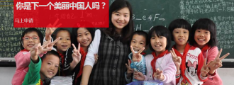
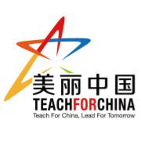

# 美丽中国(Teach For China)—你是下一个美丽中国人吗？

**一、美丽中国基本介绍**

在当代中国的主要发达城市，将近80%的学生可以进入大学，然而在中国贫困的农村地区，只有5%的优秀学生才能进入大学。这一现实也让消除贫困变得更加困难。一个孩子的出生地往往决定了他的教育前景，从而影响其未来的人生选择。在中国贫困地区，数以千万计的孩子无法接受优质教育，他们所获得的教育资源远不及城市地区的同龄孩子。

在教育资源严重不平衡的背景下,2008年美丽中国(Teach For China)以一个专业化教育非营利组织的身份成立于中国云南。是美国知名教育非营利组织美丽美国（Teach For America）和全球教育支持网络美丽世界（Teach For All）在华唯一官方合作伙伴。

美丽中国每年从中美两国招募优秀青年作为项目老师深入中国教育资源薄弱地区进行为期两年的支教。短期内，项目老师们在帮助学生提高学习成绩的同时，培养学生的思辨能力，良性作用于当地的教育环境。长期来看，美丽中国致力于培养关注教育的未来青年领袖，并从不同领域推动教育资源的均衡发展。这批具有高度社会责任感和实践能力的青年，在未来的职业发展上将继续作用于教育不均现状，推动整体教育环境朝向均衡的轨道发展。

当前，美丽中国在云南西部近中缅边界的五个县以及广东东部汕头市的两个相邻的区里安排了项目老师。2012年秋天，美丽中国向云南和广东教育资源薄弱地区输送200余名项目老师，覆盖50余所学校，影响接近30,000名学生。我们持续不断地努力，希望在将来，每一个中国孩子，无论出身，都能接受到优质教育。

** ** **二、聚焦项目**

**1、****将优秀的教师输送到教师资源匮乏地区：**

**①招募和选拔：**美丽中国从中美招募顶尖大学毕业生成为项目老师。层层选拔具备领导力、克服困难的能力、沟通能力等核心竞争力的青年，加入美丽中国；

**②培训：**美丽中国通过暑期培训，帮助项目老师完成从毕业生到优秀教育者的转变。培训内容涉及教学方法、课堂管理方法、目标设置、当地现状等多个方面，并通过实习试讲，巩固教学能力；

**③安置：**在于当地教育局等政府部门合作的基础上，项目老师们将会被分到资源匮乏的地区进行为期两年的教学工作。每校配备4名左右中美项目老师，共同应对挑战；

**2****、发展一批解决教育资源不均衡而长期奋斗的未来领袖：**

**①支持：**美丽中国有一批持续两年支持项目老师的项目经理，帮助老师们探索促进学生成功的方法。项目经理帮助项目老师制定和跟踪教学成果，涉及学生的学术成就、思辨能力、学习内驱力三方面。同时通过每月召开的职业发展会议，共同探讨解决项目老师们提出的挑战，分享实战经验；

**②长期影响力：**项目老师在教室的两年仅仅是他们对学生们产生深远影响的开端。长远看来，我们会支持项目老师成为中美两国各领域的领导者，并通过共同努力终结中国的教育资源不均。

** **

**三、申请要求******

美丽中国欢迎应届毕业生和有工作经验人士申请成为2014-2016届项目老师。

非应届在校生亦可申请成为校园主管，帮助美丽中国在你所在学校招募到更多的项目老师。

[详情请点击这里](http://www.tfchina.org/zh/shenqingxiangmu/yaoqiu)

** **

申请时间及流程：

[详情请点击这里](http://www.tfchina.org/zh/%E7%94%B3%E8%AF%B7%E9%A1%B9%E7%9B%AE/%E7%94%B3%E8%AF%B7%E6%B5%81%E7%A8%8B)

具体可以关注美丽中国（Teach For China）的官方网站，新浪微博及微信，进行更多的了解

主页：[http://www.tfchina.org/zh](http://www.tfchina.org/zh)

官方微博：[http://weibo.com/teachforchina](http://weibo.com/teachforchina)

官方微信号：meilizhongguo2008

宣传片：[http://www.56.com/u88/v_NzM1NDg2Mjk.html](http://www.56.com/u88/v_NzM1NDg2Mjk.html)

** **

（采编：杨添淇 责编：叶声）
