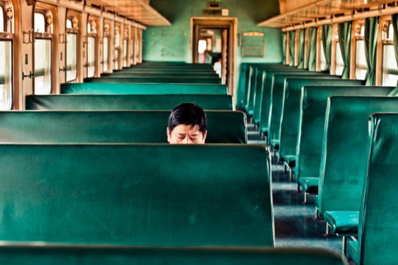
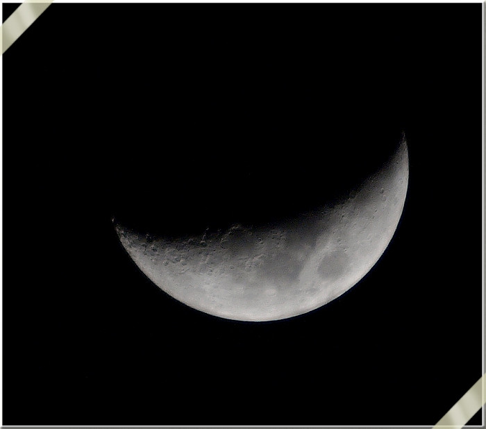

# 胡子刘

每年放了寒假回家，我都要和我爹对饮几次，论国际局势谈世界话题。我们爷儿俩都是吃地沟的命，偏偏就爱操中南海的心。有一次我大概是多灌了几杯猫尿，因为点儿鸡毛蒜皮的小事儿和我爹呛呛起来。当时我脑子一热，犯浑骂了几句脏话。结果我爹摒弃了以理服人的伎俩，直接一脚把我从凳子上踹了下来。然后指着我鼻子说，老子八十岁了也能把你打得满地找牙。

我爹练过武，这一脚下去，虽说省了劲儿，可我屁股也确实疼。好汉不吃眼前亏，我低眉耷眼对老同志表示自己一不小心犯了错误，希望组织上能再给我一次重新做人的机会。我爹昂着头，拿鼻孔对着我，冷哼了一声，表示原谅。紧接着又恨铁不成钢地的数落我太面太不爷们儿，自己几十年的武学修武都无法传承下去，这样下去他作为高手会很寂寞如雪。

我抱怨说，小时候看了黄飞鸿的电影以后我就一直想练武来着，还不是您老人家强调学习是当前人民群众的主要矛盾，让我一心一意扑向知识的海洋。现在我唯一会的拳脚功夫就是广播体操，真动起手来估计壮点儿的姑娘就能把我收拾了。

我爹听了冷冷一笑，说老子当年是不忍心折腾你，可惜现在身子骨也操练不动了，干脆给你找一个真正的高手师父，把你好好调教一下。

我爹说的高手，名字叫刘子虎。

刘子虎是我爹的小学同学，我原来就见过。这人是个老陕，说话一股羊肉泡馍味儿，宽肩粗臂长腿，黑脸浓眉大眼。我老觉得他具有评书里说的那种骑着匹马拿着两把大锤子就能在战阵里杀个七进七出的猛将气质。比较引人注意的是他那一脸胡子，从耳朵根儿开始往下溜，我每次看见总觉得他的连鬓胡再往下蓄蓄，准能和护心毛连成一片。因为他这个特点，熟人都喊他胡子刘，正好把他本名的发音颠了个儿。

胡子刘是铁路子弟，就住在铁路大院，离我家并不远。我爹原来就常带我去他家坐坐，吃点儿柿饼红油豆腐丝儿什么的，都是胡子刘从陕西带的玩意儿，虽然带着土气，但正因为这些土气而显得好吃了许多。

我老爹说胡子刘是高手，但我还是给这话打了个问号，胡子刘面相看上去确实生猛，但耳听都是虚，我没见过他出手。不过我爹倒和我说起过一件胡子刘动手的事情。

胡子刘一家都是铁路出身，父母原先就是从陕客往北客调的工作人员，后来胡子刘也在铁路上工作，那会儿从北京往陕西发的车都还是老的绿皮儿车，连T和K字开头的都少见，经常是十几个小时晃荡着的慢车，胡子刘就是这车上的乘务。从86年开始，一直干到90年初，平平稳稳的铁饭碗，虽说挣得不多，但是好在安生。

93年的时候，突然““坏了事””。

当时是一个乘客喝醉了酒，在车上闹事，对周围的女乘客动手动脚的。有乘务员过来劝阻，结果被醉酒的乘客打了两巴掌，胡子刘一看这样下去不行，就也走过去，想着把事态压一压。没曾想他这人高马大一脸络腮胡的乘务员往那儿一走，反倒把醉酒的乘客给惊着了。那人估计是觉得胡子刘会对他对手，结果自己先下手为强，朝着胡子刘面门就是一拳。胡子刘下意识的一闪，紧跟着自己的胳膊一伸拳头一抬，拳头外侧顺着乘客的太阳穴擦过去。

结果那人当场就倒地，眼看着就不行了。

这一下就麻了大烦，出人命了。胡子刘吃了官司，黑天白夜都耗在这件事上。这段时间里，他爹妈相继去世，媳妇儿也离了婚，等到事情结束，他才突然发现自己只剩干干净净的孤家寡人一个。再继续当乘务员也不可能了，铁路局安排他做了一段时间检票，后来干脆就不再管他，任他自生自灭。胡子刘自己也不愿意再干这个，四十多就早早的办了内退。不过因为他爸妈留下的房子还在铁路大院的家属区里，所以他还在那个地方住着，没有搬走。

我爸聊起这件事儿，一直说胡子刘这人性子太烈，说好听点儿叫打抱不平，说难听点儿就是出手没个遮拦，早晚还得把自己陷进去。

虽说丢了工作，可人还是得挣钱活着。胡子刘找街坊朋友东拼西凑了点儿钱，在家属院的门口开了一家水果店。我去学武术，就是在那家店里。

我爸事先给胡子刘打了个电话，说是让教我点儿功夫。开始电话那头推脱了一下，后来我爸又说就只是健身，不求什么保家卫国杀人伤敌，这才让那边松了口风。

说是个小店，其实是因为门脸儿小，纵深还是有的，除了外面卖货的场地，后面还有个小院子，堆着一箱箱没拆的水果。就在院子中央，清出来一块儿空地，胡子刘已经在那儿站好等我了。

等去了以后我才知道，不只是我一人儿跟着胡子刘练，还有个十四五岁的半大小子也跟着他学功夫，好像是胡子刘邻居家的孩子。那小子长得黑瘦黑瘦的，眼睛看人的时候带着狠劲儿，说话的腔调和胡子刘一个样，看来是个小陕。他的功夫比我扎实多了，而且学武的态度比我虔诚一万倍。我之所以来是怕我爸吹胡子瞪眼，所以不得不敷衍一下，踢腿抬手都软绵绵的。而这小子估计是真想学武，认认真真的一遍遍打套路，练动作。

我就吃不了这个苦，从我去的第一天开始，一连十天，每天都是扎马步。结果我是练的腰酸背痛腿抽筋，而且丁点儿招数都没学，心里还是挺着急的。

到后来我实在忍不住了，趁着休息的时候问胡子刘，刘叔，这马步我也站了，后面几天能不能教点儿招式？厉害的那种！

胡子刘听了我的话，皱眉头，胡子抖着，闷声闷气的对我说，你个二不愣后生，你现在学武已经晚了，还是把基础打好点儿再说，底子太薄，光会招式顶个球用。前个儿你扎步子就不稳，夜个儿你光是站着，不用人推就快倒了，还怎么打？

我睁大眼睛问他，刘叔，就没有那种不用练就可以出手的厉害招数？

胡子刘想了想，说，有，你娃要是遇见对头，不要废话，直接上去插眼踢裆锁咽喉，至少能闹出一条人命来。

操，算我没问。

但我确实不甘心，又说，刘叔，你就不觉得我是那种习武奇才么？非得扎马步？

胡子刘笑笑不说话，递给我一根香蕉让我吃。

我冷笑着接在手里，并指为刀将其斩成数截。

胡子刘撇撇嘴，又递我半个西瓜。

我手起拳落，一拳砸烂。汁水四溢，红汤飞溅！

有本事再来！小爷神挡杀神佛挡杀佛！

胡子刘看着我，把一个榴莲摆在我的面前。

……

你大爷的！

我愤怒的问他，怎么样？到底行不行？

胡子刘拿他那牛眼瞅着我，明显白多黑少杀气十足，盯着我有一分钟的时候，看得我腿肚子都开始转筋了，他才缓缓开口说。

““一根香蕉半个西瓜，一共收你五块钱。””

法克！

老子将旁边的葡萄一把攥住，颗颗捏爆！

胡子刘摇了摇头，缓缓吐出一口气，对我说：““你啊你啊…………””

怎么？能教？我赶紧追问道。

胡子刘看着我的手，沉痛的说：““不是，我是想说你捏了葡萄，还得再加五毛。””

这武是学不下去了！

我知道自己确实不是这块料，又想马儿跑又想马儿不吃草，这世界上就没白捡的好事儿。像我这种承平已久武备不修的家伙，再怎么练也不可能成高手。又坚持了十天，我想好歹能和我爹交差了，就琢磨着是不是向胡子刘提出辍学的申请。

没曾想我刚冒出这想法第二天，这功夫就暂停教学了。

胡子刘受伤了。

我去的时候，看到他后脑上包着白砂布，里面渗出红色来。之前学武的那个半大小子也不见了踪影。我有心想问问他是怎么伤的，难道是和人动手的时候被打伤了？不是说他是高手么？

我越看越觉得蹊跷，化眼为箭，目光嗖嗖的往他后脑勺上扎。我想好措辞，问，刘叔，怎么受伤了？

可胡子刘哼哼哈哈，说不小心不小心，可就是不说怎么回事儿。

最后我还是听家属院里的人嚼舌头，才明白到底是怎么弄得。

胡子刘被自己徒弟敲了闷棍。

就是原来和我一起学武的那小子干的好事儿。

胡子刘他家的邻居是个寡妇，丈夫几年前得了癌症走了，家里只留下孤儿寡母。也都是原来铁路上的子弟，所以胡子刘和邻居一家有什么困难都相互帮衬着。一来二去，难免就有闲人传出些闲话来，说胡子刘是想和那家寡妇好，教别人儿子习武也是想和小孩儿打好关系，俗话说一日为师终生为父嘛，到最后真成了父，就方便了。

结果这些话不知道怎么回事儿，拐弯抹角传到那小子耳朵里了，一下子来了二愣子脾气。好么，前脚你教我武艺，后脚就和我妈好上了？一气之下，这小子从院子边角废料里捡了根化纤棒，躲在楼道里，等胡子刘回家的时候，照着他脑袋就是一下。

有好事儿的街坊过来问他，是不是那混小子干的，简直是无法无天，把好心全当驴肝肺了！胡子刘却摇着头，说不是他，那孩子老实着呢，这是我自己上楼摔倒磕破了。

没等我主动提出退学，胡子刘倒是先让我回家了，而且叮嘱我在家好好练习，功夫这东西，一天不练十日空，十天不练百白日松，是个水滴石穿日积月累的玩意儿。话说完了，他扭头往院子的偏房走过去，我知道那是他自个儿的练功房。我进去偷瞄过，里面有很多绑起来吊着的大沙袋，我用尽全力打一拳，也不见它晃悠一下。

门关上，里面响起了砰砰砰的声音。

砰！

地动。

砰！

屋颤。

砰！

人抖。 

不再去胡子刘那学功夫，我和他的接触也就没那么频繁了，这么一下搁着有大半年没来往。倒是有一天，胡子刘邻居家的事儿突然传进我耳朵里。我有同学也在那个家属院住，他知道我在胡子刘那学了一段时间功夫，就问我对大胡子的邻居有没有印象。

我说有，一带着儿子的寡妇，听人提起过。

嘿，她家最近不好过啊！我同学说。她小叔子，名字叫周卫国。最近几天老是来找事儿，说她们住的房子不是他大哥买的，而是他自己的，说是要把房子收回去。站她们家门口骂了一个多小时，说她们娘俩占着地方不挪窝，一个是和别人眉来眼去的婊子，另一个是不是自己哥哥的种都不知道，有什么脸要房子。

就没人管管？我问。

同学说，她那小叔子，原来是捅了人进了局子，这是刚放出来。横着呢！坏人蹲了监狱以后不说老老实实的，大家反而都怕他。

你说这他妈叫什么世道！

我问同学，那胡子刘呢？没管管这茬儿？

他？同学一脸鄙夷，那孙子就不是个带把儿的，操，还好意思说自己习武之人，丫躲屋里就没露过头。

又过了两个星期，那同学又神神秘秘的过来对我说。

嘿，真你妈逼的，你知道么，那寡妇，被她小叔子睡了！

嚯！我问他，这种私密的事儿你能知道？

嗨！同学很兴奋的说，全院子都传遍了，说是周四晚上的事儿，她儿子上晚自习，对门的胡子刘好像也不在，出去进货了。她一人在家里，小叔子过来，本来说是进屋聊房子的事儿，结果…………

你去打听打听，我们家属院谁不知道这事儿？

我听了同学的话，觉得这事儿确实操蛋。集合了伦理，悬疑，情色，这三大人民群众最喜爱元素的八卦，要是不被广泛传播那才叫怪了。好吃不过饺子，好玩不过嫂子。大家都爱听这些玩意儿。

我问他，那女的什么反应？去报案了么？

同学笑得很暧昧，这种事儿去报案？说得清么？再说了，指不定她小叔子和她达成啥共识了呢，睡嫂子，送房子，两清了！

后来的事儿就不是我从同学那儿听到的，而是我爸告诉我的。

胡子刘的寡妇邻居，吞了几十颗安眠药，准备自杀。结果被她儿子发现了，紧急送医院抢救去了。

我爸问我，怎么想。

我说，大概是因为大家都在传她和自己小叔子睡了的事儿吧。这种东西一传，就算不是真的，也成了真的。我总觉得这女的不是自己寻死，是被别人拿话戳着脊梁骨，实在是不死都不行了。

我爸点点头，说，她儿子是不是还和你一起在你刘叔那儿学过武？

我说，嗯，怎么了？

我爸说，那小子去找他二叔寻仇，被一脚从楼梯上踹下去，差点把胳膊都摔断了。

我问我爸，没人管？

我爸说，多管闲事儿多吃屁，少管闲事儿少拉稀。谁去管？

我眯着眼问我爸，那刘叔呢？

我爸愣了一下，说，他？他们家属院旁边最近在搞工地，来了一批陕西人，他每天和老乡在一起，唱唱秦腔什么的。

他就没管管？我问，爸，你不是说他是高手么？我还听说，他喜欢他那寡妇邻居呢，怎么这么怂啊！他唱个秦腔顶个鸡巴用！他心里就不难受？

我爸听了我的话，突然蹦出来一句半文半白的词儿来。

只闻娥眉低垂泪，不识豪壮放悲声。

我咧嘴说，这哪个二逼写的这种…………

没等我说完，我爸笑呵呵的拿巴掌啪啪啪往我后脑勺上抡，跟扇耳光似的。

我赶紧说，好诗好诗。

我大概知道作者是谁了。

我挺长时间没往铁路大院那儿走了，我爸说那儿有一家不错的烧烤，喊我一块去吃。我必须给我爸这个面子，前两天才贬低了他的诗作，我得想辙修复一下我们复杂的父子关系。

我们爷儿俩溜溜达达到了烧烤店，顾客还是挺多的，一大帮子工地上忙完的汉子围着桌子坐着，啤酒瓶白酒杯散落在周围，烟头钢签肉串混杂在一起。

胡子刘就坐在他们中间。

我和我爹没向他打招呼，找了个小桌儿坐下，点菜点酒，慢慢吃慢慢聊。

店里的生意很好，还包揽了外卖业务，我看着伙计一拨拨往家属院里送，估计要烧烤的人不少。过了一会儿，胡子刘走到串儿店老板面前，看了看外卖单，笑着说，我吃多了，得活动活动，这家我熟，我帮你送。

他拿着塑料袋包着的烤串儿往对面的家属院走去，我看着他的身子慢慢隐没在黑暗里，心里突然很不是滋味儿。

大概过了二十分钟，他晃晃悠悠的回来了，手里还拿着一瓶白酒。

我瞄了一眼，西凤酒，老陕自己的酒。

胡子刘重新在桌子前坐下，和那些工地上的老乡说笑，说的是陕西话，我听的似懂非懂。大概喝了一阵子酒，胡子刘突然招呼周围的老乡，大概意思是问吃好了没有，要是吃好了，就打板唱一段。

他周围的人开始呼喝着鼓起掌来，有的敞开上衣的扣子，露出精健的胸膛。还有人拿筷子敲击着碟盘，叫板一响，胡子刘和那些人唱了起来。

““无银钱当时把英雄困倒，大丈夫低下头泪如雨抛；一池水得了风也起波浪，我志气比天高谁敢小量；好一似困蛟龙陆地潜藏，时不来暂且把鳞角将养，单等得春雷动倒海翻江……”…”

我爸低声对我说，这是《苏秦激友》里的唱词。

胡子刘的声音里满是愤懑与不甘，声音和周围的人混在一起，夜色漫漫，他们吼着，到最后都吼出了哭腔。

一曲唱罢，胡子刘站起身，把清冽西凤酒洒进杯子里，仰头喝干。

然后将瓶口倾斜，浅浅西凤酒，散落黄尘土。

他站起身，走到串儿店老板面前，从兜里掏出一把钱，说这是晚上的饭钱，另外送外卖那一家给的钱也在里面。

说完，转身就走了。

过了一会儿，只听到串儿店老板哎呀一声。

这钱上怎么沾着血！？

我听了这话，猛然把头转向胡子刘离开的方向，却什么都看不到了。

夜色漆黑一片。

残月升，骤起烈烈风！ 

周卫国死了。

就是那个睡了嫂子的小叔子。

具体的讯息是我跟着我爸去吃场子的时候得知的。当时是去吃涮锅，席上有个刑侦支队的叔叔，是我爹的朋友。正吃着肉呢，他突然提到了前段时间发生在铁路大院的案子。

““那人是借着送烤串的机会进到家里来的，进屋的时候周卫国还在看电视，刚泡好茶，没喝几口。””

““你们都想不出周卫国是怎么死的，嘿，像是跌了一跤。””

““那脑袋砸在地板上，面朝着地，背朝着天，噗……”……”

““就像这一样。””他拿筷子指着红油锅和里面沸腾的肉。

你麻痹，刑侦的叔叔就是口味重，我顿时觉得自己吃不下去了。

我爸低着头，小声说了一句话。

周围人都没听清楚，但是我听清楚了，是一句拳谚。

侧起腿苏秦背剑，打英雄面落黄沙。

胡子刘是不是英雄，我不知道。

但是周卫国肯定不是。

胡子刘也死了，遗体出现在铁轨上。

从北京发往西安的列车把他碾成了两截，不过据说血流的很少，身上还是干干净净的。从他的上衣口袋里发现了遗书，上面坦白了自己杀人的事实，另外还提到了对自己遗产的处置。

所有的所有，都给了打他闷棍的小子。

再一次和我爸对饮，我们很罕见的没有聊国家大事，而是把注意力扯到了胡子刘的身上。

我问我爸，你说他这么做值不值？

我爸说不知道。

我说，他杀人犯法，是个混蛋。

我爸说，世界上明知有法却无法维护的事儿太多，这是无奈。

我说，他到底喜欢那个女的么？

我爸说，喜不喜欢，我也不清楚，不过我听说那个女的帮了老刘很多，最初老刘开店的钱，都是她借了大部分。或许是喜欢，或许是报恩。

或许就是单纯的打抱不平。

我和我爸聊了许多，如果胡子刘没有学过武，不是一个普通乘务员，会不会对邻居的帮助更大。但是这很明显是个悖论，如果他生活的层次更高，那么也不会遇到邻居，不会发生这些事情。

侠以武犯禁，这句老话确实有道理。

胡子刘其实不适合活在这个世界上，他莽撞地的闯进我的生活里，带着百年千年前的刀光剑影，然后身死。

他不是好人，但是我很羡慕他。

聊着聊着，我和我爸都喝多了。

到最后，竟然哭了起来。

这个世界上再也没有独行万里为曾经一诺的男人。雄鹰只能飞翔在赵忠祥主持的《动物世界》里，振翅也飞不出小小屏幕。豪侠仅能活在雪夜醉酒后的呓语中，酒醒后壮志不复。利剑唯有悬于无人文静的博物馆里，即使你拥有了它，又能刺穿什么？

我爸帮着给他的老同学办了葬礼。

我去了。

胡子刘教的那个小子也去了。

他穿着黑色的衣服，腰上扎着功夫带，咬着牙，眼睛红红的。

这小子仰着头，像是怕什么东西从眼角掉出来。他低低地的吼着一段秦腔，声音像极了胡子刘。

好儿郎起五更习就武艺，

离爷娘求功名光耀门楣，
    
出门去只怕我宝剑不利，
    
不封候我不归桑梓之地。

那一天下了很大的雪，雪落在那小子的衣服上，像是开满了花。

(采编：薛晨如；责编：刘铮)
