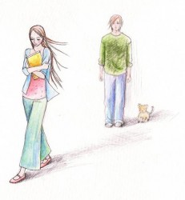

# 致我亲密的爱人

这或许是我最后一次写给你，我决意在你之前品尝这个世界的另一面。

你不曾令我失望过，直到现在我也要这么说。我感谢你不曾赐予过我虚假的希望。一个人走夜路久了，怕的不是黑暗，而是伪装成民家灯光的鬼火。你未曾向我许诺过任何光和热，教我可以适应这里的种种，睁眼看清了所有。我感激你。

我对于你而言并非生活的必需，你对我而言也不是。纵然如此，我曾长久地寄望于你的出现。我迷路了太久，需要相信行走的意义，才能继续摸索下去。对我而言，你的即将出现，是池塘上的荷叶，是堆积的松针，是散落的麦穗——你是事物残败里剩余的美好，你是一直等待不离弃，你是万里取一的宿命。

我的爱人，想到你让我感到忧伤。我们很久无法如初见时那样谈天了。我想和你坐在树下随着时间流逝，谈论彼此的影子；我想和你站在一起猜测公交车站踱步的人；我想问你一个只有你能回答的问题；我想和你坐在凌晨的路沿哼歌；我想继续给你写信；我想再看一遍那些电影，和你一起看，然后我会哭。

我觉得那时是最美好的时候，嘴巴喜欢讲话胜过亲吻的时候。这样我还顾得上好好打量你翘起的头发，你黯淡的痣，你手上的皱纹。我们可以一起为同一件事激动的时候，而不是相互为了彼此。

我或许是一个过于狂妄的孩童，或者太脆弱多疑的大人。我害怕世界不能如我所愿地变化下去，我害怕你。我喜欢我知道你的部分，害怕剩下的部分就好像害怕黑黝黝的洞口。洞里面没有怪兽，只有无数双不眨的眼睛。我如果走进去了，就会被看得透透的，可你依然无处不在，又无可触碰。

我还是喜欢一些光鲜的事情，比如因为爱情而写诗，比如因为无聊而讲笑话，比如因为悲伤而哭泣，比如因为生气而吵架。好像这些事情正在变得越来越难，我一直在努力地追，但是我跑不快。我在想我视力不太好，或许走了远路。但是我已经付出很大的代价了呀，我跑步时从不看你。我要闭着眼睛跑步，或者只看在我前面的屁股。我不知道你是不是在我旁边，我害怕以后会因为想起你曾经离我很近而停下来喘气。

我的爱人，我从未属于过我的爱人。你知道我从没向你要求什么，除了请你在我提出问题时看我的眼睛。对于得到的东西我向来随意摆放，我相信它们会自己选择归宿。我一度觉得我是个好主人，直到我看到弯腰低首的你。我想我如果弯得更低，你就能顺当地看到我了吧。我猜拥有以后总会有心慌的报应，我不想我们有报应。现在好了，我再也不用为你怎么记得我而负责了。我终于可以换来我渴望的轻浮的脚步，我要比过天边那朵云。你再也不在我这儿了。我再不盼你管了。

你会好的，就好像我也好过。你有好玩的寂寞，和不恼人的热闹，你会好的。我也没什么放不放心，心放到你那儿，未必不会麻烦了你。

我们最后一次期盼未来吧。会有很多证明现在和过去的我的愚蠢的东西出现，你会看着它们“哈哈哈哈”笑。你仍然可以牵强地对一些东西展现刻薄，但你还是不会如我一般恶。

你还是会好的。那么不再见吧！唉，不再见！

（采编：谢逸云 ；责编：刘迎）
