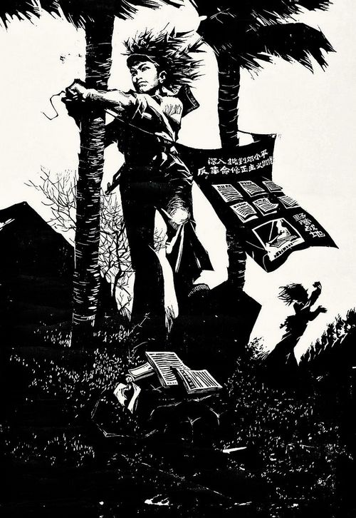
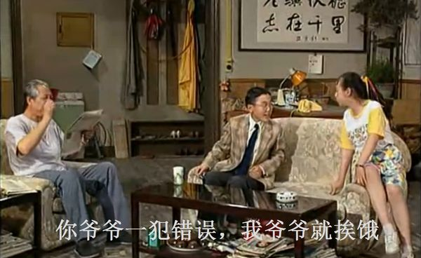

# 致所有因诗意而死的无用之人

** ** **1.**

念中学的时候，每天上午的时间用来思考中午饭吃什么，下午的时间则一分为二，一半用来打盹，一半用来思考另一个问题，我以后要做什么。

我所在的中学，食堂菜色丰富，大师傅亦算和蔼。初中每天上午四节课，第一节课决定是去大食堂吃白饭加炒菜的套餐，还是去小食堂吃面和其它杂食，第二节决定套餐是要鸡肉还是番茄炒蛋，吃牛肉面还是炒面，第三节课决定吃完了饭是喝酸奶还是吃一个雪糕，第四节课决定酸奶和雪糕的口味。高中转学，每天中午去学校对面的粤菜馆，思考过程更为繁琐，略过不提。

中午饭之后的时间用来听音乐。标准的学生课桌，抽屉很大，里面塞满了各式各样的CD，听完一张，差不多就到下午上课的时间了。下午的课多半乏味，地理，历史，不过总比上午的数理化好那么一点儿。数十个处于新陈代谢旺盛期的肉体挤在一件教室里，空气热哄哄的，漂杂着高浓度的二氧化碳，我趴在桌上看四周的同学，有人发短讯聊天，有人看武侠小说，有人趁老师回过身写板书的时候，赶紧把藏在抽屉里面的小杯的泡面捧出来喝一口汤，吸溜着鼻涕把泡面再塞回抽屉里。

要我说，这种猪一般的生活实在是太美好了。

写杂剧的贾仲明说，“饱暖生淫欲。”

淫欲其实很好满足。对我来说，饱暖之后，比淫欲更可怕的是关于“我以后要做什么”的没完没了的思考。

高中应该选哪些课——大学要学什么——以后要做什么——我的人生价值是什么——如何才算实现我的人生价值——我的人生价值能否反应我的存在——我的存在是偶然还是必然——我是否在其它的平行宇宙中存在——我在其它宇宙中的选择是什么——宇宙的本源。

每个思考人生的人都是神经病。

化学老师撺掇我去学医。我觉得学医挺好，白衣天使，救死扶伤，积阴德，下辈子投胎还生在富贵人家。什么时代都少不了医生，王侯将相，贩夫走卒，谁能长生不老，一辈子健康？随便什么地方长点脓肿肉芽，都得求我治，我把该切的一刀切了，剩下的杂碎缝缝补补，你能不给我钱？

生物老师建议我去学遗传。我觉得学遗传挺好，人都不是人，人是遗传信息的载体，从出生到死亡，所有的行为都有其生物学意义，小孩子为什么怕黑？怕黑暗中的未知威胁，怕威胁带来死亡，怕个体的死亡不断累积造成物种的灭绝。遗传的力量很伟大，张三的儿子像张三，李四的儿子像李四，王二麻子的儿子不像王二麻子，坏了，王二麻子的老婆不是好人。

物理老师不太爱搭理我，我中学几年物理就没及格过，学到高二串并联电路分不清，学什么都不会学物理。

语文老师是个老头子，相貌不俗，伊常穿一件黑色羊毛大衣，长可过膝，头戴礼帽，脚上是黑色漆皮的balmoral lacing牛津鞋，还要一条大红色的开司米围巾作为亮眼搭配，极有海派风情。伊喜欢读我的作文，还问我作文的技巧。作文要什么技巧？识得三五千个汉字，读过几本闲书，平时是个话痨，谁都会作文。

决定文理科分班的时限快要到了。当时老头子已经退休，穿着伊的黑大衣，及其傲慢的在学校里走了几圈，遇见我，问我要学什么。我愁眉苦脸，我什么都不想学，委实不知道要选择什么。

老头子压了压礼帽檐，问我，“你为什么不去写诗？”

说实话，我当时的第一反应是，“文科班有写诗这门课吗？”

老头子又说，“你应该是个诗人。”

说完伊就走了。

那次之后，老头子在学校里就鲜有露面。伊退休之后在家里闲着无聊，曾经到学校来无偿的给初中学生讲宋词，自己写讲义自己印，讲了一学期，应者寥寥，教学大纲里说了不考的宋词谁稀罕听，周敦颐比周杰伦酷吗？方岳比方文山帅吗？伊遂罢了手，似乎不久就到美国养老去了。

直到如今，好几年过去了，我每每想到伊彼时彼地那句“你为什么不去写诗？”就难以入眠，推枕绕室辗转反侧。我不知道是伊当时就看准了我爱和自己较劲儿的神经病气质，还是伊干脆就觉得我这辈子只配做写诗这么没有技术含量的事。

倘若时光能够倒流，我当时应该会一把揪住伊的大衣领子，“说清楚啊到底是什么意思？我怎么就应该是个诗人啊——混——蛋！”

 **2.**

“诗人”，开玩笑呢吧？

我读现代诗的起源，其实是读中国近当代史的副作用。

中学里的官配历史书都是三从四德女儿经培育出来的良家妇女，中国近当代史更是其中之最。初看伊，羞羞答答，什么话都是说一半儿留一半儿，掀开了盖头再看，一张寡淡的清水脸，放在人堆里怎么也显不出来，处久了就觉得乏味，教条框架太多，若是要求伊加点猛料，伊义正词严，“此乃青楼娼妓轻佻放浪之行，恕妾不可为。”等到过几年再看看伊，原来这婚姻从头到尾都是幻觉，您有一句真话没有？

我受不了这个，家花不如野花香。我看到教科书上讲了开头，就得去故纸堆里找它不同版本的经过和结尾，正史野史，名人八卦，我在历史课上把这些大毒草夹在教科书里，看得津津有味。

文革的史料我看的最多，开始时我抱着端正的学习态度，政治，经济，军事，文化，从各个角度剖析红色狂潮，解放思想廓清历史以史为鉴以求进步，后来我发现这么着不行，越看越糊涂。于是军事和经济就不看了，再过一会儿政治也不看了，只看文化，可是文化没什么好看的啊，主流文化只有八个样板戏，地下文学有手抄本和诗，手抄本就是黄赌毒大毒草，除了反特就是情爱，光《一双绣花鞋》我就看过三个版本，看来看去都差不多，女特务奶大腰细，男特务蛊惑青春少女，想炸的都没炸成，该死的全死了，忠诚的人民卫士万岁。

这么算下来，能读的只有诗。

文革时期的主流诗歌和太平天国时期差不多，洪秀全写的《天父诗》最好读，“因何当睡又不睡，因何不当睡又睡。因何不顾主顾睡，因何到今还敢睡。”文革时候的革命小将差不多也就是这个水平，“红小兵，反潮流，写出诗歌千万首，首首诗歌如排炮，炮声隆隆轰鬼头。”这是比较好听的，差一点的还有，其中数《谁不革命就滚他妈的蛋》最有名，此诗气势之豪壮，韵律之铿锵，纵观千古无出其右者。“老子英雄儿好汉，老子反动儿混蛋。要是革命的你就站过来，要是不革命就滚他妈的蛋。”朗诵诗需左手叉腰，右手挥舞毛选，双目平视前方，注意诗的韵律和格调，结尾处“滚他妈的蛋”应重复三次，同时屈膝扎侧身马步，以壮声势。

十年动乱促使地下诗歌在这其间蓬勃发展，文革初期的诗人多为风头正劲的高校中的红卫兵，他们创办诗社，油印报刊，通过诗歌宣传政治主张，后来他们这些“资产阶级文艺青年”遭到了残酷的惩罚，死伤无数，受欧洲十九世纪浪漫主义潮流影响，充满哲学思想的诗潮也逐渐消弭。文革后期的诗人主要是参与上山下乡运动的知识青年，理想和现实的严重脱节造就了几十万人格分裂者，分布在云南，新疆，内蒙，东北，以及许多条件恶劣的边陲之地。他们白天坚信自己可以创造历史，晚上却在肮脏简陋的住所里用他们唯一擅长的无用之技排遣心中的彷徨苦闷和强烈的幻灭感。

在饥饿，疲劳和孤独的状态下写出的诗句最最真诚，鲁迅说文学是“苦闷的象征”，诗人皮包骨头，双眼布满血丝，胃里是盐水煮白菜，饿，可是又饿不死，累，可是又睡不着，孤独，无比的孤独，他想问为什么，可四周只有白的刺眼的墙，这时候诗人出现幻觉，写下一首诗。

“春天用大地的肋骨搭成的篝火。”

“那些从死者，骨头里伸出的树叶，在把花的酒杯碰得叮当响。”

这些语句无比纯净，高傲，敏感，惊心动魄。

可是这些语句有什么用呢？在混沌的年代里，诗意不能长出橡胶树，诗意不能养出猪，诗意仿佛阴险的杀机，不但不能让营养不良的精神变的强壮，还会让本来就虚弱的灵魂死的更快些。

 **3.**

“也许他会冻死在寒冰，我望着迷蒙的雾，眼前仿佛出现了，一只死去的大雁。他是那样的年轻，他死了，但流露着使人难忘的，笑痕。”

郭世英的《大雁》是他流传在世的有限作品中最漂亮最鲜活的一首诗。诗人是郭沫若之子，著名的北京文艺青年，文革时最先被镇压的两个“成形的资产阶级文艺组织”之一“X社”的创始人，另一个“成形组织”则是张仃之子张郎郎创建的“太阳纵社”，当时徘徊在这两个诗社周围的有北岛，食指，芒克，这些后来的著名诗人当时尚属思想萌芽期。这两个地下诗社在文革开始后不久即被镇压，张郎郎被全国通缉，携女朋友私奔不成，被抓回来坐牢，狱友是遇罗克，遇罗克在1970年被枪毙，张郎郎运气好些，坐了十年的死囚牢，最终死里逃生。郭世英被捕之后被送去劳动改造，受了四年折磨，形式愈发严峻，隔离审查，严刑拷问，最终坠楼而亡，身上还绑着一把椅子，据说景象甚惨。郭世英的死因至今没有定论，是他杀还是自杀成了谜案。

总之年轻的诗人就这么死了，死的毫无价值。

当时与郭世英有交往的人零零散散的也写了不少回忆录，前些年逐渐浮出水面，但郭世英的形象始终有点模糊。大约因为但凡回忆亡人，口吻总是温柔，溢美之词甚多，反而失掉了其人的本来面目。牟敦白称其言必称“个性解放”，对现实氛围深感窒息，周国平称其“极其真诚”，但也有传言称其早期“又红又专”。关于“X事件”的各种传闻也越来越扑朔迷离，但近几年却少有人提及，亲身经历文革的人逐渐年老，伤痕文学也已成了过时的产物，前几日在网路上看到有人撰文，呼吁人们停止追究“X事件”，让诗人rest in peace。

想来一个才华横溢的诗人，他的死虽然蹊跷，虽然毫无价值，但终归还是悲壮的。一个因诗意而死的“苦闷的象征”，如今沦为各方茶余饭后的口舌谈资，甚至被拿来比对其父辈的种种，而那些置他于死地的诗，却没有人再读，这多多少少有些不堪。

大浪淘沙，时间过了几十年，今时今日许多灵魂依然苦闷，终究不愿意再为诗意牺牲。

有一天，闲来无事，看《我爱我家》，十几年前的北京味儿十足的情景戏剧，比现在的无厘头要有趣的多。其中有一集是说全家老少一起阻止小女儿师生恋，说班主任老师不是好人，是反动分子，“曾经贴过‘打倒江青’的大字报”，小女儿听了不忧反喜，“您太了不起了！您和张志新遇罗克他们是一样的人！”我听到这句台词，突然意识到，原来这些一直被视为禁忌话题的动乱中的牺牲者，也曾经在光天化日之下被称作英雄，虽然只是短短的一句台词。

  

遇罗克是因言获罪的典型例子，他有普罗米修斯的心态，想作为牺牲的先例。他在文革之后的全民自我反思过程中被迅速的神化，成为一个时代的烈士，说到底他其实是个只信奉马列思想的教条主义者。可是他代表千百万被压抑的人发出反抗的声音，这是需要勇气的行为。《出身论》拿到现在，叫我们这辈人读，这都是哪儿跟哪儿啊，他的思想已经被遗弃了。可是，从历史的角度来看，无论他们的行为正确与否，他们始终是有信仰并且愿意为之付出性命的人，是一个时代的先锋和极少数派，因此他们就不应该被历史剔除出去。而十几年后，不知是什么原因，他们又逐渐成为了隐秘的话题，被人有意无意的忘却。

好在还有人一直在我们耳边说，时代是在进步的。

在网路上看到了张郎郎的回忆，“在大的政治动乱中，个人就是牺牲品。你最好当一个旁观者，或者当一个记录者，那比牺牲更有意义。”

自然科学的研究对象是白鼠，社会科学的研究对象是人。

1970年，北京工人体育场举办了遇罗克的万人审判，“现行反革命”，“死刑”。

“啪”，又一个因诗意而死的人。

当时的目击者北岛为此写了一首诗。

“我并不是英雄，在没有英雄的年代里，我只想做一个人。”

 **4.**

还是说诗人。

我觉得比较有偶像潜质的诗人是安东尼奥·波契亚，提到他的时候可以顺便卖弄一下因自杀早逝的意大利女诗人安东妮亚·波齐那，这两个名字放在一起说比较像绕口令。

时代变了，写诗写到被枪毙的情形大约不会再有，但是诗还是能要人命。

关于波契亚的介绍通常只有一句话，“阿根廷诗人，用一生的时间写了一首诗，《遗忘的声音》。”

“用一生的时间写了一首诗！”

简直是“孤独致死”的代名词。

他的唯一的诗，没有形式，没有技巧，写完了之后一一标上编号。

“对于死去的人来说，这片土地与最遥远的星辰没有什么两样。”

“我看不见泪河，是因为缺少我的一滴泪。”

太文艺了！太文艺了！

我在夜里读他的诗，被感动的热泪盈眶，恨不得要去街上狂奔。

这才是写诗的最高境界，所有八卦，所有吃喝拉撒生老病死，所有与政治和时代背景有关的猜测都是庸俗透顶！

我出生了，我写诗，我死了。诗人留给这世界的任何踪迹都不可寻，除了这唯一的一首诗，仿佛从天而降。

诗是无用的，就让它无用到底！

前日看了一篇妙文，《没有人看见草生长》，是上海女作家毛尖回忆八十年代的姑娘们供养诗人的风潮。文中提及马原，格非等等一票先锋文学青年，亮点甚多。文章最终的点题段落老调重弹，还是感慨“岁月神偷”，“青春不再”。但是本着“隔锅饭香”这个基本理论思想及其演化学说“别人的青春永远比我的有趣”，这篇小短文还是让我看的甚是眼馋，在图书馆里发出不雅观的啧啧称赞之声，艳羡之情溢于言表，毫无骨气，恨不能立刻拉一个诗人来养着。举目四望，满眼净是不知诗为何物的工科男，仰天长叹，“工科者鄙！”

我觉得我读理工科是个错误。不过大多数人的前半生都浪费在错误的事情上。我期望我晚年时能够闭门免谈世事，在杭州小孤山附近找个老房子住下，从此不问苍生问鬼神，把脑子里面记载着的“有用”的知识统统忘记，做一个在智商上毫无优越感的人。

烧死布鲁诺，烧得好！

磕红丸，一天三颗！

炼丹修禅，打卦扶乩，问籤求谶，正经事！

等到那时，我每天想着无用的事，说不定能写出几句诗，不过是做不了诗人的。其一，作为诗人，我前半生污点太多，我读过理工科，亲历过数次暴乱，竟然没有去掺合一下；其二，我是绝不会因诗意而死的，反革命言论不写就不写吧，“孤独”的心境时常有，靠暴饮暴食排遣足矣，写诗赚不来酒钱，只能抖擞精神腆着一张老脸出山，“作文辅导老师侬要勿啦？数理化也能教！”

我又再次想起了老头子的那句话，“你应该是个诗人。”

终于等到了高中文理分班，我左思右想，虽然以后的日子应该衣食无虞，但还是想学个所谓一技之长，用俗世的标尺来衡量我的人生价值，事一事权贵，为五斗米折一折腰。于是乎怀着阴微的心情进了理科班，上午依旧思考中午饭吃什么，下午依旧打盹，依旧思考人生。第一次物理测验的结果出来，我一看，从分班之前的全班倒数第十变成了分班之后的理科班倒数第一。抬头瞧一瞧物理老师，伊真可怜，学识满腹，却要为了五斗米打发我这种学生。遂不再想，趴下便睡。

熬到毕业，上了一个因为理工科闻名的大学，写论文，做实验，坚信科学能拯救世界。有一天，我去找我的导师讨论伊新发表的一篇论文，该论文的数学模拟部分做的颠三倒四，我基本没看懂，伊说伊也没懂，我满心疑惑，“没用的模拟你放这儿干什么？”伊诡秘的一笑，“这个模拟做出来的图放在论文上好看。”

我想，就在那天我的“科学拯救世界”理论被碾的粉粉碎。

上到高年级，对科研成果里的水分见怪不怪，“这是被广泛认可的理论”等同于“我找不到参考文献”，“以三个菌种样本为例”等同于“其它的菌种都被污染了”，对论文中的语言偷梁换柱成了一个技术活儿。

认识了一个和我选了同一门课的黑人兄弟，伊实验报告分数极低，在实验室外面闷闷的抽烟。我看了伊的报告，伊真是个老实孩子，有一部分实验数据的误差比样本本身还大，伊也敢往报告上写。我教育伊说这报告不是这么个写法，伊那张大黑脸绷的笔直，“绝不在科学中弄虚作假”，我担心伊这么弄下去连毕业都有风险，伊说伊不在乎，伊真心的热爱科学，伊愿意一辈子泡实验室，哪怕研究出来的东西没有价值。

我的天，原来我错了。

理工科学校里也有这般愿意为“科学的诗意”而死的无用之人！

（采编：何凌昊；责编：尹桑）

 
