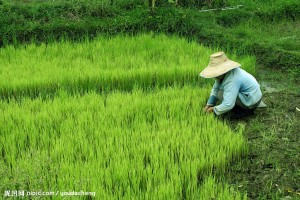
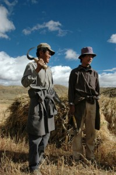

# 菜市场

**这一个菜市场，这些二十几岁，三十几岁，四十几岁，五十几岁，六十几岁，七十几岁的人，将他们的生活以及生活背后的人生以这样巧妙的方式展现在我面前。穿过白汽，再走过人群，菜市场里到处是你伸手就摸得到的生活和人性，到处是你闭着眼睛也能听的到闻得到的人身上最原始味道。**  

# **菜市场******

##  文/仇小丫

 

早市的菜新鲜又便宜，摊主没有营业执照，不用租金，每天早上开始，8点多结束，付给城管一到两块钱。

早市里的人，多是最传统的那种东北人，说话做事也是最传统的东北民风，淳朴，爽朗，坚韧。你去买东西，就会发现他根本不会抓顾客，不懂营销策略，他告诉你他这东西真的很好，绝对不是骗人的，你听那语气，仅是一个普通农民对丰硕果实的自豪，喜爱和尊重，夹杂着对生活的叹息，对自然的敬畏，和早习以为常的隐忍和无奈。你听那语气，是在说“我还敢骗人，我骗人老天爷都要惩罚我咧”！但你就是听不到他说“你多买点吧我这东西你买了你就会怎样怎样”，这是地道的东北人，他们说话大嗓门，有骨气。那骨气里，有让人一眼就看得见底的艰辛。

我非常喜欢去早市场并且每次要来来回回逛很久，卖菜的和买菜的都不会注意我，因为我看起来就像个无所事事打酱油的路人。每个早晨送完妹妹上学我就叼杯豆浆自由自在地穿梭在菜市场的各个摊前，看人家买菜的怎么买菜，卖菜的怎么卖菜，常用时令果蔬当日多少价钱，看哪些摊位比较火爆哪些比较冷清，看人们在买一样的东西时不同人不同的注重点在哪里，看人们在货比三家时最后怎样做选择。我一会儿跟买东西的人站一块搀和，一会儿跟卖东西的人站一块搀和，玩得不亦乐乎。自行车倒了，我就给扶一下，东西掉了，我就给捡一下，在东北的菜市场里，我不但敢扶老太太，还敢多管闲事。我秋裤外穿再套上棉袄，在菜市场里毫无违和感，一点不让人讨厌，我操着带“文化人”口音的东北话，跟人混得铁熟，我买菜时候直接跟人家说我不会买菜也不认秤，您掂量着给我整。我蹲下系鞋带把包随手往那儿一放，我掉哪的东西回去就能找着。中午或晚上去小餐馆吃饭坐那等着，照着菜单算每一盘菜的大概成本，算这家店一天大概赚多少钱，我通过这种变态的方式来排解压力，满足强大的控制欲并寻找安全感。

由此我爱上了菜市场，每天去菜市场看形形色色的人。

小两口一起出来的，男人一般都本分朴实，女人特别精明能干，自己家卖的东西，饿了或者渴了拿起来就吃一个，言行里透着一股实在劲。他们孩子一般都在上小学，你跟他们提家里有妹妹在哪个小学，学习怎么样，淘气不淘气，他们跟你可有话说了；有四五十岁的男人或女人，穿厚重的棉袄，裹着棉帽子或者包着头巾，如果他们家里有儿子女儿在上大学或者毕了业已经有了工作，他们对你也都乐呵呵的，跟你聊他们孩子，要去哪哪上班了，说有多舍不得，脸上的笑容全是满足和骄傲；有从来没见怎么笑过的，也不吆喝，东西是真心好，顾客不多，你来买东西买多少我就给你称多少，买什么就称什么绝不给你推荐这个那个，也不多说话，一分钱不多赚你的，也不想你给他抹去几毛钱；有推着大二八自行车出来卖蜂蜜的老大爷，一个箱子在后车座上，糊上白纸，上面用毛笔写的“蜂蜜”两个字，每天就在那个固定的地方，看上去得有七十好几了，表情严肃冷峻，来了要么自己往那一站，要么跟旁边同样年纪的老头聊聊天，有次我路过，正好听到大爷的一句“你说咱们是干啥的，咱们就像那要饭的，你说咱跟那要饭的有啥区别”，我猜大爷那箱子里的蜂蜜一定是纯的，但是从来没见人去买过，不知道这么多天来他究竟卖出几瓶。

有个做小蛋糕的女人（在一个模具里倒上已经和好的蛋糕粉，炉子上烤不到一分钟），手法娴熟，生意不错，赶上高峰期就一直低着头一边做蛋糕一边收钱，说话很少，就固定的几个字，但是在夹杂着一堆东北口音里面的即使很小声的外地口音也可以被听的分明。我注意到她，她没注意到我。因为我在旁边说了一句“十几年前我上小学的时候这东西就卖2块钱，现在你卖2块5，你挣钱么？”而抬头看了我一眼。那眼神里是有惊喜的，我知道那眼神的意味，是在对旁边买东西的人说“我卖2块5 你们都嫌贵，都说我赚翻了，现在你看看，也有你们当地人替我说话哩！我并没有骗人我也不容易哩！”。随后我们就聊了起来，她是湖南岳阳某个村子来的，因为太穷了村里就有人组织大伙儿学做这个蛋糕，然后一行人扛着工具一路向北，来到了长春。长春以及周边外五县地区但凡做这个小蛋糕的都是他们村子里的人，而她是和老公一起来的，孩子扔在爷爷奶奶家。我很惊讶，这个小蛋糕已经在这边出现了十多年了，我说那你们住哪里怎么分工呢，她说有组织给具体分配，一炉子蛋糕赚5毛钱，一年在这边住7个多月，租房，冬季回家，第二年暖和了再来。如此这样她已经做了4年了。我愕然，一对湖南的夫妻一年有7个月在东北一个说出来谁都不知道名字的小城，推着车卖蛋糕，并以此养家糊口。

还有山西的，河南的，并不用挨个问，每一个离开家的人都有不得不离开的理由。

我从早市队伍的这头走到那头，再走回来，认真观察着每一个在这里卖东西的人， 我没法将注意力从他们身上移开，摊主们形形色色，总的来说是生活在社会中下层，很难被定义的那类人群。他们通常前一天晚上或第二天早起进货，赶在两三点（夏季）或三四点（冬季）前到达早市地点占位，很难说他们是商人或买卖人，九成以上都是农民，也有带着自己家园子里的东西来卖的，靠这个赚钱是不可能的，基本是维持生活。他们裹着厚厚的棉衣棉裤棉鞋棉帽子，在冷风中瑟瑟的站着或蹲着，身上挂着来不及打扫或者早习以为常的灰尘，皮肤黝黑，指甲宽厚，泛黄，有淤泥，双手粗糙厚实，长满了老茧，还有冻裂的痕。

这是一群生活艰苦并且不卑不亢的人。

包子馒头的香味伴随着开锅声扑鼻而来，热腾腾的白汽在阳光下格外好看。这一个菜市场，这些二十几岁，三十几岁，四十几岁，五十几岁，六十几岁，七十几岁的人，将他们的生活以及生活背后的人生以这样巧妙的方式展现在我面前。穿过白汽，再走过人群，菜市场里到处是你伸手就摸得到的生活和人性，到处是你闭着眼睛也能听的到闻得到的人身上最原始味道。

菜市场里永远热闹暖和，让人眷恋，也让人清醒。

 

（采编：周拙恒；责编：周拙恒）

 
