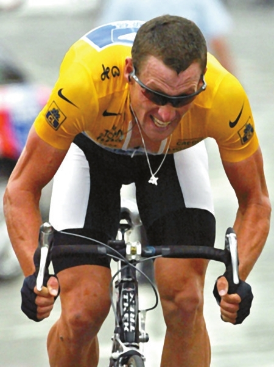
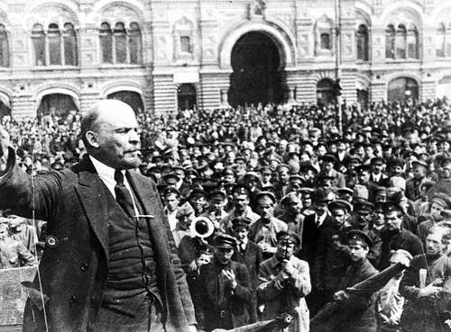

# 营销之道：“英雄”与骗子

兰斯·阿姆斯特朗，对于很多体育迷来说，是一个熟悉的名字。非典时期，长假漫漫，就关心起了体育，那时候最引人注意的就是意大利的豪门尤文图斯（后来因为丑闻被降级）、洛杉矶湖人，还有就是这个大名鼎鼎的环法自行车赛的霸主。这个名字一度代表着体育，乃至生命的最高精神：拼搏，不为疾病屈服，与命运抗争。

在这个英雄辈出，但又极其缺乏英雄的时代，按照任何标准来讲，阿姆斯特朗原本都可以称得上是一位“英雄”。他出生于德克萨斯一个单亲家庭，母亲在未成年时生下了他。出身不好的他从小受人欺负、白眼，受到继父的家庭暴力。年幼的他就立志要自强自立，养活母亲和自己。于是，身强力壮的他就选择参加奖金相对较高的自行车比赛，来补贴家用。运气不错，他接连获得了不少好成绩，并在国际比赛中崭露头角。但是，正当事业蒸蒸日上之时，命运再一次的捉弄了他：他患上了癌症。当然，抗癌是一个不错的故事脚本，精明的兰斯自然不会放过这个机会，积极的投入治疗。效果很显著，癌症被控制住了，并最终被治愈了，由此他得以重回赛场。重返赛场的兰斯似乎一发不可收拾，接连七次豪夺环法自行车赛冠军。故事到此为止，似乎是一个始终以胜利收场（无论是生活还是竞赛）的“英雄”的励志故事。但人算不如天算，精明的他最终败给了自己的谎言—滥用违禁药品、虚假的广告以及接二连三为了圆谎而再度撒下的谎言。冠军荣誉被剥夺，并且自己的职业生涯也岌岌可危：终身禁赛对任何一个运动员而言都是灭顶之灾。

有些人会认为，这是阿姆斯特朗过错，也是他的不幸，但不完全是他的责任。而且他荣誉的取消更为他的英雄色彩增加了一丝悲壮，毕竟，换作旁人面临同样的境地，也不大可能连夺七次环法冠军。不过，在前面这些论述中，那些贬义词已经表明了笔者的立场。如果行文至此，这个肤浅的结论也过于平淡无聊。

暂且不深论，再看另一个案例。

喜欢重口味美国血腥电影的朋友可能会看过《电锯惊魂》，作为一枚脑残粉，我看的不精但爱搬弄是非。《电锯7》中讲述了这样一个故事：主人公名叫Bobby。他有一个好友凯尔，两人本都是在街头巷尾逛酒吧混日子的地痞无赖。一日，在泡吧时候，两人看到了新闻中采访经历过老约翰（竖锯）“game”的幸存者，同时，他们也看到了一条生财之道：杜撰自己是一次电锯游戏的幸存者。从此，他就开始了自己的骗局。一方面，Bobby是个聪明人，他很清楚大众的消费心理：无知的人们需要英雄来满足自己软弱的需求，但英雄又像流行歌曲、时装一样，季节一过，会随时被人遗忘。至于如何编造自己的故事，如何让大家相信，如何保持自己的魅力（电视访谈、DVD制作、写书签收等等）他都下了很大功夫。当然了，一个巴掌拍不响，光靠他自己的撒谎，显然无法为他赢得这一切，于是，他的团队就应运而生，或者说，他的团队与他的谎言相伴生。简洁起见，我就不多费笔墨，剧情大家可以自己去了解。

在这个使他大获成功名利双收的团队中，有这样几个人：负责公关的某女（“明知你是骗子，仍不遗余力将你打造成大明星，靠不停讲大话谋取暴利”—竖锯），负责法务的某女（“在你面前是你的律师，为求私利，她无视曾经宣誓过的《律师道德守则》”—竖锯），负责安保的凯尔（“他明知你在骗人，却对你言听计从，今天，他将体验生与死的区别。”—竖锯），以及不知实情蒙在鼓里的妻子（妻子着实是一个善良的女性，一直到死都是最无辜的—这可能也象征着什么，但还是不去揣测了）。重申一下，即使不是为了宣扬所谓的因果报应，事实上，他们几个骗子到最后都受到了竖锯给他们的“惩罚”。

阿姆斯特朗的故事和《电锯》中的这个故事有几分神似，所以最好是移花接木地来看：个人奋斗和团队协作。

第一，他们不是一个人在战斗，在背后有一个明显的利益团体，可以是一个公司，一个车队，也可能是一个政党、一个机构。在这里面他既是领导者（Bobby），也是一个被摆布的木偶；第二，利益相关的人，即团队中的不同分工的人，为了同一个“目标”，换句话说也就是一个谎言，去分工合作。即使他们知道自己在撒谎，或者是故意撒谎，他们也无意更正自己的行为，为什么呢？他不仅仅是在跟领导干活，也在挣得自己的一份生活，抑或更是用集体意志绑架“领导”，使之骑虎难下，不得不将谎言进行下去。第三，就是“无知的看客”，那些打着某些旗号骗人的人，通常都会认为观众是傻子，等着他们去灌输，去洗脑。最后，就是二者的结局都是以众人的唾弃，或者是一无所有而告终。Bobby是丢掉了自己的家庭和事业，阿姆斯特朗则是官司缠身、丑闻不断。当然，林子大了什么鸟都有，不排除一些接受能力强的白痴，甘心受各种误导欺骗，仍一味充当拥趸，但也不能排除一些理智的、清醒的看客。他们不仅是骗局的观众、欣赏者，也是骗子的衣食父母。哪天看客们换了口味，某个骗局也就变得毫无意义。简言之，“看客的心态，你不懂”，做一个好看客，着实重要。不同之处在于：Bobby彻头彻尾是个骗子，而阿姆斯特朗呢，本身有过人的本领，“有实力才有争议（加一句广告词）”，是世界一流的赛车在

讲了半天故事，言归正传。谎言是什么呢？其实就是含沙射影的一种方式，用自以为聪明的办法去讽喻这个世界。简单的世界有简单的逻辑，疯狂的世界有疯狂的逻辑；抑或二者颠倒。我不是什么先知，自以为洞察了什么，但可以说，这个世界的逻辑，还是很简单的。我们生活于其中，自然由其逻辑支配，长大成人，也无外乎是熟识了这些条条框框罢了。我们生活在谎言中，同时呢，也编造着谎言。

生活于其中，我们可能会有看客（不排除说，看客也是谎言的参与者），参与者乃至主导者几个身份。一般说来，我们都是谎言的看客，分分秒秒，我们都在经历着无数的谎言。有些是我们不知道的，来无所谓去无所谓，有些是我们不去戳穿的，“不能”或者“不能”（unable or can’t），有些则是我们狂热的信奉的，比如“自由主义”、“共产主义”等等。作为普通大众，我们可能会随波逐流，有什么就接受什么，似乎不加选择，少数人的行为，可能也无助于改变现状。但是，千万不要小看这些，民粹的力量万万千千，一旦点燃起来，后果不堪想象。大众消费的倾向，则是世俗化的民粹。他们消费那些由自己制造出来的英雄（时装、快餐、流行歌曲），消费自己的谎言。有些大而无当的话曾经这样讲：大众消费什么？消费的是产品、是需求、是符号。去掉这些故弄玄虚的虎皮，大众到底消费什么？

至于游戏的参与者，则是最大限度的在游戏中谋求所需要的东西。人做事情，所需要得到的无非就是两个东西：名/利。我在这里就不搬弄老僵尸们的理论，这其实是一个很通俗的道理，讲了几千年，老生常谈了。“名”呢，就是声望，我们也可以说，是“好名声”“好人缘”“社会地位”等等。“利”呢，则是物质需求，动物本性。在这些“团体”中，毫无疑问，参与者可以获取他想要的，如果他不是脑子坏掉了，或者不是太“坚持正义”什么的。象那些舍生取义，杀身成仁的志士们，违抗已有“龟腚”按照所谓“正义”原则行事的人们，或许只存在于金庸先生刻画出的仗义侠士身上，或许只存在于那些主旋律电影中，无论是文化部门批准的内地片，还是好莱坞商业片。当然，最近的抗日科幻剧大火，也不免会落入这个俗套吧，小李飞刀单挑重机枪迫击炮，阿西莫夫估计都没见过，想都不敢想吧。

获得利益，每个人都不可能是均等的，能力的差异决定了分成的多少和地位的高低，当然，这也是和每个人的贡献挂钩。在理想情况下，综合能力最高的人当然会贡献最多，回报也就会最多。至于领导者，就是扮演的这么一个角色。领导者不一定样样都精通，但是，他一定是能力最强的，他可以组织好所有的资源，用种种“领导策略”让下属服服帖帖的为自己服务，比如鱼腹藏书装神弄鬼什么的；他也可能是一个无心之故被推上潮头的人，比如说黎元洪；当然，他也可能完完全全就是个傀儡，被一些能干的人支配，作为代言人，“我是傀儡，我为自己代言”。这无疑是最悲剧的一种情况了。历史上，那些曾经做过领导者的人，多多少少会有这几种的特点吧。

同样，曾经出现过的各种集团啊，团体啊什么的，也一般都会按照某些规律来行事吧。谎言和骗局并不可怕，维系社会运行的可能正是这些东西。相反，随时都是赤裸裸的真理（插一句歌词：我的X，赤裸裸~），恐怕，这个社会还真没有人能扛得住啊。老话说，唱戏的是疯子，听戏的是傻子。一疯一傻，来个二重唱，中间再有给戏伴奏的，那岂不美妙！如何让普通大众相信我们的骗局，还真是个问题，突然想起来，这不就是“大众消费什么？”的另一面—“怎么让大众消费？”的问题吗。最近，看了一部俄国电影《莫斯科2017》，说实话，这部电影着实无聊，用粗陋的好莱坞式手法，讲了一个道理：营销何以改变买者和卖者。他们讲：列宁，是做广告营销的第一人。他通过自己的智慧，把苏维埃作为一种商品推销出去：

色彩—红色、积极向上，革命；

期待—“跟着我，有牛奶喝，有面包吃”（真田广之会不会告我侵权？），满足“食”的本性；“人民翻身当家做主人”，满足“地位”的需求；

信仰—苏维埃，人类的希望……

还有其他无聊内容，恕不剧透。当然了，当下发生的好多故事情节也都挺有意思的，希望大家能够有效的匹配，比如刘翔啊、刀锋战士啊什么的。

话不多言，按照起承转合的“龟绿”，我应该合题了。怎么说呢，写着写着就没正行了，无厘头了。码了一堆垃圾，权当娱乐吧。哦对了，还是以周星驰《鹿鼎记》中的一段对话做结尾比较好，这个应该是革命传销的经典案例了吧，应个景：

天地会青草堂堂主被清军杀掉，于是，陈近南寻找打入皇宫内部的人。小宝无意闯入，被耍，推上前台。

陈近南（语重心长的讲）：小宝，你是个聪明人，我就用一个聪明的方法跟你说话，外面的人就不行。

韦小宝（一脸不解）：不明白。

陈近南：读过书和明事理的人，大多已在清廷里面当官了，所以如果我们要对抗清廷，就要用一些蠢一点的人。对付那些蠢人，就绝不可以和他们说真话，必须要用宗教形式来催眠他们，使他们觉得所做的事情都是对的。所以“反清复明”只是一句口号，跟“阿弥陀佛”是一样的。清朝一直欺压我们汉人，抢走我们的银两和女人，所以我们要反清。

韦小宝：要反清抢回钱和女人，是不是，复不复明根本就是多余的，谁会去鸟他。行了，大家聪明人，了解！继续……

陈近南：总之，如果成功的话，就有无数银两和女人，你愿不愿意去？

韦小宝：愿意！

(采编：彭程；责编：彭程)
